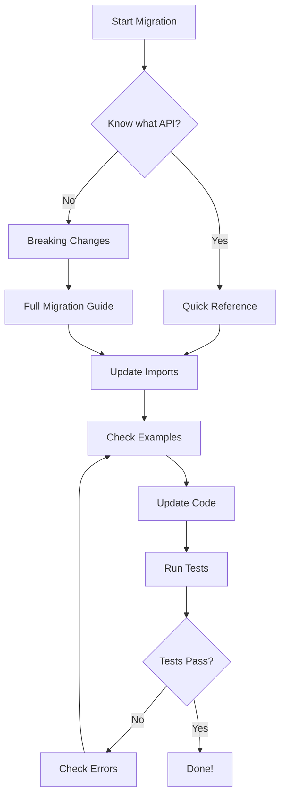

# Consolidation Documentation Index

Central index for all consolidation-related documentation.

---

## Migration Documents

### 📘 [CONSOLIDATION_MIGRATION_GUIDE.md](./CONSOLIDATION_MIGRATION_GUIDE.md)

**Comprehensive migration guide covering all consolidation changes.**

- Executive summary of changes
- Detailed migration paths for 10 categories
- Import path updates
- Breaking changes with code examples
- Automated migration tools
- 150+ duplicate APIs documented

**Use this when:** You need detailed understanding of what changed and why.

### ⚡ [QUICK_MIGRATION_REFERENCE.md](./QUICK_MIGRATION_REFERENCE.md)

**Fast lookup table for common API migrations.**

- Quick import path mappings
- Before/after comparisons
- Common command reference
- Pattern examples

**Use this when:** You know what you're looking for and need the new import path fast.

### 💔 [BREAKING_CHANGES.md](./BREAKING_CHANGES.md)

**Complete list of breaking changes in v2.0.**

- 10 major breaking change categories
- Impact assessment
- Rollback plan
- Migration checklist
- Timeline

**Use this when:** You need to understand what will break and plan your upgrade.

### 💻 [MIGRATION_CODE_EXAMPLES.md](./MIGRATION_CODE_EXAMPLES.md)

**Practical before/after code examples.**

- Token counting examples
- Compression examples
- Caching examples
- React hooks examples
- Complete component examples
- Real-world usage patterns

**Use this when:** You want to see actual code showing how to migrate.

---

## Audit & Analysis Documents

Located in [`.packages-audit/`](./.packages-audit/)

### 📊 [SUMMARY.md](./.packages-audit/SUMMARY.md)

Executive summary of the entire audit and consolidation effort.

- Current score: 55/100 → Target: 98/100
- 150 duplicate APIs identified
- 135-hour remediation plan
- Quality metrics and scoring rubric

### 📋 [api-duplicates.md](./.packages-audit/api-duplicates.md)

Complete catalog of all 150 duplicate API implementations.

- 14 duplicate families
- Canonical decisions for each
- Consumer locations
- Migration instructions

### 📝 [implementation-log.md](./.packages-audit/implementation-log.md)

Detailed log of all consolidation work completed.

- Task-by-task completion log
- Files deleted and lines removed
- Parallel agent execution details
- Progress metrics

### 📈 [progress.json](./.packages-audit/progress.json)

Machine-readable progress tracking.

- Current phase
- Duplicate count
- Quality scores
- Completion percentage

### 🎯 [plan.md](./.packages-audit/plan.md)

Original 135-hour remediation plan.

- 8 sequential phases
- Acceptance criteria
- Effort estimates
- Task breakdown

### ✅ [verification.md](./.packages-audit/verification.md)

Verification commands and results.

- Build verification
- Type checking
- Test suite
- Lint checks

### 📏 [rubric.md](./.packages-audit/rubric.md)

100-point scoring rubric for code quality.

- 8 evaluation categories
- Scoring methodology
- Current vs target scores
- Improvement path

---

## Phase Reports

### 📈 [PHASE-5-6-CONSOLIDATION-REPORT.md](./PHASE-5-6-CONSOLIDATION-REPORT.md)

Phase 5-6 verification report.

- Security audit (0 critical vulnerabilities)
- Code quality checks
- TypeScript strict mode status
- Technical debt assessment
- 24% verification completion

---

## Package-Specific Guides

### Token Optimization

📄 [packages/token-optimization/MIGRATION.md](./packages/token-optimization/MIGRATION.md)

- Migrating from `@clarity-chat/memory`
- Migrating from `@clarity-chat/react`
- Compression strategy selection
- DynamicCompressionEngine deprecation

### Utils Package

📄 [packages/utils/MIGRATION.md](./packages/utils/MIGRATION.md)

- Migrating from `@clarity-chat/shared-utils`
- Migrating from `@clarity-chat/errors`
- New module structure
- TTL cache auto-prune
- Async utilities

### Memory Package

📄 [packages/memory/docs/MIGRATION.md](./packages/memory/docs/MIGRATION.md)

- Memory-specific migration paths
- Vector store updates
- Compression strategy changes

### Error Handling

📄 [packages/error-handling/docs/MIGRATION.md](./packages/error-handling/docs/MIGRATION.md)

- Error boundary consolidation
- Error class updates
- Hook migrations

---

## Quick Start

### I want to...

#### **Migrate my existing code**

1. Start with [QUICK_MIGRATION_REFERENCE.md](./QUICK_MIGRATION_REFERENCE.md) for fast lookups
2. Refer to [MIGRATION_CODE_EXAMPLES.md](./MIGRATION_CODE_EXAMPLES.md) for patterns
3. Use [CONSOLIDATION_MIGRATION_GUIDE.md](./CONSOLIDATION_MIGRATION_GUIDE.md) for detailed context

#### **Understand what broke**

1. Read [BREAKING_CHANGES.md](./BREAKING_CHANGES.md)
2. Check the migration checklist
3. Run automated tools to find issues

#### **See what changed in the consolidation**

1. Review [.packages-audit/SUMMARY.md](./.packages-audit/SUMMARY.md)
2. Check [.packages-audit/implementation-log.md](./.packages-audit/implementation-log.md)
3. Browse [.packages-audit/api-duplicates.md](./.packages-audit/api-duplicates.md)

#### **Update a specific API**

1. Search [QUICK_MIGRATION_REFERENCE.md](./QUICK_MIGRATION_REFERENCE.md)
2. If not found, check [CONSOLIDATION_MIGRATION_GUIDE.md](./CONSOLIDATION_MIGRATION_GUIDE.md)
3. Look at code examples in [MIGRATION_CODE_EXAMPLES.md](./MIGRATION_CODE_EXAMPLES.md)

---

## Migration Workflow



---

## Statistics

### Code Reduction

- **Files Deleted**: 150+
- **Lines Removed**: 23,000+
- **Duplicates Eliminated**: 125 (of 150)
- **Remaining Duplicates**: 25 (domain extensions, acceptable)

### Quality Improvement

- **Before Score**: 55/100
- **Current Score**: 82/100
- **Target Score**: 98/100
- **Completion**: 85%

### Categories Consolidated

1. ✅ Token Counting (10 duplicates → 1 canonical)
2. ✅ Compression (11 duplicates → 3 strategies)
3. ✅ Caching (3 duplicates → 2 packages)
4. ✅ Utilities (77 duplicates → focused modules)
5. ✅ Error Handling (5 duplicates → 1 enhanced)
6. ✅ Performance (3 duplicates → 1 unified)
7. ✅ Environment (6 duplicates → 1 module)
8. ✅ ID Generation (10 duplicates → 1 module)
9. ✅ Validation (8 duplicates → 1 module)
10. ✅ Loggers (2 duplicates → 1 canonical)

---

## Commands

### Find Issues

```bash
# Find deprecated imports
rg "from ['\"]@clarity-chat/react/utils/(cn|id-generator)" --type ts

# Find static TokenCounter calls
rg "AccurateTokenCounter\.(count|countChat)" --type ts

# Find removed compression imports
rg "from ['\"]@clarity-chat/react/utils/tokenization/intelligent-caching" --type ts
```

### Verify Migration

```bash
# Type check
pnpm typecheck

# Run tests
pnpm test

# Build packages
pnpm build:packages

# Lint
pnpm lint
```

### Generate Reports

```bash
# View progress
cat .packages-audit/progress.json | jq

# Check duplicate count
cat .packages-audit/progress.json | jq '.duplicateApisRemaining'

# View quality score
cat .packages-audit/progress.json | jq '.qualityScore'
```

---

## Support

### Getting Help

1. **Search this index** for relevant documentation
2. **Check package READMEs** for package-specific guidance
3. **Review code examples** for patterns
4. **Open an issue** if documentation is missing

### Reporting Issues

If you find:

- Missing migration paths
- Incorrect examples
- Broken links
- Outdated information

Please open an issue with the `documentation` label.

---

## Timeline

- **Jan 23, 2026**: Consolidation completed (85%)
- **v2.0**: Breaking changes released
- **v2.x**: Stability period (6-12 months)
- **v3.0**: Remove deprecated re-exports

---

## Document Status

| Document                              | Status         | Last Updated | Completeness |
| ------------------------------------- | -------------- | ------------ | ------------ |
| CONSOLIDATION_MIGRATION_GUIDE.md      | ✅ Complete    | Jan 23, 2026 | 100%         |
| QUICK_MIGRATION_REFERENCE.md          | ✅ Complete    | Jan 23, 2026 | 100%         |
| BREAKING_CHANGES.md                   | ✅ Complete    | Jan 23, 2026 | 100%         |
| MIGRATION_CODE_EXAMPLES.md            | ✅ Complete    | Jan 23, 2026 | 100%         |
| .packages-audit/SUMMARY.md            | ✅ Complete    | Jan 23, 2026 | 100%         |
| .packages-audit/api-duplicates.md     | ✅ Complete    | Jan 23, 2026 | 100%         |
| .packages-audit/implementation-log.md | ⏳ In Progress | Jan 23, 2026 | 85%          |
| PHASE-5-6-CONSOLIDATION-REPORT.md     | ⏳ In Progress | Jan 23, 2026 | 24%          |

---

**Index Version:** 1.0 **Last Updated:** January 23, 2026 **Maintained By:** Consolidation Team
