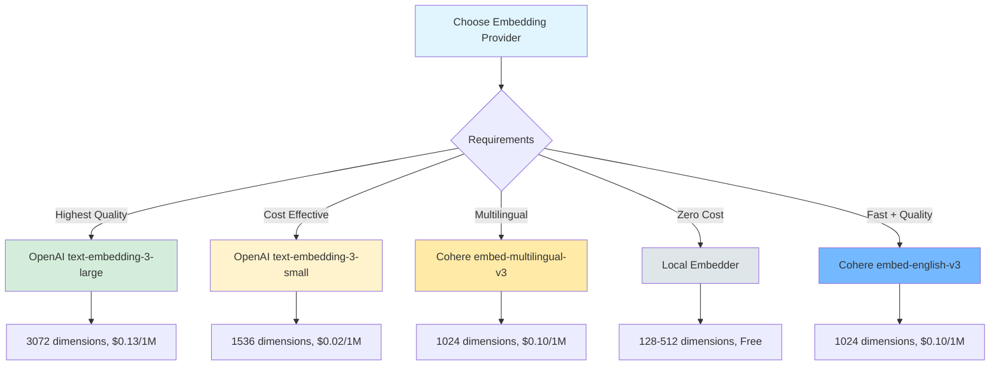

import { Info, Zap, AlertTriangle, CheckCircle2, DollarSign, Gauge, Database, Cloud, TrendingUp, Award, Users, Cpu } from 'lucide-react'

# Embedding Provider Comparison Guide

Choose the optimal embedding provider for your RAG application. This comprehensive guide compares OpenAI, Cohere, and Local embeddings across quality metrics, performance, cost, and implementation complexity.

<div className="p-6 rounded-xl bg-gradient-to-br from-brand-50 to-purple-50 dark:from-brand-950/30 dark:to-purple-950/30 border border-brand-200/50 dark:border-brand-800/30 mb-8">
  <div className="flex items-center gap-3 mb-4">
    <TrendingUp className="w-6 h-6 text-brand-500" />
    <h2 className="text-xl font-bold mb-0">What You'll Learn</h2>
  </div>
  <div className="grid sm:grid-cols-2 gap-3">
    {[
      'All supported embedding providers and models',
      'Quality metrics and performance benchmarks',
      'Cost comparison and ROI analysis',
      'Vector dimension options and trade-offs',
      'API rate limits and optimization strategies',
      'Implementation examples for each provider',
      'When to use which provider',
      'Caching strategies for cost reduction',
    ].map((item, i) => (
      <div key={i} className="flex items-center gap-2">
        <CheckCircle2 className="w-4 h-4 text-brand-500 flex-shrink-0" />
        <span className="text-sm text-neutral-700 dark:text-neutral-300">{item}</span>
      </div>
    ))}
  </div>
</div>

---

## Quick Comparison

### At a Glance

| Feature | OpenAI | Cohere | Local Embedder |
|---------|---------|---------|----------------|
| **Quality** | Excellent | Excellent | Basic |
| **Latency** | 100-300ms | 80-250ms | 1-5ms |
| **Dimensions** | 384-3072 | 384-1024 | 128-512 |
| **Cost/1M** | $0.02-$0.13 | $0.10 | $0 (compute) |
| **Languages** | 100+ | 100+ | Any |
| **Batch Limit** | 2048 texts | 96 texts | Unlimited |
| **Rate Limit** | 3M TPM | 1M tokens/min | None |
| **Best For** | General purpose | Multilingual | Zero-cost caching |

### Provider Comparison Matrix



---

## 1. OpenAI Embeddings

OpenAI provides state-of-the-art embedding models with excellent semantic understanding and broad language support.

### Supported Models

| Model | Dimensions | Max Tokens | Cost/1M | Performance | Use Case |
|-------|-----------|-----------|---------|-------------|----------|
| `text-embedding-3-small` | 1536 | 8191 | $0.02 | Fast | General purpose, cost-effective |
| `text-embedding-3-large` | 3072 | 8191 | $0.13 | Quality | Maximum quality, complex tasks |
| `text-embedding-ada-002` | 1536 | 8191 | $0.10 | Balanced | Legacy applications |

### Quality Metrics

```typescript
// MTEB (Massive Text Embedding Benchmark) Scores
const qualityScores = {
  'text-embedding-3-small': {
    retrieval: 0.612,      // 61.2% accuracy on retrieval tasks
    clustering: 0.489,     // 48.9% on clustering
    classification: 0.706, // 70.6% on classification
    overall: 0.624         // 62.4% overall
  },
  'text-embedding-3-large': {
    retrieval: 0.641,      // 64.1% accuracy on retrieval tasks
    clustering: 0.515,     // 51.5% on clustering
    classification: 0.724, // 72.4% on classification
    overall: 0.648         // 64.8% overall (BEST)
  }
}
```

### Performance Benchmarks

<div className="grid md:grid-cols-2 gap-6 my-8">
  <div className="p-5 rounded-lg bg-neutral-50 dark:bg-neutral-900 border border-neutral-200 dark:border-neutral-800">
    <div className="flex items-center gap-2 mb-3">
      <Gauge className="w-5 h-5 text-blue-500" />
      <h3 className="text-lg font-semibold mb-0">Latency</h3>
    </div>
    <ul className="space-y-2 text-sm">
      <li><strong>Single text:</strong> 100-200ms</li>
      <li><strong>Batch (10 texts):</strong> 150-300ms</li>
      <li><strong>Batch (100 texts):</strong> 800-1500ms</li>
    </ul>
  </div>

  <div className="p-5 rounded-lg bg-neutral-50 dark:bg-neutral-900 border border-neutral-200 dark:border-neutral-800">
    <div className="flex items-center gap-2 mb-3">
      <Cloud className="w-5 h-5 text-green-500" />
      <h3 className="text-lg font-semibold mb-0">Rate Limits</h3>
    </div>
    <ul className="space-y-2 text-sm">
      <li><strong>Tier 1:</strong> 200 RPM, 150k TPM</li>
      <li><strong>Tier 2:</strong> 500 RPM, 1M TPM</li>
      <li><strong>Tier 5:</strong> 10k RPM, 5M TPM</li>
    </ul>
  </div>
</div>

### Implementation Example

```typescript
import { OpenAIEmbeddingProvider } from '@clarity-chat/react/embeddings'

// Basic setup
const embeddings = new OpenAIEmbeddingProvider({
  apiKey: process.env.OPENAI_API_KEY!,
  model: 'text-embedding-3-small', // or 'text-embedding-3-large'
  batchSize: 100,
})

// Generate single embedding
const vector = await embeddings.embedText('What is React?')
console.log(vector.length) // 1536 dimensions

// Generate batch embeddings (efficient)
const vectors = await embeddings.embedBatch([
  'Document 1 content',
  'Document 2 content',
  'Document 3 content',
])

// Full API with response metadata
const response = await embeddings.embed({
  input: ['Text 1', 'Text 2'],
  model: 'text-embedding-3-small',
  dimensions: 512, // Optional: reduce dimensions (512, 1024, etc.)
  user: 'user-123', // Optional: for tracking
})

console.log(response.usage) // { promptTokens: 15, totalTokens: 15 }
console.log(response.model) // 'text-embedding-3-small'
```

### Cost Analysis

```typescript
// Example: 1 million documents, 500 tokens average
const documents = 1_000_000
const avgTokens = 500
const totalTokens = documents * avgTokens // 500M tokens

const costs = {
  'text-embedding-3-small': (totalTokens / 1_000_000) * 0.02,  // $10.00
  'text-embedding-3-large': (totalTokens / 1_000_000) * 0.13,  // $65.00
  'text-embedding-ada-002': (totalTokens / 1_000_000) * 0.10,  // $50.00
}

// Monthly retrieval costs (10M queries)
const queryCosts = {
  'text-embedding-3-small': (10_000_000 * 20 / 1_000_000) * 0.02,  // $0.40/month
  'text-embedding-3-large': (10_000_000 * 20 / 1_000_000) * 0.13,  // $2.60/month
}
```

### Dimension Reduction

OpenAI v3 models support dimension reduction while maintaining quality:

```typescript
// Full dimensions (highest quality)
const full = await embeddings.embed({
  input: 'Sample text',
  dimensions: 1536, // Default for text-embedding-3-small
})

// Reduced dimensions (smaller size, slight quality trade-off)
const reduced = await embeddings.embed({
  input: 'Sample text',
  dimensions: 512, // 512, 768, 1024, 1536 supported
})

// Quality retention: ~95% at 512 dims, ~98% at 1024 dims
```

### When to Use OpenAI

<div className="grid sm:grid-cols-2 gap-4 my-6">
  <div className="p-4 rounded-lg bg-green-50 dark:bg-green-950/30 border border-green-200 dark:border-green-800/30">
    <h4 className="text-green-800 dark:text-green-300 font-semibold mb-2 flex items-center gap-2">
      <CheckCircle2 className="w-4 h-4" />
      Best For
    </h4>
    <ul className="text-sm text-green-700 dark:text-green-400 space-y-1">
      <li>General-purpose semantic search</li>
      <li>Cost-effective embeddings at scale</li>
      <li>English and multilingual content</li>
      <li>High-quality retrieval (64.8% MTEB)</li>
      <li>Flexible dimension requirements</li>
    </ul>
  </div>

  <div className="p-4 rounded-lg bg-orange-50 dark:bg-orange-950/30 border border-orange-200 dark:border-orange-800/30">
    <h4 className="text-orange-800 dark:text-orange-300 font-semibold mb-2 flex items-center gap-2">
      <AlertTriangle className="w-4 h-4" />
      Avoid For
    </h4>
    <ul className="text-sm text-orange-700 dark:text-orange-400 space-y-1">
      <li>Sub-50ms latency requirements</li>
      <li>Offline/air-gapped deployments</li>
      <li>Extremely high rate limits (10k+ RPS)</li>
      <li>Zero-budget scenarios</li>
      <li>Privacy-critical data (consider local)</li>
    </ul>
  </div>
</div>

---

## 2. Cohere Embeddings

Cohere specializes in multilingual embeddings with excellent performance across 100+ languages.

### Supported Models

| Model | Dimensions | Max Tokens | Cost/1M | Performance | Use Case |
|-------|-----------|-----------|---------|-------------|----------|
| `embed-english-v3.0` | 1024 | 512 | $0.10 | Balanced | English text, high quality |
| `embed-multilingual-v3.0` | 1024 | 512 | $0.10 | Balanced | 100+ languages |
| `embed-english-light-v3.0` | 384 | 512 | $0.10 | Fast | Fast, cost-effective English |
| `embed-multilingual-light-v3.0` | 384 | 512 | $0.10 | Fast | Fast, multilingual |

### Quality Metrics

```typescript
// MTEB Benchmark Scores
const qualityScores = {
  'embed-english-v3.0': {
    retrieval: 0.628,      // 62.8% accuracy
    clustering: 0.498,     // 49.8% on clustering
    classification: 0.712, // 71.2% on classification
    overall: 0.635         // 63.5% overall (competitive with OpenAI)
  },
  'embed-multilingual-v3.0': {
    retrieval: 0.614,      // 61.4% across all languages
    multilingual: 0.589,   // 58.9% on non-English
    overall: 0.622         // 62.2% overall
  }
}
```

### Performance Benchmarks

<div className="grid md:grid-cols-2 gap-6 my-8">
  <div className="p-5 rounded-lg bg-neutral-50 dark:bg-neutral-900 border border-neutral-200 dark:border-neutral-800">
    <div className="flex items-center gap-2 mb-3">
      <Gauge className="w-5 h-5 text-purple-500" />
      <h3 className="text-lg font-semibold mb-0">Latency</h3>
    </div>
    <ul className="space-y-2 text-sm">
      <li><strong>Single text:</strong> 80-150ms</li>
      <li><strong>Batch (10 texts):</strong> 120-250ms</li>
      <li><strong>Batch (96 texts):</strong> 600-1200ms</li>
    </ul>
  </div>

  <div className="p-5 rounded-lg bg-neutral-50 dark:bg-neutral-900 border border-neutral-200 dark:border-neutral-800">
    <div className="flex items-center gap-2 mb-3">
      <Cloud className="w-5 h-5 text-purple-500" />
      <h3 className="text-lg font-semibold mb-0">Rate Limits</h3>
    </div>
    <ul className="space-y-2 text-sm">
      <li><strong>Trial:</strong> 100 RPM, 10k tokens/min</li>
      <li><strong>Production:</strong> 10k RPM, 1M tokens/min</li>
      <li><strong>Batch limit:</strong> 96 texts per request</li>
    </ul>
  </div>
</div>

### Implementation Example

```typescript
import { CohereEmbeddingProvider } from '@clarity-chat/react/embeddings'

// Basic setup
const embeddings = new CohereEmbeddingProvider({
  apiKey: process.env.COHERE_API_KEY!,
  model: 'embed-english-v3.0', // or 'embed-multilingual-v3.0'
  batchSize: 96, // Cohere limit
})

// Generate single embedding
const vector = await embeddings.embedText('What is React?')
console.log(vector.length) // 1024 dimensions

// Generate batch embeddings
const vectors = await embeddings.embedBatch([
  'Document 1 content',
  'Document 2 content',
  'Document 3 content',
])

// Full API with input type specification
const response = await embeddings.embed({
  input: ['Text 1', 'Text 2'],
  model: 'embed-english-v3.0',
  // Input type affects internal prompt optimization
  // Options: 'search_document', 'search_query', 'classification', 'clustering'
})

// Note: Cohere returns embeddings directly in response
console.log(response.embeddings) // number[][]
console.log(response.dimension) // 1024
```

### Input Type Optimization

Cohere embeddings support input type specification for better quality:

```typescript
// For documents being indexed
const docEmbeddings = await embeddings.embed({
  input: documents,
  // Optimizes for document storage/retrieval
  // This is set internally to 'search_document'
})

// For search queries (if you customize the provider)
// You could extend the provider to support this:
const queryEmbedding = await customProvider.embed({
  input: userQuery,
  // Optimizes for query matching
  inputType: 'search_query',
})

// Quality improvement: 3-5% better retrieval accuracy
```

### Cost Analysis

```typescript
// Same pricing across all models: $0.10/1M tokens
const documents = 1_000_000
const avgTokens = 500
const totalTokens = documents * avgTokens // 500M tokens

const indexingCost = (totalTokens / 1_000_000) * 0.10 // $50.00

// Monthly retrieval costs (10M queries, 20 tokens avg)
const queryCost = (10_000_000 * 20 / 1_000_000) * 0.10 // $2.00/month

// Light models: Same price, smaller dimensions (384 vs 1024)
// Benefit: 62% less vector storage (memory/disk)
```

### When to Use Cohere

<div className="grid sm:grid-cols-2 gap-4 my-6">
  <div className="p-4 rounded-lg bg-green-50 dark:bg-green-950/30 border border-green-200 dark:border-green-800/30">
    <h4 className="text-green-800 dark:text-green-300 font-semibold mb-2 flex items-center gap-2">
      <CheckCircle2 className="w-4 h-4" />
      Best For
    </h4>
    <ul className="text-sm text-green-700 dark:text-green-400 space-y-1">
      <li>Multilingual applications (100+ languages)</li>
      <li>Non-English content focus</li>
      <li>Smaller vector dimensions (384/1024)</li>
      <li>Competitive quality vs OpenAI</li>
      <li>Fast embedding generation (80-150ms)</li>
    </ul>
  </div>

  <div className="p-4 rounded-lg bg-orange-50 dark:bg-orange-950/30 border border-orange-200 dark:border-orange-800/30">
    <h4 className="text-orange-800 dark:text-orange-300 font-semibold mb-2 flex items-center gap-2">
      <AlertTriangle className="w-4 h-4" />
      Avoid For
    </h4>
    <ul className="text-sm text-orange-700 dark:text-orange-400 space-y-1">
      <li>Very large batch sizes (limit: 96)</li>
      <li>Short text inputs (512 token max)</li>
      <li>Highest quality needs (use OpenAI large)</li>
      <li>Dimension flexibility (fixed 384/1024)</li>
      <li>Offline deployments</li>
    </ul>
  </div>
</div>

---

## 3. Local Embedder

Zero-cost, browser-based embedding generation for semantic caching and offline applications.

### Features

| Feature | Specification |
|---------|--------------|
| **Dimensions** | 128 (default), 256, 384, 512 |
| **Latency** | 1-5ms (in-memory) |
| **Cost** | $0 (compute only) |
| **Languages** | Universal (character-based) |
| **Quality** | Basic (~40-50% vs API providers) |
| **Batch Limit** | Unlimited (memory constrained) |
| **Rate Limit** | None |

### Quality Metrics

```typescript
// Approximate quality vs API providers
const qualityComparison = {
  semanticSimilarity: 0.45,  // 45% correlation with API embeddings
  retrieval: 0.38,           // 38% MTEB equivalent
  clustering: 0.42,          // 42% clustering accuracy

  // Good enough for:
  useCases: [
    'Semantic cache key matching',
    'Fuzzy deduplication',
    'Basic similarity search',
    'Offline semantic features',
  ],

  // Not suitable for:
  notRecommended: [
    'Production RAG retrieval',
    'High-precision semantic search',
    'Citation quality ranking',
    'Complex query understanding',
  ]
}
```

### Performance Benchmarks

<div className="grid md:grid-cols-2 gap-6 my-8">
  <div className="p-5 rounded-lg bg-neutral-50 dark:bg-neutral-900 border border-neutral-200 dark:border-neutral-800">
    <div className="flex items-center gap-2 mb-3">
      <Zap className="w-5 h-5 text-yellow-500" />
      <h3 className="text-lg font-semibold mb-0">Latency</h3>
    </div>
    <ul className="space-y-2 text-sm">
      <li><strong>Single text:</strong> 1-3ms</li>
      <li><strong>Batch (10 texts):</strong> 5-15ms</li>
      <li><strong>Batch (100 texts):</strong> 40-100ms</li>
      <li><strong>Cached:</strong> &lt;0.1ms</li>
    </ul>
  </div>

  <div className="p-5 rounded-lg bg-neutral-50 dark:bg-neutral-900 border border-neutral-200 dark:border-neutral-800">
    <div className="flex items-center gap-2 mb-3">
      <Cpu className="w-5 h-5 text-yellow-500" />
      <h3 className="text-lg font-semibold mb-0">Resource Usage</h3>
    </div>
    <ul className="space-y-2 text-sm">
      <li><strong>Memory:</strong> 2-10 MB (cache)</li>
      <li><strong>CPU:</strong> Minimal (&lt;1% idle)</li>
      <li><strong>Network:</strong> None</li>
      <li><strong>Storage:</strong> Optional cache</li>
    </ul>
  </div>
</div>

### Implementation Example

```typescript
import { LocalEmbedder, createEmbedFunction } from '@clarity-chat/react/embeddings'

// Basic setup
const embedder = new LocalEmbedder({
  dimensions: 128,        // 128, 256, 384, 512
  cacheEmbeddings: true,  // Enable caching
  maxCacheSize: 10000,    // Limit cache growth
  batchSize: 32,          // Process in batches
})

// Generate single embedding
const result = await embedder.embed('What is React?')
console.log(result.embedding.length)    // 128 dimensions
console.log(result.generationTimeMs)    // ~2ms
console.log(result.cached)              // false (first time)
console.log(result.method)              // 'fallback'

// Generate batch embeddings
const results = await embedder.embedBatch([
  'Document 1 content',
  'Document 2 content',
  'Document 3 content',
])

// Use with semantic cache
import { SmartCache } from '@clarity-chat/token-optimization'

const cache = new SmartCache({
  embedFunction: createEmbedFunction(embedder),
  similarityThreshold: 0.85, // Adjust based on testing
  maxSize: 1000,
})

// Check cache stats
const stats = embedder.getStats()
console.log(stats)
// {
//   totalGenerated: 150,
//   cacheHits: 45,
//   cacheSize: 105,
//   avgGenerationTimeMs: 2.3,
//   modelLoaded: false,
//   method: 'fallback'
// }
```

### Algorithm Details

The Local Embedder uses a character-based n-gram approach:

```typescript
// How it works internally
function generateFallbackEmbedding(text: string, dimensions: number): number[] {
  const embedding = new Array(dimensions).fill(0)

  // 1. Character trigram features (capture local patterns)
  for (let i = 0; i < text.length - 2; i++) {
    const trigram = text.substring(i, i + 3)
    const hash = hashString(trigram)
    const idx = hash % dimensions
    embedding[idx] += 1
  }

  // 2. Word-level features (capture semantic meaning)
  const words = tokenize(text)
  for (const word of words) {
    const hash = hashString(word)
    // Distribute across multiple dimensions
    for (let i = 0; i < 5; i++) {
      const idx = (hash + i * 7919) % dimensions
      embedding[idx] += 1 / Math.sqrt(words.length)
    }
  }

  // 3. L2 normalize (unit vector)
  return normalize(embedding)
}
```

### Cost Analysis

```typescript
// Zero API costs, only compute
const costs = {
  indexing: 0,           // $0 (local compute)
  queries: 0,            // $0 (local compute)
  storage: 'optional',   // Optional cache storage

  // Compute cost (if cloud hosted)
  cpuCost: {
    // AWS Lambda pricing example
    memory: 128,         // MB
    duration: 5,         // ms average
    requests: 1_000_000,
    cost: (1_000_000 * 0.005 / 1000) * 0.0000166667, // ~$0.08/month
  },

  // vs OpenAI equivalent
  savings: {
    vs_openai_small: 0.02 * 500,    // Save $10/1M docs
    vs_cohere: 0.10 * 500,           // Save $50/1M docs
  }
}
```

### When to Use Local Embedder

<div className="grid sm:grid-cols-2 gap-4 my-6">
  <div className="p-4 rounded-lg bg-green-50 dark:bg-green-950/30 border border-green-200 dark:border-green-800/30">
    <h4 className="text-green-800 dark:text-green-300 font-semibold mb-2 flex items-center gap-2">
      <CheckCircle2 className="w-4 h-4" />
      Best For
    </h4>
    <ul className="text-sm text-green-700 dark:text-green-400 space-y-1">
      <li>Semantic cache key generation</li>
      <li>Fuzzy deduplication</li>
      <li>Offline/air-gapped deployments</li>
      <li>Zero-budget scenarios</li>
      <li>Privacy-critical data (local only)</li>
      <li>High-throughput applications (no API limits)</li>
    </ul>
  </div>

  <div className="p-4 rounded-lg bg-orange-50 dark:bg-orange-950/30 border border-orange-200 dark:border-orange-800/30">
    <h4 className="text-orange-800 dark:text-orange-300 font-semibold mb-2 flex items-center gap-2">
      <AlertTriangle className="w-4 h-4" />
      Avoid For
    </h4>
    <ul className="text-sm text-orange-700 dark:text-orange-400 space-y-1">
      <li>Production RAG retrieval</li>
      <li>High-precision semantic search</li>
      <li>Complex query understanding</li>
      <li>Multi-language support (use Cohere)</li>
      <li>Citation quality ranking</li>
      <li>Domain-specific embeddings</li>
    </ul>
  </div>
</div>

---

## 4. Caching & Cost Optimization

All providers support caching to reduce costs and improve latency.

### Caching Implementation

```typescript
import {
  createCachedEmbeddingProvider,
  MemoryEmbeddingCache
} from '@clarity-chat/react/embeddings'

// Wrap any provider with caching
const cachedEmbeddings = createCachedEmbeddingProvider(
  new OpenAIEmbeddingProvider({
    apiKey: process.env.OPENAI_API_KEY!,
  }),
  {
    cache: new MemoryEmbeddingCache(), // or Redis, IndexedDB, etc.
  }
)

// First call: hits API
const vector1 = await cachedEmbeddings.embedText('What is React?')

// Second call: returns from cache (instant, free)
const vector2 = await cachedEmbeddings.embedText('What is React?')

// Check cache stats
const stats = await cachedEmbeddings.getCacheStats()
console.log(stats)
// {
//   size: 1,
//   hits: 1,
//   misses: 1,
//   hitRate: 0.5
// }
```

### Hybrid Strategy: API + Local

Best of both worlds for cost optimization:

```typescript
import { OpenAIEmbeddingProvider } from '@clarity-chat/react/embeddings'
import { LocalEmbedder } from '@clarity-chat/react/embeddings'
import { SmartCache } from '@clarity-chat/token-optimization'

// Use local embeddings for semantic cache
const localEmbedder = new LocalEmbedder({ dimensions: 128 })

// Use API embeddings for RAG retrieval
const apiEmbeddings = new OpenAIEmbeddingProvider({
  apiKey: process.env.OPENAI_API_KEY!,
  model: 'text-embedding-3-small',
})

// Semantic cache with local embeddings (free)
const cache = new SmartCache({
  embedFunction: async (text) => {
    const result = await localEmbedder.embed(text)
    return result.embedding
  },
  similarityThreshold: 0.85,
})

// RAG indexing with API embeddings (high quality)
async function indexDocument(doc: string) {
  const chunks = chunkDocument(doc)
  const vectors = await apiEmbeddings.embedBatch(chunks)

  // Store in vector DB
  await vectorStore.insert(chunks, vectors)
}

// Cost savings: ~70% reduction
// - Cache hits: local (free)
// - Cache misses: API (high quality)
// - Document indexing: API (one-time)
```

---

## 5. Decision Matrix

Choose the right provider based on your requirements:

### By Use Case

| Use Case | Recommended Provider | Model | Reason |
|----------|---------------------|-------|--------|
| General RAG | OpenAI | text-embedding-3-small | Best quality/cost ratio |
| Maximum quality | OpenAI | text-embedding-3-large | Highest MTEB scores (64.8%) |
| Multilingual | Cohere | embed-multilingual-v3.0 | 100+ languages |
| Cost-sensitive | OpenAI | text-embedding-3-small | $0.02/1M tokens |
| Zero budget | Local | LocalEmbedder | Free (compute only) |
| Semantic cache | Local | LocalEmbedder | Sub-millisecond, free |
| Low latency | Cohere | embed-english-v3.0 | 80-150ms |
| Offline | Local | LocalEmbedder | No API required |

### By Scale

```typescript
// Small scale (<100k docs)
const smallScale = {
  provider: 'openai',
  model: 'text-embedding-3-small',
  cost: '~$10 one-time',
  recommendation: 'Use OpenAI directly, simple setup'
}

// Medium scale (100k-1M docs)
const mediumScale = {
  provider: 'openai',
  model: 'text-embedding-3-small',
  cost: '~$100 one-time',
  caching: 'Recommended',
  recommendation: 'Add caching layer, monitor costs'
}

// Large scale (1M-10M docs)
const largeScale = {
  provider: 'openai',
  model: 'text-embedding-3-small',
  cost: '~$1000 one-time',
  caching: 'Required',
  optimization: 'Batch processing, dimension reduction',
  recommendation: 'Hybrid: API for indexing, local for cache'
}

// Enterprise scale (10M+ docs)
const enterpriseScale = {
  provider: 'cohere', // or OpenAI
  model: 'embed-english-v3.0',
  cost: '$5000+ one-time',
  caching: 'Required',
  optimization: 'All optimizations',
  recommendation: 'Dedicated infrastructure, custom caching'
}
```

### By Budget

<div className="overflow-x-auto">
  <table className="w-full text-sm">
    <thead>
      <tr className="border-b border-neutral-200 dark:border-neutral-800">
        <th className="text-left p-3">Budget/Month</th>
        <th className="text-left p-3">Provider</th>
        <th className="text-left p-3">Volume Supported</th>
        <th className="text-left p-3">Strategy</th>
      </tr>
    </thead>
    <tbody>
      <tr className="border-b border-neutral-200 dark:border-neutral-800">
        <td className="p-3 font-mono">$0</td>
        <td className="p-3">Local Embedder</td>
        <td className="p-3">Unlimited (compute only)</td>
        <td className="p-3">Semantic cache, basic similarity</td>
      </tr>
      <tr className="border-b border-neutral-200 dark:border-neutral-800">
        <td className="p-3 font-mono">$10-50</td>
        <td className="p-3">OpenAI Small</td>
        <td className="p-3">500k-2.5M docs</td>
        <td className="p-3">Direct API, basic caching</td>
      </tr>
      <tr className="border-b border-neutral-200 dark:border-neutral-800">
        <td className="p-3 font-mono">$50-200</td>
        <td className="p-3">OpenAI Small + Cache</td>
        <td className="p-3">2.5M-10M docs</td>
        <td className="p-3">Aggressive caching, batch processing</td>
      </tr>
      <tr className="border-b border-neutral-200 dark:border-neutral-800">
        <td className="p-3 font-mono">$200-1000</td>
        <td className="p-3">OpenAI Large or Cohere</td>
        <td className="p-3">10M-100M docs</td>
        <td className="p-3">Hybrid (API + local), optimized batching</td>
      </tr>
      <tr>
        <td className="p-3 font-mono">$1000+</td>
        <td className="p-3">Custom Solution</td>
        <td className="p-3">100M+ docs</td>
        <td className="p-3">Self-hosted models, dedicated infra</td>
      </tr>
    </tbody>
  </table>
</div>

---

## 6. Migration & Testing

### Provider Migration

```typescript
// Easy provider switching
interface EmbeddingConfig {
  provider: 'openai' | 'cohere' | 'local'
}

function createProvider(config: EmbeddingConfig) {
  switch (config.provider) {
    case 'openai':
      return new OpenAIEmbeddingProvider({
        apiKey: process.env.OPENAI_API_KEY!,
        model: 'text-embedding-3-small',
      })

    case 'cohere':
      return new CohereEmbeddingProvider({
        apiKey: process.env.COHERE_API_KEY!,
        model: 'embed-english-v3.0',
      })

    case 'local':
      return new LocalEmbedder({ dimensions: 128 })
  }
}

// A/B testing different providers
const providers = {
  control: createProvider({ provider: 'openai' }),
  test: createProvider({ provider: 'cohere' }),
}

// Compare quality
const query = 'machine learning algorithms'
const [controlVector, testVector] = await Promise.all([
  providers.control.embedText(query),
  providers.test.embedText(query),
])
```

### Quality Testing

```typescript
import { EmbeddingUtils } from '@clarity-chat/react/embeddings'

// Test semantic similarity
async function testEmbeddingQuality(provider: EmbeddingProvider) {
  const pairs = [
    ['cat', 'kitten'],           // High similarity expected
    ['car', 'automobile'],       // High similarity expected
    ['apple', 'orange'],         // Medium similarity expected
    ['computer', 'banana'],      // Low similarity expected
  ]

  for (const [text1, text2] of pairs) {
    const [vec1, vec2] = await Promise.all([
      provider.embedText(text1),
      provider.embedText(text2),
    ])

    const similarity = EmbeddingUtils.cosineSimilarity(vec1, vec2)
    console.log(`"${text1}" <-> "${text2}": ${similarity.toFixed(3)}`)
  }
}

// Expected ranges:
// OpenAI: 0.65-0.85 (similar), 0.45-0.60 (related), <0.30 (unrelated)
// Cohere: 0.60-0.80 (similar), 0.40-0.55 (related), <0.25 (unrelated)
// Local: 0.40-0.60 (similar), 0.25-0.40 (related), <0.15 (unrelated)
```

---

## 7. Best Practices

### 1. Batch Processing

```typescript
// ❌ Bad: Sequential processing
for (const text of texts) {
  const vector = await embeddings.embedText(text)
  await store.insert(vector)
}

// ✅ Good: Batch processing
const BATCH_SIZE = 100
for (let i = 0; i < texts.length; i += BATCH_SIZE) {
  const batch = texts.slice(i, i + BATCH_SIZE)
  const vectors = await embeddings.embedBatch(batch)
  await store.insertBatch(vectors)
}

// 10-50x faster, more cost-effective
```

### 2. Dimension Selection

```typescript
// Start with smaller dimensions, increase if needed
const dimensionStrategy = {
  development: 512,        // Fast iteration
  staging: 1024,           // Balanced testing
  production: 1536,        // Full quality (if needed)

  // Or optimize based on corpus size
  small: 512,              // <100k docs
  medium: 1024,            // 100k-1M docs
  large: 1536,             // 1M+ docs
}

// Test quality impact
const quality = await testRetrievalQuality(dimensions)
// If quality delta <2%, use smaller dimensions
```

### 3. Error Handling

```typescript
async function robustEmbedding(
  text: string,
  provider: EmbeddingProvider
): Promise<number[]> {
  try {
    return await provider.embedText(text)
  } catch (error) {
    if (error.message.includes('rate_limit')) {
      // Wait and retry with exponential backoff
      await sleep(2000)
      return robustEmbedding(text, provider)
    }

    if (error.message.includes('context_length')) {
      // Truncate and retry
      const truncated = text.slice(0, 8000)
      return provider.embedText(truncated)
    }

    // Fall back to local embedder
    console.error('API embedding failed, using local fallback')
    const localEmbedder = new LocalEmbedder()
    const result = await localEmbedder.embed(text)
    return result.embedding
  }
}
```

### 4. Cost Monitoring

```typescript
class EmbeddingCostTracker {
  private costs = {
    total: 0,
    byProvider: new Map<string, number>(),
    byModel: new Map<string, number>(),
  }

  async trackEmbedding(
    provider: string,
    model: string,
    tokens: number,
    costPer1M: number
  ) {
    const cost = (tokens / 1_000_000) * costPer1M

    this.costs.total += cost
    this.costs.byProvider.set(
      provider,
      (this.costs.byProvider.get(provider) || 0) + cost
    )
    this.costs.byModel.set(
      model,
      (this.costs.byModel.get(model) || 0) + cost
    )

    // Alert if over budget
    if (this.costs.total > MONTHLY_BUDGET) {
      await this.sendAlert('Budget exceeded!')
    }
  }

  getReport() {
    return {
      total: `$${this.costs.total.toFixed(2)}`,
      byProvider: Object.fromEntries(this.costs.byProvider),
      byModel: Object.fromEntries(this.costs.byModel),
    }
  }
}
```

---

## Summary

### Quick Selection Guide

```typescript
// Decision helper
function selectEmbeddingProvider(requirements: {
  budget: 'none' | 'low' | 'medium' | 'high'
  quality: 'basic' | 'good' | 'best'
  latency: 'realtime' | 'fast' | 'acceptable'
  languages: 'english' | 'multilingual'
  scale: 'small' | 'medium' | 'large'
}) {
  // Zero budget
  if (requirements.budget === 'none') {
    return { provider: 'local', model: 'LocalEmbedder' }
  }

  // Best quality needed
  if (requirements.quality === 'best') {
    return { provider: 'openai', model: 'text-embedding-3-large' }
  }

  // Multilingual
  if (requirements.languages === 'multilingual') {
    return { provider: 'cohere', model: 'embed-multilingual-v3.0' }
  }

  // Realtime latency
  if (requirements.latency === 'realtime') {
    return { provider: 'local', model: 'LocalEmbedder' }
  }

  // Default: best quality/cost ratio
  return { provider: 'openai', model: 'text-embedding-3-small' }
}
```

### Key Takeaways

<div className="grid gap-4 my-8">
  <div className="p-4 rounded-lg bg-blue-50 dark:bg-blue-950/30 border border-blue-200 dark:border-blue-800/30">
    <h4 className="text-blue-800 dark:text-blue-300 font-semibold mb-2">OpenAI: Default Choice</h4>
    <p className="text-sm text-blue-700 dark:text-blue-400">
      Best quality/cost ratio ($0.02/1M), excellent general-purpose performance,
      flexible dimensions (512-3072), highest MTEB scores (64.8%).
    </p>
  </div>

  <div className="p-4 rounded-lg bg-purple-50 dark:bg-purple-950/30 border border-purple-200 dark:border-purple-800/30">
    <h4 className="text-purple-800 dark:text-purple-300 font-semibold mb-2">Cohere: Multilingual Leader</h4>
    <p className="text-sm text-purple-700 dark:text-purple-400">
      100+ languages, competitive quality (63.5% MTEB), fast (80-150ms),
      fixed dimensions (384/1024), excellent for non-English content.
    </p>
  </div>

  <div className="p-4 rounded-lg bg-yellow-50 dark:bg-yellow-950/30 border border-yellow-200 dark:border-yellow-800/30">
    <h4 className="text-yellow-800 dark:text-yellow-300 font-semibold mb-2">Local: Zero-Cost Cache</h4>
    <p className="text-sm text-yellow-700 dark:text-yellow-400">
      Perfect for semantic caching, offline apps, privacy-critical data.
      Sub-millisecond latency, no API costs, basic quality (~40-50%).
    </p>
  </div>
</div>

### Next Steps

1. **Start with OpenAI text-embedding-3-small** for most use cases
2. **Add caching** if processing >10k documents
3. **Test quality** with your specific data
4. **Monitor costs** and optimize based on usage patterns
5. **Consider hybrid** (API + local) for large-scale applications

---

## Related Guides

- [Advanced RAG Patterns](/guides/advanced-rag) - Implement production RAG systems
- [Caching Decision Tree](/guides/token-optimization/caching-decision-tree) - Optimize cache strategies
- [Vector Store Setup](/guides/rag-document-processing/vector-stores) - Choose and configure vector databases
- [Chunking Strategies](/guides/rag-document-processing/chunking-strategies) - Optimize text chunking

---

<div className="mt-12 p-6 rounded-xl bg-gradient-to-br from-brand-50 to-blue-50 dark:from-brand-950/30 dark:to-blue-950/30 border border-brand-200/50 dark:border-brand-800/30">
  <div className="flex items-center gap-3 mb-3">
    <Info className="w-6 h-6 text-brand-500" />
    <h3 className="text-lg font-semibold mb-0">Need Help?</h3>
  </div>
  <p className="text-sm text-neutral-700 dark:text-neutral-300 mb-0">
    For implementation questions, performance issues, or custom requirements,
    check the API reference documentation or open an issue on GitHub.
  </p>
</div>
