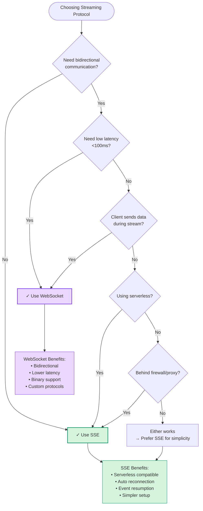

import {
  Radio,
  Network,
  CheckCircle2,
  XCircle,
  ArrowRight,
  Zap,
  Shield,
  Server,
  Globe,
  Code2,
  TrendingUp,
  AlertTriangle,
  Info,
  GitBranch,
} from 'lucide-react'

# SSE vs WebSocket Decision Guide

<div className="flex items-center gap-2 mb-6">
  <Radio className="w-5 h-5 text-brand-500" />
  <Network className="w-5 h-5 text-purple-500" />
  <span className="text-sm text-muted-foreground">
    Choose the right streaming protocol for your application
  </span>
</div>

## Quick Decision Matrix

<div className="grid md:grid-cols-2 gap-6 mb-12">
  <div className="p-6 rounded-xl border-2 border-brand-500 bg-brand-50 dark:bg-brand-950/30">
    <div className="flex items-center gap-3 mb-4">
      <Radio className="w-6 h-6 text-brand-500" />
      <h3 className="text-xl font-bold">Choose SSE When</h3>
    </div>
    <ul className="space-y-2">
      <li className="flex items-start gap-2">
        <CheckCircle2 className="w-5 h-5 text-emerald-500 flex-shrink-0 mt-0.5" />
        <span>You need <strong>one-way</strong> server-to-client streaming</span>
      </li>
      <li className="flex items-start gap-2">
        <CheckCircle2 className="w-5 h-5 text-emerald-500 flex-shrink-0 mt-0.5" />
        <span>Streaming AI responses (OpenAI, Anthropic, etc.)</span>
      </li>
      <li className="flex items-start gap-2">
        <CheckCircle2 className="w-5 h-5 text-emerald-500 flex-shrink-0 mt-0.5" />
        <span>Simple deployment on <strong>serverless</strong> platforms</span>
      </li>
      <li className="flex items-start gap-2">
        <CheckCircle2 className="w-5 h-5 text-emerald-500 flex-shrink-0 mt-0.5" />
        <span>Working behind proxies/CDNs/firewalls</span>
      </li>
      <li className="flex items-start gap-2">
        <CheckCircle2 className="w-5 h-5 text-emerald-500 flex-shrink-0 mt-0.5" />
        <span>Built-in <strong>automatic reconnection</strong></span>
      </li>
      <li className="flex items-start gap-2">
        <CheckCircle2 className="w-5 h-5 text-emerald-500 flex-shrink-0 mt-0.5" />
        <span>Event IDs for <strong>resumption</strong> after disconnect</span>
      </li>
    </ul>
    <div className="mt-4 p-3 rounded-lg bg-white dark:bg-neutral-900 border border-brand-200 dark:border-brand-800">
      <div className="text-sm font-medium text-brand-600 dark:text-brand-400 mb-1">
        Perfect For
      </div>
      <div className="text-sm text-muted-foreground">
        AI chat streaming, live notifications, dashboard updates, real-time logs
      </div>
    </div>
  </div>

  <div className="p-6 rounded-xl border-2 border-purple-500 bg-purple-50 dark:bg-purple-950/30">
    <div className="flex items-center gap-3 mb-4">
      <Network className="w-6 h-6 text-purple-500" />
      <h3 className="text-xl font-bold">Choose WebSocket When</h3>
    </div>
    <ul className="space-y-2">
      <li className="flex items-start gap-2">
        <CheckCircle2 className="w-5 h-5 text-emerald-500 flex-shrink-0 mt-0.5" />
        <span>You need <strong>bidirectional</strong> communication</span>
      </li>
      <li className="flex items-start gap-2">
        <CheckCircle2 className="w-5 h-5 text-emerald-500 flex-shrink-0 mt-0.5" />
        <span>Client must send data during streaming</span>
      </li>
      <li className="flex items-start gap-2">
        <CheckCircle2 className="w-5 h-5 text-emerald-500 flex-shrink-0 mt-0.5" />
        <span><strong>Lower latency</strong> is critical (&lt;100ms)</span>
      </li>
      <li className="flex items-start gap-2">
        <CheckCircle2 className="w-5 h-5 text-emerald-500 flex-shrink-0 mt-0.5" />
        <span>Binary data support required</span>
      </li>
      <li className="flex items-start gap-2">
        <CheckCircle2 className="w-5 h-5 text-emerald-500 flex-shrink-0 mt-0.5" />
        <span>Real-time <strong>collaborative</strong> features</span>
      </li>
      <li className="flex items-start gap-2">
        <CheckCircle2 className="w-5 h-5 text-emerald-500 flex-shrink-0 mt-0.5" />
        <span>Custom sub-protocols needed</span>
      </li>
    </ul>
    <div className="mt-4 p-3 rounded-lg bg-white dark:bg-neutral-900 border border-purple-200 dark:border-purple-800">
      <div className="text-sm font-medium text-purple-600 dark:text-purple-400 mb-1">
        Perfect For
      </div>
      <div className="text-sm text-muted-foreground">
        Multiplayer games, collaborative editing, live presence, chat rooms
      </div>
    </div>
  </div>
</div>

---

## Feature Comparison Matrix

<div className="overflow-x-auto">
  <table className="w-full border-collapse">
    <thead>
      <tr className="border-b-2 border-neutral-200 dark:border-neutral-800">
        <th className="text-left p-4 font-semibold">Feature</th>
        <th className="text-center p-4 font-semibold">
          <div className="flex items-center justify-center gap-2">
            <Radio className="w-5 h-5 text-brand-500" />
            SSE
          </div>
        </th>
        <th className="text-center p-4 font-semibold">
          <div className="flex items-center justify-center gap-2">
            <Network className="w-5 h-5 text-purple-500" />
            WebSocket
          </div>
        </th>
      </tr>
    </thead>
    <tbody>
      <tr className="border-b border-neutral-100 dark:border-neutral-900">
        <td className="p-4 font-medium">Direction</td>
        <td className="p-4 text-center">Server → Client only</td>
        <td className="p-4 text-center">Bidirectional (Full Duplex)</td>
      </tr>
      <tr className="border-b border-neutral-100 dark:border-neutral-900 bg-neutral-50 dark:bg-neutral-950/50">
        <td className="p-4 font-medium">Protocol</td>
        <td className="p-4 text-center">HTTP/1.1, HTTP/2</td>
        <td className="p-4 text-center">WebSocket (ws://, wss://)</td>
      </tr>
      <tr className="border-b border-neutral-100 dark:border-neutral-900">
        <td className="p-4 font-medium">Data Format</td>
        <td className="p-4 text-center">Text (UTF-8) only</td>
        <td className="p-4 text-center">Text + Binary</td>
      </tr>
      <tr className="border-b border-neutral-100 dark:border-neutral-900 bg-neutral-50 dark:bg-neutral-950/50">
        <td className="p-4 font-medium">Browser Support</td>
        <td className="p-4 text-center">
          <div className="flex items-center justify-center gap-1">
            <CheckCircle2 className="w-4 h-4 text-emerald-500" />
            All modern browsers
          </div>
        </td>
        <td className="p-4 text-center">
          <div className="flex items-center justify-center gap-1">
            <CheckCircle2 className="w-4 h-4 text-emerald-500" />
            All modern browsers
          </div>
        </td>
      </tr>
      <tr className="border-b border-neutral-100 dark:border-neutral-900">
        <td className="p-4 font-medium">Automatic Reconnection</td>
        <td className="p-4 text-center">
          <div className="flex items-center justify-center gap-1">
            <CheckCircle2 className="w-4 h-4 text-emerald-500" />
            Built-in to spec
          </div>
        </td>
        <td className="p-4 text-center">
          <div className="flex items-center justify-center gap-1">
            <XCircle className="w-4 h-4 text-neutral-400" />
            Manual implementation
          </div>
        </td>
      </tr>
      <tr className="border-b border-neutral-100 dark:border-neutral-900 bg-neutral-50 dark:bg-neutral-950/50">
        <td className="p-4 font-medium">Event Resumption</td>
        <td className="p-4 text-center">
          <div className="flex items-center justify-center gap-1">
            <CheckCircle2 className="w-4 h-4 text-emerald-500" />
            Event IDs (Last-Event-ID)
          </div>
        </td>
        <td className="p-4 text-center">
          <div className="flex items-center justify-center gap-1">
            <XCircle className="w-4 h-4 text-neutral-400" />
            Manual implementation
          </div>
        </td>
      </tr>
      <tr className="border-b border-neutral-100 dark:border-neutral-900">
        <td className="p-4 font-medium">Firewall/Proxy Friendly</td>
        <td className="p-4 text-center">
          <div className="flex items-center justify-center gap-1">
            <CheckCircle2 className="w-4 h-4 text-emerald-500" />
            Excellent (standard HTTP)
          </div>
        </td>
        <td className="p-4 text-center">
          <div className="flex items-center justify-center gap-1">
            <AlertTriangle className="w-4 h-4 text-amber-500" />
            May be blocked
          </div>
        </td>
      </tr>
      <tr className="border-b border-neutral-100 dark:border-neutral-900 bg-neutral-50 dark:bg-neutral-950/50">
        <td className="p-4 font-medium">Serverless Support</td>
        <td className="p-4 text-center">
          <div className="flex items-center justify-center gap-1">
            <CheckCircle2 className="w-4 h-4 text-emerald-500" />
            Vercel, Netlify, Cloudflare Workers
          </div>
        </td>
        <td className="p-4 text-center">
          <div className="flex items-center justify-center gap-1">
            <XCircle className="w-4 h-4 text-neutral-400" />
            Requires persistent connections
          </div>
        </td>
      </tr>
      <tr className="border-b border-neutral-100 dark:border-neutral-900">
        <td className="p-4 font-medium">Connection Overhead</td>
        <td className="p-4 text-center">Standard HTTP</td>
        <td className="p-4 text-center">WebSocket handshake + HTTP upgrade</td>
      </tr>
      <tr className="border-b border-neutral-100 dark:border-neutral-900 bg-neutral-50 dark:bg-neutral-950/50">
        <td className="p-4 font-medium">Latency</td>
        <td className="p-4 text-center">~100-200ms typical</td>
        <td className="p-4 text-center">~50-100ms typical (lower)</td>
      </tr>
      <tr className="border-b border-neutral-100 dark:border-neutral-900">
        <td className="p-4 font-medium">Message Size Limit</td>
        <td className="p-4 text-center">Server/browser dependent</td>
        <td className="p-4 text-center">Configurable, up to 2^63 bytes</td>
      </tr>
      <tr className="border-b border-neutral-100 dark:border-neutral-900 bg-neutral-50 dark:bg-neutral-950/50">
        <td className="p-4 font-medium">Compression</td>
        <td className="p-4 text-center">HTTP compression (gzip, br)</td>
        <td className="p-4 text-center">Per-message deflate extension</td>
      </tr>
      <tr className="border-b border-neutral-100 dark:border-neutral-900">
        <td className="p-4 font-medium">Authentication</td>
        <td className="p-4 text-center">Headers, cookies</td>
        <td className="p-4 text-center">Query params, first message, custom headers</td>
      </tr>
      <tr className="bg-neutral-50 dark:bg-neutral-950/50">
        <td className="p-4 font-medium">Complexity</td>
        <td className="p-4 text-center">
          <div className="flex items-center justify-center gap-1">
            <TrendingUp className="w-4 h-4 text-emerald-500" />
            Simple
          </div>
        </td>
        <td className="p-4 text-center">
          <div className="flex items-center justify-center gap-1">
            <TrendingUp className="w-4 h-4 text-amber-500" />
            More complex
          </div>
        </td>
      </tr>
    </tbody>
  </table>
</div>

---

## Use Case Recommendations

### AI Chat Streaming (Recommended: SSE)

<div className="p-6 rounded-xl bg-emerald-50 dark:bg-emerald-950/30 border border-emerald-200 dark:border-emerald-800 mb-6">
  <div className="flex items-start gap-3">
    <Radio className="w-6 h-6 text-emerald-500 flex-shrink-0 mt-1" />
    <div>
      <h4 className="font-semibold text-emerald-900 dark:text-emerald-100 mb-2">
        Why SSE is Ideal for AI Streaming
      </h4>
      <ul className="space-y-2 text-sm text-emerald-800 dark:text-emerald-200">
        <li className="flex items-start gap-2">
          <CheckCircle2 className="w-4 h-4 flex-shrink-0 mt-0.5" />
          <span><strong>One-way flow:</strong> AI responses stream server→client, perfect for SSE</span>
        </li>
        <li className="flex items-start gap-2">
          <CheckCircle2 className="w-4 h-4 flex-shrink-0 mt-0.5" />
          <span><strong>Serverless compatible:</strong> Works on Vercel, Netlify, Cloudflare Workers</span>
        </li>
        <li className="flex items-start gap-2">
          <CheckCircle2 className="w-4 h-4 flex-shrink-0 mt-0.5" />
          <span><strong>Automatic reconnection:</strong> Built into SSE spec, handles network hiccups</span>
        </li>
        <li className="flex items-start gap-2">
          <CheckCircle2 className="w-4 h-4 flex-shrink-0 mt-0.5" />
          <span><strong>Event resumption:</strong> Resume from last event ID after reconnection</span>
        </li>
        <li className="flex items-start gap-2">
          <CheckCircle2 className="w-4 h-4 flex-shrink-0 mt-0.5" />
          <span><strong>Standard HTTP:</strong> No special infrastructure or WebSocket servers required</span>
        </li>
      </ul>
    </div>
  </div>
</div>

```tsx
import { useStreamingSSE } from '@clarity-chat/react'

function AIChat() {
  const { status, data, connect, disconnect } = useStreamingSSE({
    url: '/api/chat/stream',
    method: 'POST',
    body: { message: 'Tell me about quantum computing' },
    autoReconnect: true,
    resumeFromLastEventId: true,
    onMessage: (event) => {
      if (event.type === 'done') disconnect()
    },
  })

  return (
    <div>
      <button onClick={connect}>Send Message</button>
      {status === 'streaming' && <p>{data}</p>}
    </div>
  )
}
```

### Real-Time Collaboration (Recommended: WebSocket)

<div className="p-6 rounded-xl bg-purple-50 dark:bg-purple-950/30 border border-purple-200 dark:border-purple-800 mb-6">
  <div className="flex items-start gap-3">
    <Network className="w-6 h-6 text-purple-500 flex-shrink-0 mt-1" />
    <div>
      <h4 className="font-semibold text-purple-900 dark:text-purple-100 mb-2">
        Why WebSocket is Ideal for Collaboration
      </h4>
      <ul className="space-y-2 text-sm text-purple-800 dark:text-purple-200">
        <li className="flex items-start gap-2">
          <CheckCircle2 className="w-4 h-4 flex-shrink-0 mt-0.5" />
          <span><strong>Bidirectional:</strong> Users send edits, receive updates from others</span>
        </li>
        <li className="flex items-start gap-2">
          <CheckCircle2 className="w-4 h-4 flex-shrink-0 mt-0.5" />
          <span><strong>Low latency:</strong> Real-time presence, cursors, typing indicators</span>
        </li>
        <li className="flex items-start gap-2">
          <CheckCircle2 className="w-4 h-4 flex-shrink-0 mt-0.5" />
          <span><strong>Persistent connection:</strong> Always-on for instant updates</span>
        </li>
        <li className="flex items-start gap-2">
          <CheckCircle2 className="w-4 h-4 flex-shrink-0 mt-0.5" />
          <span><strong>Binary data:</strong> Send diffs, OT operations, CRDT updates efficiently</span>
        </li>
      </ul>
    </div>
  </div>
</div>

```tsx
import { useStreamingWebSocket } from '@clarity-chat/react'

function CollaborativeEditor() {
  const { status, send, sendJson } = useStreamingWebSocket({
    url: 'wss://api.example.com/ws/collab',
    autoReconnect: true,
    enableHeartbeat: true,
    onMessage: (msg) => {
      if (msg.data.type === 'cursor_update') {
        updateUserCursor(msg.data.userId, msg.data.position)
      } else if (msg.data.type === 'text_delta') {
        applyTextDelta(msg.data.delta)
      }
    },
  })

  const handleEdit = (delta) => {
    sendJson({ type: 'text_delta', delta })
  }

  return <Editor onEdit={handleEdit} />
}
```

---

## Performance Characteristics

### Throughput Comparison

<div className="grid md:grid-cols-2 gap-6 mb-8">
  <div className="p-6 rounded-xl border border-neutral-200 dark:border-neutral-800">
    <h4 className="font-semibold mb-4 flex items-center gap-2">
      <Radio className="w-5 h-5 text-brand-500" />
      SSE Performance
    </h4>
    <dl className="space-y-3 text-sm">
      <div className="flex justify-between">
        <dt className="text-muted-foreground">Latency (typical)</dt>
        <dd className="font-mono font-medium">100-200ms</dd>
      </div>
      <div className="flex justify-between">
        <dt className="text-muted-foreground">Messages/sec</dt>
        <dd className="font-mono font-medium">~1,000-10,000</dd>
      </div>
      <div className="flex justify-between">
        <dt className="text-muted-foreground">Connection overhead</dt>
        <dd className="font-mono font-medium">Standard HTTP</dd>
      </div>
      <div className="flex justify-between">
        <dt className="text-muted-foreground">Reconnect time</dt>
        <dd className="font-mono font-medium">~1-3s (auto)</dd>
      </div>
    </dl>
  </div>

  <div className="p-6 rounded-xl border border-neutral-200 dark:border-neutral-800">
    <h4 className="font-semibold mb-4 flex items-center gap-2">
      <Network className="w-5 h-5 text-purple-500" />
      WebSocket Performance
    </h4>
    <dl className="space-y-3 text-sm">
      <div className="flex justify-between">
        <dt className="text-muted-foreground">Latency (typical)</dt>
        <dd className="font-mono font-medium">50-100ms</dd>
      </div>
      <div className="flex justify-between">
        <dt className="text-muted-foreground">Messages/sec</dt>
        <dd className="font-mono font-medium">~10,000-100,000</dd>
      </div>
      <div className="flex justify-between">
        <dt className="text-muted-foreground">Connection overhead</dt>
        <dd className="font-mono font-medium">~2-6 KB handshake</dd>
      </div>
      <div className="flex justify-between">
        <dt className="text-muted-foreground">Reconnect time</dt>
        <dd className="font-mono font-medium">~0.5-2s (manual)</dd>
      </div>
    </dl>
  </div>
</div>

<div className="p-4 rounded-lg bg-blue-50 dark:bg-blue-950/20 border border-blue-200 dark:border-blue-800 mb-8">
  <div className="flex items-start gap-3">
    <Info className="w-5 h-5 text-blue-500 flex-shrink-0 mt-0.5" />
    <div className="text-sm text-blue-900 dark:text-blue-100">
      <strong>Performance Note:</strong> For most AI chat applications, SSE's ~100-200ms latency is imperceptible to users. WebSocket's lower latency (~50-100ms) matters more for real-time collaboration or gaming.
    </div>
  </div>
</div>

---

## Browser Compatibility

Both SSE and WebSocket enjoy excellent browser support:

<div className="grid md:grid-cols-2 gap-6 mb-8">
  <div className="p-6 rounded-xl border border-neutral-200 dark:border-neutral-800">
    <h4 className="font-semibold mb-3 flex items-center gap-2">
      <Globe className="w-5 h-5 text-brand-500" />
      SSE Browser Support
    </h4>
    <ul className="space-y-2 text-sm">
      <li className="flex items-center gap-2">
        <CheckCircle2 className="w-4 h-4 text-emerald-500" />
        Chrome 6+ (2010)
      </li>
      <li className="flex items-center gap-2">
        <CheckCircle2 className="w-4 h-4 text-emerald-500" />
        Firefox 6+ (2011)
      </li>
      <li className="flex items-center gap-2">
        <CheckCircle2 className="w-4 h-4 text-emerald-500" />
        Safari 5+ (2010)
      </li>
      <li className="flex items-center gap-2">
        <CheckCircle2 className="w-4 h-4 text-emerald-500" />
        Edge (all versions)
      </li>
      <li className="flex items-center gap-2">
        <XCircle className="w-4 h-4 text-neutral-400" />
        IE (no native support, polyfill available)
      </li>
    </ul>
  </div>

  <div className="p-6 rounded-xl border border-neutral-200 dark:border-neutral-800">
    <h4 className="font-semibold mb-3 flex items-center gap-2">
      <Globe className="w-5 h-5 text-purple-500" />
      WebSocket Browser Support
    </h4>
    <ul className="space-y-2 text-sm">
      <li className="flex items-center gap-2">
        <CheckCircle2 className="w-4 h-4 text-emerald-500" />
        Chrome 16+ (2011)
      </li>
      <li className="flex items-center gap-2">
        <CheckCircle2 className="w-4 h-4 text-emerald-500" />
        Firefox 11+ (2012)
      </li>
      <li className="flex items-center gap-2">
        <CheckCircle2 className="w-4 h-4 text-emerald-500" />
        Safari 7+ (2013)
      </li>
      <li className="flex items-center gap-2">
        <CheckCircle2 className="w-4 h-4 text-emerald-500" />
        Edge (all versions)
      </li>
      <li className="flex items-center gap-2">
        <XCircle className="w-4 h-4 text-neutral-400" />
        IE 10+ (basic support, IE11+ recommended)
      </li>
    </ul>
  </div>
</div>

<div className="p-4 rounded-lg bg-emerald-50 dark:bg-emerald-950/20 border border-emerald-200 dark:border-emerald-800">
  <div className="flex items-start gap-3">
    <CheckCircle2 className="w-5 h-5 text-emerald-500 flex-shrink-0 mt-0.5" />
    <div className="text-sm text-emerald-900 dark:text-emerald-100">
      <strong>Coverage:</strong> Both protocols cover 95%+ of global browser usage. IE is the only major limitation, and most modern apps no longer support it.
    </div>
  </div>
</div>

---

## Infrastructure Requirements

### SSE Infrastructure

<div className="space-y-4 mb-8">
  <div className="p-5 rounded-xl border border-neutral-200 dark:border-neutral-800">
    <h4 className="font-semibold mb-3 flex items-center gap-2">
      <Server className="w-5 h-5 text-brand-500" />
      Server Requirements
    </h4>
    <div className="grid md:grid-cols-2 gap-4 text-sm">
      <div>
        <div className="font-medium text-emerald-600 dark:text-emerald-400 mb-2">
          ✓ Works On
        </div>
        <ul className="space-y-1 text-muted-foreground">
          <li>• Vercel Edge & Serverless</li>
          <li>• Netlify Functions</li>
          <li>• Cloudflare Workers</li>
          <li>• AWS Lambda</li>
          <li>• Node.js servers (Express, Fastify)</li>
          <li>• Next.js API routes</li>
          <li>• Any HTTP server</li>
        </ul>
      </div>
      <div>
        <div className="font-medium text-neutral-600 dark:text-neutral-400 mb-2">
          Requirements
        </div>
        <ul className="space-y-1 text-muted-foreground">
          <li>• Standard HTTP/HTTPS</li>
          <li>• `Content-Type: text/event-stream`</li>
          <li>• `Cache-Control: no-cache`</li>
          <li>• Chunked transfer encoding</li>
          <li>• No special libraries needed</li>
        </ul>
      </div>
    </div>
  </div>

  <div className="p-5 rounded-xl border border-neutral-200 dark:border-neutral-800">
    <h4 className="font-semibold mb-3">Deployment Example (Next.js)</h4>
    <pre className="p-4 rounded-lg bg-neutral-950 text-neutral-100 overflow-x-auto text-sm">
      <code>{`// app/api/chat/stream/route.ts
export async function POST(req: Request) {
  const stream = new ReadableStream({
    async start(controller) {
      const encoder = new TextEncoder()

      // Stream AI response
      for await (const chunk of aiResponse) {
        controller.enqueue(encoder.encode(\`data: \${chunk}\\n\\n\`))
      }

      controller.close()
    },
  })

  return new Response(stream, {
    headers: {
      'Content-Type': 'text/event-stream',
      'Cache-Control': 'no-cache',
      'Connection': 'keep-alive',
    },
  })
}`}</code>
    </pre>
  </div>
</div>

### WebSocket Infrastructure

<div className="space-y-4 mb-8">
  <div className="p-5 rounded-xl border border-neutral-200 dark:border-neutral-800">
    <h4 className="font-semibold mb-3 flex items-center gap-2">
      <Server className="w-5 h-5 text-purple-500" />
      Server Requirements
    </h4>
    <div className="grid md:grid-cols-2 gap-4 text-sm">
      <div>
        <div className="font-medium text-emerald-600 dark:text-emerald-400 mb-2">
          ✓ Works On
        </div>
        <ul className="space-y-1 text-muted-foreground">
          <li>• Railway</li>
          <li>• Fly.io</li>
          <li>• Render</li>
          <li>• AWS EC2/ECS</li>
          <li>• Digital Ocean</li>
          <li>• Node.js servers (ws, socket.io)</li>
          <li>• Dedicated servers (VPS, bare metal)</li>
        </ul>
      </div>
      <div>
        <div className="font-medium text-red-600 dark:text-red-400 mb-2">
          ✗ Doesn't Work On
        </div>
        <ul className="space-y-1 text-muted-foreground">
          <li>• Vercel Serverless</li>
          <li>• Netlify Functions</li>
          <li>• Cloudflare Workers (standard)</li>
          <li>• AWS Lambda (standard)</li>
          <li>• Most serverless platforms</li>
        </ul>
      </div>
    </div>
  </div>

  <div className="p-5 rounded-xl border border-neutral-200 dark:border-neutral-800">
    <h4 className="font-semibold mb-3">Deployment Example (Node.js + ws)</h4>
    <pre className="p-4 rounded-lg bg-neutral-950 text-neutral-100 overflow-x-auto text-sm">
      <code>{`// server.ts
import { WebSocketServer } from 'ws'

const wss = new WebSocketServer({ port: 8080 })

wss.on('connection', (ws) => {
  ws.on('message', async (data) => {
    const msg = JSON.parse(data.toString())

    // Stream AI response
    for await (const chunk of aiResponse(msg.content)) {
      ws.send(JSON.stringify({ type: 'chunk', data: chunk }))
    }

    ws.send(JSON.stringify({ type: 'done' }))
  })
})

// Deploy on Railway, Fly.io, or any VPS`}</code>
    </pre>
  </div>
</div>

<div className="p-4 rounded-lg bg-amber-50 dark:bg-amber-950/20 border border-amber-200 dark:border-amber-800">
  <div className="flex items-start gap-3">
    <AlertTriangle className="w-5 h-5 text-amber-500 flex-shrink-0 mt-0.5" />
    <div className="text-sm text-amber-900 dark:text-amber-100">
      <strong>Infrastructure Constraint:</strong> WebSocket requires persistent connection infrastructure. Serverless platforms like Vercel don't support it natively. Consider SSE for serverless deployments, or use dedicated servers (Railway, Fly.io) for WebSocket.
    </div>
  </div>
</div>

---

## Code Examples

### Basic SSE Implementation

```tsx
import { useStreamingSSE } from '@clarity-chat/react'

function SSEChat() {
  const {
    status,
    data,
    events,
    connect,
    disconnect,
    reset,
  } = useStreamingSSE({
    url: '/api/chat/stream',
    method: 'POST',
    body: { message: 'Hello, AI!' },

    // Authentication
    authToken: user.apiKey,
    useCookieFallback: true,

    // Reconnection
    autoReconnect: true,
    maxReconnectAttempts: 5,
    reconnectDelay: 1000,
    maxReconnectDelay: 30000,

    // Resumption
    resumeFromLastEventId: true,

    // Event handlers
    onMessage: (event) => {
      console.log('Received:', event.data)
      if (event.type === 'done') disconnect()
    },
    onError: (error) => {
      console.error('Stream error:', error)
    },
    onReconnecting: (attempt, delay) => {
      console.log(`Reconnecting... attempt ${attempt}`)
    },
  })

  return (
    <div>
      <button onClick={connect} disabled={status !== 'idle'}>
        Start Stream
      </button>
      <button onClick={disconnect} disabled={status === 'idle'}>
        Cancel
      </button>

      {status === 'streaming' && <div>{data}</div>}
      {status === 'error' && <div>Error occurred</div>}
    </div>
  )
}
```

### Basic WebSocket Implementation

```tsx
import { useStreamingWebSocket } from '@clarity-chat/react'
import { useEffect } from 'react'

function WebSocketChat() {
  const {
    status,
    messages,
    connect,
    disconnect,
    sendJson,
  } = useStreamingWebSocket({
    url: 'wss://api.example.com/ws',

    // Reconnection
    autoReconnect: true,
    maxReconnectAttempts: 5,
    reconnectDelay: 1000,
    reconnectOnCleanClose: true,

    // Heartbeat (keepalive)
    enableHeartbeat: true,
    heartbeatInterval: 30000,
    heartbeatMessage: 'ping',

    // Event handlers
    onMessage: (msg) => {
      console.log('Received:', msg.data)
    },
    onOpen: () => {
      console.log('WebSocket connected')
    },
    onError: (event) => {
      console.error('WebSocket error:', event)
    },
    onHeartbeatFailed: () => {
      console.warn('Heartbeat failed, reconnecting...')
    },
  })

  // Auto-connect on mount
  useEffect(() => {
    connect()
    return () => disconnect()
  }, [connect, disconnect])

  const sendMessage = (text: string) => {
    sendJson({
      type: 'chat',
      content: text,
      timestamp: Date.now(),
    })
  }

  return (
    <div>
      <div>Status: {status}</div>

      <div>
        {messages.map((msg, i) => (
          <div key={i}>{msg.data}</div>
        ))}
      </div>

      <button onClick={() => sendMessage('Hello!')}>
        Send Message
      </button>
    </div>
  )
}
```

---

## Migration Path Between Protocols

<div className="mb-8">
  <h3 className="text-xl font-semibold mb-4 flex items-center gap-2">
    <GitBranch className="w-6 h-6 text-brand-500" />
    Migrating from SSE to WebSocket
  </h3>

  <div className="space-y-6">
    <div className="p-6 rounded-xl border border-neutral-200 dark:border-neutral-800">
      <h4 className="font-semibold mb-3">Step 1: Update Hook Import</h4>
      <div className="grid md:grid-cols-2 gap-4">
        <div>
          <div className="text-sm font-medium text-muted-foreground mb-2">Before (SSE)</div>
          <pre className="p-3 rounded-lg bg-neutral-950 text-neutral-100 text-xs overflow-x-auto">
            <code>{`import { useStreamingSSE } from '@clarity-chat/react'`}</code>
          </pre>
        </div>
        <div>
          <div className="text-sm font-medium text-muted-foreground mb-2">After (WebSocket)</div>
          <pre className="p-3 rounded-lg bg-neutral-950 text-neutral-100 text-xs overflow-x-auto">
            <code>{`import { useStreamingWebSocket } from '@clarity-chat/react'`}</code>
          </pre>
        </div>
      </div>
    </div>

    <div className="p-6 rounded-xl border border-neutral-200 dark:border-neutral-800">
      <h4 className="font-semibold mb-3">Step 2: Update URL Protocol</h4>
      <div className="grid md:grid-cols-2 gap-4">
        <div>
          <div className="text-sm font-medium text-muted-foreground mb-2">Before (SSE)</div>
          <pre className="p-3 rounded-lg bg-neutral-950 text-neutral-100 text-xs overflow-x-auto">
            <code>{`url: 'https://api.example.com/stream'`}</code>
          </pre>
        </div>
        <div>
          <div className="text-sm font-medium text-muted-foreground mb-2">After (WebSocket)</div>
          <pre className="p-3 rounded-lg bg-neutral-950 text-neutral-100 text-xs overflow-x-auto">
            <code>{`url: 'wss://api.example.com/ws'`}</code>
          </pre>
        </div>
      </div>
    </div>

    <div className="p-6 rounded-xl border border-neutral-200 dark:border-neutral-800">
      <h4 className="font-semibold mb-3">Step 3: Adjust Configuration</h4>
      <div className="grid md:grid-cols-2 gap-4">
        <div>
          <div className="text-sm font-medium text-muted-foreground mb-2">SSE Config</div>
          <pre className="p-3 rounded-lg bg-neutral-950 text-neutral-100 text-xs overflow-x-auto">
            <code>{`{
  url: '/api/stream',
  method: 'POST',
  body: { message: 'Hello' },
  authToken: token,
  resumeFromLastEventId: true,
}`}</code>
          </pre>
        </div>
        <div>
          <div className="text-sm font-medium text-muted-foreground mb-2">WebSocket Config</div>
          <pre className="p-3 rounded-lg bg-neutral-950 text-neutral-100 text-xs overflow-x-auto">
            <code>{`{
  url: 'wss://api.example.com/ws',
  // No method/body - send via sendJson()
  enableHeartbeat: true,
  heartbeatInterval: 30000,
  // resumeFromLastEventId not available
}`}</code>
          </pre>
        </div>
      </div>
    </div>

    <div className="p-6 rounded-xl border border-neutral-200 dark:border-neutral-800">
      <h4 className="font-semibold mb-3">Step 4: Update Message Sending</h4>
      <div className="grid md:grid-cols-2 gap-4">
        <div>
          <div className="text-sm font-medium text-muted-foreground mb-2">SSE (request body)</div>
          <pre className="p-3 rounded-lg bg-neutral-950 text-neutral-100 text-xs overflow-x-auto">
            <code>{`// SSE: Send via request body
useStreamingSSE({
  url: '/api/stream',
  method: 'POST',
  body: { message: 'Hello' },
})`}</code>
          </pre>
        </div>
        <div>
          <div className="text-sm font-medium text-muted-foreground mb-2">WebSocket (send method)</div>
          <pre className="p-3 rounded-lg bg-neutral-950 text-neutral-100 text-xs overflow-x-auto">
            <code>{`// WebSocket: Send after connection
const { sendJson } = useStreamingWebSocket({
  url: 'wss://api.example.com/ws',
})

sendJson({ message: 'Hello' })`}</code>
          </pre>
        </div>
      </div>
    </div>

    <div className="p-6 rounded-xl border border-neutral-200 dark:border-neutral-800">
      <h4 className="font-semibold mb-3">Step 5: Deploy to Compatible Infrastructure</h4>
      <div className="text-sm text-muted-foreground mb-3">
        SSE works on serverless platforms, WebSocket requires persistent connections:
      </div>
      <ul className="space-y-2 text-sm">
        <li className="flex items-start gap-2">
          <ArrowRight className="w-4 h-4 text-brand-500 flex-shrink-0 mt-0.5" />
          <span><strong>From Vercel Serverless (SSE)</strong> → <strong>Railway/Fly.io (WebSocket)</strong></span>
        </li>
        <li className="flex items-start gap-2">
          <ArrowRight className="w-4 h-4 text-brand-500 flex-shrink-0 mt-0.5" />
          <span>Set up WebSocket server with <code>ws</code> or <code>socket.io</code></span>
        </li>
        <li className="flex items-start gap-2">
          <ArrowRight className="w-4 h-4 text-brand-500 flex-shrink-0 mt-0.5" />
          <span>Configure load balancer for sticky sessions (if using multiple instances)</span>
        </li>
      </ul>
    </div>
  </div>
</div>

<div className="mb-8">
  <h3 className="text-xl font-semibold mb-4 flex items-center gap-2">
    <GitBranch className="w-6 h-6 text-purple-500" />
    Migrating from WebSocket to SSE
  </h3>

  <div className="space-y-6">
    <div className="p-6 rounded-xl border border-neutral-200 dark:border-neutral-800">
      <h4 className="font-semibold mb-3">Why Migrate to SSE?</h4>
      <ul className="space-y-2 text-sm text-muted-foreground">
        <li className="flex items-start gap-2">
          <CheckCircle2 className="w-4 h-4 text-emerald-500 flex-shrink-0 mt-0.5" />
          <span>Simplify infrastructure (serverless compatibility)</span>
        </li>
        <li className="flex items-start gap-2">
          <CheckCircle2 className="w-4 h-4 text-emerald-500 flex-shrink-0 mt-0.5" />
          <span>Reduce costs (no persistent server required)</span>
        </li>
        <li className="flex items-start gap-2">
          <CheckCircle2 className="w-4 h-4 text-emerald-500 flex-shrink-0 mt-0.5" />
          <span>Automatic reconnection & resumption built-in</span>
        </li>
        <li className="flex items-start gap-2">
          <CheckCircle2 className="w-4 h-4 text-emerald-500 flex-shrink-0 mt-0.5" />
          <span>Better firewall/proxy compatibility</span>
        </li>
      </ul>
    </div>

    <div className="p-6 rounded-xl border border-neutral-200 dark:border-neutral-800">
      <h4 className="font-semibold mb-3">Migration Steps</h4>
      <ol className="space-y-3 text-sm">
        <li className="flex gap-3">
          <span className="flex-shrink-0 w-6 h-6 rounded-full bg-brand-500 text-white flex items-center justify-center text-xs font-bold">1</span>
          <div>
            <div className="font-medium mb-1">Change hook import</div>
            <pre className="p-2 rounded bg-neutral-950 text-neutral-100 text-xs overflow-x-auto">
              <code>{`import { useStreamingSSE } from '@clarity-chat/react'`}</code>
            </pre>
          </div>
        </li>
        <li className="flex gap-3">
          <span className="flex-shrink-0 w-6 h-6 rounded-full bg-brand-500 text-white flex items-center justify-center text-xs font-bold">2</span>
          <div>
            <div className="font-medium mb-1">Update URL to HTTP/HTTPS</div>
            <pre className="p-2 rounded bg-neutral-950 text-neutral-100 text-xs overflow-x-auto">
              <code>{`url: 'https://api.example.com/stream' // was wss://`}</code>
            </pre>
          </div>
        </li>
        <li className="flex gap-3">
          <span className="flex-shrink-0 w-6 h-6 rounded-full bg-brand-500 text-white flex items-center justify-center text-xs font-bold">3</span>
          <div>
            <div className="font-medium mb-1">Move message sending to request body</div>
            <pre className="p-2 rounded bg-neutral-950 text-neutral-100 text-xs overflow-x-auto">
              <code>{`method: 'POST',
body: { message: 'Hello' } // was sent via sendJson()`}</code>
            </pre>
          </div>
        </li>
        <li className="flex gap-3">
          <span className="flex-shrink-0 w-6 h-6 rounded-full bg-brand-500 text-white flex items-center justify-center text-xs font-bold">4</span>
          <div>
            <div className="font-medium mb-1">Deploy API route as serverless function</div>
            <div className="text-muted-foreground">Can now use Vercel, Netlify, or any serverless platform</div>
          </div>
        </li>
      </ol>
    </div>
  </div>
</div>

<div className="p-4 rounded-lg bg-blue-50 dark:bg-blue-950/20 border border-blue-200 dark:border-blue-800">
  <div className="flex items-start gap-3">
    <Info className="w-5 h-5 text-blue-500 flex-shrink-0 mt-0.5" />
    <div className="text-sm text-blue-900 dark:text-blue-100">
      <strong>Compatibility Note:</strong> Both hooks share similar APIs (status, connect, disconnect, error handling), making migration straightforward. The main differences are in how messages are sent and infrastructure requirements.
    </div>
  </div>
</div>

---

## Decision Flowchart



---

## Next Steps

<div className="grid md:grid-cols-3 gap-6 mt-8">
  <Link
    href="/reference/hooks/use-streaming-sse"
    className="block p-6 rounded-xl border border-neutral-200 dark:border-neutral-800 hover:border-brand-300 dark:hover:border-brand-700 transition-all hover:-translate-y-1 hover:shadow-lg group"
  >
    <Radio className="w-8 h-8 text-brand-500 mb-3" />
    <h3 className="font-semibold mb-2 group-hover:text-brand-500 transition-colors">
      useStreamingSSE API
    </h3>
    <p className="text-sm text-muted-foreground">
      Complete API reference for SSE streaming hook
    </p>
  </Link>

  <Link
    href="/reference/hooks/use-streaming-websocket"
    className="block p-6 rounded-xl border border-neutral-200 dark:border-neutral-800 hover:border-purple-300 dark:hover:border-purple-700 transition-all hover:-translate-y-1 hover:shadow-lg group"
  >
    <Network className="w-8 h-8 text-purple-500 mb-3" />
    <h3 className="font-semibold mb-2 group-hover:text-purple-500 transition-colors">
      useStreamingWebSocket API
    </h3>
    <p className="text-sm text-muted-foreground">
      Complete API reference for WebSocket streaming hook
    </p>
  </Link>

  <Link
    href="/guides/streaming"
    className="block p-6 rounded-xl border border-neutral-200 dark:border-neutral-800 hover:border-emerald-300 dark:hover:border-emerald-700 transition-all hover:-translate-y-1 hover:shadow-lg group"
  >
    <Code2 className="w-8 h-8 text-emerald-500 mb-3" />
    <h3 className="font-semibold mb-2 group-hover:text-emerald-500 transition-colors">
      Streaming Guide
    </h3>
    <p className="text-sm text-muted-foreground">
      Full implementation guide with examples
    </p>
  </Link>
</div>
