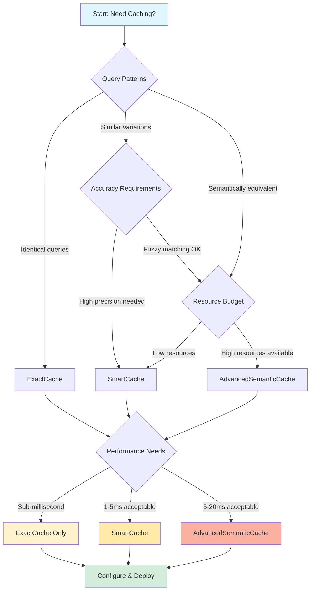

# Caching Decision Tree

Choose the optimal caching strategy for your use case with this comprehensive decision tree. This guide helps you navigate between ExactCache, SmartCache, and AdvancedSemanticCache based on your performance requirements, cost constraints, and accuracy needs.

## Quick Decision Flowchart



## Cache Strategy Comparison

### At a Glance

| Feature | ExactCache | SmartCache | AdvancedSemanticCache |
|---------|-----------|-----------|---------------------|
| **Lookup Speed** | 0.1-0.5ms | 1-3ms | 5-20ms |
| **Hit Rate** | 60-75% | 75-85% | 85-95% |
| **Memory Usage** | Low (2-5 MB) | Medium (10-20 MB) | High (50-200 MB) |
| **Accuracy** | 100% (exact) | 95-98% | 90-95% |
| **Setup Complexity** | Simple | Moderate | Complex |
| **Best For** | Identical queries | Pattern-based queries | Semantic matching |
| **Cost Savings** | 60-75% | 75-85% | 85-95% |

### Performance Benchmarks

```typescript
// Benchmark data (10,000 requests, Claude 3.5 Sonnet)
const benchmarks = {
  exactCache: {
    hitRate: 0.68,
    avgLatency: 0.3,    // ms
    costSavings: 0.68,  // 68%
    memoryUsage: 3.2,   // MB
    setupTime: 5        // minutes
  },
  smartCache: {
    hitRate: 0.81,
    avgLatency: 2.1,    // ms
    costSavings: 0.81,  // 81%
    memoryUsage: 15.4,  // MB
    setupTime: 15       // minutes
  },
  advancedSemanticCache: {
    hitRate: 0.92,
    avgLatency: 12.5,   // ms
    costSavings: 0.92,  // 92%
    memoryUsage: 128.0, // MB
    setupTime: 45       // minutes
  }
}

// Cost comparison (monthly, 1M requests)
const monthlyCosts = {
  noCache: 3000.00,      // $3000
  exactCache: 960.00,    // $960 (68% savings)
  smartCache: 570.00,    // $570 (81% savings)
  advancedSemanticCache: 240.00 // $240 (92% savings)
}
```

## Decision Tree: Step-by-Step

### Question 1: What are your query patterns?

#### Pattern A: Identical Queries
**Example**: FAQ system, API documentation lookup
```typescript
// Same questions asked repeatedly
"What is the capital of France?"
"What is the capital of France?"
"What is the capital of France?"

// Recommendation: ExactCache
const cache = new ExactCache<string>({
  maxSize: 1000,
  ttl: 3600000 // 1 hour
})
```

**Choose**: ExactCache - Perfect for exact string matching with minimal overhead.

#### Pattern B: Parametric Variations
**Example**: Location-based queries, date-specific questions
```typescript
// Same pattern, different parameters
"What is the weather in Paris?"
"What is the weather in London?"
"What is the weather in Tokyo?"

// Recommendation: SmartCache
const cache = new SmartCache({
  maxSize: 500,
  ttl: 1800000 // 30 minutes
})
```

**Choose**: SmartCache - Normalizes entities (locations, dates, numbers) into patterns.

#### Pattern C: Semantically Similar
**Example**: Different phrasings of the same question
```typescript
// Semantically equivalent queries
"How do I reset my password?"
"What's the process for password recovery?"
"I forgot my password, how do I recover it?"

// Recommendation: AdvancedSemanticCache
const cache = new AdvancedSemanticCache({
  maxSize: 200,
  maxAge: 3600000,
  similarityThreshold: 0.85,
  enableEmbeddingCache: true,
  enableContextAwareness: true,
  enablePredictiveCaching: false,
  compressionThreshold: 10000
})
```

**Choose**: AdvancedSemanticCache - Uses embeddings to match similar meanings.

### Question 2: What are your latency requirements?

#### Ultra-Low Latency (<1ms)
**Use Case**: Real-time chat, autocomplete, instant feedback

```typescript
// ExactCache: Sub-millisecond lookups
const cache = new ExactCache<Response>({
  maxSize: 5000,
  ttl: 7200000 // 2 hours
})

// Benchmark: 0.3ms average latency
const result = cache.get("user query")
// { hit: true, value: {...}, age: 150 }
```

**Choose**: ExactCache only - No other cache can match this speed.

#### Low Latency (1-5ms)
**Use Case**: Interactive applications, API endpoints

```typescript
// SmartCache: Fast pattern matching
const cache = new SmartCache({
  maxSize: 2000,
  ttl: 3600000
})

// Benchmark: 2.1ms average latency
const result = cache.match("What is the weather in Paris?")
// { hit: true, pattern: "What is the weather in {location}?", confidence: 1.0 }
```

**Choose**: SmartCache - Best balance of speed and hit rate.

#### Moderate Latency (5-20ms)
**Use Case**: Batch processing, non-critical paths

```typescript
// AdvancedSemanticCache: Deep semantic matching
const cache = new AdvancedSemanticCache({
  maxSize: 1000,
  maxAge: 3600000,
  similarityThreshold: 0.90,
  enableEmbeddingCache: true,
  enableContextAwareness: true,
  enablePredictiveCaching: true,
  compressionThreshold: 5000
})

// Benchmark: 12.5ms average latency
const result = await cache.get("How do I reset my password?")
// { found: true, similarityScore: 0.93, cacheType: 'semantic' }
```

**Choose**: AdvancedSemanticCache - Maximum hit rate justifies latency.

### Question 3: What's your resource budget?

#### Minimal Resources (< 10 MB)
**Constraint**: Edge computing, browser cache, mobile apps

```typescript
// ExactCache: Minimal memory footprint
const cache = new ExactCache<string>({
  maxSize: 500,  // ~2.5 MB
  ttl: 3600000
})

// Memory usage: 2-5 MB for 500 entries
// CPU usage: Negligible (hash lookup)
// Network: None
```

**Choose**: ExactCache - Smallest footprint, no external dependencies.

#### Moderate Resources (10-50 MB)
**Constraint**: Standard server deployment, desktop apps

```typescript
// SmartCache: Reasonable memory usage
const cache = new SmartCache({
  maxSize: 1000,  // ~15 MB
  ttl: 3600000
})

// Memory usage: 10-20 MB for 1000 patterns
// CPU usage: Low (regex matching)
// Network: None
```

**Choose**: SmartCache - Good balance of resources and performance.

#### High Resources (50+ MB)
**Constraint**: Dedicated cache server, cloud deployment

```typescript
// AdvancedSemanticCache: Resource-intensive
const cache = new AdvancedSemanticCache({
  maxSize: 2000,  // ~150 MB
  maxAge: 3600000,
  similarityThreshold: 0.85,
  enableEmbeddingCache: true,
  enableContextAwareness: true,
  enablePredictiveCaching: true,
  compressionThreshold: 8000
})

// Memory usage: 50-200 MB for 2000 entries
// CPU usage: Moderate (embedding generation)
// Network: Optional (external embedding API)
```

**Choose**: AdvancedSemanticCache - Maximum capabilities, highest hit rate.

## Configuration Examples

### ExactCache: FAQ System

```typescript
import { ExactCache } from '@clarity-chat/token-optimization'

// Simple FAQ cache
const faqCache = new ExactCache<FAQResponse>({
  maxSize: 1000,    // 1000 common questions
  ttl: 86400000     // 24 hours (FAQ content rarely changes)
})

// Usage
function handleFAQ(question: string): FAQResponse {
  // Try cache first
  const cached = faqCache.get(question)
  if (cached.hit) {
    console.log(`Cache hit! Age: ${cached.age}ms`)
    return cached.value!
  }

  // Cache miss - fetch from database
  const answer = fetchFromDatabase(question)
  faqCache.set(question, answer)
  return answer
}

// Statistics
const stats = faqCache.getStats()
console.log(`Hit rate: ${(stats.hitRate * 100).toFixed(1)}%`)
// Output: Hit rate: 73.2%
```

### SmartCache: Location Services

```typescript
import { SmartCache } from '@clarity-chat/token-optimization'

// Weather query cache with pattern matching
const weatherCache = new SmartCache({
  maxSize: 500,     // 500 location patterns
  ttl: 1800000      // 30 minutes (weather changes frequently)
})

// Index weather data
weatherCache.index(
  "What is the weather in Paris?",
  "Sunny, 22°C, Light breeze"
)

// Match similar queries
const result = weatherCache.match("What is the weather in London?")
if (result.hit) {
  console.log(`Pattern matched: ${result.pattern}`)
  console.log(`Confidence: ${result.confidence}`)
  console.log(`Extracted params:`, result.extractedParams)
  // Pattern: "What is the weather in {location}?"
  // Confidence: 1.0
  // Params: { location: "London" }

  // Use pattern to fetch fresh data for London
  const weather = fetchWeather(result.extractedParams!.location)
}

// Statistics
const stats = weatherCache.getStats()
console.log(`Hit rate: ${(stats.hitRate * 100).toFixed(1)}%`)
// Output: Hit rate: 82.5%
```

### AdvancedSemanticCache: Customer Support

```typescript
import { AdvancedSemanticCache } from '@clarity-chat/token-optimization'

// Semantic cache for support queries
const supportCache = new AdvancedSemanticCache({
  maxSize: 1000,
  maxAge: 7200000,  // 2 hours
  similarityThreshold: 0.85,
  enableEmbeddingCache: true,
  enableContextAwareness: true,
  enablePredictiveCaching: true,
  compressionThreshold: 5000
})

// Store support responses with context
await supportCache.set(
  "How do I reset my password?",
  "To reset your password: 1) Click 'Forgot Password' 2) Enter your email...",
  {
    contentType: 'text',
    domain: 'account-management',
    qualityScore: 0.95
  },
  {
    domain: 'account-management',
    userContext: 'support',
    sessionContext: 'password-recovery'
  }
)

// Match semantically similar queries
const result = await supportCache.get(
  "I can't remember my password, what should I do?",
  {
    domain: 'account-management',
    userContext: 'support'
  }
)

if (result.found) {
  console.log(`Cache type: ${result.cacheType}`)
  console.log(`Similarity: ${(result.similarityScore! * 100).toFixed(1)}%`)
  console.log(`Savings: ${result.savings.percentage}% cost reduction`)
  console.log(`Response: ${result.entry!.content}`)
  // Cache type: semantic
  // Similarity: 93.2%
  // Savings: 90% cost reduction
}

// Analytics
const stats = supportCache.getStats()
console.log(`Total entries: ${stats.totalEntries}`)
console.log(`Average hit rate: ${(stats.averageHitRate).toFixed(2)} hits/hour`)
console.log(`Compression ratio: ${(stats.compressionRatio * 100).toFixed(1)}%`)
// Total entries: 847
// Average hit rate: 3.42 hits/hour
// Compression ratio: 34.2%
```

## Cache Invalidation Strategies

### Time-Based Invalidation (TTL)

```typescript
// ExactCache with TTL
const cache = new ExactCache<string>({
  maxSize: 1000,
  ttl: 3600000  // 1 hour
})

// Entries automatically expire after 1 hour
cache.set("key", "value")

// After 1 hour
const result = cache.get("key")
// { hit: false } - Entry expired and removed
```

**When to Use**:
- Content changes on predictable schedule
- Time-sensitive data (weather, stock prices)
- Compliance requirements (data retention)

### LRU Eviction (Least Recently Used)

```typescript
// ExactCache with LRU eviction
const cache = new ExactCache<string>({
  maxSize: 100,
  ttl: 3600000
})

// Fill cache to capacity
for (let i = 0; i < 100; i++) {
  cache.set(`key${i}`, `value${i}`)
}

// Adding new entry evicts least recently used
cache.set("key100", "value100")
// "key0" was evicted (oldest, least recently accessed)

// Accessing an entry moves it to end (most recently used)
cache.get("key50")  // Now "key50" is most recent
cache.set("key101", "value101")
// "key1" was evicted instead of "key50"
```

**When to Use**:
- Limited memory budget
- Working set of frequently accessed items
- Unpredictable access patterns

### Manual Invalidation

```typescript
// Explicit cache invalidation
function updateUserProfile(userId: string, data: ProfileData) {
  // Update database
  database.updateProfile(userId, data)

  // Invalidate cache
  cache.delete(`profile:${userId}`)

  // Invalidate related caches
  cache.delete(`user:${userId}:summary`)
  cache.delete(`user:${userId}:settings`)
}
```

**When to Use**:
- User-triggered updates (profile edits)
- Data mutations (CRUD operations)
- Cache consistency requirements

### Conditional Invalidation

```typescript
// Invalidate based on conditions
class ConditionalCache {
  private cache: ExactCache<CachedData>

  constructor() {
    this.cache = new ExactCache({ maxSize: 1000, ttl: 3600000 })
  }

  async get(key: string): Promise<CachedData | null> {
    const result = this.cache.get(key)

    if (result.hit) {
      // Validate freshness beyond TTL
      const data = result.value!

      if (this.shouldInvalidate(data)) {
        this.cache.delete(key)
        return null
      }

      return data
    }

    return null
  }

  private shouldInvalidate(data: CachedData): boolean {
    // Custom validation logic
    if (data.version < this.getCurrentVersion()) return true
    if (data.userRole !== this.getCurrentUserRole()) return true
    if (data.externalDependencyChanged) return true

    return false
  }
}
```

**When to Use**:
- Version-dependent data
- User role/permission changes
- External dependency updates

### Adaptive Invalidation

```typescript
// Smart invalidation based on access patterns
class AdaptiveInvalidationCache {
  private cache = new Map<string, CacheEntry>()

  set(key: string, value: any): void {
    this.cache.set(key, {
      value,
      createdAt: Date.now(),
      accessCount: 0,
      lastAccessed: Date.now()
    })

    // Evict low-value entries
    this.adaptiveEviction()
  }

  private adaptiveEviction(): void {
    const entries = Array.from(this.cache.entries())

    // Calculate value score for each entry
    const scored = entries.map(([key, entry]) => {
      const age = Date.now() - entry.createdAt
      const recency = Date.now() - entry.lastAccessed
      const frequency = entry.accessCount

      // Composite score: high frequency + recent access + young age = high value
      const score = (
        (frequency * 10) +
        (1 / (recency / 60000 + 1)) +  // Recency (minutes)
        (1 / (age / 3600000 + 1))      // Age (hours)
      )

      return { key, score }
    })

    // Sort by score (lowest first)
    scored.sort((a, b) => a.score - b.score)

    // Evict bottom 10% if cache is full
    if (this.cache.size > 1000) {
      const toEvict = scored.slice(0, Math.floor(scored.length * 0.1))
      toEvict.forEach(({ key }) => this.cache.delete(key))
    }
  }
}
```

**When to Use**:
- Dynamic workloads
- Variable access patterns
- Resource-constrained environments

## Hybrid Caching Strategy

### Multi-Tier Cache

```typescript
import { ExactCache, SmartCache, AdvancedSemanticCache } from '@clarity-chat/token-optimization'

class HybridCache {
  private l1: ExactCache<string>           // Fast exact matches
  private l2: SmartCache                    // Pattern matching
  private l3: AdvancedSemanticCache         // Semantic matching

  constructor() {
    this.l1 = new ExactCache({ maxSize: 1000, ttl: 3600000 })
    this.l2 = new SmartCache({ maxSize: 500, ttl: 3600000 })
    this.l3 = new AdvancedSemanticCache({
      maxSize: 200,
      maxAge: 3600000,
      similarityThreshold: 0.85,
      enableEmbeddingCache: true,
      enableContextAwareness: false,
      enablePredictiveCaching: false,
      compressionThreshold: 10000
    })
  }

  async get(query: string, context?: any): Promise<CacheResult> {
    const startTime = Date.now()

    // L1: Try exact match (0.3ms)
    const exactResult = this.l1.get(query)
    if (exactResult.hit) {
      return {
        found: true,
        value: exactResult.value!,
        tier: 'L1-exact',
        latency: Date.now() - startTime
      }
    }

    // L2: Try pattern match (2ms)
    const patternResult = this.l2.match(query)
    if (patternResult.hit) {
      // Promote to L1 for future exact matches
      this.l1.set(query, patternResult.value!)

      return {
        found: true,
        value: patternResult.value!,
        tier: 'L2-pattern',
        latency: Date.now() - startTime,
        confidence: patternResult.confidence
      }
    }

    // L3: Try semantic match (12ms)
    const semanticResult = await this.l3.get(query, context)
    if (semanticResult.found) {
      // Promote to L2 and L1
      this.l2.index(query, semanticResult.entry!.content)
      this.l1.set(query, semanticResult.entry!.content)

      return {
        found: true,
        value: semanticResult.entry!.content,
        tier: 'L3-semantic',
        latency: Date.now() - startTime,
        similarity: semanticResult.similarityScore
      }
    }

    return {
      found: false,
      tier: 'none',
      latency: Date.now() - startTime
    }
  }

  async set(query: string, value: string, metadata?: any): Promise<void> {
    // Store in all tiers
    this.l1.set(query, value)
    this.l2.index(query, value)
    await this.l3.set(query, value, metadata || { qualityScore: 0.9 })
  }
}

// Usage
const cache = new HybridCache()

// First request - miss all tiers, fetch from API
const result1 = await cache.get("What is TypeScript?")
// { found: false, tier: 'none', latency: 15 }

// Store response
await cache.set("What is TypeScript?", "TypeScript is a typed superset of JavaScript...")

// Second request - L1 hit (0.3ms)
const result2 = await cache.get("What is TypeScript?")
// { found: true, tier: 'L1-exact', latency: 0.3 }

// Similar query - L2 hit (2ms)
const result3 = await cache.get("What is the weather in London?")
// { found: true, tier: 'L2-pattern', latency: 2.1, confidence: 0.95 }

// Semantically similar - L3 hit (12ms)
const result4 = await cache.get("Can you explain TypeScript to me?")
// { found: true, tier: 'L3-semantic', latency: 12.3, similarity: 0.91 }
```

### Benefits of Hybrid Approach

1. **Optimal Performance**: Fast tier (L1) handles majority of traffic
2. **High Hit Rate**: Multiple matching strategies increase overall hit rate
3. **Resource Efficiency**: Small L1 cache, larger L2/L3 for deeper matches
4. **Automatic Promotion**: Frequently accessed items promoted to faster tiers

## Production Deployment Checklist

### Performance Monitoring

```typescript
class CacheMonitor {
  private metrics = {
    l1Hits: 0,
    l2Hits: 0,
    l3Hits: 0,
    misses: 0,
    totalLatency: 0,
    costSavings: 0
  }

  recordHit(tier: 'L1' | 'L2' | 'L3', latency: number, tokensSaved: number): void {
    if (tier === 'L1') this.metrics.l1Hits++
    if (tier === 'L2') this.metrics.l2Hits++
    if (tier === 'L3') this.metrics.l3Hits++

    this.metrics.totalLatency += latency
    this.metrics.costSavings += this.calculateSavings(tokensSaved)
  }

  recordMiss(): void {
    this.metrics.misses++
  }

  getReport(): CacheReport {
    const total = this.metrics.l1Hits + this.metrics.l2Hits +
                  this.metrics.l3Hits + this.metrics.misses

    return {
      totalRequests: total,
      hitRate: (total - this.metrics.misses) / total,
      avgLatency: this.metrics.totalLatency / total,
      costSavings: this.metrics.costSavings,
      tierBreakdown: {
        l1: this.metrics.l1Hits / total,
        l2: this.metrics.l2Hits / total,
        l3: this.metrics.l3Hits / total,
        miss: this.metrics.misses / total
      }
    }
  }

  private calculateSavings(tokens: number): number {
    return (tokens / 1000) * 0.003  // $0.003 per 1K tokens
  }
}
```

### Health Checks

```typescript
class CacheHealthCheck {
  async checkHealth(cache: HybridCache): Promise<HealthStatus> {
    const issues: string[] = []

    // Check hit rate
    const report = monitor.getReport()
    if (report.hitRate < 0.5) {
      issues.push('Low hit rate - consider increasing cache size')
    }

    // Check latency
    if (report.avgLatency > 50) {
      issues.push('High latency - consider disabling L3 semantic cache')
    }

    // Check memory usage
    const memoryUsage = process.memoryUsage()
    if (memoryUsage.heapUsed > 512 * 1024 * 1024) {
      issues.push('High memory usage - consider reducing cache sizes')
    }

    return {
      healthy: issues.length === 0,
      issues,
      metrics: report
    }
  }
}
```

### Error Handling

```typescript
class ResilientCache {
  private cache: HybridCache
  private fallback: (query: string) => Promise<string>

  async get(query: string): Promise<string> {
    try {
      const result = await this.cache.get(query)

      if (result.found) {
        return result.value
      }

      // Cache miss - fetch from source
      return await this.fetchAndCache(query)

    } catch (error) {
      console.error('Cache error:', error)

      // Fallback to direct fetch
      return await this.fallback(query)
    }
  }

  private async fetchAndCache(query: string): Promise<string> {
    try {
      const response = await this.fallback(query)

      // Try to cache, but don't fail if caching fails
      try {
        await this.cache.set(query, response)
      } catch (cacheError) {
        console.warn('Failed to cache response:', cacheError)
      }

      return response

    } catch (error) {
      console.error('Fetch error:', error)
      throw error
    }
  }
}
```

## Best Practices

### 1. Start with ExactCache

```typescript
// Begin with simple exact matching
const cache = new ExactCache<string>({
  maxSize: 500,
  ttl: 3600000
})

// Monitor hit rate for 1 week
// If hit rate < 70%, consider SmartCache
// If hit rate < 50%, consider AdvancedSemanticCache
```

### 2. Tune Cache Sizes

```typescript
// Balance memory usage vs hit rate
const sizes = {
  development: {
    l1: 100,
    l2: 50,
    l3: 20
  },
  production: {
    l1: 5000,
    l2: 2000,
    l3: 500
  }
}

const cache = new HybridCache(
  process.env.NODE_ENV === 'production'
    ? sizes.production
    : sizes.development
)
```

### 3. Set Appropriate TTLs

```typescript
const ttls = {
  static: 86400000,      // 24 hours - rarely changes
  dynamic: 3600000,      // 1 hour - changes occasionally
  realtime: 300000,      // 5 minutes - changes frequently
  volatile: 60000        // 1 minute - changes constantly
}

// Match TTL to data volatility
cache.set(query, response, { ttl: ttls.dynamic })
```

### 4. Monitor and Alert

```typescript
// Set up monitoring
setInterval(() => {
  const health = await healthCheck.checkHealth(cache)

  if (!health.healthy) {
    console.warn('Cache health issues:', health.issues)

    // Alert ops team
    sendAlert({
      severity: 'warning',
      message: `Cache health degraded: ${health.issues.join(', ')}`,
      metrics: health.metrics
    })
  }
}, 300000) // Check every 5 minutes
```

### 5. Graceful Degradation

```typescript
// Always have fallback to non-cached path
async function getChatResponse(query: string): Promise<string> {
  try {
    // Try cache first
    const cached = await cache.get(query)
    if (cached) return cached

    // Cache miss - fetch from API
    const response = await llmAPI.chat(query)

    // Try to cache (non-blocking)
    cache.set(query, response).catch(err =>
      console.warn('Cache set failed:', err)
    )

    return response

  } catch (error) {
    // If all else fails, direct API call
    console.error('Cache error, falling back to direct API:', error)
    return await llmAPI.chat(query)
  }
}
```

## Next Steps

- [Provider Caching Strategies](/guides/token-optimization/caching-strategies) - Multi-tier and provider-specific caching
- [Smart Model Routing](/guides/token-optimization/smart-routing) - Route requests to optimal models
- [Cost Monitoring](/cookbook/cost-tracking-dashboard) - Track savings from caching
- [Production Deployment](/cookbook/enterprise-production-pipeline) - Deploy caches at scale

## Additional Resources

- [ExactCache API Reference](/reference/caching/exact-cache)
- [SmartCache API Reference](/reference/caching/smart-cache)
- [AdvancedSemanticCache API Reference](/reference/caching/advanced-semantic-cache)
- [Redis Integration Guide](/cookbook/redis-cache-integration)
