# Blog Post Diagrams

Mermaid diagrams for embedding in blog posts. Copy these into your markdown files or render them
with a Mermaid-compatible viewer.

---

## Post 1: Psychology of Response Timing

### Response Timing Flow

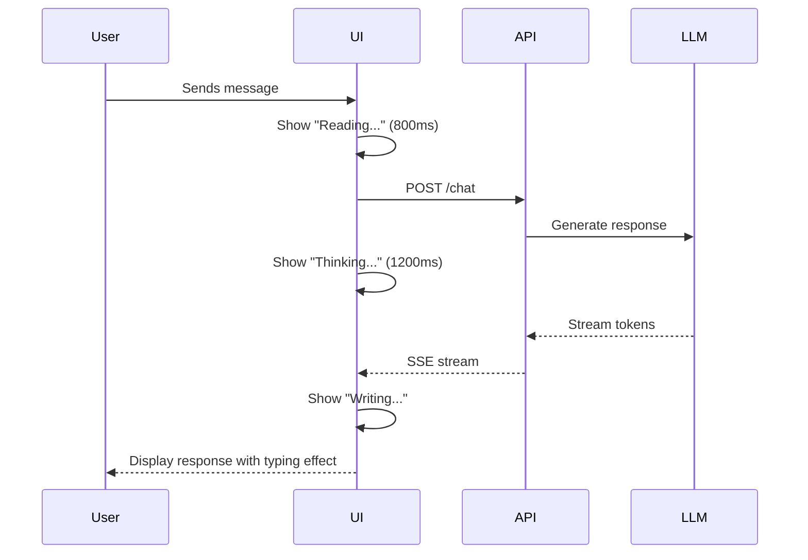

### Expected Wait Times by Query Type

```mermaid
gantt
    title Expected Processing Time by Query Complexity
    dateFormat X
    axisFormat %L ms

    section Greeting
    Expected wait    :0, 500

    section Simple Fact
    Expected wait    :0, 1500

    section Explanation
    Expected wait    :0, 2500

    section Code Generation
    Expected wait    :0, 4000

    section Analysis
    Expected wait    :0, 5000
```

---

## Post 7: SSE vs WebSockets

### Protocol Comparison

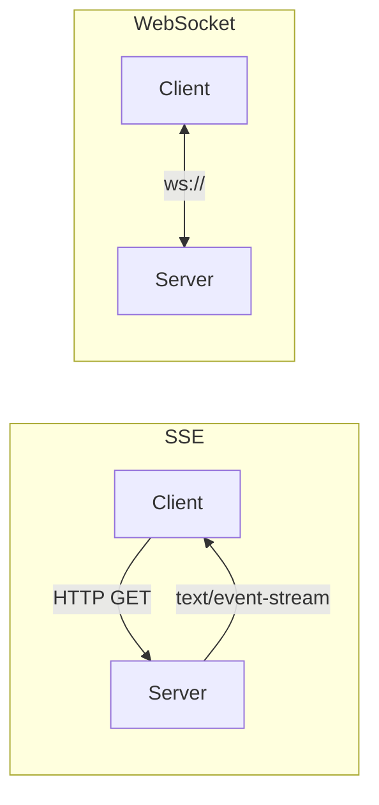

### Decision Tree

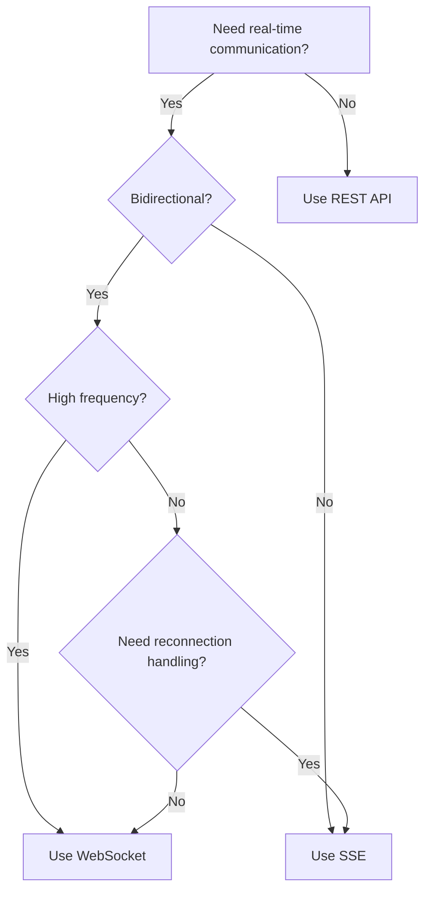

---

## Post 8: Context Window Management

### Four Strategies

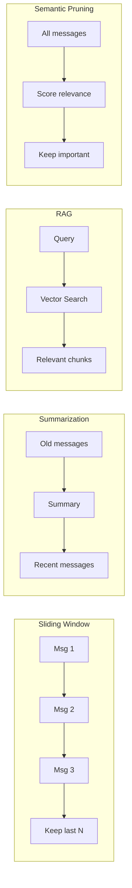

### Token Budget Allocation

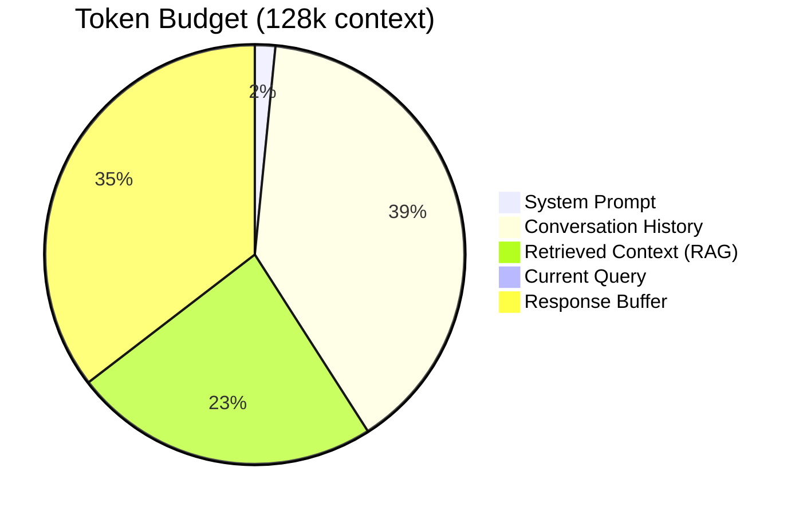

---

## Post 11: Retry Pattern

### Exponential Backoff

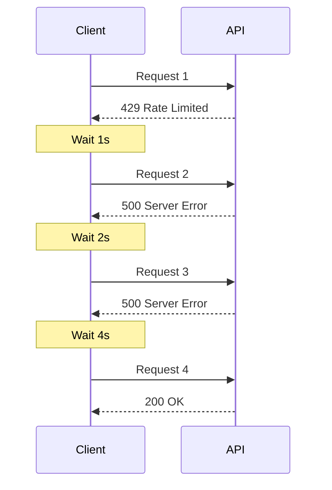

### Error Classification Flow

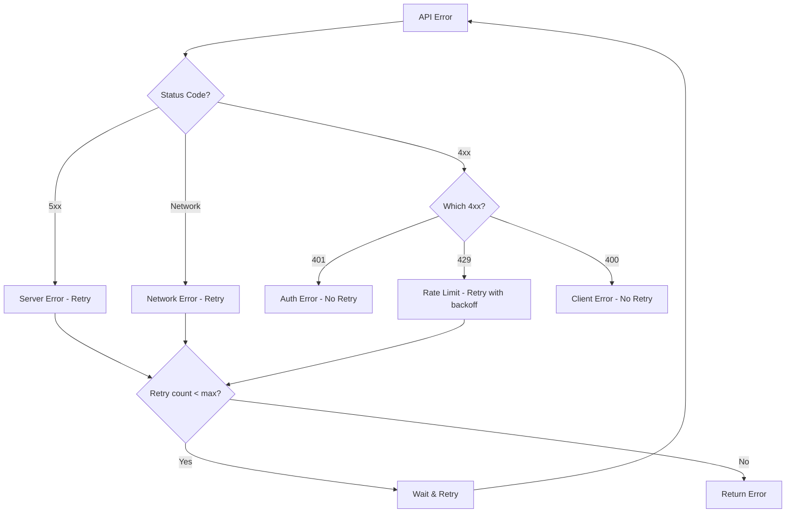

---

## Post 12: Optimistic UI

### Message State Machine

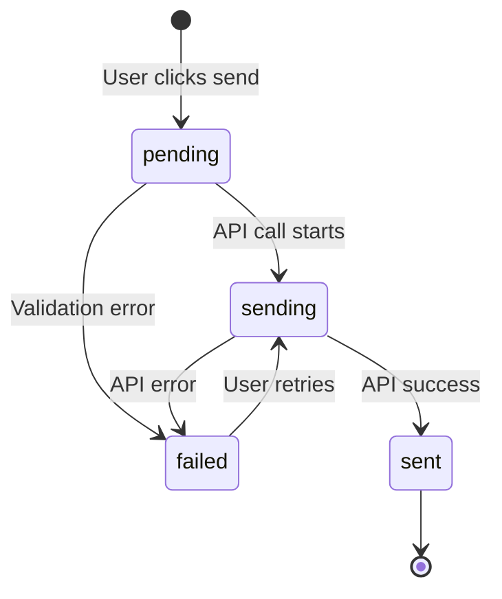

---

## Post 17: RAG Pipeline

### Complete RAG Architecture

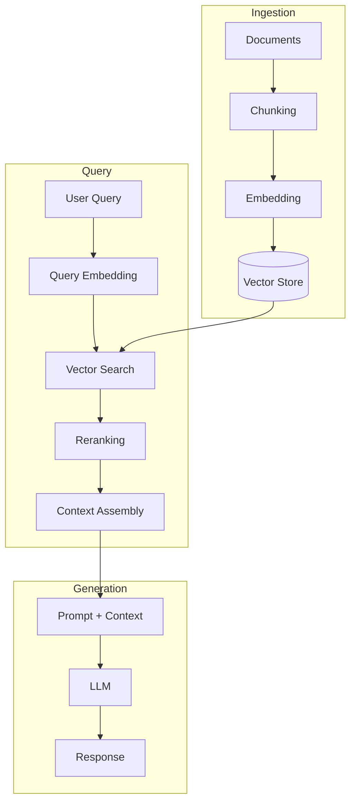

### Chunking Strategies

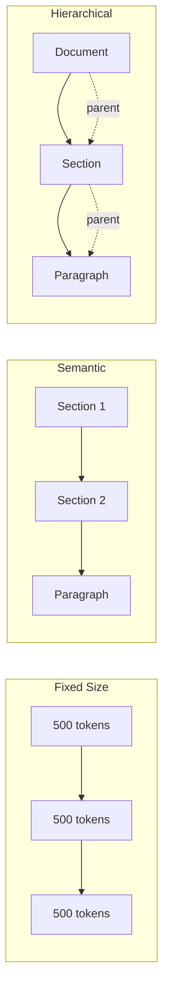

### Hybrid Search

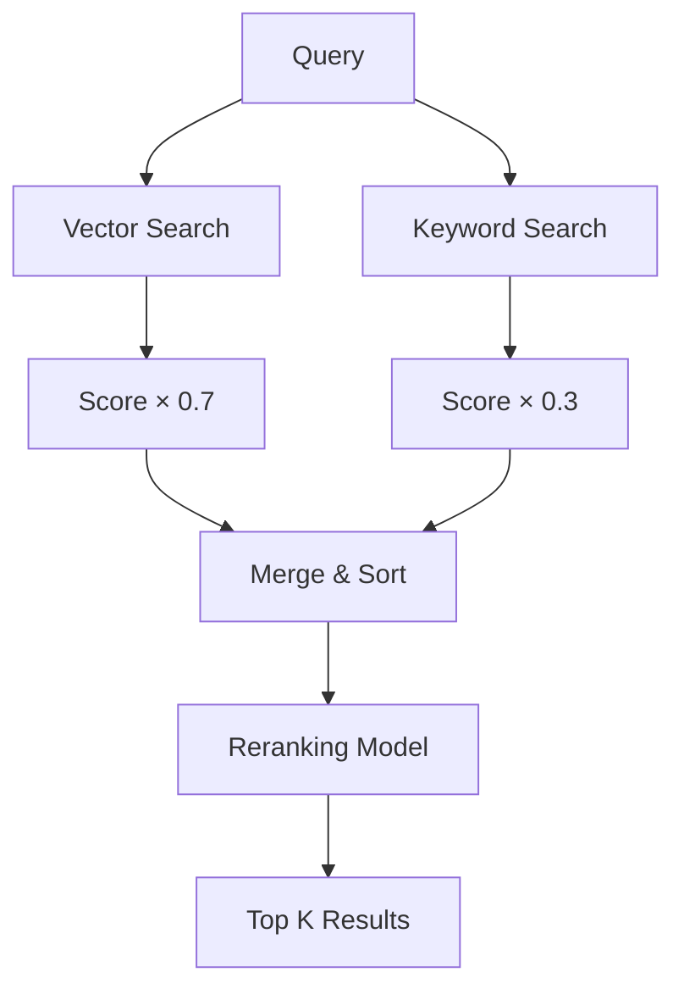

---

## Post 18: AI Agents & Function Calling

### Agent Loop

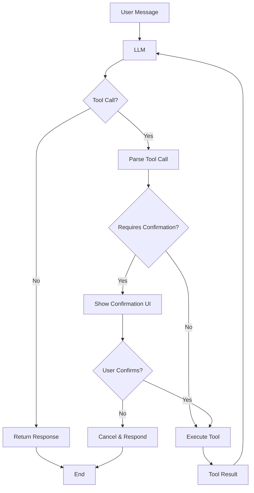

### Tool Execution Safety

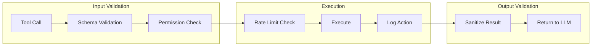

---

## Post 19: Prompt Injection Security

### Defense Layers

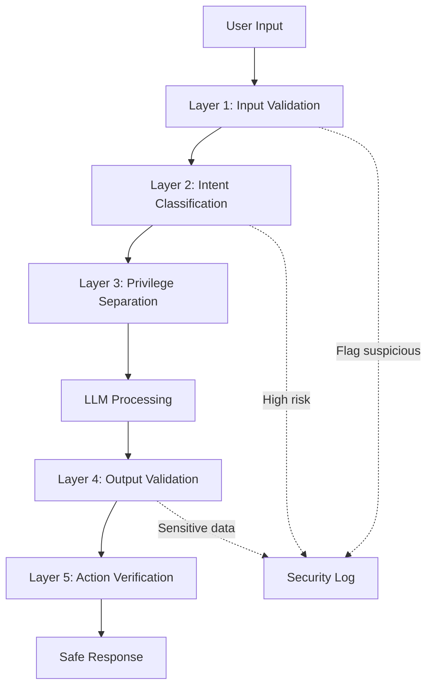

### Attack Vectors

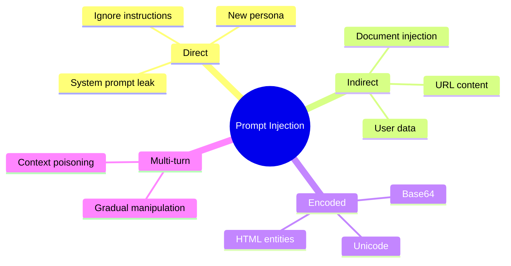

---

## Post 20: AI Memory Systems

### Memory Types

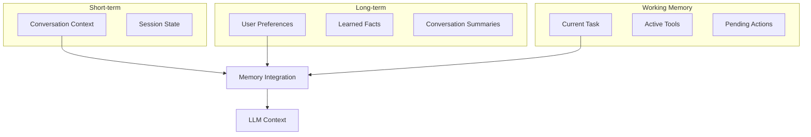

### Memory Retrieval

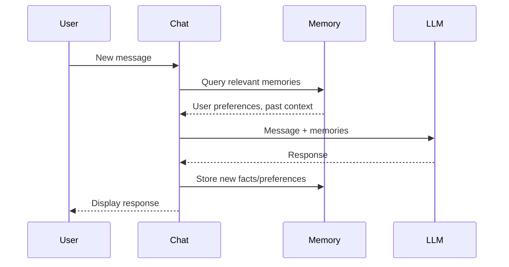

---

## Post 24: AI Chat Analytics

### Metrics Pipeline

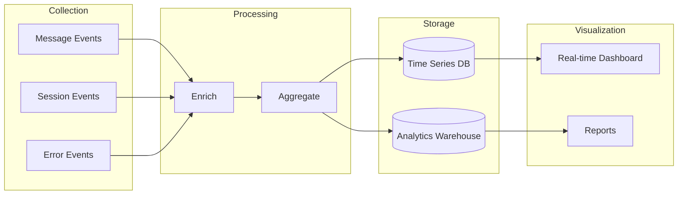

### Key Metrics Hierarchy

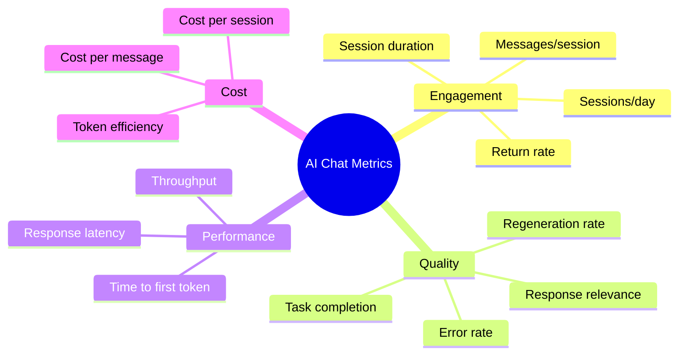

---

## Usage Instructions

### Embedding in Markdown

Most markdown renderers support Mermaid with code blocks:

````markdown
```mermaid
flowchart LR
    A --> B
```
````

### Static Image Generation

Use the Mermaid CLI for static images:

```bash
npm install -g @mermaid-js/mermaid-cli
mmdc -i diagram.mmd -o diagram.svg
```

### Styling

Add custom styling in the diagram:

```mermaid
%%{init: {'theme': 'neutral', 'themeVariables': { 'primaryColor': '#3b82f6'}}}%%
flowchart LR
    A[Start] --> B[End]
```

---

## Diagram Specifications from Graphics Requirements

These diagrams fulfill the specifications in `GRAPHICS_REQUIREMENTS.md`:

| Requirement               | Diagram                   | Location |
| ------------------------- | ------------------------- | -------- |
| Response timing flow      | Response Timing Flow      | Post 1   |
| SSE vs WebSocket          | Protocol Comparison       | Post 7   |
| Context window strategies | Four Strategies           | Post 8   |
| Retry pattern             | Exponential Backoff       | Post 11  |
| Message state machine     | Message State Machine     | Post 12  |
| RAG pipeline              | Complete RAG Architecture | Post 17  |
| Agent loop                | Agent Loop                | Post 18  |
| Security layers           | Defense Layers            | Post 19  |
| Memory architecture       | Memory Types              | Post 20  |
| Analytics pipeline        | Metrics Pipeline          | Post 24  |
