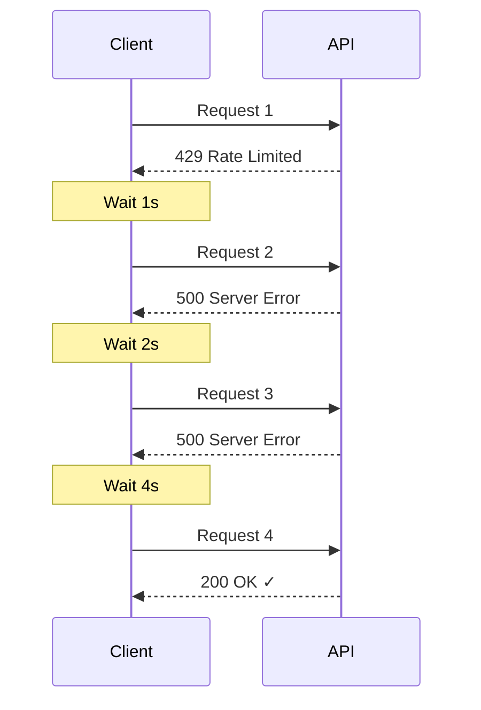

# The Retry Pattern: How to Handle AI API Failures Gracefully

72% of AI chat applications have silent failures. Users click send, something breaks, nothing happens. The message vanishes into the void.

Your AI chat WILL fail. Rate limits, network hiccups, API timeouts, server errors—the question isn't if, it's when. And when it fails, do you lose the user's message? Do they know what happened? Can they retry?

Let's build bulletproof error recovery.

---

## Why AI APIs Fail

If you've run an AI application in production, you've seen these:

**Rate limits (HTTP 429)** — Too many requests. OpenAI, Anthropic, and Google all have aggressive rate limiting, especially on lower tiers. Send a burst of messages and you'll hit this within seconds.

**Timeouts** — Long responses from the AI take time to generate. A complex coding question might take 30+ seconds. Most HTTP clients timeout at 30 seconds by default.

**Network errors** — Connection dropped, DNS failed, SSL handshake issues. Mobile users switching between WiFi and cellular hit these constantly.

**Server errors (500/503)** — The AI provider is down or overloaded. Happens more than you'd expect, especially during high-traffic periods.

**Authentication (401/403)** — Token expired, quota exhausted, account issue. Usually requires user action.

In production, typical failure rates look like this:

| Error Type | Frequency |
|------------|-----------|
| Rate limits | 2-5% |
| Timeouts | 1-2% |
| Network | 1-2% |
| Server errors | 0.1-0.5% |
| Auth issues | <0.1% |

That adds up to 3-8% of requests failing. For an app with 1,000 daily active users sending 10 messages each, that's 300-800 failures per day.

---

## Naive Retry vs Smart Retry

Here's how most developers first implement retry:

```typescript
// DON'T DO THIS
async function sendMessage(content: string) {
  try {
    return await fetch('/api/chat', {
      method: 'POST',
      body: JSON.stringify({ message: content }),
    })
  } catch (error) {
    // Just try again immediately
    return await fetch('/api/chat', {
      method: 'POST',
      body: JSON.stringify({ message: content }),
    })
  }
}
```

This fails in multiple ways:

1. **Rate limited?** Immediate retry = more rate limiting
2. **Server overloaded?** More requests = more overload (you're part of the problem)
3. **No feedback** — User doesn't know what's happening
4. **No limit** — Could retry forever
5. **No classification** — Auth errors shouldn't be retried

---

## Exponential Backoff Visualized



---

Smart retry uses exponential backoff with error classification:

```typescript
interface RetryConfig {
  maxRetries: number
  initialDelay: number
  maxDelay: number
  backoffMultiplier: number
}

async function withRetry<T>(
  fn: () => Promise<T>,
  config: RetryConfig = {
    maxRetries: 3,
    initialDelay: 1000,
    maxDelay: 30000,
    backoffMultiplier: 2,
  }
): Promise<T> {
  let lastError: Error
  let delay = config.initialDelay

  for (let attempt = 0; attempt <= config.maxRetries; attempt++) {
    try {
      return await fn()
    } catch (error) {
      lastError = error as Error

      // Don't retry non-recoverable errors
      if (!isRetryable(error)) {
        throw error
      }

      // Last attempt failed
      if (attempt === config.maxRetries) {
        throw error
      }

      // Wait before next attempt
      await sleep(delay)

      // Increase delay for next attempt (with cap)
      delay = Math.min(delay * config.backoffMultiplier, config.maxDelay)
    }
  }

  throw lastError!
}

function isRetryable(error: unknown): boolean {
  if (error instanceof Response) {
    // Don't retry client errors (except rate limits)
    if (error.status >= 400 && error.status < 500) {
      return error.status === 429 // Rate limit is retryable
    }
    // Retry server errors
    return error.status >= 500
  }

  // Retry network errors
  if (error instanceof TypeError) {
    return error.message === 'Failed to fetch'
  }

  return false
}

function sleep(ms: number): Promise<void> {
  return new Promise(resolve => setTimeout(resolve, ms))
}
```

The timing difference is significant:

```
Naive Retry:
Attempt 1 ──X── Attempt 2 ──X── Attempt 3 ──X── FAIL
            0ms            0ms            0ms

Exponential Backoff:
Attempt 1 ──X────── Attempt 2 ──X──────── Attempt 3 ──✓
            1000ms            2000ms
```

That 3-second total wait often makes the difference between success and failure.

---

## Full Implementation

Here's a complete error recovery system for chat:

```typescript
type ErrorType = 'rateLimit' | 'timeout' | 'network' | 'server' | 'auth' | 'unknown'

interface ErrorRecoveryState {
  error: Error | null
  errorType: ErrorType | null
  attemptNumber: number
  maxAttempts: number
  retryIn: number | null
  isRetrying: boolean
  canRetry: boolean
}

interface ErrorRecoveryConfig {
  maxRetries?: number
  initialDelay?: number
  maxDelay?: number
  onRetryAttempt?: (attempt: number) => void
  onSuccess?: (attempt: number) => void
  onMaxRetriesReached?: (error: Error) => void
}

function useErrorRecovery(config: ErrorRecoveryConfig = {}) {
  const {
    maxRetries = 3,
    initialDelay = 1000,
    maxDelay = 30000,
    onRetryAttempt,
    onSuccess,
    onMaxRetriesReached,
  } = config

  const [state, setState] = useState<ErrorRecoveryState>({
    error: null,
    errorType: null,
    attemptNumber: 0,
    maxAttempts: maxRetries,
    retryIn: null,
    isRetrying: false,
    canRetry: false,
  })

  const countdownRef = useRef<NodeJS.Timeout>()

  const classifyError = (error: unknown): ErrorType => {
    if (error instanceof Response) {
      if (error.status === 429) return 'rateLimit'
      if (error.status === 401 || error.status === 403) return 'auth'
      if (error.status >= 500) return 'server'
    }

    if (error instanceof TypeError && error.message === 'Failed to fetch') {
      return 'network'
    }

    if (error instanceof DOMException && error.name === 'AbortError') {
      return 'timeout'
    }

    return 'unknown'
  }

  const getRetryDelay = (errorType: ErrorType, attempt: number, response?: Response): number => {
    // Rate limit: respect Retry-After header
    if (errorType === 'rateLimit' && response?.headers.get('Retry-After')) {
      const retryAfter = parseInt(response.headers.get('Retry-After')!)
      return retryAfter * 1000
    }

    // Exponential backoff with jitter
    const baseDelay = initialDelay * Math.pow(2, attempt)
    const jitter = Math.random() * 0.3 * baseDelay // 0-30% jitter
    return Math.min(baseDelay + jitter, maxDelay)
  }

  const shouldRetry = (errorType: ErrorType): boolean => {
    // Never retry auth errors—user action required
    if (errorType === 'auth') return false

    // Everything else is potentially retryable
    return true
  }

  const execute = async <T>(fn: () => Promise<T>): Promise<T> => {
    let attempt = 0

    while (true) {
      try {
        setState(prev => ({
          ...prev,
          isRetrying: attempt > 0,
          attemptNumber: attempt,
        }))

        const result = await fn()

        // Success!
        setState({
          error: null,
          errorType: null,
          attemptNumber: attempt,
          maxAttempts: maxRetries,
          retryIn: null,
          isRetrying: false,
          canRetry: false,
        })

        if (attempt > 0) {
          onSuccess?.(attempt)
        }

        return result

      } catch (error) {
        const errorType = classifyError(error)

        // Can we retry?
        if (!shouldRetry(errorType) || attempt >= maxRetries) {
          setState({
            error: error as Error,
            errorType,
            attemptNumber: attempt,
            maxAttempts: maxRetries,
            retryIn: null,
            isRetrying: false,
            canRetry: shouldRetry(errorType) && attempt < maxRetries,
          })

          if (attempt >= maxRetries) {
            onMaxRetriesReached?.(error as Error)
          }

          throw error
        }

        // Calculate delay
        const delay = getRetryDelay(errorType, attempt, error as Response)

        // Update state with countdown
        setState({
          error: error as Error,
          errorType,
          attemptNumber: attempt,
          maxAttempts: maxRetries,
          retryIn: delay,
          isRetrying: false,
          canRetry: true,
        })

        // Start countdown
        let remaining = delay
        const countdownInterval = setInterval(() => {
          remaining -= 1000
          setState(prev => ({ ...prev, retryIn: Math.max(0, remaining) }))
        }, 1000)

        // Wait
        await sleep(delay)

        clearInterval(countdownInterval)
        onRetryAttempt?.(attempt + 1)
        attempt++
      }
    }
  }

  const reset = () => {
    if (countdownRef.current) {
      clearTimeout(countdownRef.current)
    }
    setState({
      error: null,
      errorType: null,
      attemptNumber: 0,
      maxAttempts: maxRetries,
      retryIn: null,
      isRetrying: false,
      canRetry: false,
    })
  }

  return {
    ...state,
    execute,
    reset,
  }
}
```

---

## Error-Specific Handling

Different errors deserve different treatment:

```typescript
const ERROR_CONFIG: Record<ErrorType, {
  retryDelay: number | 'exponential'
  maxRetries: number
  userMessage: string
  action: string
}> = {
  rateLimit: {
    retryDelay: 30000, // Or use Retry-After header
    maxRetries: 2,
    userMessage: "Slow down a bit",
    action: "We're waiting for the rate limit to reset.",
  },
  timeout: {
    retryDelay: 2000,
    maxRetries: 2,
    userMessage: "Response taking too long",
    action: "Trying again with more patience...",
  },
  network: {
    retryDelay: 1000,
    maxRetries: 3,
    userMessage: "Connection lost",
    action: "Reconnecting...",
  },
  server: {
    retryDelay: 'exponential',
    maxRetries: 3,
    userMessage: "Service temporarily busy",
    action: "We'll keep trying.",
  },
  auth: {
    retryDelay: 0, // Don't retry
    maxRetries: 0,
    userMessage: "Session expired",
    action: "Please log in again.",
  },
  unknown: {
    retryDelay: 'exponential',
    maxRetries: 2,
    userMessage: "Something went wrong",
    action: "Trying again...",
  },
}

function getErrorMessage(errorType: ErrorType): { message: string; action: string } {
  const config = ERROR_CONFIG[errorType]
  return {
    message: config.userMessage,
    action: config.action,
  }
}
```

---

## UX During Retries

Keep users informed during the retry process:

```tsx
// Import icons from lucide-react, heroicons, or your preferred icon library
// npm install lucide-react
import { AlertTriangle as AlertTriangleIcon } from 'lucide-react'

// Type for error classification
type ErrorType = 'rateLimit' | 'network' | 'server' | 'auth' | 'timeout'

// Helper to get user-friendly error messages
function getErrorMessage(errorType: ErrorType): { message: string; action: string } {
  const messages: Record<ErrorType, { message: string; action: string }> = {
    rateLimit: { message: 'Too many requests', action: 'Waiting before retrying...' },
    network: { message: 'Network connection lost', action: 'Checking connection...' },
    server: { message: 'Server temporarily unavailable', action: 'Retrying shortly...' },
    auth: { message: 'Authentication error', action: 'Please sign in again.' },
    timeout: { message: 'Request timed out', action: 'Retrying with longer timeout...' },
  }
  return messages[errorType]
}

interface RetryBannerProps {
  errorType: ErrorType
  attemptNumber: number
  maxAttempts: number
  retryIn: number | null
  onCancel: () => void
  onRetryNow: () => void
}

function RetryBanner({
  errorType,
  attemptNumber,
  maxAttempts,
  retryIn,
  onCancel,
  onRetryNow,
}: RetryBannerProps) {
  const { message, action } = getErrorMessage(errorType)

  return (
    <div className="p-4 bg-amber-50 border border-amber-200 rounded-lg">
      <div className="flex items-start gap-3">
        <AlertTriangleIcon className="w-5 h-5 text-amber-600 mt-0.5" />

        <div className="flex-1">
          <p className="font-medium text-amber-900">{message}</p>
          <p className="text-sm text-amber-700 mt-1">{action}</p>

          {retryIn !== null && retryIn > 0 && (
            <p className="text-sm text-amber-600 mt-2">
              Retrying in {Math.ceil(retryIn / 1000)}s...
              ({attemptNumber + 1} of {maxAttempts})
            </p>
          )}

          <p className="text-xs text-amber-500 mt-2 italic">
            Your message is saved.
          </p>
        </div>

        <div className="flex gap-2">
          <button
            onClick={onCancel}
            className="px-3 py-1 text-sm text-amber-700 hover:text-amber-900"
          >
            Cancel
          </button>
          {retryIn !== null && (
            <button
              onClick={onRetryNow}
              className="px-3 py-1 text-sm bg-amber-600 text-white rounded hover:bg-amber-700"
            >
              Retry Now
            </button>
          )}
        </div>
      </div>
    </div>
  )
}
```

Put it all together in your chat:

```tsx
function ResilientChat() {
  const [messages, setMessages] = useState<Message[]>([])
  const [pendingMessage, setPendingMessage] = useState<string | null>(null)

  const {
    error,
    errorType,
    attemptNumber,
    maxAttempts,
    retryIn,
    execute,
    reset,
  } = useErrorRecovery({
    maxRetries: 3,
    onSuccess: (attempt) => {
      if (attempt > 0) {
        console.log(`Succeeded after ${attempt + 1} attempts`)
      }
    },
    onMaxRetriesReached: () => {
      // Keep the failed message visible for manual retry
    },
  })

  const sendMessage = async (content: string) => {
    // Save message immediately (optimistic UI)
    setPendingMessage(content)
    setMessages(prev => [...prev, {
      id: `temp-${Date.now()}`,
      role: 'user',
      content,
      status: 'sending',
    }])

    try {
      await execute(async () => {
        const response = await fetch('/api/chat', {
          method: 'POST',
          body: JSON.stringify({ message: content }),
          signal: AbortSignal.timeout(30000),
        })

        if (!response.ok) {
          throw response
        }

        return response.json()
      })

      // Update message status to sent
      setMessages(prev => prev.map(m =>
        m.content === content && m.status === 'sending'
          ? { ...m, status: 'sent' }
          : m
      ))
      setPendingMessage(null)

    } catch (err) {
      // Update message status to failed
      setMessages(prev => prev.map(m =>
        m.content === content && m.status === 'sending'
          ? { ...m, status: 'failed' }
          : m
      ))
    }
  }

  return (
    <div className="flex flex-col h-full">
      <MessageList messages={messages} />

      {error && errorType && (
        <RetryBanner
          errorType={errorType}
          attemptNumber={attemptNumber}
          maxAttempts={maxAttempts}
          retryIn={retryIn}
          onCancel={() => {
            reset()
            setPendingMessage(null)
          }}
          onRetryNow={() => {
            if (pendingMessage) {
              sendMessage(pendingMessage)
            }
          }}
        />
      )}

      <ChatInput
        onSend={sendMessage}
        disabled={retryIn !== null}
      />
    </div>
  )
}
```

---

## The Takeaway

AI APIs fail 3-8% of the time. Your retry strategy determines whether that's a minor hiccup or a lost user.

The essentials:

1. **Never retry immediately** — Use exponential backoff
2. **Classify errors** — Different errors need different handling
3. **Respect rate limits** — Check Retry-After headers
4. **Keep users informed** — Show attempt count and countdown
5. **Never lose data** — Preserve the user's message through failures
6. **Know when to stop** — Auth errors shouldn't be retried

Build this once, and your chat becomes resilient to the chaos of real-world network conditions.

---

*Clarity Chat's `useErrorRecovery` hook handles exponential backoff, error classification, user-facing retries, and data preservation automatically. Build resilient chat without reinventing error handling. [See the error recovery docs →](/docs/hooks/use-error-recovery)*
