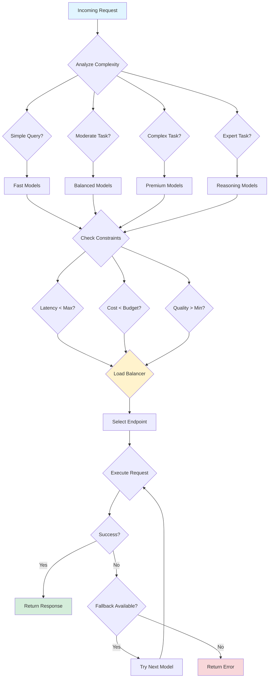

# Smart Model Routing

Smart model routing dynamically selects the optimal AI model for each request based on complexity, cost constraints, latency requirements, and quality thresholds. This guide provides production-ready routing strategies and implementation patterns.

## Overview

### Why Smart Routing?

```typescript
// Without routing: Use GPT-4 for everything
const cost = 1000 * 0.03 = $30/day

// With smart routing: 70% GPT-3.5, 30% GPT-4
const cost = (700 * 0.002) + (300 * 0.03) = $10.40/day
// 65% cost reduction with minimal quality impact
```

### Key Benefits

- **Cost Optimization**: Route simple requests to cheaper models
- **Quality Assurance**: Use premium models for complex tasks
- **Reliability**: Automatic fallbacks when models fail
- **Performance**: Latency-aware routing for time-sensitive requests
- **Flexibility**: A/B test models and gather performance data

## Cost vs Quality Tradeoff Analysis

### Model Tier Classification

```typescript
export enum ModelTier {
  FAST = 'fast',        // Lowest cost, fastest response
  BALANCED = 'balanced', // Good cost/quality balance
  PREMIUM = 'premium',   // Highest quality, higher cost
  REASONING = 'reasoning' // Specialized reasoning tasks
}

export interface ModelConfig {
  tier: ModelTier;
  provider: string;
  model: string;
  costPer1kTokens: {
    input: number;
    output: number;
  };
  avgLatency: number; // milliseconds
  qualityScore: number; // 0-100
  maxTokens: number;
  features: string[];
}

export const MODEL_CATALOG: Record<string, ModelConfig> = {
  'gpt-4o': {
    tier: ModelTier.PREMIUM,
    provider: 'openai',
    model: 'gpt-4o',
    costPer1kTokens: { input: 0.0025, output: 0.01 },
    avgLatency: 2000,
    qualityScore: 95,
    maxTokens: 128000,
    features: ['vision', 'function-calling', 'json-mode']
  },
  'gpt-4o-mini': {
    tier: ModelTier.BALANCED,
    provider: 'openai',
    model: 'gpt-4o-mini',
    costPer1kTokens: { input: 0.00015, output: 0.0006 },
    avgLatency: 1200,
    qualityScore: 85,
    maxTokens: 128000,
    features: ['vision', 'function-calling', 'json-mode']
  },
  'gpt-3.5-turbo': {
    tier: ModelTier.FAST,
    provider: 'openai',
    model: 'gpt-3.5-turbo',
    costPer1kTokens: { input: 0.0005, output: 0.0015 },
    avgLatency: 800,
    qualityScore: 75,
    maxTokens: 16385,
    features: ['function-calling', 'json-mode']
  },
  'claude-3-5-sonnet': {
    tier: ModelTier.PREMIUM,
    provider: 'anthropic',
    model: 'claude-3-5-sonnet-20241022',
    costPer1kTokens: { input: 0.003, output: 0.015 },
    avgLatency: 1800,
    qualityScore: 98,
    maxTokens: 200000,
    features: ['vision', 'artifacts', 'extended-thinking']
  },
  'claude-3-5-haiku': {
    tier: ModelTier.FAST,
    provider: 'anthropic',
    model: 'claude-3-5-haiku-20241022',
    costPer1kTokens: { input: 0.0008, output: 0.004 },
    avgLatency: 600,
    qualityScore: 78,
    maxTokens: 200000,
    features: ['vision', 'fast-response']
  },
  'o1': {
    tier: ModelTier.REASONING,
    provider: 'openai',
    model: 'o1',
    costPer1kTokens: { input: 0.015, output: 0.06 },
    avgLatency: 8000,
    qualityScore: 99,
    maxTokens: 200000,
    features: ['extended-thinking', 'reasoning']
  },
  'gemini-1.5-pro': {
    tier: ModelTier.PREMIUM,
    provider: 'google',
    model: 'gemini-1.5-pro',
    costPer1kTokens: { input: 0.00125, output: 0.005 },
    avgLatency: 1500,
    qualityScore: 92,
    maxTokens: 2000000,
    features: ['vision', 'audio', 'video', 'large-context']
  },
  'gemini-1.5-flash': {
    tier: ModelTier.FAST,
    provider: 'google',
    model: 'gemini-1.5-flash',
    costPer1kTokens: { input: 0.000075, output: 0.0003 },
    avgLatency: 500,
    qualityScore: 80,
    maxTokens: 1000000,
    features: ['vision', 'audio', 'fast-response']
  }
};
```

### Complexity Classification

```typescript
export enum ComplexityLevel {
  SIMPLE = 'simple',       // FAQ, basic queries
  MODERATE = 'moderate',   // Standard conversations
  COMPLEX = 'complex',     // Multi-step reasoning
  EXPERT = 'expert'        // Advanced analysis, coding
}

export interface ComplexitySignals {
  // Token-based signals
  inputTokens: number;
  expectedOutputTokens: number;

  // Content-based signals
  hasCodeBlocks: boolean;
  hasMath: boolean;
  hasMultipleLanguages: boolean;
  requiresReasoning: boolean;

  // Structural signals
  conversationDepth: number;
  numberOfEntities: number;
  questionComplexity: number; // 0-10

  // User signals
  userTier: 'free' | 'pro' | 'enterprise';
  previousFailures: number;
  qualityThreshold: number; // 0-100
}

export function analyzeComplexity(
  request: string,
  context: ComplexitySignals
): ComplexityLevel {
  let score = 0;

  // Token-based scoring
  if (context.inputTokens > 4000) score += 2;
  else if (context.inputTokens > 1000) score += 1;

  if (context.expectedOutputTokens > 2000) score += 2;
  else if (context.expectedOutputTokens > 500) score += 1;

  // Content-based scoring
  if (context.hasCodeBlocks) score += 2;
  if (context.hasMath) score += 1;
  if (context.hasMultipleLanguages) score += 1;
  if (context.requiresReasoning) score += 3;

  // Structural scoring
  if (context.conversationDepth > 10) score += 2;
  if (context.numberOfEntities > 5) score += 1;
  score += Math.floor(context.questionComplexity / 3);

  // Pattern matching
  const patterns = {
    expert: [
      /write.*(?:algorithm|function|class|system)/i,
      /analyze.*(?:architecture|design|performance)/i,
      /explain.*(?:in detail|comprehensive|step by step)/i,
      /debug|refactor|optimize/i
    ],
    complex: [
      /compare.*and.*and/i,
      /multiple.*(?:steps|stages|phases)/i,
      /reasoning|logic|proof/i,
      /convert.*to.*language/i
    ],
    moderate: [
      /how (?:do|can|should) I/i,
      /what is.*difference/i,
      /explain.*briefly/i
    ]
  };

  for (const pattern of patterns.expert) {
    if (pattern.test(request)) {
      score += 3;
      break;
    }
  }

  for (const pattern of patterns.complex) {
    if (pattern.test(request)) {
      score += 2;
      break;
    }
  }

  // Classify based on score
  if (score >= 10) return ComplexityLevel.EXPERT;
  if (score >= 6) return ComplexityLevel.COMPLEX;
  if (score >= 3) return ComplexityLevel.MODERATE;
  return ComplexityLevel.SIMPLE;
}
```

## Request Routing Logic

### Decision Engine

```typescript
export interface RoutingDecision {
  primaryModel: string;
  fallbackChain: string[];
  reason: string;
  estimatedCost: number;
  estimatedLatency: number;
  confidence: number;
}

export interface RoutingContext {
  request: string;
  complexity: ComplexityLevel;
  signals: ComplexitySignals;
  constraints?: {
    maxCost?: number;
    maxLatency?: number;
    minQuality?: number;
    requiredFeatures?: string[];
  };
  userPreferences?: {
    provider?: string;
    preferSpeed?: boolean;
    preferQuality?: boolean;
  };
}

export class ModelRouter {
  constructor(
    private catalog: Record<string, ModelConfig>,
    private metrics: MetricsCollector
  ) {}

  route(context: RoutingContext): RoutingDecision {
    // Step 1: Filter models by constraints
    const candidates = this.filterCandidates(context);

    // Step 2: Score each candidate
    const scored = candidates.map(model => ({
      model,
      score: this.scoreModel(model, context)
    }));

    // Step 3: Sort by score
    scored.sort((a, b) => b.score - a.score);

    // Step 4: Select primary and fallbacks
    const primary = scored[0];
    const fallbacks = scored
      .slice(1, 4)
      .map(s => s.model.model);

    // Step 5: Calculate estimates
    const avgTokens = (context.signals.inputTokens +
                       context.signals.expectedOutputTokens) / 2;
    const estimatedCost = this.estimateCost(
      primary.model,
      context.signals.inputTokens,
      context.signals.expectedOutputTokens
    );

    return {
      primaryModel: primary.model.model,
      fallbackChain: fallbacks,
      reason: this.explainDecision(primary, context),
      estimatedCost,
      estimatedLatency: primary.model.avgLatency,
      confidence: primary.score / 100
    };
  }

  private filterCandidates(
    context: RoutingContext
  ): ModelConfig[] {
    return Object.values(this.catalog).filter(model => {
      // Check feature requirements
      if (context.constraints?.requiredFeatures) {
        const hasAllFeatures = context.constraints.requiredFeatures
          .every(f => model.features.includes(f));
        if (!hasAllFeatures) return false;
      }

      // Check latency constraint
      if (context.constraints?.maxLatency &&
          model.avgLatency > context.constraints.maxLatency) {
        return false;
      }

      // Check quality threshold
      if (context.constraints?.minQuality &&
          model.qualityScore < context.constraints.minQuality) {
        return false;
      }

      // Check token limits
      const totalTokens = context.signals.inputTokens +
                         context.signals.expectedOutputTokens;
      if (totalTokens > model.maxTokens) return false;

      return true;
    });
  }

  private scoreModel(
    model: ModelConfig,
    context: RoutingContext
  ): number {
    let score = 0;

    // Complexity match (40 points)
    const complexityMatch = this.getComplexityMatch(
      model.tier,
      context.complexity
    );
    score += complexityMatch * 40;

    // Quality score (30 points)
    score += (model.qualityScore / 100) * 30;

    // Cost efficiency (20 points)
    const costScore = this.getCostScore(model, context);
    score += costScore * 20;

    // Latency score (10 points)
    const latencyScore = context.userPreferences?.preferSpeed
      ? 1 - (model.avgLatency / 10000)
      : 0.5;
    score += Math.max(0, latencyScore) * 10;

    // User preferences bonus
    if (context.userPreferences?.provider === model.provider) {
      score += 5;
    }

    if (context.userPreferences?.preferQuality &&
        model.tier === ModelTier.PREMIUM) {
      score += 5;
    }

    // Historical performance bonus
    const performance = this.metrics.getModelPerformance(model.model);
    if (performance) {
      score += (performance.successRate - 0.9) * 50;
    }

    return Math.max(0, Math.min(100, score));
  }

  private getComplexityMatch(
    tier: ModelTier,
    complexity: ComplexityLevel
  ): number {
    const matchMatrix: Record<ComplexityLevel, Record<ModelTier, number>> = {
      [ComplexityLevel.SIMPLE]: {
        [ModelTier.FAST]: 1.0,
        [ModelTier.BALANCED]: 0.8,
        [ModelTier.PREMIUM]: 0.3,
        [ModelTier.REASONING]: 0.1
      },
      [ComplexityLevel.MODERATE]: {
        [ModelTier.FAST]: 0.7,
        [ModelTier.BALANCED]: 1.0,
        [ModelTier.PREMIUM]: 0.6,
        [ModelTier.REASONING]: 0.2
      },
      [ComplexityLevel.COMPLEX]: {
        [ModelTier.FAST]: 0.3,
        [ModelTier.BALANCED]: 0.7,
        [ModelTier.PREMIUM]: 1.0,
        [ModelTier.REASONING]: 0.8
      },
      [ComplexityLevel.EXPERT]: {
        [ModelTier.FAST]: 0.1,
        [ModelTier.BALANCED]: 0.4,
        [ModelTier.PREMIUM]: 0.9,
        [ModelTier.REASONING]: 1.0
      }
    };

    return matchMatrix[complexity][tier] || 0.5;
  }

  private getCostScore(
    model: ModelConfig,
    context: RoutingContext
  ): number {
    const estimatedCost = this.estimateCost(
      model,
      context.signals.inputTokens,
      context.signals.expectedOutputTokens
    );

    // Inverse cost score (lower cost = higher score)
    const maxCost = context.constraints?.maxCost || 1.0;
    return Math.max(0, 1 - (estimatedCost / maxCost));
  }

  private estimateCost(
    model: ModelConfig,
    inputTokens: number,
    outputTokens: number
  ): number {
    const inputCost = (inputTokens / 1000) * model.costPer1kTokens.input;
    const outputCost = (outputTokens / 1000) * model.costPer1kTokens.output;
    return inputCost + outputCost;
  }

  private explainDecision(
    selected: { model: ModelConfig; score: number },
    context: RoutingContext
  ): string {
    const reasons: string[] = [];

    reasons.push(
      `Complexity: ${context.complexity} (matched with ${selected.model.tier} tier)`
    );

    if (context.constraints?.requiredFeatures?.length) {
      reasons.push(
        `Required features: ${context.constraints.requiredFeatures.join(', ')}`
      );
    }

    if (context.userPreferences?.preferSpeed) {
      reasons.push(
        `Speed prioritized (${selected.model.avgLatency}ms avg latency)`
      );
    }

    if (context.userPreferences?.preferQuality) {
      reasons.push(
        `Quality prioritized (score: ${selected.model.qualityScore}/100)`
      );
    }

    reasons.push(`Overall score: ${selected.score.toFixed(1)}/100`);

    return reasons.join(' | ');
  }
}
```

## Fallback Chains

### Cascading Fallback Strategy

```typescript
export interface FallbackConfig {
  maxRetries: number;
  retryDelayMs: number;
  backoffMultiplier: number;
  circuitBreaker?: {
    failureThreshold: number;
    resetTimeoutMs: number;
  };
}

export class FallbackExecutor {
  private circuitStates: Map<string, CircuitState> = new Map();

  constructor(
    private config: FallbackConfig,
    private metrics: MetricsCollector
  ) {}

  async executeWithFallback<T>(
    primaryModel: string,
    fallbackChain: string[],
    executor: (model: string) => Promise<T>
  ): Promise<FallbackResult<T>> {
    const attempts: FallbackAttempt[] = [];
    const allModels = [primaryModel, ...fallbackChain];

    for (const model of allModels) {
      // Check circuit breaker
      if (this.isCircuitOpen(model)) {
        attempts.push({
          model,
          status: 'skipped',
          reason: 'Circuit breaker open'
        });
        continue;
      }

      // Try execution with retries
      const result = await this.tryWithRetry(model, executor);
      attempts.push(result);

      if (result.status === 'success') {
        return {
          data: result.data!,
          model,
          attempts,
          totalLatency: attempts.reduce((sum, a) => sum + (a.latency || 0), 0)
        };
      }

      // Update circuit breaker
      this.recordFailure(model);

      // Wait before trying next model
      if (allModels.indexOf(model) < allModels.length - 1) {
        await this.delay(this.config.retryDelayMs);
      }
    }

    throw new AllModelsFailedError(attempts);
  }

  private async tryWithRetry<T>(
    model: string,
    executor: (model: string) => Promise<T>
  ): Promise<FallbackAttempt> {
    let lastError: Error | null = null;
    let delay = this.config.retryDelayMs;

    for (let attempt = 0; attempt < this.config.maxRetries; attempt++) {
      const startTime = Date.now();

      try {
        const data = await executor(model);
        const latency = Date.now() - startTime;

        this.metrics.recordSuccess(model, latency);
        this.recordSuccess(model);

        return {
          model,
          status: 'success',
          data,
          latency,
          attempt: attempt + 1
        };
      } catch (error) {
        lastError = error as Error;
        const latency = Date.now() - startTime;

        this.metrics.recordFailure(model, error, latency);

        // Don't retry on certain errors
        if (this.isNonRetryableError(error)) {
          return {
            model,
            status: 'failed',
            error: lastError,
            latency,
            attempt: attempt + 1,
            reason: 'Non-retryable error'
          };
        }

        // Wait before retry
        if (attempt < this.config.maxRetries - 1) {
          await this.delay(delay);
          delay *= this.config.backoffMultiplier;
        }
      }
    }

    return {
      model,
      status: 'failed',
      error: lastError!,
      attempt: this.config.maxRetries,
      reason: 'Max retries exceeded'
    };
  }

  private isCircuitOpen(model: string): boolean {
    if (!this.config.circuitBreaker) return false;

    const state = this.circuitStates.get(model);
    if (!state || state.state === 'closed') return false;

    // Check if reset timeout has passed
    if (state.state === 'open') {
      const elapsed = Date.now() - state.openedAt!;
      if (elapsed > this.config.circuitBreaker.resetTimeoutMs) {
        state.state = 'half-open';
        return false;
      }
      return true;
    }

    return false;
  }

  private recordFailure(model: string): void {
    if (!this.config.circuitBreaker) return;

    const state = this.getCircuitState(model);
    state.failures++;
    state.lastFailure = Date.now();

    if (state.failures >= this.config.circuitBreaker.failureThreshold) {
      state.state = 'open';
      state.openedAt = Date.now();
    }
  }

  private recordSuccess(model: string): void {
    if (!this.config.circuitBreaker) return;

    const state = this.getCircuitState(model);

    if (state.state === 'half-open') {
      state.state = 'closed';
      state.failures = 0;
    } else if (state.state === 'closed') {
      // Gradually reduce failure count on success
      state.failures = Math.max(0, state.failures - 1);
    }
  }

  private getCircuitState(model: string): CircuitState {
    if (!this.circuitStates.has(model)) {
      this.circuitStates.set(model, {
        state: 'closed',
        failures: 0,
        lastFailure: null,
        openedAt: null
      });
    }
    return this.circuitStates.get(model)!;
  }

  private isNonRetryableError(error: any): boolean {
    const nonRetryablePatterns = [
      /invalid.*api.*key/i,
      /authentication.*failed/i,
      /content.*policy.*violation/i,
      /token.*limit.*exceeded/i
    ];

    const message = error.message || String(error);
    return nonRetryablePatterns.some(pattern => pattern.test(message));
  }

  private delay(ms: number): Promise<void> {
    return new Promise(resolve => setTimeout(resolve, ms));
  }
}

interface CircuitState {
  state: 'open' | 'closed' | 'half-open';
  failures: number;
  lastFailure: number | null;
  openedAt: number | null;
}

interface FallbackAttempt {
  model: string;
  status: 'success' | 'failed' | 'skipped';
  data?: any;
  error?: Error;
  latency?: number;
  attempt?: number;
  reason?: string;
}

interface FallbackResult<T> {
  data: T;
  model: string;
  attempts: FallbackAttempt[];
  totalLatency: number;
}

class AllModelsFailedError extends Error {
  constructor(public attempts: FallbackAttempt[]) {
    super(
      `All models failed. Attempts: ${attempts.map(a =>
        `${a.model}: ${a.status} (${a.reason || a.error?.message})`
      ).join(', ')}`
    );
  }
}
```

## Load Balancing Across Providers

### Multi-Provider Load Balancer

```typescript
export interface ProviderEndpoint {
  provider: string;
  model: string;
  apiKey: string;
  baseUrl?: string;
  weight: number; // 0-100, higher = more traffic
  maxConcurrent: number;
  currentLoad: number;
  healthScore: number; // 0-100
}

export class LoadBalancer {
  private endpoints: Map<string, ProviderEndpoint[]> = new Map();
  private roundRobinCounters: Map<string, number> = new Map();

  constructor(
    private strategy: 'round-robin' | 'least-loaded' | 'weighted' | 'adaptive',
    private metrics: MetricsCollector
  ) {}

  registerEndpoint(model: string, endpoint: ProviderEndpoint): void {
    if (!this.endpoints.has(model)) {
      this.endpoints.set(model, []);
    }
    this.endpoints.get(model)!.push(endpoint);
  }

  selectEndpoint(model: string): ProviderEndpoint {
    const endpoints = this.endpoints.get(model);
    if (!endpoints || endpoints.length === 0) {
      throw new Error(`No endpoints available for model: ${model}`);
    }

    // Filter healthy endpoints
    const healthy = endpoints.filter(e =>
      e.healthScore > 50 &&
      e.currentLoad < e.maxConcurrent
    );

    if (healthy.length === 0) {
      throw new Error(`No healthy endpoints for model: ${model}`);
    }

    switch (this.strategy) {
      case 'round-robin':
        return this.roundRobin(model, healthy);
      case 'least-loaded':
        return this.leastLoaded(healthy);
      case 'weighted':
        return this.weighted(healthy);
      case 'adaptive':
        return this.adaptive(healthy);
      default:
        return healthy[0];
    }
  }

  private roundRobin(
    model: string,
    endpoints: ProviderEndpoint[]
  ): ProviderEndpoint {
    const counter = this.roundRobinCounters.get(model) || 0;
    const selected = endpoints[counter % endpoints.length];
    this.roundRobinCounters.set(model, counter + 1);
    return selected;
  }

  private leastLoaded(endpoints: ProviderEndpoint[]): ProviderEndpoint {
    return endpoints.reduce((least, current) => {
      const leastUtilization = least.currentLoad / least.maxConcurrent;
      const currentUtilization = current.currentLoad / current.maxConcurrent;
      return currentUtilization < leastUtilization ? current : least;
    });
  }

  private weighted(endpoints: ProviderEndpoint[]): ProviderEndpoint {
    const totalWeight = endpoints.reduce((sum, e) => sum + e.weight, 0);
    let random = Math.random() * totalWeight;

    for (const endpoint of endpoints) {
      random -= endpoint.weight;
      if (random <= 0) return endpoint;
    }

    return endpoints[endpoints.length - 1];
  }

  private adaptive(endpoints: ProviderEndpoint[]): ProviderEndpoint {
    // Score based on health, load, and recent performance
    const scored = endpoints.map(endpoint => {
      const loadFactor = 1 - (endpoint.currentLoad / endpoint.maxConcurrent);
      const healthFactor = endpoint.healthScore / 100;
      const perf = this.metrics.getProviderPerformance(endpoint.provider);
      const perfFactor = perf ? perf.avgLatency / 5000 : 0.5;

      const score = (
        loadFactor * 0.4 +
        healthFactor * 0.4 +
        (1 - perfFactor) * 0.2
      );

      return { endpoint, score };
    });

    scored.sort((a, b) => b.score - a.score);
    return scored[0].endpoint;
  }

  async executeWithLoadBalancing<T>(
    model: string,
    executor: (endpoint: ProviderEndpoint) => Promise<T>
  ): Promise<T> {
    const endpoint = this.selectEndpoint(model);

    // Track load
    endpoint.currentLoad++;

    try {
      const result = await executor(endpoint);
      this.updateHealth(endpoint, true);
      return result;
    } catch (error) {
      this.updateHealth(endpoint, false);
      throw error;
    } finally {
      endpoint.currentLoad--;
    }
  }

  private updateHealth(endpoint: ProviderEndpoint, success: boolean): void {
    // Exponential moving average
    const alpha = 0.1;
    const newScore = success ? 100 : 0;
    endpoint.healthScore = (
      alpha * newScore +
      (1 - alpha) * endpoint.healthScore
    );
  }
}
```

## Latency-Aware Routing

### Dynamic Latency Optimization

```typescript
export interface LatencyProfile {
  model: string;
  p50: number;
  p95: number;
  p99: number;
  avgLatency: number;
  lastUpdated: number;
  sampleSize: number;
}

export class LatencyAwareRouter {
  private profiles: Map<string, LatencyProfile> = new Map();
  private latencySamples: Map<string, number[]> = new Map();
  private maxSamples = 1000;

  recordLatency(model: string, latency: number): void {
    if (!this.latencySamples.has(model)) {
      this.latencySamples.set(model, []);
    }

    const samples = this.latencySamples.get(model)!;
    samples.push(latency);

    // Keep only recent samples
    if (samples.length > this.maxSamples) {
      samples.shift();
    }

    // Update profile periodically
    if (samples.length % 10 === 0) {
      this.updateProfile(model);
    }
  }

  private updateProfile(model: string): void {
    const samples = this.latencySamples.get(model)!;
    if (samples.length === 0) return;

    const sorted = [...samples].sort((a, b) => a - b);
    const profile: LatencyProfile = {
      model,
      p50: this.percentile(sorted, 0.5),
      p95: this.percentile(sorted, 0.95),
      p99: this.percentile(sorted, 0.99),
      avgLatency: samples.reduce((a, b) => a + b, 0) / samples.length,
      lastUpdated: Date.now(),
      sampleSize: samples.length
    };

    this.profiles.set(model, profile);
  }

  private percentile(sorted: number[], p: number): number {
    const index = Math.ceil(sorted.length * p) - 1;
    return sorted[Math.max(0, index)];
  }

  selectByLatency(
    candidates: string[],
    maxLatency: number,
    percentile: 'p50' | 'p95' | 'p99' = 'p95'
  ): string[] {
    return candidates.filter(model => {
      const profile = this.profiles.get(model);
      if (!profile) return true; // Include if no data

      return profile[percentile] <= maxLatency;
    }).sort((a, b) => {
      const profileA = this.profiles.get(a);
      const profileB = this.profiles.get(b);

      if (!profileA && !profileB) return 0;
      if (!profileA) return 1;
      if (!profileB) return -1;

      return profileA[percentile] - profileB[percentile];
    });
  }

  getPredictedLatency(
    model: string,
    confidence: 'p50' | 'p95' | 'p99' = 'p95'
  ): number {
    const profile = this.profiles.get(model);
    if (!profile) {
      // Return default from catalog
      return MODEL_CATALOG[model]?.avgLatency || 2000;
    }

    return profile[confidence];
  }

  getLatencyStats(model: string): LatencyProfile | null {
    return this.profiles.get(model) || null;
  }
}
```

## A/B Testing Different Models

### Experiment Framework

```typescript
export interface ABTestConfig {
  name: string;
  modelA: string;
  modelB: string;
  trafficSplit: number; // 0-1, percentage to model A
  startDate: Date;
  endDate: Date;
  sampleSize: number;
  metrics: string[];
}

export interface ABTestResult {
  modelA: ModelMetrics;
  modelB: ModelMetrics;
  winner: string | null;
  confidence: number;
  recommendation: string;
}

export interface ModelMetrics {
  model: string;
  requests: number;
  avgLatency: number;
  avgCost: number;
  errorRate: number;
  userSatisfaction: number;
  customMetrics: Record<string, number>;
}

export class ABTestRunner {
  private activeTests: Map<string, ABTestConfig> = new Map();
  private results: Map<string, ABTestResult> = new Map();

  constructor(private metrics: MetricsCollector) {}

  startTest(config: ABTestConfig): void {
    this.activeTests.set(config.name, config);
  }

  selectModel(testName: string, userId: string): string {
    const test = this.activeTests.get(testName);
    if (!test) throw new Error(`Test not found: ${testName}`);

    // Check if test is active
    const now = new Date();
    if (now < test.startDate || now > test.endDate) {
      throw new Error('Test is not active');
    }

    // Consistent hashing for user assignment
    const hash = this.hashUserId(userId);
    const assignment = hash < test.trafficSplit ? test.modelA : test.modelB;

    // Track assignment
    this.metrics.recordAssignment(testName, userId, assignment);

    return assignment;
  }

  private hashUserId(userId: string): number {
    let hash = 0;
    for (let i = 0; i < userId.length; i++) {
      hash = ((hash << 5) - hash) + userId.charCodeAt(i);
      hash = hash & hash; // Convert to 32-bit integer
    }
    return Math.abs(hash % 1000) / 1000;
  }

  analyzeTest(testName: string): ABTestResult {
    const test = this.activeTests.get(testName);
    if (!test) throw new Error(`Test not found: ${testName}`);

    const metricsA = this.metrics.getModelMetrics(
      test.modelA,
      test.startDate,
      test.endDate
    );

    const metricsB = this.metrics.getModelMetrics(
      test.modelB,
      test.startDate,
      test.endDate
    );

    // Calculate significance
    const { winner, confidence } = this.statisticalTest(metricsA, metricsB);

    const result: ABTestResult = {
      modelA: metricsA,
      modelB: metricsB,
      winner,
      confidence,
      recommendation: this.generateRecommendation(
        metricsA,
        metricsB,
        winner,
        confidence
      )
    };

    this.results.set(testName, result);
    return result;
  }

  private statisticalTest(
    metricsA: ModelMetrics,
    metricsB: ModelMetrics
  ): { winner: string | null; confidence: number } {
    // Simple comparison based on multiple metrics
    let scoreA = 0;
    let scoreB = 0;

    // Latency (lower is better)
    if (metricsA.avgLatency < metricsB.avgLatency) {
      scoreA += metricsB.avgLatency / metricsA.avgLatency;
    } else {
      scoreB += metricsA.avgLatency / metricsB.avgLatency;
    }

    // Cost (lower is better)
    if (metricsA.avgCost < metricsB.avgCost) {
      scoreA += metricsB.avgCost / metricsA.avgCost;
    } else {
      scoreB += metricsA.avgCost / metricsB.avgCost;
    }

    // Error rate (lower is better)
    if (metricsA.errorRate < metricsB.errorRate) {
      scoreA += 2; // Weight errors heavily
    } else {
      scoreB += 2;
    }

    // User satisfaction (higher is better)
    scoreA += metricsA.userSatisfaction;
    scoreB += metricsB.userSatisfaction;

    const totalScore = scoreA + scoreB;
    const winnerScore = Math.max(scoreA, scoreB);
    const confidence = winnerScore / totalScore;

    let winner: string | null = null;
    if (confidence > 0.6) {
      winner = scoreA > scoreB ? metricsA.model : metricsB.model;
    }

    return { winner, confidence };
  }

  private generateRecommendation(
    metricsA: ModelMetrics,
    metricsB: ModelMetrics,
    winner: string | null,
    confidence: number
  ): string {
    if (!winner) {
      return 'No clear winner. Consider extending test duration or increasing sample size.';
    }

    if (confidence < 0.7) {
      return `${winner} shows slight advantage but results are not statistically significant. Recommend continuing test.`;
    }

    const loser = winner === metricsA.model ? metricsB : metricsA;
    const winnerMetrics = winner === metricsA.model ? metricsA : metricsB;

    const improvements: string[] = [];

    if (winnerMetrics.avgLatency < loser.avgLatency) {
      const improvement = (
        (loser.avgLatency - winnerMetrics.avgLatency) /
        loser.avgLatency * 100
      ).toFixed(1);
      improvements.push(`${improvement}% faster`);
    }

    if (winnerMetrics.avgCost < loser.avgCost) {
      const improvement = (
        (loser.avgCost - winnerMetrics.avgCost) /
        loser.avgCost * 100
      ).toFixed(1);
      improvements.push(`${improvement}% cheaper`);
    }

    if (winnerMetrics.errorRate < loser.errorRate) {
      const improvement = (
        (loser.errorRate - winnerMetrics.errorRate) /
        loser.errorRate * 100
      ).toFixed(1);
      improvements.push(`${improvement}% fewer errors`);
    }

    return `Recommend switching to ${winner}. Benefits: ${improvements.join(', ')}. Confidence: ${(confidence * 100).toFixed(1)}%`;
  }
}
```

## Complete Routing Engine Example

### Production-Ready Implementation

```typescript
import { OpenAI } from 'openai';
import Anthropic from '@anthropic-ai/sdk';

export class SmartRoutingEngine {
  private router: ModelRouter;
  private fallbackExecutor: FallbackExecutor;
  private loadBalancer: LoadBalancer;
  private latencyRouter: LatencyAwareRouter;
  private abTester: ABTestRunner;
  private metrics: MetricsCollector;

  // Provider clients
  private clients: Map<string, any> = new Map();

  constructor(config: RoutingEngineConfig) {
    this.metrics = new MetricsCollector();

    this.router = new ModelRouter(MODEL_CATALOG, this.metrics);

    this.fallbackExecutor = new FallbackExecutor(
      {
        maxRetries: 3,
        retryDelayMs: 1000,
        backoffMultiplier: 2,
        circuitBreaker: {
          failureThreshold: 5,
          resetTimeoutMs: 60000
        }
      },
      this.metrics
    );

    this.loadBalancer = new LoadBalancer('adaptive', this.metrics);
    this.latencyRouter = new LatencyAwareRouter();
    this.abTester = new ABTestRunner(this.metrics);

    this.initializeClients(config);
    this.setupLoadBalancing(config);
  }

  private initializeClients(config: RoutingEngineConfig): void {
    if (config.openai?.apiKey) {
      this.clients.set('openai', new OpenAI({
        apiKey: config.openai.apiKey
      }));
    }

    if (config.anthropic?.apiKey) {
      this.clients.set('anthropic', new Anthropic({
        apiKey: config.anthropic.apiKey
      }));
    }
  }

  private setupLoadBalancing(config: RoutingEngineConfig): void {
    // Register endpoints for each model
    Object.entries(MODEL_CATALOG).forEach(([modelId, modelConfig]) => {
      const apiKey = config[modelConfig.provider]?.apiKey;
      if (!apiKey) return;

      this.loadBalancer.registerEndpoint(modelId, {
        provider: modelConfig.provider,
        model: modelId,
        apiKey,
        weight: 100,
        maxConcurrent: 10,
        currentLoad: 0,
        healthScore: 100
      });
    });
  }

  async chat(
    request: ChatRequest,
    options?: RoutingOptions
  ): Promise<ChatResponse> {
    const startTime = Date.now();

    try {
      // Step 1: Analyze request complexity
      const complexity = analyzeComplexity(
        request.message,
        {
          inputTokens: this.estimateTokens(request.message),
          expectedOutputTokens: 500,
          hasCodeBlocks: /```/.test(request.message),
          hasMath: /\$\$|\\\[|\\\(/.test(request.message),
          hasMultipleLanguages: false,
          requiresReasoning: /why|how|explain|analyze/i.test(request.message),
          conversationDepth: request.history?.length || 0,
          numberOfEntities: 0,
          questionComplexity: 5,
          userTier: options?.userTier || 'free',
          previousFailures: 0,
          qualityThreshold: options?.qualityThreshold || 70
        }
      );

      // Step 2: Get routing decision
      const decision = this.router.route({
        request: request.message,
        complexity,
        signals: {
          inputTokens: this.estimateTokens(request.message),
          expectedOutputTokens: 500,
          hasCodeBlocks: /```/.test(request.message),
          hasMath: false,
          hasMultipleLanguages: false,
          requiresReasoning: /why|how|explain/i.test(request.message),
          conversationDepth: request.history?.length || 0,
          numberOfEntities: 0,
          questionComplexity: 5,
          userTier: options?.userTier || 'free',
          previousFailures: 0,
          qualityThreshold: options?.qualityThreshold || 70
        },
        constraints: {
          maxLatency: options?.maxLatencyMs,
          minQuality: options?.qualityThreshold,
          requiredFeatures: options?.requiredFeatures
        },
        userPreferences: {
          preferSpeed: options?.preferSpeed,
          preferQuality: options?.preferQuality
        }
      });

      // Step 3: Apply latency filtering if needed
      let models = [decision.primaryModel, ...decision.fallbackChain];
      if (options?.maxLatencyMs) {
        models = this.latencyRouter.selectByLatency(
          models,
          options.maxLatencyMs,
          'p95'
        );
      }

      // Step 4: Execute with fallback
      const result = await this.fallbackExecutor.executeWithFallback(
        models[0],
        models.slice(1),
        async (model) => {
          return await this.loadBalancer.executeWithLoadBalancing(
            model,
            async (endpoint) => {
              return await this.executeRequest(endpoint, request);
            }
          );
        }
      );

      const totalLatency = Date.now() - startTime;

      // Record latency for future routing
      this.latencyRouter.recordLatency(result.model, result.totalLatency);

      return {
        message: result.data.message,
        model: result.model,
        complexity,
        decision,
        metrics: {
          totalLatency,
          modelLatency: result.totalLatency,
          attempts: result.attempts.length,
          estimatedCost: decision.estimatedCost
        }
      };

    } catch (error) {
      this.metrics.recordFailure('routing-engine', error, Date.now() - startTime);
      throw error;
    }
  }

  private async executeRequest(
    endpoint: ProviderEndpoint,
    request: ChatRequest
  ): Promise<{ message: string }> {
    const client = this.clients.get(endpoint.provider);
    if (!client) {
      throw new Error(`Client not initialized for provider: ${endpoint.provider}`);
    }

    switch (endpoint.provider) {
      case 'openai':
        return await this.executeOpenAI(client, endpoint.model, request);
      case 'anthropic':
        return await this.executeAnthropic(client, endpoint.model, request);
      default:
        throw new Error(`Unsupported provider: ${endpoint.provider}`);
    }
  }

  private async executeOpenAI(
    client: OpenAI,
    model: string,
    request: ChatRequest
  ): Promise<{ message: string }> {
    const completion = await client.chat.completions.create({
      model,
      messages: [
        ...(request.history || []),
        { role: 'user', content: request.message }
      ]
    });

    return {
      message: completion.choices[0].message.content || ''
    };
  }

  private async executeAnthropic(
    client: Anthropic,
    model: string,
    request: ChatRequest
  ): Promise<{ message: string }> {
    const response = await client.messages.create({
      model,
      max_tokens: 4096,
      messages: [
        ...(request.history || []),
        { role: 'user', content: request.message }
      ]
    });

    const content = response.content[0];
    return {
      message: content.type === 'text' ? content.text : ''
    };
  }

  private estimateTokens(text: string): number {
    // Rough estimate: 4 characters per token
    return Math.ceil(text.length / 4);
  }
}

// Usage Example
const engine = new SmartRoutingEngine({
  openai: {
    apiKey: process.env.OPENAI_API_KEY!
  },
  anthropic: {
    apiKey: process.env.ANTHROPIC_API_KEY!
  }
});

// Simple request - routes to fast model
const response1 = await engine.chat({
  message: 'What is the capital of France?'
});

// Complex request - routes to premium model
const response2 = await engine.chat({
  message: 'Write a Python function to implement a red-black tree with detailed comments',
  history: []
}, {
  preferQuality: true,
  qualityThreshold: 90
});

// Latency-sensitive request
const response3 = await engine.chat({
  message: 'Summarize this article in 3 sentences',
  history: []
}, {
  maxLatencyMs: 1000,
  preferSpeed: true
});
```

## Decision Tree Visualization



## Monitoring and Optimization

### Metrics Dashboard

```typescript
export class MetricsCollector {
  private modelMetrics: Map<string, ModelPerformance> = new Map();
  private providerMetrics: Map<string, ProviderPerformance> = new Map();

  recordSuccess(model: string, latency: number): void {
    const metrics = this.getModelPerformance(model);
    metrics.requests++;
    metrics.successes++;
    metrics.totalLatency += latency;
    metrics.latencies.push(latency);
    metrics.successRate = metrics.successes / metrics.requests;
    metrics.avgLatency = metrics.totalLatency / metrics.requests;
  }

  recordFailure(model: string, error: any, latency: number): void {
    const metrics = this.getModelPerformance(model);
    metrics.requests++;
    metrics.failures++;
    metrics.totalLatency += latency;
    metrics.successRate = metrics.successes / metrics.requests;
    metrics.errorTypes.set(
      error.message,
      (metrics.errorTypes.get(error.message) || 0) + 1
    );
  }

  getModelPerformance(model: string): ModelPerformance {
    if (!this.modelMetrics.has(model)) {
      this.modelMetrics.set(model, {
        model,
        requests: 0,
        successes: 0,
        failures: 0,
        totalLatency: 0,
        avgLatency: 0,
        successRate: 1.0,
        latencies: [],
        errorTypes: new Map()
      });
    }
    return this.modelMetrics.get(model)!;
  }

  generateReport(): RoutingReport {
    const models = Array.from(this.modelMetrics.values());

    return {
      summary: {
        totalRequests: models.reduce((sum, m) => sum + m.requests, 0),
        totalSuccesses: models.reduce((sum, m) => sum + m.successes, 0),
        totalFailures: models.reduce((sum, m) => sum + m.failures, 0),
        avgLatency: models.reduce((sum, m) => sum + m.avgLatency, 0) / models.length
      },
      modelBreakdown: models.map(m => ({
        model: m.model,
        requests: m.requests,
        successRate: m.successRate,
        avgLatency: m.avgLatency,
        p95Latency: this.calculateP95(m.latencies),
        topErrors: Array.from(m.errorTypes.entries())
          .sort((a, b) => b[1] - a[1])
          .slice(0, 5)
      })),
      recommendations: this.generateRecommendations(models)
    };
  }

  private calculateP95(latencies: number[]): number {
    if (latencies.length === 0) return 0;
    const sorted = [...latencies].sort((a, b) => a - b);
    const index = Math.ceil(sorted.length * 0.95) - 1;
    return sorted[index];
  }

  private generateRecommendations(models: ModelPerformance[]): string[] {
    const recommendations: string[] = [];

    // Find underperforming models
    models.forEach(model => {
      if (model.successRate < 0.95 && model.requests > 100) {
        recommendations.push(
          `${model.model}: Low success rate (${(model.successRate * 100).toFixed(1)}%). Consider removing from rotation.`
        );
      }

      if (model.avgLatency > 5000) {
        recommendations.push(
          `${model.model}: High latency (${model.avgLatency}ms avg). Consider using for batch processing only.`
        );
      }
    });

    return recommendations;
  }
}

interface ModelPerformance {
  model: string;
  requests: number;
  successes: number;
  failures: number;
  totalLatency: number;
  avgLatency: number;
  successRate: number;
  latencies: number[];
  errorTypes: Map<string, number>;
}

interface ProviderPerformance {
  provider: string;
  avgLatency: number;
  successRate: number;
}

interface RoutingReport {
  summary: {
    totalRequests: number;
    totalSuccesses: number;
    totalFailures: number;
    avgLatency: number;
  };
  modelBreakdown: Array<{
    model: string;
    requests: number;
    successRate: number;
    avgLatency: number;
    p95Latency: number;
    topErrors: Array<[string, number]>;
  }>;
  recommendations: string[];
}
```

## Best Practices

### 1. Start Simple, Iterate

```typescript
// Phase 1: Basic routing
const simpleRouter = (complexity: ComplexityLevel) => {
  switch (complexity) {
    case ComplexityLevel.SIMPLE:
      return 'gpt-3.5-turbo';
    case ComplexityLevel.MODERATE:
      return 'gpt-4o-mini';
    default:
      return 'gpt-4o';
  }
};

// Phase 2: Add fallbacks
// Phase 3: Add load balancing
// Phase 4: Add A/B testing
```

### 2. Monitor Everything

- Track success rates per model
- Monitor latency percentiles (p50, p95, p99)
- Log routing decisions for analysis
- Set up alerts for degraded performance

### 3. Tune Based on Data

```typescript
// Weekly analysis
const report = metrics.generateReport();

// Adjust model weights based on performance
if (report.modelBreakdown.find(m => m.model === 'gpt-4o')?.successRate > 0.98) {
  // Increase weight for reliable model
}

// Remove underperforming models
report.recommendations.forEach(rec => {
  if (rec.includes('Consider removing')) {
    // Take action
  }
});
```

### 4. Plan for Failures

- Always have fallback chains
- Use circuit breakers to avoid cascading failures
- Implement exponential backoff
- Log all errors for debugging

## Next Steps

- [Caching Strategies](/guides/token-optimization/caching)
- [Compression Techniques](/guides/token-optimization/compression)
- [Cost Monitoring](/guides/token-optimization/monitoring)
- [Production Deployment](/cookbook/enterprise-production-pipeline)

## Additional Resources

- [OpenAI Models](https://platform.openai.com/docs/models)
- [Anthropic Models](https://docs.anthropic.com/claude/docs/models-overview)
- [Google AI Models](https://ai.google.dev/models)
- [Model Benchmarks](https://artificialanalysis.ai/)
