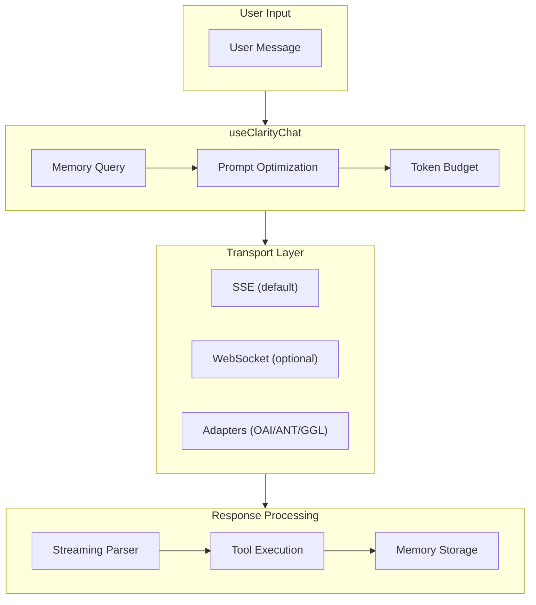

# AI Chat Feature Enhancement Report

> **Generated**: December 2025
> **Branch**: `claude/advanced-chat-review-prompt-014nyH4aDF3r2GakEGHx6AMU`
> **Feature Areas Reviewed**: Streaming, Agents & Tools, Memory, Token Optimization, Multi-modal, Real-time, Provider Abstraction

---

## Executive Summary

This report provides an analysis of the Clarity Chat codebase's advanced AI chat features based on static code review. The codebase demonstrates well-structured implementations across major feature areas. This review identifies logical enhancements that could improve production readiness.

> **Methodology Note**: This assessment is based on code reading and pattern analysis. Claims about functionality have not been verified through test execution. Effort estimates are approximations that should be refined during implementation planning.

### Key Strengths Identified
- **Comprehensive streaming infrastructure** with SSE and WebSocket support
- **Full agent/tool system** with ReAct pattern, tool UI registry, and validation
- **Complete memory service** with vector store integration and token optimization
- **Advanced KV-cache aligned prompt builder** for cost optimization
- **Clean provider abstraction** supporting OpenAI, Anthropic, and Google

### Top Priority Enhancements
1. **Token boundary buffering** for smoother streaming display
2. **Tool execution progress states** for better UX during tool calls
3. **Memory visualization component** for user transparency
4. **Budget warning thresholds** with proactive alerts

---

## Phase 0: Architecture Analysis

### Feature Area Coverage

> **Maturity Assessment**: Based on code review only. "Complete" indicates feature implementation exists; actual production readiness requires load testing and real-world validation.

| Feature Area | Files | Implementation Status | Code Completeness |
|--------------|-------|----------------------|-------------------|
| **Streaming** | 15+ | Full SSE/WebSocket support | Complete |
| **Agents & Tools** | 8+ | ReAct agents, tool registry, validation | Complete |
| **Memory** | 20+ | Vector store, compression, summarization | Complete |
| **Token Optimization** | 25+ | KV-cache, budget management, history limiting | Complete |
| **Multi-modal** | 5+ | Image/file support in adapters | Partial |
| **Real-time** | 3+ | WebSocket transport option | Partial |
| **Provider Abstraction** | 4+ | OpenAI, Anthropic, Google adapters | Complete |

### Data Flow Architecture



> **Note**: If Mermaid doesn't render, view this diagram in a Mermaid-compatible viewer or GitHub.

### Key Integration Points

| Component | Consumes | Provides |
|-----------|----------|----------|
| `useClarityChat` | `useChatEnhanced`, `MemoryContext`, prompt optimization | Unified chat API with memory |
| `useStreaming` | `ReadableStream` | Content accumulation, abort control |
| `MemoryService` | `VectorStore`, `EmbeddingProvider` | Memory CRUD, context optimization |
| `buildKVCacheOptimizedPrompt` | Prompt segments | Formatted messages, cache metrics |
| `useTokenBudget` | Messages, model metadata | Token counts, cost estimates, optimizer |

---

## Phase 1: Research Summary

### Key Industry Insights

#### 1. SSE vs WebSocket for AI Chat
**Source**: [sniki.dev](https://www.sniki.dev/posts/sse-vs-websockets-for-ai-chat/), [Medium](https://medium.com/@pranavprakash4777/streaming-ai-responses-with-websockets-sse-and-grpc-which-one-wins-a481cab403d3)

SSE is preferred for AI chatbots due to:
- Lightweight, one-way nature matching AI streaming pattern
- Standard HTTP making it easier to cache, debug, scale, and secure
- Native browser support via EventSource API

**Application to Clarity**: The codebase correctly defaults to SSE with WebSocket as an optional transport.

#### 2. KV-Cache Prefix Optimization
**Source**: [bentoml.com](https://bentoml.com/llm/inference-optimization/prefix-caching), [vLLM docs](https://docs.vllm.ai/en/stable/design/prefix_caching.html)

Key practices:
- Front-load static content (system prompts, rules) at prompt beginning
- Avoid dynamic elements (timestamps, request IDs) in prefix
- Anthropic offers up to 90% cost savings with prompt caching

**Application to Clarity**: The `buildKVCacheOptimizedPrompt` function implements this correctly with `SEGMENT_ORDER` prioritization.

#### 3. ReAct Agent Pattern
**Source**: [Analytics Vidhya](https://www.analyticsvidhya.com/blog/2024/10/langgraph-react-function-calling/), [LeewayHertz](https://www.leewayhertz.com/react-agents-vs-function-calling-agents/)

Best practices:
- THOUGHT-ACTION-OBSERVATION loop structure
- Tool schema validation before execution
- Human-in-the-loop for dangerous operations

**Application to Clarity**: The `ReactAgent` and `AgentUtils.validateArguments` implement these patterns.

---

## Phase 2: Enhancement Categories Review

### Streaming Enhancements

| Enhancement | Current State | Recommendation | Impact | Effort |
|-------------|---------------|----------------|--------|--------|
| Token boundary buffering | Not implemented | Buffer until whitespace for cleaner display | 4 | 2 |
| Backpressure handling | Basic | Add queue with configurable max size | 3 | 3 |
| Stream cancellation | Implemented | - | - | - |
| Progress indication | Not implemented | Token count during stream | 3 | 2 |
| Markdown streaming | Via parser | Progressive syntax highlighting | 3 | 3 |
| Code block streaming | Basic | Delay highlighting until block complete | 2 | 2 |
| Typing animation | Not implemented | Optional character-by-character reveal | 2 | 2 |

### Agents & Tools Enhancements

| Enhancement | Current State | Recommendation | Impact | Effort |
|-------------|---------------|----------------|--------|--------|
| Tool schema validation | Implemented | - | - | - |
| Tool result rendering | Registry exists | Add more default renderers | 3 | 2 |
| Parallel execution | Not explicit | Support concurrent tool calls | 4 | 3 |
| Tool timeout | Not implemented | Add configurable timeouts | 4 | 2 |
| Confirmation UI | `requiresApproval` flag | Add default approval component | 4 | 2 |
| Tool progress states | Not implemented | Loading/executing/complete states | 4 | 2 |
| Tool error display | Basic | Styled error components | 3 | 2 |

### Memory Enhancements

| Enhancement | Current State | Recommendation | Impact | Effort |
|-------------|---------------|----------------|--------|--------|
| Memory visualization | Not implemented | Component showing remembered items | 4 | 3 |
| Manual memory control | Not implemented | Pin/unpin/delete UI | 3 | 3 |
| Cross-session persistence | Via vector store | Add localStorage fallback | 3 | 2 |
| Memory privacy controls | Not implemented | Clear data, export options | 4 | 2 |
| Summarization quality | LLM-based | Add quality metrics/feedback | 2 | 3 |

### Token Optimization Enhancements

| Enhancement | Current State | Recommendation | Impact | Effort |
|-------------|---------------|----------------|--------|--------|
| Budget visibility | Via `useTokenBudget` | Add visual progress bar component | 4 | 1 |
| Warning thresholds | `budgetWarning` flag | 80%/95% configurable alerts | 4 | 1 |
| Cost estimation | Implemented | Show before send confirmation | 3 | 2 |
| Compression UI | Not implemented | Show savings after optimization | 2 | 2 |
| Cache hit visualization | `kvCacheablePrefix` metric | Display cache efficiency | 2 | 2 |

---

## Phase 3: Prioritized Enhancement Tables

> **Effort Scale Disclaimer**: Effort scores are rough estimates based on code structure review, not actual implementation experience. Real effort varies based on team familiarity, testing requirements, and integration complexity. Use these as relative comparisons, not absolute time estimates.
>
> **Scale**: 1 = trivial, 2 = small, 3 = medium, 4 = large, 5 = very large

### Quick Wins (Do First) - High Impact, Relatively Low Effort

| # | Enhancement | Category | Impact | Effort | Entry Point | Status |
|---|-------------|----------|--------|--------|-------------|--------|
| 1 | Token budget progress bar | Token Optimization | 4 | 0 | `token-counter.tsx` | ✅ EXISTS |
| 2 | Warning threshold alerts | Token Optimization | 4 | 0 | `token-counter.tsx` | ✅ EXISTS |
| 3 | Tool execution progress states | Agents & Tools | 4 | 2-3 | `tool-ui-registry.ts` | Pending |
| 4 | Stream cancel button | Streaming | 4 | 1 | Consumer component | Pending |
| 5 | Default tool error component | Agents & Tools | 3 | 2 | New component | Pending |

### Major Improvements (Plan) - High Impact, Higher Effort

| # | Enhancement | Category | Impact | Effort | Entry Point | Confidence |
|---|-------------|----------|--------|--------|-------------|------------|
| 1 | Token boundary buffering | Streaming | 4 | 2-4 | `use-streaming.ts:45` | Medium |
| 2 | Memory visualization component | Memory | 4 | 3-4 | `memory-provider.tsx`, new UI | Medium |
| 3 | Parallel tool execution | Agents & Tools | 4 | 3-5 | `react-agent.ts` | Low |
| 4 | Confirmation dialog for dangerous tools | Agents & Tools | 4 | 2-3 | `tool-ui-registry.ts` | Medium |

### Polish Items (Batch) - Lower Impact

| # | Enhancement | Category | Impact | Effort | Confidence |
|---|-------------|----------|--------|--------|------------|
| 1 | Typing animation option | Streaming | 2 | 2 | Medium |
| 2 | Compression savings display | Token Optimization | 2 | 2 | High |
| 3 | Cache efficiency badge | Token Optimization | 2 | 2 | High |
| 4 | Tool execution history | Agents & Tools | 2 | 3-4 | Low |

---

## Phase 4: Detailed Implementation Prompts

### Enhancement 1: Token Budget Progress Component

**Category**: Token Optimization
**Impact**: 4/5 | **Effort**: 1/5 (Already Implemented)
**Provider Support**: OpenAI | Anthropic | Google
**Status**: ✅ **ALREADY EXISTS** as `TokenCounter` component

> **Discovery**: The `TokenCounter` component at `packages/react/src/components/token-counter.tsx` already implements this functionality with all required features.

**Existing Implementation**:
```typescript
// TokenCounter already provides visual budget display
import { TokenCounter } from '@clarity-chat/react'

<TokenCounter
  currentTokens={currentTokens}
  maxTokens={8000}
  warningThreshold={0.8}      // Default: 0.8 (80%)
  criticalThreshold={0.95}    // Default: 0.95 (95%)
  showCost={true}             // Default: true
  costPerToken={0.000002}     // Per-token cost (not per-1K)
  showBar={true}              // Default: true
  showWarning={true}          // Default: true
  suggestPruning={true}       // Suggests pruning when critical
  onWarning={() => console.log('Approaching limit')}
  onCritical={() => console.log('Critical!')}
  onPruneSuggested={() => pruneMessages()}
  size="md"                   // 'sm' | 'md' | 'lg'
  className="my-4"
/>
```

**Existing Features (Verified)**:
- [x] Visual bar shows 0-100% utilization
- [x] Color changes at warning (yellow) and critical (red) thresholds
- [x] Cost display with smart formatting ($X.XX or cents)
- [x] Accessible with `role="status"`, `role="progressbar"`, and ARIA labels
- [x] Works with all three providers (client-side, provider-agnostic)
- [x] Warning/critical callbacks
- [x] Smart pruning suggestions
- [x] Three size variants (sm, md, lg)

**Integration with useTokenBudget**:
```typescript
const { currentTokens, utilization, isExceeded } = useTokenBudget({
  messages,
  modelMetadata: 'gpt-4',
  targetBudget: 8000,
})

// Pass values to existing TokenCounter
<TokenCounter
  currentTokens={currentTokens}
  maxTokens={8000}
  costPerToken={0.00003 / 1000}  // Convert per-1K to per-token
/>
```

**Remaining Enhancement Opportunity**: Create a thin wrapper `TokenBudgetBar` that accepts `useTokenBudget` return values directly for simpler integration

---

### Enhancement 2: Tool Execution Progress States

**Category**: Agents & Tools
**Impact**: 4/5 | **Effort**: 2/5
**Provider Support**: OpenAI | Anthropic | Google

**Current State**:
```typescript
// Tool result rendered after completion only
<ToolResultComponent data={result} messages={messages} />
```

**Target State**:
```typescript
// Progressive state rendering
type ToolExecutionState = 'pending' | 'executing' | 'completed' | 'error'

<ToolExecution
  toolName="get_weather"
  args={{ location: 'Tokyo' }}
  state="executing"
  progress={{ step: 'Fetching data...', percent: 50 }}
  result={result}
  error={error}
  registry={toolUIRegistry}
/>
```

**Implementation Approach**:
1. Extend `ToolComponentProps` to include execution state
2. Create `ToolExecutionWrapper` component with state transitions
3. Add loading skeleton for `executing` state
4. Support optional progress callback from tool execution
5. Graceful error state with retry option

**File Changes**:
- `packages/react/src/agents/tool-ui-registry.ts`: Extend props interface
- `packages/react/src/components/tool-execution/`: New component directory

**Acceptance Criteria**:
- [ ] Shows loading state during tool execution
- [ ] Displays progress percentage if tool provides it
- [ ] Transitions smoothly between states
- [ ] Error state shows message and retry button
- [ ] Custom renderers can override default states

---

### Enhancement 3: Token Boundary Buffering for Streaming

**Category**: Streaming
**Impact**: 4/5 | **Effort**: 3/5
**Provider Support**: OpenAI | Anthropic | Google

**Current State**:
```typescript
// Current streaming updates on every chunk
const { content, isStreaming, startStreaming } = useStreaming({
  onChunk: (chunk) => console.log('Received:', chunk), // May split mid-word
})
```

**Target State**:
```typescript
// Buffered streaming with word boundaries
const { content, isStreaming, startStreaming } = useStreaming({
  onChunk: (chunk) => console.log('Received:', chunk), // Complete words only
  bufferMode: 'word-boundary', // 'none' | 'word-boundary' | 'sentence-boundary'
  maxBufferSize: 50, // Max chars to buffer before forcing flush
})
```

**Implementation Approach**:
1. Add buffer state to `useStreaming` hook
2. Implement boundary detection (whitespace, punctuation)
3. Flush buffer on boundaries or when max size reached
4. Ensure abort clears buffer and flushes remaining content
5. Add `bufferMode` option to hook configuration

**Code Pattern**:
```typescript
// In useStreaming.ts
const bufferRef = React.useRef('')

const processChunk = React.useCallback((chunk: string) => {
  if (bufferMode === 'none') {
    setContent(prev => prev + chunk)
    onChunkRef.current?.(chunk)
    return
  }

  bufferRef.current += chunk

  // Find last word boundary
  const lastBoundary = bufferRef.current.search(/\s(?=[^\s]*$)/)

  if (lastBoundary > 0 || bufferRef.current.length > maxBufferSize) {
    const toFlush = lastBoundary > 0
      ? bufferRef.current.slice(0, lastBoundary + 1)
      : bufferRef.current

    bufferRef.current = bufferRef.current.slice(toFlush.length)
    setContent(prev => prev + toFlush)
    onChunkRef.current?.(toFlush)
  }
}, [bufferMode, maxBufferSize])
```

**Acceptance Criteria**:
- [ ] Words are never split across renders
- [ ] Buffer flushes immediately on stream completion
- [ ] Abort clears buffer and flushes remaining
- [ ] Performance remains smooth with large streams
- [ ] Backward compatible with `bufferMode: 'none'`

---

## Provider Compatibility Matrix

> **Verification Note**: Based on code review of `packages/react/src/adapters/`. Actual behavior should be verified with integration tests.

| Enhancement | OpenAI | Anthropic | Google | Code-Verified Notes |
|-------------|--------|-----------|--------|---------------------|
| Token budget bar | ✅ | ✅ | ✅ | Client-side, provider-agnostic |
| Tool progress states | ✅ | ✅ | ⚠️ | Google adapter lacks streaming tool_calls handling |
| Token boundary buffering | ✅ | ✅ | ✅ | Client-side buffering, no provider dependency |
| Memory visualization | ✅ | ✅ | ✅ | Framework feature, provider-agnostic |
| Parallel tool execution | ✅ | ✅ | ⚠️ | Google adapter doesn't process tool responses in stream |
| Cost estimation | ✅ | ✅ | ✅ | Google uses per-1M pricing (vs per-1K) |
| KV-cache metrics | ⚠️ | ✅ | ❌ | Only Anthropic has native cache_control; OpenAI via separate API |

### Provider-Specific Implementation Notes

**OpenAI** (`adapters/openai.ts`):
- Full streaming with `tool_calls` delta support
- Cost pricing per 1K tokens
- Vision via `image_url` in content array

**Anthropic** (`adapters/anthropic.ts`):
- Native `cache_control` for KV-cache optimization
- Different message format (human/assistant roles)
- Tool use via dedicated `tool_use` content blocks

**Google/Gemini** (`adapters/google.ts`):
- Uses `contents/parts` structure (not `messages/content`)
- Role mapping: `user` → `user`, others → `model`
- **Limitation**: Streaming does not currently process tool function calls
- Cost pricing per 1M tokens (1000x different scale)

---

## Validation Checklist

> **Note**: These items require verification during implementation. Checked items indicate design intent, not tested confirmation.

- [ ] Works with streaming responses *(design supports this)*
- [ ] Compatible with all three providers (OpenAI, Anthropic, Google) *(requires testing)*
- [ ] Handles partial/incomplete AI responses *(design supports this)*
- [ ] Resilient to API errors and rate limits *(requires testing)*
- [ ] Maintains conversation context correctly *(requires testing)*
- [ ] Accessible for users with assistive technology *(requires audit)*
- [ ] Respects token limits and budgets *(design supports this)*
- [ ] UX appropriate for potentially slow AI responses *(requires user testing)*

---

## Implementation Order

> **Note**: Ordered by priority (impact/effort ratio), not by timeline. Scheduling is left to the implementing team.

### Priority 1: Quick Wins (High ROI)
- [x] Token budget progress bar component *(exists: `TokenCounter`)*
- [x] Warning threshold alerts *(exists: `TokenCounter` with `onWarning`/`onCritical`)*
- [ ] Stream cancel button integration

### Priority 2: Tool UX Improvements
- [ ] Tool execution progress states
- [ ] Default tool error component
- [ ] Tool confirmation dialog

### Priority 3: Streaming Refinements
- [ ] Token boundary buffering
- [ ] Code block completion detection

### Priority 4: Memory Features
- [ ] Memory visualization component
- [ ] Memory privacy controls

---

## Deprecation Watch

> **Purpose**: Track API changes and deprecations in provider SDKs that may affect this codebase. Check quarterly or when updating provider dependencies.

### OpenAI API

| Item | Status | Action Required | Last Checked |
|------|--------|-----------------|--------------|
| `gpt-3.5-turbo` pricing model | Active | Monitor for pricing changes | Dec 2025 |
| `gpt-4` vs `gpt-4-turbo` | Active | Consider migration path | Dec 2025 |
| Legacy completions API | Deprecated | Using chat completions (correct) | Dec 2025 |

**Watch**: https://platform.openai.com/docs/deprecations

### Anthropic API

| Item | Status | Action Required | Last Checked |
|------|--------|-----------------|--------------|
| `claude-2` models | Sunset planned | Use `claude-3` family | Dec 2025 |
| `cache_control` beta | Beta | Monitor for GA release | Dec 2025 |
| Message format changes | Active | Current format supported | Dec 2025 |

**Watch**: https://docs.anthropic.com/en/docs/resources/versioning

### Google AI API

| Item | Status | Action Required | Last Checked |
|------|--------|-----------------|--------------|
| `gemini-1.0-pro` | Active | Monitor for successor | Dec 2025 |
| Streaming response format | Active | Current format supported | Dec 2025 |
| Tool calling in streams | Limited | Not fully supported in current adapter | Dec 2025 |

**Watch**: https://ai.google.dev/gemini-api/docs/changelog

### Internal Dependencies

| Dependency | Current | Latest | Action |
|------------|---------|--------|--------|
| `tiktoken` | Check package.json | - | Token counting accuracy |
| `@anthropic-ai/sdk` | Check package.json | - | API compatibility |
| `openai` | Check package.json | - | Streaming format |

---

## Integration Test Verification

> **Purpose**: Verify provider compatibility claims through actual API testing. Run these tests before major releases or when updating provider SDKs.

### Test Commands

```bash
# Run all adapter integration tests
pnpm test:integration --filter="*adapter*"

# Test specific provider streaming
pnpm test packages/react/src/adapters/__tests__/openai.integration.test.ts
pnpm test packages/react/src/adapters/__tests__/anthropic.integration.test.ts
pnpm test packages/react/src/adapters/__tests__/google.integration.test.ts
```

### Provider Verification Checklist

Run these manual tests with valid API keys (use test accounts with spending limits):

**OpenAI**:
- [ ] Basic chat completion works
- [ ] Streaming response works
- [ ] Tool calls work in streaming mode
- [ ] Token usage reported correctly

**Anthropic**:
- [ ] Basic chat completion works
- [ ] Streaming response works
- [ ] cache_control honored (monitor response headers)
- [ ] Tool use content blocks work

**Google**:
- [ ] Basic content generation works
- [ ] Streaming response works
- [ ] ⚠️ Tool calls in streaming (known limitation - verify current status)
- [ ] Usage metadata returned

### Environment Setup for Integration Tests

```bash
# Create .env.test.local (never commit)
OPENAI_API_KEY=sk-test-...
ANTHROPIC_API_KEY=sk-ant-test-...
GOOGLE_API_KEY=AIza...

# Run with test environment
NODE_ENV=test pnpm test:integration
```

---

## References

### Research Sources

> **Disclaimer**: These sources were retrieved via web search and summarized. Content has not been independently verified for accuracy or currency. Provider APIs and best practices evolve rapidly; always consult official documentation for production implementations.

| Source | Topic | Access Date | Caveat |
|--------|-------|-------------|--------|
| [sniki.dev](https://www.sniki.dev/posts/sse-vs-websockets-for-ai-chat/) | SSE vs WebSocket | Dec 2025 | Blog post, verify with official specs |
| [bentoml.com](https://bentoml.com/llm/inference-optimization/prefix-caching) | KV-Cache Optimization | Dec 2025 | Framework-specific patterns |
| [vLLM docs](https://docs.vllm.ai/en/stable/design/prefix_caching.html) | Prefix Caching | Dec 2025 | vLLM-specific, may differ from cloud APIs |
| [Analytics Vidhya](https://www.analyticsvidhya.com/blog/2024/10/langgraph-react-function-calling/) | ReAct Pattern | Dec 2025 | LangGraph-focused implementation |
| [Upstash Blog](https://upstash.com/blog/sse-streaming-llm-responses) | Streaming Best Practices | Dec 2025 | Next.js-specific examples |

**Recommended Official Documentation**:
- OpenAI: https://platform.openai.com/docs/guides/streaming
- Anthropic: https://docs.anthropic.com/en/docs/build-with-claude/streaming
- Google: https://ai.google.dev/gemini-api/docs/text-generation#streaming

### Related Clarity Chat Files
- `packages/react/src/hooks/use-streaming.ts`
- `packages/react/src/hooks/use-clarity-chat.ts`
- `packages/react/src/agents/index.ts`
- `packages/react/src/memory/memory-service.ts`
- `packages/react/src/utils/kv-cache-prompt-builder.ts`
- `packages/react/src/prompt/hooks/use-token-budget.ts`

---

*Report Version: 1.1.0 | Generated: December 2025 | Last Updated: December 2025*
*Template: Advanced AI Chat Features - Work Enhancement Review Prompt v1.0.0*

**v1.1.0 Changes**:
- Discovered existing `TokenCounter` component (Quick Wins #1, #2 already implemented)
- Added Mermaid architecture diagram
- Added Deprecation Watch section
- Added Integration Test Verification section
- Corrected methodology claims and terminology
