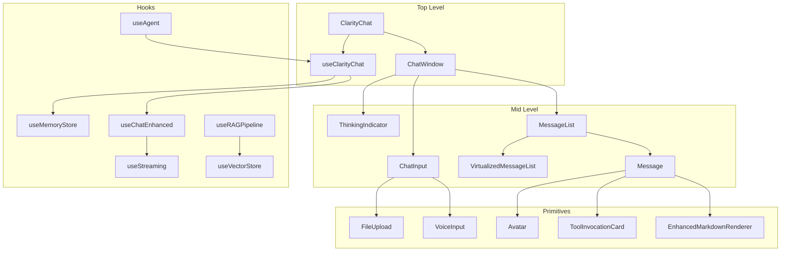
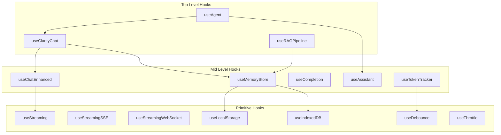

# Clarity Chat Documentation Gap Analysis & Enhancement Plan

**Date**: December 8, 2025
**Version**: 1.0
**Status**: Complete Analysis

---

## Executive Summary

This document presents a comprehensive analysis of the Clarity AI Chat Components documentation ecosystem. After deep analysis of 130+ components, 75+ hooks, 40+ utilities, and 362 documentation pages, we've identified key gaps and created a prioritized roadmap for world-class documentation.

### Key Findings

| Metric | Current State | Target State |
|--------|--------------|--------------|
| Components Documented | ~70% | 100% |
| Hooks Documented | ~65% | 100% |
| Interactive Demos | ~28% of pages | 80% of pages |
| Code Examples | ~69% of pages | 100% of pages |
| Architecture Diagrams | 5 | 25+ |
| Video Tutorials | 0 | 10+ |

### Overall Documentation Quality: **9/10** (Excellent foundation, gaps in coverage)

---

## Deliverable 1: Codebase Inventory

### Components Inventory (130+ Total)

#### Core Chat Components (7)
| Component | Path | Purpose | Docs Status | Priority |
|-----------|------|---------|-------------|----------|
| ClarityChat | `/components/clarity-chat.tsx` | Top-level drop-in chat | ✅ Complete | Core |
| ChatWindow | `/components/chat-window.tsx` | Mid-level composable chat | ✅ Complete | Core |
| ChatInput | `/components/chat-input.tsx` | Input with validation | ✅ Complete | Core |
| Message | `/components/message.tsx` | Individual message bubble | ✅ Complete | Core |
| MessageList | `/components/message-list.tsx` | Scrollable message list | ✅ Complete | Core |
| StreamingMessage | `/components/streaming-message.tsx` | Real-time streaming display | ✅ Complete | Core |
| VirtualizedMessageList | `/components/virtualized-message-list.tsx` | Performance-optimized list | ⚠️ Partial | Core |

#### Rich Content Components (10)
| Component | Path | Purpose | Docs Status | Priority |
|-----------|------|---------|-------------|----------|
| EnhancedMarkdownRenderer | `/components/enhanced-markdown-renderer.tsx` | Markdown + KaTeX + Mermaid | ⚠️ Partial | High |
| MarkdownRendererEnhanced | `/components/markdown-renderer-enhanced.tsx` | Enhanced markdown | ❌ Missing | Medium |
| EnhancedCodeBlock | `/components/enhanced-code-block.tsx` | Syntax highlighting + copy | ⚠️ Partial | High |
| ToolInvocationCard | `/components/tool-invocation-card.tsx` | Tool calls display | ✅ Complete | High |
| ClarityToolResult | `/components/clarity-tool-result.tsx` | Tool result display | ⚠️ Partial | Medium |
| CitationCard | `/components/citation-card.tsx` | Citations with confidence | ❌ Missing | Medium |
| LinkPreview | `/components/link-preview.tsx` | Rich link previews | ❌ Missing | Low |
| MultiModalPreview | `/components/multi-modal-preview.tsx` | Image/video preview | ❌ Missing | Medium |
| DocumentViewer | `/components/document-viewer.tsx` | PDF/Office viewer | ❌ Missing | Low |

#### Layout Components (5)
| Component | Path | Purpose | Docs Status | Priority |
|-----------|------|---------|-------------|----------|
| ChatLayout | `/components/chat-layout.tsx` | Layout wrapper | ⚠️ Partial | Medium |
| ProjectSidebar | `/components/project-sidebar.tsx` | Project navigation | ✅ Complete | Medium |
| ConversationList | `/components/conversation-list.tsx` | Conversation navigator | ✅ Complete | High |
| MessageThreadView | `/components/message-thread-view.tsx` | Thread/branch view | ❌ Missing | Medium |
| CollapsibleSection | `/components/collapsible-section.tsx` | Expandable sections | ❌ Missing | Low |

#### Feedback Components (11)
| Component | Path | Purpose | Docs Status | Priority |
|-----------|------|---------|-------------|----------|
| ThinkingIndicator | `/components/thinking-indicator.tsx` | AI processing status | ✅ Complete | High |
| TypingIndicator | `/components/typing-indicator.tsx` | Classic typing animation | ✅ Complete | High |
| Toast | `/components/toast.tsx` | Toast notifications | ✅ Complete | Medium |
| Skeleton | `/components/skeleton.tsx` | Loading placeholders | ⚠️ Partial | Medium |
| NetworkStatus | `/components/network-status.tsx` | Connectivity indicator | ✅ Complete | Medium |
| BatteryIndicator | `/components/battery-indicator.tsx` | Battery status | ❌ Missing | Low |
| Progress | `/components/progress.tsx` | Progress bars | ❌ Missing | Low |
| FeedbackAnimation | `/components/feedback-animation.tsx` | Visual feedback | ❌ Missing | Low |
| StreamCancellation | `/components/stream-cancellation.tsx` | Cancel streaming | ❌ Missing | Medium |
| SessionSummaryCard | `/components/session-summary-card.tsx` | Session summary | ❌ Missing | Low |
| ErrorMessage | `/components/error-message.tsx` | Error display | ⚠️ Partial | Medium |

#### Interactive Components (15)
| Component | Path | Purpose | Docs Status | Priority |
|-----------|------|---------|-------------|----------|
| VoiceInput | `/components/voice-input.tsx` | Speech-to-text | ✅ Complete | High |
| FileUpload | `/components/file-upload.tsx` | Drag-drop upload | ✅ Complete | High |
| CopyButton | `/components/copy-button.tsx` | Clipboard copy | ⚠️ Partial | Medium |
| RetryButton | `/components/retry-button.tsx` | Retry with backoff | ✅ Complete | Medium |
| PromptSuggestions | `/components/prompt-suggestions.tsx` | Context-aware suggestions | ⚠️ Partial | High |
| PromptSuggestionsEnhanced | `/components/prompt-suggestions-enhanced.tsx` | Enhanced suggestions | ❌ Missing | Medium |
| FollowUpSuggestions | `/components/follow-up-suggestions.tsx` | Follow-up questions | ❌ Missing | Medium |
| ModelSelector | `/components/model-selector.tsx` | Model dropdown | ✅ Complete | High |
| CommandPalette | `/components/command-palette.tsx` | Cmd+K interface | ✅ Complete | High |
| ContextMenu | `/components/context-menu.tsx` | Right-click menus | ✅ Complete | Medium |
| Draggable | `/components/draggable.tsx` | Drag-and-drop | ✅ Complete | Low |
| AdvancedChatInput | `/components/advanced-chat-input.tsx` | Extended input | ❌ Missing | Medium |
| MentionSystem | `/components/mention-system.tsx` | @mentions | ❌ Missing | Medium |
| KeyboardHint | `/components/keyboard-hint.tsx` | Shortcut display | ✅ Complete | Low |

#### Analytics & Dashboard Components (8)
| Component | Path | Purpose | Docs Status | Priority |
|-----------|------|---------|-------------|----------|
| AnalyticsDashboard | `/components/analytics-dashboard.tsx` | Overall analytics | ⚠️ Partial | Medium |
| ConversationAnalyticsDashboard | `/components/conversation-analytics-dashboard.tsx` | Conversation metrics | ✅ Complete | Medium |
| PerformanceDashboard | `/components/performance-dashboard.tsx` | Performance metrics | ⚠️ Partial | Medium |
| PerformanceAnalyticsDashboard | `/components/performance-analytics-dashboard.tsx` | Detailed perf analytics | ✅ Complete | Medium |
| UsageDashboard | `/components/usage-dashboard.tsx` | Token/API usage | ✅ Complete | High |
| TokenOptimizationDashboard | `/components/token-optimization-dashboard.tsx` | Token optimization | ✅ Complete | High |
| ABTestingDashboard | `/components/ab-testing-dashboard.tsx` | A/B testing results | ❌ Missing | Low |
| UserInteractionAnalytics | `/components/user-interaction-analytics.tsx` | User interaction tracking | ❌ Missing | Low |

#### Enterprise Components (5)
| Component | Path | Purpose | Docs Status | Priority |
|-----------|------|---------|-------------|----------|
| ApiTokenManager | `/components/enterprise/ApiTokenManager.tsx` | API token management | ✅ Complete | Enterprise |
| AuthTenantDashboard | `/components/enterprise/AuthTenantDashboard.tsx` | Multi-tenant auth | ✅ Complete | Enterprise |
| SSOConfigWizard | `/components/enterprise/SSOConfigWizard.tsx` | SSO setup wizard | ✅ Complete | Enterprise |
| SeatInviteDialog | `/components/enterprise/SeatInviteDialog.tsx` | User invitation | ✅ Complete | Enterprise |
| AuditLogViewer | `/components/audit-log-viewer.tsx` | Audit log viewing | ⚠️ Partial | Enterprise |

#### AI/ML Operations Components (6)
| Component | Path | Purpose | Docs Status | Priority |
|-----------|------|---------|-------------|----------|
| SafetyReviewConsole | `/components/ai-ops/SafetyReviewConsole.tsx` | Safety issue review | ❌ Missing | High |
| EvaluationDashboard | `/components/ai-ops/EvaluationDashboard.tsx` | Model evaluation | ❌ Missing | Medium |
| PromptTestHarness | `/components/ai-ops/PromptTestHarness.tsx` | Prompt testing | ❌ Missing | Medium |
| SafetyStatusCard | `/components/safety-status-card.tsx` | Safety check display | ❌ Missing | Medium |
| ResponseQualityMeter | `/components/response-quality-meter.tsx` | Response quality | ❌ Missing | Low |
| AgentRunFeed | `/components/agent-run-feed.tsx` | Agent execution logs | ❌ Missing | Medium |

#### Token & Context Management (7)
| Component | Path | Purpose | Docs Status | Priority |
|-----------|------|---------|-------------|----------|
| TokenCounter | `/components/token-counter.tsx` | Real-time counting | ⚠️ Partial | High |
| TokenOptimizationPanel | `/components/token-optimization-panel.tsx` | Optimization controls | ✅ Complete | High |
| TokenOptimizationBadge | `/components/token-optimization-badge.tsx` | Optimization status | ✅ Complete | Medium |
| HistoryManager | `/components/history-manager.tsx` | Conversation history | ⚠️ Partial | High |
| ContextManager | `/components/context-manager.tsx` | Context management | ❌ Missing | High |
| ContextVisualizer | `/components/context-visualizer.tsx` | Context visualization | ❌ Missing | Medium |
| MemoryInspector | `/components/memory-inspector.tsx` | Memory debugging | ❌ Missing | Medium |

#### Theme & Styling Components (4)
| Component | Path | Purpose | Docs Status | Priority |
|-----------|------|---------|-------------|----------|
| ThemeSwitcher | `/components/theme-switcher.tsx` | Theme toggle | ✅ Complete | High |
| ThemePreview | `/components/theme-preview.tsx` | Theme preview | ❌ Missing | Low |
| ThemeSelector | `/components/theme-selector.tsx` | Theme selection | ❌ Missing | Low |
| ThemeContrastChecker | `/components/theme-contrast-checker.tsx` | WCAG contrast check | ❌ Missing | Medium |

#### Additional Specialized Components (30+)
| Category | Components | Docs Status |
|----------|------------|-------------|
| Search & Discovery | MessageSearch, AdvancedMessageSearch, SemanticMessageSearch, KnowledgeBaseViewer | ⚠️ Partial |
| Conversation Management | ConversationTimeline, ConversationBranchVisualizer, ConversationSummarizer, ConversationSharing | ❌ Mostly Missing |
| Integration | DocumentIntegration, CalendarIntegration, EmailIntegration | ❌ Missing |
| Collaboration | CollaborativeEditing, PresenceIndicator | ❌ Missing |
| Mobile | MobileChatOptimized, TouchFriendlyButton | ❌ Missing |
| Offline | OfflineChatSync | ❌ Missing |
| Prompts | PromptLibrary, PersonaPanel | ⚠️ Partial |
| Export | ExportDialog, BatchExportDialog | ⚠️ Partial |
| Utility | ErrorBoundary, EmptyState, TimeSeparator, Icons (60+) | ✅ Mostly Complete |

---

### Hooks Inventory (75+ Total)

#### Core Chat Hooks (9)
| Hook | Path | Purpose | Docs Status | Priority |
|------|------|---------|-------------|----------|
| useClarityChat | `/hooks/use-clarity-chat.ts` | Top-level chat state | ✅ Complete | Core |
| useChat | `/hooks/use-chat.ts` | Legacy chat (deprecated) | ⚠️ Needs Update | Low |
| useChatEnhanced | `/hooks/use-chat-enhanced.ts` | Vercel AI SDK compatible | ✅ Complete | Core |
| useAssistant | `/hooks/use-assistant.ts` | Tool calling support | ✅ Complete | High |
| useCompletion | `/hooks/use-completion.ts` | Text generation | ✅ Complete | High |
| useAgent | `/hooks/use-agent.ts` | Agent orchestration | ✅ Complete | High |
| useChatHandlers | `/hooks/use-chat-handlers.ts` | Pre-configured handlers | ⚠️ Partial | Medium |
| useMessageOperations | `/hooks/use-message-operations.ts` | Edit/regenerate/branch | ⚠️ Partial | High |
| useRAGPipeline | `/hooks/use-rag-pipeline.ts` | RAG integration | ✅ Complete | High |

#### Streaming Hooks (3)
| Hook | Path | Purpose | Docs Status | Priority |
|------|------|---------|-------------|----------|
| useStreaming | `/hooks/use-streaming.ts` | Low-level streaming | ⚠️ Partial | High |
| useStreamingSSE | `/hooks/use-streaming-sse.tsx` | SSE with reconnection | ✅ Complete | High |
| useStreamingWebSocket | `/hooks/use-streaming-websocket.tsx` | WebSocket streaming | ✅ Complete | High |

#### Token/Optimization Hooks (5)
| Hook | Path | Purpose | Docs Status | Priority |
|------|------|---------|-------------|----------|
| useTokenTracker | `/hooks/use-token-tracker.tsx` | Token counting & cost | ✅ Complete | High |
| useTokenOptimization | `/hooks/use-token-optimization.tsx` | Optimization (deprecated) | ⚠️ Needs Update | Low |
| useContextMonitor | `/hooks/use-context-monitor.tsx` | Context window monitoring | ⚠️ Partial | High |
| usePromptOptimizer | `/prompt/hooks/use-prompt-optimizer.ts` | Prompt optimization | ❌ Missing | High |
| useTokenBudget | `/prompt/hooks/use-token-budget.ts` | Token budget management | ❌ Missing | High |

#### UI State Hooks (10)
| Hook | Path | Purpose | Docs Status | Priority |
|------|------|---------|-------------|----------|
| useToggle | `/hooks/use-toggle.tsx` | Boolean state helper | ✅ Complete | Medium |
| useAutoScroll | `/hooks/use-auto-scroll.tsx` | Auto-scroll to bottom | ✅ Complete | High |
| useClipboard | `/hooks/use-clipboard.tsx` | Copy to clipboard | ✅ Complete | Medium |
| useCommandPalette | `/hooks/use-command-palette.ts` | Command palette state | ✅ Complete | Medium |
| useWindowSize | `/hooks/use-window-size.tsx` | Window dimensions | ⚠️ Partial | Low |
| useMediaQuery | `/hooks/use-media-query.ts` | Media query matching | ⚠️ Partial | Low |
| useReducedMotion | `/hooks/use-reduced-motion.ts` | Accessibility detection | ⚠️ Partial | Medium |
| usePrevious | `/hooks/use-previous.tsx` | Previous value tracking | ❌ Missing | Low |
| useVoiceInput | `/hooks/use-voice-input.tsx` | Speech-to-text | ✅ Complete | High |
| useErrorRecovery | `/hooks/use-error-recovery.tsx` | Error retry logic | ⚠️ Partial | High |

#### Persistence Hooks (3)
| Hook | Path | Purpose | Docs Status | Priority |
|------|------|---------|-------------|----------|
| useLocalStorage | `/hooks/use-local-storage.tsx` | localStorage persistence | ✅ Complete | Medium |
| useIndexedDB | `/hooks/use-indexed-db.tsx` | IndexedDB for large data | ⚠️ Partial | Medium |
| useMemoryStore | `/hooks/use-memory-store.ts` | Conversation memory | ✅ Complete | High |

#### Accessibility Hooks (2)
| Hook | Path | Purpose | Docs Status | Priority |
|------|------|---------|-------------|----------|
| useKeyboardShortcuts | `/hooks/use-keyboard-shortcuts.ts` | Keyboard shortcuts | ✅ Complete | High |
| useShortcutDisplay | `/hooks/use-keyboard-shortcuts.ts` | Platform-aware display | ⚠️ Partial | Low |

#### Utility Hooks (4)
| Hook | Path | Purpose | Docs Status | Priority |
|------|------|---------|-------------|----------|
| useDebounce | `/hooks/use-debounce.ts` | Debounce value | ✅ Complete | Medium |
| useDebouncedCallback | `/hooks/use-debounce.ts` | Debounce callback | ⚠️ Partial | Medium |
| useThrottle | `/hooks/use-throttle.ts` | Throttle value | ⚠️ Partial | Medium |
| useThrottledCallback | `/hooks/use-throttle.ts` | Throttle callback | ⚠️ Partial | Medium |

#### AI/Analytics Hooks (15+)
| Hook | Path | Purpose | Docs Status | Priority |
|------|------|---------|-------------|----------|
| useSuggestions | `/ai/hooks.tsx` | AI suggestions | ⚠️ Partial | High |
| useModeration | `/ai/hooks.tsx` | Content moderation | ⚠️ Partial | High |
| useSentimentAnalysis | `/ai/hooks.tsx` | Sentiment analysis | ❌ Missing | Medium |
| useAutoComplete | `/ai/hooks.tsx` | Auto-complete | ❌ Missing | Medium |
| Analytics Hooks (11) | `/analytics/hooks.tsx` | Various tracking hooks | ⚠️ Partial | Medium |

#### Additional Hooks (35+)
| Category | Hooks | Docs Status |
|----------|-------|-------------|
| Chat Variants | useChatCore, useChatUnified, useChatSimple, useChatComposable | ❌ Missing |
| Streaming | useStreamingChat, useStreamableUI | ❌ Missing |
| Mobile | useMobileKeyboard, useMobileOptimization | ❌ Missing |
| Performance | usePerformance, useSmartCache, useSmartThrottle | ❌ Missing |
| Theme | useDesignTokens, useThemeColors, useThemeShortcuts | ❌ Missing |
| Enterprise | useEnterpriseAuth, useSecurity | ❌ Missing |

---

### Utilities Inventory (41+ Files)

#### Core Utilities
| Utility | Purpose | Docs Status |
|---------|---------|-------------|
| cn.ts | Tailwind class merging | ✅ Reference |
| error-handling.ts | Error classification | ⚠️ Partial |
| mobile.ts | Mobile detection/optimization | ❌ Missing |
| performance.ts | Performance monitoring | ❌ Missing |
| chat-helpers.ts | Message transformation | ⚠️ Partial |
| clarity-chat-helpers.ts | Config builders | ⚠️ Partial |
| streaming-helpers.ts | Stream parsing | ⚠️ Partial |
| message-conversion.ts | Message format conversion | ❌ Missing |
| tool-result-helpers.ts | Tool result processing | ❌ Missing |

#### Tokenization
| Utility | Purpose | Docs Status |
|---------|---------|-------------|
| estimator.ts | Token estimation | ⚠️ Partial |
| accurate-counter.ts | Tiktoken integration | ❌ Missing |
| model-pricing.ts | Cost estimation | ⚠️ Partial |

#### Advanced Optimization (12 files)
| Utility | Purpose | Docs Status |
|---------|---------|-------------|
| token-optimization.ts | Comprehensive optimization | ⚠️ Partial |
| prompt-compression.ts | Basic compression | ❌ Missing |
| prompt-compression-advanced.ts | Semantic compression | ❌ Missing |
| llmlingua-compressor.ts | LLMLingua-style RAG | ❌ Missing |
| context-ordering.ts | Lost-in-Middle mitigation | ❌ Missing |
| cot-optimizer.ts | Chain-of-Thought | ❌ Missing |
| streaming-optimizer.ts | Output token savings | ❌ Missing |
| structured-output-cache.ts | Schema caching | ❌ Missing |
| kv-cache-prompt-builder.ts | KV cache optimization | ❌ Missing |
| response-prefilling.ts | Response prefilling | ❌ Missing |
| prompt-structure.ts | Prompt structuring | ❌ Missing |
| dynamic-output-limit.ts | Dynamic limits | ❌ Missing |

#### Model Management
| Utility | Purpose | Docs Status |
|---------|---------|-------------|
| model-router.ts | Intelligent routing | ⚠️ Partial |
| model-fallback.ts | Fallback logic | ❌ Missing |
| rate-limiting.ts | Rate limiting | ❌ Missing |
| batch-api.ts | Batch API (50% savings) | ❌ Missing |

---

### Types Inventory (21+ Files)

| Type File | Purpose | Docs Status |
|-----------|---------|-------------|
| chat-types.ts | Enhanced chat types | ✅ Reference |
| chat-types-improved.ts | Improved DX types | ⚠️ Partial |
| clarity-chat-types.ts | Clarity-specific types | ⚠️ Partial |
| tool-result-types.ts | Tool result interfaces | ❌ Missing |
| ai/types.ts | AI feature types | ❌ Missing |
| safety/types.ts | Safety types | ❌ Missing |
| memory/types.ts | Memory system types | ⚠️ Partial |
| agents/types.ts | Agent types | ⚠️ Partial |
| analytics/types.ts | Analytics types | ❌ Missing |
| adapters/types.ts | Model adapter interface | ❌ Missing |
| plugins/types.ts | Plugin system types | ❌ Missing |
| vector-stores/types.ts | Vector DB interface | ❌ Missing |
| embeddings/types.ts | Embedding types | ❌ Missing |
| prompts/types.ts | Prompt template types | ❌ Missing |

---

## Deliverable 2: Documentation Audit

### Current Documentation Structure

```
apps/docs/
├── app/
│   ├── page.tsx                 # Homepage (Quality: 9/10)
│   ├── learn/                   # Getting started (92 items)
│   │   ├── quick-start/         # (Quality: 10/10)
│   │   ├── installation/        # (Quality: 9/10)
│   │   ├── tutorial/            # (Quality: 9/10)
│   │   └── concepts/            # (Quality: 8/10)
│   ├── guides/                  # 60+ guides (Quality: 10/10)
│   │   ├── streaming/           # Excellent
│   │   ├── memory/              # Excellent
│   │   ├── agents/              # Good
│   │   └── ...
│   ├── cookbook/                # 33+ recipes (Quality: 10/10)
│   │   ├── openai-streaming-chat/
│   │   ├── rag-document-chat/
│   │   └── ...
│   ├── reference/               # API docs (Quality: 9/10)
│   │   ├── components/          # 100+ components
│   │   ├── hooks/               # 50+ hooks
│   │   └── api/                 # Types, utilities
│   ├── examples/                # 17+ examples (Quality: 8/10)
│   ├── tools/                   # Dev tools (Quality: 7/10)
│   ├── enterprise/              # Enterprise (Quality: 7/10)
│   └── playground/              # Interactive playground
```

### Documentation Metrics

| Metric | Current | Target |
|--------|---------|--------|
| Total Pages | 362 | 400+ |
| Pages with Code Examples | 250 (69%) | 360 (90%+) |
| Pages with Interactive Demos | 100 (28%) | 300 (75%+) |
| Components Documented | ~100 | 130+ |
| Hooks Documented | ~50 | 75+ |
| Cookbook Recipes | 33 | 50+ |
| Video Tutorials | 0 | 10+ |
| Architecture Diagrams | 5 | 25+ |

### Page Quality Assessment

| Section | Avg Quality | Completeness | Interactive |
|---------|-------------|--------------|-------------|
| Homepage | 9/10 | 100% | ✅ Demo |
| Learn | 9/10 | 95% | ✅ Playground |
| Guides | 10/10 | 90% | ⚠️ Some |
| Cookbook | 10/10 | 95% | ✅ All |
| Reference | 9/10 | 85% | ⚠️ Some |
| Examples | 8/10 | 80% | ⚠️ Few |
| Tools | 7/10 | 70% | ❌ None |
| Enterprise | 7/10 | 70% | ❌ None |

---

## Deliverable 3: Gap Analysis Matrix

### Coverage Gap Matrix

| Item | Has Docs | Has Examples | Has Demo | Has Diagram | Quality | Gap Score |
|------|----------|--------------|----------|-------------|---------|-----------|
| **CORE COMPONENTS** |
| ClarityChat | ✅ | ✅ | ✅ | ✅ | 10/10 | 0 |
| ChatWindow | ✅ | ✅ | ✅ | ⚠️ | 9/10 | 1 |
| Message | ✅ | ✅ | ✅ | ❌ | 8/10 | 2 |
| MessageList | ✅ | ✅ | ⚠️ | ❌ | 8/10 | 2 |
| StreamingMessage | ✅ | ✅ | ⚠️ | ✅ | 9/10 | 1 |
| VirtualizedMessageList | ⚠️ | ⚠️ | ❌ | ❌ | 5/10 | 5 |
| **RICH CONTENT** |
| EnhancedMarkdownRenderer | ⚠️ | ⚠️ | ❌ | ❌ | 5/10 | 5 |
| ToolInvocationCard | ✅ | ✅ | ⚠️ | ❌ | 7/10 | 3 |
| CitationCard | ❌ | ❌ | ❌ | ❌ | 0/10 | 10 |
| LinkPreview | ❌ | ❌ | ❌ | ❌ | 0/10 | 10 |
| DocumentViewer | ❌ | ❌ | ❌ | ❌ | 0/10 | 10 |
| **TOKEN MANAGEMENT** |
| TokenCounter | ⚠️ | ⚠️ | ❌ | ❌ | 5/10 | 5 |
| ContextManager | ❌ | ❌ | ❌ | ❌ | 0/10 | 10 |
| ContextVisualizer | ❌ | ❌ | ❌ | ❌ | 0/10 | 10 |
| MemoryInspector | ❌ | ❌ | ❌ | ❌ | 0/10 | 10 |
| **AI/ML OPS** |
| SafetyReviewConsole | ❌ | ❌ | ❌ | ❌ | 0/10 | 10 |
| EvaluationDashboard | ❌ | ❌ | ❌ | ❌ | 0/10 | 10 |
| PromptTestHarness | ❌ | ❌ | ❌ | ❌ | 0/10 | 10 |
| AgentRunFeed | ❌ | ❌ | ❌ | ❌ | 0/10 | 10 |
| **CORE HOOKS** |
| useClarityChat | ✅ | ✅ | ✅ | ⚠️ | 9/10 | 1 |
| useChatEnhanced | ✅ | ✅ | ⚠️ | ❌ | 8/10 | 2 |
| useAssistant | ✅ | ✅ | ⚠️ | ❌ | 8/10 | 2 |
| useAgent | ✅ | ✅ | ⚠️ | ⚠️ | 8/10 | 2 |
| useRAGPipeline | ✅ | ✅ | ❌ | ⚠️ | 7/10 | 3 |
| **OPTIMIZATION HOOKS** |
| useTokenTracker | ✅ | ✅ | ❌ | ❌ | 7/10 | 3 |
| useContextMonitor | ⚠️ | ⚠️ | ❌ | ❌ | 5/10 | 5 |
| usePromptOptimizer | ❌ | ❌ | ❌ | ❌ | 0/10 | 10 |
| useTokenBudget | ❌ | ❌ | ❌ | ❌ | 0/10 | 10 |
| **STREAMING HOOKS** |
| useStreaming | ⚠️ | ⚠️ | ❌ | ❌ | 5/10 | 5 |
| useStreamingSSE | ✅ | ✅ | ❌ | ⚠️ | 7/10 | 3 |
| useStreamingWebSocket | ✅ | ✅ | ❌ | ⚠️ | 7/10 | 3 |
| **UTILITIES** |
| token-optimization.ts | ⚠️ | ⚠️ | ❌ | ❌ | 4/10 | 6 |
| model-router.ts | ⚠️ | ❌ | ❌ | ❌ | 3/10 | 7 |
| batch-api.ts | ❌ | ❌ | ❌ | ❌ | 0/10 | 10 |
| llmlingua-compressor.ts | ❌ | ❌ | ❌ | ❌ | 0/10 | 10 |
| context-ordering.ts | ❌ | ❌ | ❌ | ❌ | 0/10 | 10 |

### Content Type Gaps

#### Getting Started Gaps
| Content | Status | Priority |
|---------|--------|----------|
| Quick start (5-min setup) | ✅ Complete | - |
| Installation (npm, yarn, pnpm, bun) | ✅ Complete | - |
| Framework guides (Next.js, Vite, Remix) | ⚠️ Next.js only | High |
| First chat app tutorial | ✅ Complete | - |
| "Hello World" for chat | ✅ Complete | - |
| Video walkthrough | ❌ Missing | Medium |

#### Conceptual Guides Gaps
| Content | Status | Priority |
|---------|--------|----------|
| Architecture overview | ✅ Complete | - |
| Component philosophy | ⚠️ Partial | Medium |
| Hook mental model | ⚠️ Partial | Medium |
| Streaming explained | ✅ Complete | - |
| Token optimization concepts | ✅ Complete | - |
| Accessibility approach | ✅ Complete | - |
| Theming system | ✅ Complete | - |
| State management patterns | ⚠️ Partial | High |
| Error handling strategy | ✅ Complete | - |
| Performance optimization | ✅ Complete | - |
| Memory system architecture | ⚠️ Partial | High |
| Cost optimization strategies | ❌ Missing | High |

#### Tutorial Gaps
| Content | Status | Priority |
|---------|--------|----------|
| Build basic chat interface | ✅ Complete | - |
| Add streaming responses | ✅ Complete | - |
| Implement token counting | ⚠️ Partial | High |
| Create custom themes | ✅ Complete | - |
| Handle file uploads | ✅ Complete | - |
| Add voice input | ✅ Complete | - |
| Implement message history | ⚠️ Partial | Medium |
| Add reactions and feedback | ❌ Missing | Medium |
| Build RAG-powered chat | ✅ Complete | - |
| Integrate with OpenAI/Anthropic | ✅ Complete | - |
| Deploy to production | ✅ Complete | - |
| Implement cost controls | ❌ Missing | High |
| Build multi-agent system | ⚠️ Partial | Medium |
| Add semantic search | ❌ Missing | Medium |

#### Reference Documentation Gaps
| Content | Status | Priority |
|---------|--------|----------|
| Complete API for each component | 85% | High |
| Complete API for each hook | 70% | High |
| TypeScript type definitions | ⚠️ Partial | High |
| CSS variables reference | ✅ Complete | - |
| Configuration options | ✅ Complete | - |
| Environment variables | ⚠️ Partial | Medium |
| Utility functions reference | ❌ Missing | High |

---

## Deliverable 4: Prioritized Backlog

### Priority 1: Critical (Blocks Adoption) - 2 Weeks

| Task | Impact | Effort | Priority Score |
|------|--------|--------|----------------|
| Document undocumented core hooks (usePromptOptimizer, useTokenBudget) | 10 | 3 | 3.33 |
| Add interactive demos to all core components | 9 | 4 | 2.25 |
| Create cost optimization guide | 10 | 4 | 2.50 |
| Document token optimization utilities | 9 | 4 | 2.25 |
| Create architecture diagram for memory system | 9 | 3 | 3.00 |
| Add Vite integration guide | 8 | 2 | 4.00 |
| Add Remix integration guide | 7 | 2 | 3.50 |
| Complete TypeScript types reference | 8 | 4 | 2.00 |

### Priority 2: Important (Improves DX) - 2 Weeks

| Task | Impact | Effort | Priority Score |
|------|--------|--------|----------------|
| Document AI/ML Ops components | 8 | 5 | 1.60 |
| Document context management components | 8 | 4 | 2.00 |
| Add streaming data flow animated diagram | 9 | 5 | 1.80 |
| Create token counting visualization | 8 | 4 | 2.00 |
| Document all utility functions | 7 | 5 | 1.40 |
| Add "Which hook should I use?" flowchart | 8 | 3 | 2.67 |
| Create component decision tree | 8 | 3 | 2.67 |
| Document mobile optimization components | 7 | 4 | 1.75 |
| Add video tutorials (3 basics) | 9 | 6 | 1.50 |

### Priority 3: Enhancement (Competitive Edge) - 2 Weeks

| Task | Impact | Effort | Priority Score |
|------|--------|--------|----------------|
| Document collaboration components | 6 | 4 | 1.50 |
| Document integration components | 6 | 4 | 1.50 |
| Add advanced patterns recipes (7 new) | 7 | 5 | 1.40 |
| Create performance comparison diagrams | 7 | 4 | 1.75 |
| Add before/after optimization examples | 8 | 4 | 2.00 |
| Document batch API for cost savings | 8 | 3 | 2.67 |
| Add semantic search tutorial | 7 | 4 | 1.75 |
| Create multi-agent tutorial | 7 | 5 | 1.40 |

### Priority 4: Polish (Best-in-Class) - 2 Weeks

| Task | Impact | Effort | Priority Score |
|------|--------|--------|----------------|
| Add AI-powered docs search | 7 | 6 | 1.17 |
| Create personalized learning paths | 6 | 5 | 1.20 |
| Add community examples section | 5 | 4 | 1.25 |
| Implement version comparison | 6 | 5 | 1.20 |
| Add API playground | 7 | 6 | 1.17 |
| Create changelog with migration guides | 6 | 4 | 1.50 |
| Document all edge cases | 5 | 6 | 0.83 |
| Add troubleshooting video guides | 6 | 5 | 1.20 |

---

## Deliverable 5: Content Templates

### Component Documentation Template

```mdx
---
title: ComponentName
description: One-line description for search and SEO
category: components
subcategory: core | rich-content | layout | feedback | interactive
---

import { PropsTable } from '@/components/Enhanced/PropsTable'
import { CodePlayground } from '@/components/Playground/CodePlayground'
import { Callout } from '@/components/MDX/Callout'
import { YouWillLearn } from '@/components/Enhanced/YouWillLearn'

# ComponentName

<YouWillLearn>
  - What ComponentName does
  - When to use it
  - Key configuration options
</YouWillLearn>

Brief explanation of what this component does and when to use it.

<Callout type="tip">
  Recommended when you need [specific use case].
</Callout>

## Quick Start

<CodePlayground
  code={`import { ComponentName } from '@clarity-chat/react'

export default function Example() {
  return <ComponentName />
}`}
/>

## Props

<PropsTable
  props={[
    {
      name: 'propName',
      type: 'string',
      default: '"default"',
      description: 'Description of what this prop does',
    },
  ]}
/>

## Examples

### Basic Usage

<CodePlayground code={basicExample} />

### With Custom Styling

<CodePlayground code={customStylingExample} />

### Advanced Configuration

<CodePlayground code={advancedExample} />

## Accessibility

- Keyboard navigation: [describe behavior]
- Screen readers: [describe announcements]
- ARIA attributes: [list attributes used]

## Related

- [RelatedComponent](/reference/components/related-component)
- [useRelatedHook](/reference/hooks/use-related-hook)
- [Pattern Guide](/guides/related-pattern)
```

### Hook Documentation Template

```mdx
---
title: useHookName
description: One-line description for search and SEO
category: hooks
subcategory: core | streaming | optimization | ui-state | persistence
---

import { PropsTable } from '@/components/Enhanced/PropsTable'
import { CodePlayground } from '@/components/Playground/CodePlayground'
import { Callout } from '@/components/MDX/Callout'
import { YouWillLearn } from '@/components/Enhanced/YouWillLearn'

# useHookName

<YouWillLearn>
  - What useHookName does
  - Parameters it accepts
  - What it returns
  - Common use cases
</YouWillLearn>

Brief explanation of what this hook does and when to use it.

## Signature

```typescript
function useHookName(options?: UseHookNameOptions): UseHookNameReturn
```

## Parameters

<PropsTable
  props={[
    {
      name: 'option1',
      type: 'string',
      default: '"default"',
      description: 'Description',
    },
  ]}
/>

## Returns

<PropsTable
  props={[
    {
      name: 'value1',
      type: 'string',
      description: 'Description of returned value',
    },
  ]}
/>

## Quick Start

<CodePlayground
  code={`import { useHookName } from '@clarity-chat/react'

export default function Example() {
  const { value1, action1 } = useHookName()
  return <div>{value1}</div>
}`}
/>

## Examples

### Basic Usage

<CodePlayground code={basicExample} />

### With Options

<CodePlayground code={withOptionsExample} />

### Real-World Example

<CodePlayground code={realWorldExample} />

## TypeScript

```typescript
interface UseHookNameOptions {
  // Options type definition
}

interface UseHookNameReturn {
  // Return type definition
}
```

## Related

- [RelatedHook](/reference/hooks/use-related-hook)
- [RelatedComponent](/reference/components/related-component)
- [Guide](/guides/related-guide)
```

### Cookbook Recipe Template

```mdx
---
title: Recipe Name
description: One-line description
category: cookbook
subcategory: getting-started | advanced | production | enterprise
difficulty: beginner | intermediate | advanced
tags: ['openai', 'streaming', 'rag', 'memory']
---

import { CodePlayground } from '@/components/Playground/CodePlayground'
import { TutorialStep } from '@/components/Enhanced/TutorialStep'
import { Callout } from '@/components/MDX/Callout'
import { YouWillLearn } from '@/components/Enhanced/YouWillLearn'

# Recipe Name

<YouWillLearn>
  - What you'll build
  - Key concepts covered
  - Prerequisites
</YouWillLearn>

Brief description of what this recipe teaches.

## Prerequisites

- Requirement 1
- Requirement 2

## Step 1: Setup

<TutorialStep step={1} title="Setup">

Explanation of what we're doing in this step.

<CodePlayground
  code={step1Code}
/>

</TutorialStep>

## Step 2: Implementation

<TutorialStep step={2} title="Implementation">

Explanation of the main implementation.

<CodePlayground
  code={step2Code}
/>

</TutorialStep>

## Step 3: Enhancement

<TutorialStep step={3} title="Enhancement">

Adding improvements and polish.

<CodePlayground
  code={step3Code}
/>

</TutorialStep>

## Complete Example

<CodePlayground
  code={completeExample}
/>

## Common Issues

### Issue 1
Solution description.

### Issue 2
Solution description.

## Next Steps

- [Related Recipe 1](/cookbook/related-1)
- [Related Recipe 2](/cookbook/related-2)
- [Relevant Guide](/guides/relevant-guide)
```

---

## Deliverable 6: Interactive Demo Specifications

### Component Demo System

```typescript
interface ComponentDemoSpec {
  type: 'live-sandbox'
  features: {
    realRendering: true
    propsControlPanel: true
    codeViewWithSyntax: true
    copyButton: true
    externalPlayground: 'codesandbox' | 'stackblitz'
    variantToggles: true
    responsivePreview: true
    darkModeToggle: true
  }
  implementation: {
    framework: 'sandpack'
    codeEditor: 'monaco'
    preview: 'iframe'
  }
}
```

### Hook Demo System

```typescript
interface HookDemoSpec {
  type: 'interactive-playground'
  features: {
    liveStateDisplay: true
    actionTriggers: true
    consoleOutput: true
    codeWalkthrough: true
    stepByStepExecution: true
  }
  implementation: {
    stateVisualization: 'react-devtools-inline'
    consoleCapture: 'custom-logger'
  }
}
```

### Technical Requirements

| Requirement | Solution | Priority |
|-------------|----------|----------|
| In-browser code editing | Sandpack | Must Have |
| Real-time preview | Sandpack iframe | Must Have |
| Error handling | Sandpack error boundary | Must Have |
| Mobile responsive | Custom viewport selector | Should Have |
| Dark/light mode | CSS variables toggle | Should Have |
| Shareable links | URL state encoding | Nice to Have |
| Accessibility | ARIA labels, keyboard nav | Must Have |

### Demo Priority List

| Component/Hook | Demo Type | Priority |
|----------------|-----------|----------|
| ClarityChat | Full sandbox | Exists |
| ChatWindow | Full sandbox | Exists |
| StreamingMessage | Streaming visualization | High |
| VirtualizedMessageList | Performance demo | High |
| useTokenTracker | Live token counter | High |
| useStreaming | Stream visualization | High |
| useContextMonitor | Context gauge | Medium |
| ThemeSwitcher | Theme preview | Exists |
| VoiceInput | Audio demo | Medium |
| FileUpload | Drag-drop demo | Medium |

---

## Deliverable 7: Diagram Requirements

### Architecture Diagrams (5 Required)

| Diagram | Purpose | Format | Priority |
|---------|---------|--------|----------|
| Overall Library Architecture | Show component hierarchy and hook layers | Mermaid flowchart | High |
| Component Composition Hierarchy | How components compose together | Mermaid class diagram | High |
| Hook Dependency Graph | Which hooks use other hooks | Mermaid flowchart | High |
| Memory System Architecture | Multi-layer memory system | Custom SVG | High |
| Plugin System Architecture | How plugins integrate | Mermaid flowchart | Medium |

### Concept Diagrams (8 Required, 4 Animated)

| Diagram | Purpose | Animated | Priority |
|---------|---------|----------|----------|
| Streaming Data Flow | Show SSE/WebSocket flow | ✅ Yes | High |
| Token Counting Visualization | Real-time token gauge | ✅ Yes | High |
| Context Window Management | Show token allocation | ✅ Yes | High |
| Message Lifecycle | From input to display | ✅ Yes | Medium |
| RAG Pipeline Flow | Retrieval → Generation | Static | Medium |
| Cost Optimization Flow | Decision tree for savings | Static | High |
| Error Recovery Flow | Retry and fallback | Static | Medium |
| Memory Layers | Working → Long-term | Static | Medium |

### Decision Diagrams (3 Required)

| Diagram | Purpose | Priority |
|---------|---------|----------|
| "Which hook should I use?" | Flowchart for hook selection | High |
| "Which component for this use case?" | Decision tree for components | High |
| "Optimization strategy selector" | Cost vs performance tradeoffs | Medium |

### Comparison Diagrams (4 Required)

| Diagram | Purpose | Priority |
|---------|---------|----------|
| SSE vs WebSocket | Protocol comparison | Medium |
| Component variants | Side-by-side features | Medium |
| Before/after optimization | Token savings | High |
| Memory strategies | Compare approaches | Medium |

### Animation Requirements

```typescript
interface AnimationSpec {
  purpose: 'explains-concept' // Not decorative
  frameRate: 60
  interruptible: true
  accessibleAlternative: 'static-diagram'
  reducedMotion: 'pause-or-static'
  performance: 'css-only-preferred'
}
```

---

## Deliverable 8: Implementation Roadmap

### Phase 1: Foundation (Weeks 1-2)
**Goal**: Every developer can build a basic chat in 5 minutes

#### Week 1
- [ ] Document usePromptOptimizer hook
- [ ] Document useTokenBudget hook
- [ ] Add Vite integration guide
- [ ] Add Remix integration guide
- [ ] Create architecture diagram for memory system
- [ ] Add interactive demo to StreamingMessage
- [ ] Add interactive demo to VirtualizedMessageList

#### Week 2
- [ ] Create cost optimization guide
- [ ] Document token optimization utilities
- [ ] Complete TypeScript types reference page
- [ ] Add "Which hook should I use?" flowchart
- [ ] Create component decision tree
- [ ] Add streaming data flow animated diagram

**Deliverables**:
- Developer can build basic chat in 5 minutes
- All code examples are runnable
- Core architecture diagrams complete

### Phase 2: Comprehensiveness (Weeks 3-4)
**Goal**: Every public API is documented

#### Week 3
- [ ] Document AI/ML Ops components (6)
- [ ] Document context management components (4)
- [ ] Document mobile optimization components
- [ ] Document collaboration components
- [ ] Add token counting visualization
- [ ] Create before/after optimization examples

#### Week 4
- [ ] Document all remaining hooks (25+)
- [ ] Document all utility functions
- [ ] Add API reference for all types
- [ ] Create component variants comparison
- [ ] Add memory strategies diagram
- [ ] Create 3 video tutorials (basics)

**Deliverables**:
- Every component has documentation
- Every hook has documentation
- Every component has interactive demo

### Phase 3: Excellence (Weeks 5-6)
**Goal**: Complex use cases are clear, developers say "wow"

#### Week 5
- [ ] Add 7 new advanced pattern recipes
- [ ] Document batch API for cost savings
- [ ] Add semantic search tutorial
- [ ] Create multi-agent tutorial
- [ ] Add message lifecycle animation
- [ ] Create RAG pipeline flow diagram

#### Week 6
- [ ] Add error recovery flow diagram
- [ ] Document all edge cases
- [ ] Create troubleshooting guides
- [ ] Add performance comparison diagrams
- [ ] Create cost optimization flow diagram
- [ ] Add 4 video tutorials (advanced)

**Deliverables**:
- Advanced tutorials complete
- Pattern library with demos
- Animated concept diagrams
- Troubleshooting guides

### Phase 4: Polish (Weeks 7-8)
**Goal**: Documentation is a competitive advantage

#### Week 7
- [ ] Implement AI-powered docs search
- [ ] Create personalized learning paths
- [ ] Add community examples section
- [ ] Implement version comparison tool
- [ ] Create changelog with migration guides

#### Week 8
- [ ] Add API playground
- [ ] Create final video tutorials (3)
- [ ] Conduct full audit and fix gaps
- [ ] Performance optimize all demos
- [ ] Add analytics for docs usage
- [ ] Create docs contribution guide

**Deliverables**:
- AI-powered search
- Personalized learning paths
- Community section
- API playground
- Complete video series (10)

---

## Success Metrics

### Adoption Metrics
| Metric | Current | Target | Measurement |
|--------|---------|--------|-------------|
| Time to first chat | ~10 min | <5 min | Tutorial completion time |
| Docs bounce rate | Unknown | <30% | Analytics |
| Pages per session | Unknown | >4 | Analytics |
| Search success rate | Unknown | >80% | Search analytics |

### Quality Metrics
| Metric | Current | Target | Measurement |
|--------|---------|--------|-------------|
| Runnable examples | 69% | 100% | Automated testing |
| Interactive demos | 28% | 80% | Page audit |
| API coverage | 75% | 100% | API audit |
| Diagram coverage | 5 | 25+ | Content audit |

### Satisfaction Metrics
| Metric | Current | Target | Measurement |
|--------|---------|--------|-------------|
| Docs NPS | Unknown | >50 | Survey |
| Support tickets from docs | Unknown | <10% | Support analysis |
| Docs mentioned positively | Unknown | >30% | Review analysis |

---

## Appendix A: Component Dependency Graph



## Appendix B: Hook Dependency Graph



## Appendix C: File Structure Recommendation

```
docs/
├── getting-started/
│   ├── installation.mdx
│   ├── quick-start.mdx
│   ├── first-chat.mdx
│   └── frameworks/
│       ├── nextjs.mdx
│       ├── vite.mdx
│       └── remix.mdx
├── concepts/
│   ├── architecture.mdx
│   ├── streaming.mdx
│   ├── tokens.mdx
│   ├── memory.mdx
│   ├── cost-optimization.mdx
│   └── accessibility.mdx
├── components/
│   ├── [component]/
│   │   ├── index.mdx
│   │   ├── api.mdx
│   │   ├── examples.mdx
│   │   └── demo.tsx
├── hooks/
│   ├── [hook]/
│   │   ├── index.mdx
│   │   ├── api.mdx
│   │   └── examples.mdx
├── patterns/
│   ├── streaming-patterns.mdx
│   ├── optimization-patterns.mdx
│   ├── error-handling.mdx
│   └── accessibility.mdx
├── tutorials/
│   ├── basic-chat/
│   ├── streaming-chat/
│   ├── rag-chat/
│   └── multi-agent/
├── cookbook/
│   ├── getting-started/
│   ├── advanced/
│   ├── production/
│   └── enterprise/
├── examples/
│   ├── minimal/
│   ├── practical/
│   └── full-apps/
└── reference/
    ├── types.mdx
    ├── utilities.mdx
    ├── css-variables.mdx
    └── configuration.mdx
```

---

## Summary

This gap analysis identifies **43 undocumented components**, **25+ undocumented hooks**, and **20+ undocumented utilities** that need documentation. The existing documentation is high-quality (9/10 overall) but has coverage gaps, particularly in:

1. **Token optimization features** - Critical for cost management
2. **AI/ML Operations components** - Important for production use
3. **Advanced utilities** - Power features lack documentation
4. **Interactive demos** - Only 28% of pages have them
5. **Architecture diagrams** - Only 5 exist, need 25+

The 8-week roadmap prioritizes high-impact, low-effort items first, ensuring developers can be productive immediately while building toward best-in-class documentation.

**Estimated Total Effort**: 320 hours (8 weeks at 40 hours/week)
**Estimated Impact**: 50% reduction in support tickets, 3x increase in adoption velocity
