# Components API Reference

Complete reference for all 47+ components in Clarity Chat.

---

## 📊 Component Architecture Overview


---

## 📑 Table of Contents

### Core Components
- [ChatWindow](#chatwindow)
- [MessageList](#messagelist)
- [Message](#message)
- [ChatInput](#chatinput)
- [AdvancedChatInput](#advancedchatinput)

### Display Components
- [ThinkingIndicator](#thinkingindicator)
- [TypingIndicator](#typingindicator)
- [Avatar](#avatar)
- [CopyButton](#copybutton)
- [Skeleton](#skeleton)

### Input Components
- [FileUpload](#fileupload)
- [VoiceInput](#voiceinput)
- [Autocomplete](#autocomplete)

### Context Components
- [ContextManager](#contextmanager)
- [ContextCard](#contextcard)
- [ContextVisualizer](#contextvisualizer)

### Organization Components
- [ProjectSidebar](#projectsidebar)
- [ConversationList](#conversationlist)
- [PromptLibrary](#promptlibrary)

### Error & Status Components
- [ErrorBoundary](#errorboundary)
- [ErrorBoundaryEnhanced](#errorboundaryenhanced)
- [NetworkStatus](#networkstatus)
- [RetryButton](#retrybutton)

### Analytics & Performance
- [PerformanceDashboard](#performancedashboard)
- [TokenCounter](#tokencounter)
- [UsageDashboard](#usagedashboard)

### Theme Components
- [ThemeProvider](#themeprovider)
- [ThemeSelector](#themeselector)
- [ThemePreview](#themepreview)

---

## Core Components

### ChatWindow

The main container component that orchestrates the entire chat interface.

#### Component Anatomy


#### Component Tree

```mermaid
graph LR
    A[ChatWindow] --> B[ThemeProvider]
    B --> C[ErrorBoundary]
    C --> D[Layout Container]
    
    D --> E[Sidebar?]
    D --> F[Main]
    
    E --> G[ConversationList]
    E --> H[Settings]
    
    F --> I[MessageList]
    F --> J[ChatInput]
    
    I --> K[Message×N]
    J --> L[FileUpload]
    J --> M[VoiceInput]
    
    style A fill:#4A90E2,color:#fff
    style D fill:#50E3C2,color:#fff
    style I fill:#F5A623,color:#fff
    style J fill:#ec4899,color:#fff
```



**Import:**
```tsx
import { ChatWindow } from '@clarity-chat/react'
```

**Props:**

| Prop | Type | Required | Default | Description |
|------|------|----------|---------|-------------|
| `messages` | `Message[]` | ✅ | - | Array of chat messages |
| `onSendMessage` | `(content: string) => Promise<void>` | ✅ | - | Handler for sending messages |
| `isLoading` | `boolean` | ❌ | `false` | Show loading indicator |
| `placeholder` | `string` | ❌ | `'Type a message...'` | Input placeholder text |
| `showSidebar` | `boolean` | ❌ | `true` | Display project sidebar |
| `showTimestamps` | `boolean` | ❌ | `true` | Show message timestamps |
| `enableVoiceInput` | `boolean` | ❌ | `false` | Enable voice input button |
| `enableFileUpload` | `boolean` | ❌ | `true` | Enable file attachments |
| `maxFileSize` | `number` | ❌ | `10485760` | Max file size in bytes (10MB) |
| `allowedFileTypes` | `string[]` | ❌ | `['*']` | Allowed MIME types |
| `className` | `string` | ❌ | - | Additional CSS classes |
| `style` | `CSSProperties` | ❌ | - | Inline styles |

**Type Definitions:**

```typescript
interface Message {
  id: string
  role: 'user' | 'assistant' | 'system'
  content: string
  timestamp: Date
  metadata?: {
    model?: string
    tokens?: number
    cost?: number
    [key: string]: any
  }
  attachments?: Attachment[]
  citations?: Citation[]
}

interface Attachment {
  id: string
  name: string
  type: string
  size: number
  url: string
}
```

#### Data Flow


**Usage Example:**

```tsx
function App() {
  const [messages, setMessages] = useState<Message[]>([])
  const [isLoading, setIsLoading] = useState(false)

  const handleSendMessage = async (content: string) => {
    const userMessage: Message = {
      id: crypto.randomUUID(),
      role: 'user',
      content,
      timestamp: new Date(),
    }
    setMessages((prev) => [...prev, userMessage])
    setIsLoading(true)

    try {
      const response = await fetch('/api/chat', {
        method: 'POST',
        body: JSON.stringify({ message: content }),
      })
      const data = await response.json()
      
      setMessages((prev) => [...prev, {
        id: crypto.randomUUID(),
        role: 'assistant',
        content: data.message,
        timestamp: new Date(),
      }])
    } catch (error) {
      console.error('Error:', error)
    } finally {
      setIsLoading(false)
    }
  }

  return (
    <ChatWindow
      messages={messages}
      onSendMessage={handleSendMessage}
      isLoading={isLoading}
      placeholder="Ask me anything..."
      enableVoiceInput
      showSidebar
    />
  )
}
```

**Advanced Usage with All Features:**

```tsx
import {
  ChatWindow,
  ThemeProvider,
  ErrorBoundaryEnhanced,
  AnalyticsProvider,
  themes,
} from '@clarity-chat/react'

function AdvancedApp() {
  const [messages, setMessages] = useState<Message[]>([])
  const { trackEvent } = useAnalytics()

  const handleSendMessage = async (content: string) => {
    trackEvent('message_sent', { content_length: content.length })
    // Your logic here
  }

  return (
    <ThemeProvider theme={themes.glassmorphism}>
      <AnalyticsProvider config={{ /* ... */ }}>
        <ErrorBoundaryEnhanced enableFeedback>
          <ChatWindow
            messages={messages}
            onSendMessage={handleSendMessage}
            enableVoiceInput
            enableFileUpload
            maxFileSize={50 * 1024 * 1024} // 50MB
            allowedFileTypes={['image/*', 'application/pdf']}
            showSidebar
            showTimestamps
          />
        </ErrorBoundaryEnhanced>
      </AnalyticsProvider>
    </ThemeProvider>
  )
}
```

---

### MessageList

Displays a list of messages with virtualization for performance.

#### Component Anatomy


#### Virtualization Performance


**Import:**
```tsx
import { MessageList } from '@clarity-chat/react'
```

**Props:**

| Prop | Type | Required | Default | Description |
|------|------|----------|---------|-------------|
| `messages` | `Message[]` | ✅ | - | Array of messages to display |
| `isLoading` | `boolean` | ❌ | `false` | Show loading indicator |
| `onRetry` | `(messageId: string) => void` | ❌ | - | Handler for retry button |
| `onEdit` | `(messageId: string, content: string) => void` | ❌ | - | Handler for edit button |
| `onDelete` | `(messageId: string) => void` | ❌ | - | Handler for delete button |
| `showTimestamps` | `boolean` | ❌ | `true` | Show message timestamps |
| `showAvatar` | `boolean` | ❌ | `true` | Show user avatars |
| `enableVirtualization` | `boolean` | ❌ | `true` | Enable virtual scrolling |
| `estimatedMessageHeight` | `number` | ❌ | `100` | Estimated height per message |
| `className` | `string` | ❌ | - | Additional CSS classes |

**Usage Example:**

```tsx
function ChatInterface() {
  const [messages, setMessages] = useState<Message[]>([])

  const handleRetry = (messageId: string) => {
    // Retry logic
  }

  const handleEdit = (messageId: string, newContent: string) => {
    setMessages((prev) =>
      prev.map((msg) =>
        msg.id === messageId ? { ...msg, content: newContent } : msg
      )
    )
  }

  const handleDelete = (messageId: string) => {
    setMessages((prev) => prev.filter((msg) => msg.id !== messageId))
  }

  return (
    <MessageList
      messages={messages}
      onRetry={handleRetry}
      onEdit={handleEdit}
      onDelete={handleDelete}
      showTimestamps
      showAvatar
      enableVirtualization
    />
  )
}
```

---

### Message

Individual message component with rich content rendering.

#### Message Anatomy


#### Content Rendering Pipeline


**Import:**
```tsx
import { Message } from '@clarity-chat/react'
```

**Props:**

| Prop | Type | Required | Default | Description |
|------|------|----------|---------|-------------|
| `message` | `Message` | ✅ | - | Message object |
| `showAvatar` | `boolean` | ❌ | `true` | Display avatar |
| `showTimestamp` | `boolean` | ❌ | `true` | Display timestamp |
| `showActions` | `boolean` | ❌ | `true` | Show action buttons |
| `onCopy` | `() => void` | ❌ | - | Copy button handler |
| `onEdit` | `() => void` | ❌ | - | Edit button handler |
| `onRetry` | `() => void` | ❌ | - | Retry button handler |
| `onDelete` | `() => void` | ❌ | - | Delete button handler |
| `renderContent` | `(content: string) => ReactNode` | ❌ | - | Custom content renderer |
| `className` | `string` | ❌ | - | Additional CSS classes |

**Features:**
- ✅ Markdown rendering with syntax highlighting
- ✅ Code block copy functionality
- ✅ LaTeX math rendering (with KaTeX)
- ✅ Link preview cards
- ✅ Image attachments
- ✅ Citation cards

**Usage Example:**

```tsx
function MessageComponent() {
  const message: Message = {
    id: '1',
    role: 'assistant',
    content: '# Hello!\n\nThis is **markdown** with `code`.',
    timestamp: new Date(),
  }

  return (
    <Message
      message={message}
      showAvatar
      showTimestamp
      showActions
      onCopy={() => navigator.clipboard.writeText(message.content)}
      onRetry={() => console.log('Retry')}
    />
  )
}
```

---

### VoiceInput

Voice-to-text input component using Web Speech API.

#### Voice Input Flow


#### Browser Support Matrix


**Import:**
```tsx
import { VoiceInput } from '@clarity-chat/react'
```

**Props:**

| Prop | Type | Required | Default | Description |
|------|------|----------|---------|-------------|
| `onTranscript` | `(text: string) => void` | ✅ | - | Handler for transcribed text |
| `onError` | `(error: Error) => void` | ❌ | - | Error handler |
| `lang` | `string` | ❌ | `'en-US'` | Language code (BCP 47) |
| `continuous` | `boolean` | ❌ | `false` | Continuous recording |
| `interimResults` | `boolean` | ❌ | `true` | Show interim results |
| `autoSubmit` | `boolean` | ❌ | `true` | Auto-submit on speech end |
| `className` | `string` | ❌ | - | Additional CSS classes |

**Supported Languages:**
- `en-US` - English (US)
- `en-GB` - English (UK)
- `es-ES` - Spanish (Spain)
- `fr-FR` - French (France)
- `de-DE` - German (Germany)
- `zh-CN` - Chinese (Simplified)
- `ja-JP` - Japanese
- And 20+ more...

**Usage Example:**

```tsx
function VoiceChat() {
  const handleTranscript = (text: string) => {
    console.log('Transcribed:', text)
    // Send message or update input
  }

  const handleError = (error: Error) => {
    console.error('Voice error:', error)
  }

  return (
    <div className="flex gap-2">
      <input type="text" placeholder="Type or speak..." />
      <VoiceInput
        onTranscript={handleTranscript}
        onError={handleError}
        lang="en-US"
        autoSubmit
        interimResults
      />
    </div>
  )
}
```

**Browser Support:**

| Browser | Support |
|---------|---------|
| Chrome/Edge | ✅ Full support |
| Safari (iOS 14.5+) | ✅ Full support |
| Safari (macOS 14.3+) | ✅ Full support |
| Firefox | ❌ Not yet supported |

---

### ThemeProvider

Context provider for theming system.

#### Theme Context Flow


**Import:**
```tsx
import { ThemeProvider, themes } from '@clarity-chat/react'
```

**Props:**

| Prop | Type | Required | Default | Description |
|------|------|----------|---------|-------------|
| `theme` | `Theme` | ✅ | - | Theme object |
| `children` | `ReactNode` | ✅ | - | Child components |

**Built-in Themes:**

```typescript
import { themes } from '@clarity-chat/react'

// Available themes:
themes.default       // Clean, professional
themes.dark          // Dark mode
themes.ocean         // Blue ocean vibes
themes.sunset        // Warm sunset colors
themes.forest        // Green nature theme
themes.corporate     // Professional business
themes.glassmorphism // Modern glass effect
themes.neon          // Cyberpunk neon
themes.minimal       // Ultra minimal
themes.warm          // Cozy warm tones
themes.cool          // Cool blue/gray
```

#### Theme Comparison


**Custom Theme Example:**

```tsx
import { ThemeProvider, createTheme } from '@clarity-chat/react'

const myTheme = createTheme({
  name: 'My Custom Theme',
  colors: {
    primary: '#6366f1',
    secondary: '#8b5cf6',
    background: '#ffffff',
    surface: '#f3f4f6',
    text: '#111827',
    accent: '#ec4899',
  },
  typography: {
    fontFamily: 'Inter, system-ui, sans-serif',
    fontSize: {
      sm: '0.875rem',
      base: '1rem',
      lg: '1.125rem',
      xl: '1.25rem',
    },
  },
  spacing: {
    xs: '0.25rem',
    sm: '0.5rem',
    md: '1rem',
    lg: '1.5rem',
    xl: '2rem',
  },
  borderRadius: {
    sm: '0.25rem',
    md: '0.5rem',
    lg: '0.75rem',
    xl: '1rem',
  },
})

function App() {
  return (
    <ThemeProvider theme={myTheme}>
      <ChatWindow {...props} />
    </ThemeProvider>
  )
}
```

---

### ErrorBoundaryEnhanced

Enhanced error boundary with user feedback collection.

#### Error Handling Flow


**Import:**
```tsx
import { ErrorBoundaryEnhanced } from '@clarity-chat/react'
```

**Props:**

| Prop | Type | Required | Default | Description |
|------|------|----------|---------|-------------|
| `children` | `ReactNode` | ✅ | - | Components to wrap |
| `fallback` | `ReactNode \| ((error, reset) => ReactNode)` | ❌ | Default UI | Custom fallback UI |
| `onError` | `(error: Error, errorInfo: ErrorInfo) => void` | ❌ | - | Error handler |
| `enableFeedback` | `boolean` | ❌ | `false` | Show feedback form |
| `resetKeys` | `any[]` | ❌ | - | Keys that trigger reset |

**Usage Example:**

```tsx
function App() {
  const handleError = (error: Error, errorInfo: ErrorInfo) => {
    console.error('Error caught:', error, errorInfo)
    // Send to error tracking service
  }

  return (
    <ErrorBoundaryEnhanced
      enableFeedback
      onError={handleError}
      fallback={({ error, resetError }) => (
        <div className="error-container">
          <h2>Something went wrong</h2>
          <p>{error.message}</p>
          <button onClick={resetError}>Try Again</button>
        </div>
      )}
    >
      <ChatWindow {...props} />
    </ErrorBoundaryEnhanced>
  )
}
```

---

## 🎯 Component Composition Patterns

### Pattern 1: Full-Featured Chat


### Pattern 2: Minimal Chat

```mermaid
graph TB
    A[App] --> B[ChatWindow]
    B --> C[MessageList]
    B --> D[ChatInput]
    
    C --> E[Message×N]
    
    style A fill:#4A90E2,color:#fff
    style B fill:#50E3C2,color:#fff
```



### Pattern 3: Custom Layout

```mermaid
graph TB
    A[Custom Layout] --> B[Header]
    A --> C[ThemeProvider]
    A --> D[Footer]
    
    C --> E[MessageList]
    C --> F[ChatInput]
    C --> G[TokenCounter]
    
    E --> H[Message×N]
    
    style A fill:#4A90E2,color:#fff
    style C fill:#50E3C2,color:#fff
```



---

## 📚 Additional Resources

- **[Hooks API Reference](./hooks.md)** - All custom hooks
- **[Utilities API](./utilities.md)** - Helper functions
- **[TypeScript Types](./types.md)** - Complete type definitions
- **[Examples](../examples/README.md)** - Real-world usage examples
- **[Storybook](https://storybook.clarity-chat.dev)** - Interactive component explorer

---

## 🤝 Need Help?

- 💬 [Discord Community](https://discord.gg/clarity-chat)
- 🐛 [Report Issues](https://github.com/christireid/Clarity-ai-chat-components/issues)
- 📖 [Full Documentation](../README.md)

---

**Next:** [Hooks API Reference →](./hooks.md)
