# Hooks API Reference

Complete reference for all 25+ custom hooks in Clarity Chat.

---

## 🎯 Hook Categories Overview


---

## 🎯 Core Hooks

### useChat

Main hook for managing chat state and message operations.

#### Hook State Machine


#### Data Flow


```tsx
import { useChat } from '@clarity-chat/react'

const {
  messages,
  sendMessage,
  updateMessage,
  deleteMessage,
  clearMessages,
  isLoading,
} = useChat(options)
```

**Options:**
```typescript
interface UseChatOptions {
  initialMessages?: Message[]
  onError?: (error: Error) => void
  persistMessages?: boolean
  storageKey?: string
}
```

**Returns:**
```typescript
interface UseChatReturn {
  messages: Message[]
  sendMessage: (content: string) => Promise<void>
  updateMessage: (id: string, updates: Partial<Message>) => void
  deleteMessage: (id: string) => void
  clearMessages: () => void
  isLoading: boolean
}
```

**Example:**
```tsx
function ChatComponent() {
  const { messages, sendMessage, isLoading } = useChat({
    initialMessages: [],
    persistMessages: true,
    storageKey: 'my-chat-history',
  })

  return (
    <ChatWindow
      messages={messages}
      onSendMessage={sendMessage}
      isLoading={isLoading}
    />
  )
}
```

---

### useStreaming

Handle streaming responses from AI APIs.

#### Streaming Hook Lifecycle


#### Cancellation Flow


```tsx
import { useStreaming } from '@clarity-chat/react'

const {
  streamMessage,
  isStreaming,
  cancel,
  currentChunk,
} = useStreaming(options)
```

**Options:**
```typescript
interface UseStreamingOptions {
  onChunk?: (chunk: string) => void
  onComplete?: (fullText: string) => void
  onError?: (error: Error) => void
}
```

**Example:**
```tsx
function StreamingChat() {
  const { streamMessage, isStreaming, cancel } = useStreaming({
    onChunk: (chunk) => console.log('Received:', chunk),
    onComplete: (text) => console.log('Complete:', text),
  })

  const handleSend = async (content: string) => {
    await streamMessage('/api/chat', {
      method: 'POST',
      body: JSON.stringify({ message: content }),
    })
  }

  return (
    <>
      <ChatWindow onSendMessage={handleSend} isLoading={isStreaming} />
      {isStreaming && <button onClick={cancel}>Cancel</button>}
    </>
  )
}
```

---

### useErrorRecovery

Automatic error recovery with exponential backoff.

#### Retry Strategy Visualization


#### Exponential Backoff Timeline


```tsx
import { useErrorRecovery } from '@clarity-chat/react'

const { executeWithRetry, isRetrying, retryCount } = useErrorRecovery(options)
```

**Options:**
```typescript
interface UseErrorRecoveryOptions {
  maxRetries?: number
  initialDelay?: number
  maxDelay?: number
  backoffMultiplier?: number
  onError?: (error: Error) => void
  onRetry?: (attempt: number) => void
}
```

**Example:**
```tsx
function ResilientChat() {
  const { executeWithRetry, isRetrying, retryCount } = useErrorRecovery({
    maxRetries: 3,
    initialDelay: 1000,
    backoffMultiplier: 2,
  })

  const handleSend = async (content: string) => {
    await executeWithRetry(async () => {
      const res = await fetch('/api/chat', {
        method: 'POST',
        body: JSON.stringify({ message: content }),
      })
      if (!res.ok) throw new Error('API Error')
      return res.json()
    })
  }

  return (
    <div>
      <ChatWindow onSendMessage={handleSend} />
      {isRetrying && <p>Retrying... (Attempt {retryCount})</p>}
    </div>
  )
}
```

---

### useVoiceInput

Voice-to-text input with Web Speech API.

#### Voice Recognition State Flow


#### Language Support Matrix


```tsx
import { useVoiceInput } from '@clarity-chat/react'

const {
  isListening,
  transcript,
  interimTranscript,
  startListening,
  stopListening,
  isSupported,
} = useVoiceInput(options)
```

**Options:**
```typescript
interface UseVoiceInputOptions {
  lang?: string
  continuous?: boolean
  interimResults?: boolean
  onTranscript?: (text: string) => void
  onError?: (error: Error) => void
}
```

**Example:**
```tsx
function VoiceChat() {
  const {
    isListening,
    transcript,
    startListening,
    stopListening,
    isSupported,
  } = useVoiceInput({
    lang: 'en-US',
    continuous: false,
    onTranscript: (text) => console.log('Final:', text),
  })

  if (!isSupported) {
    return <p>Voice input not supported in this browser</p>
  }

  return (
    <div>
      <button onClick={isListening ? stopListening : startListening}>
        {isListening ? '🎤 Stop' : '🎤 Start'}
      </button>
      <p>Transcript: {transcript}</p>
    </div>
  )
}
```

---

### useMobileKeyboard

Detect and handle mobile keyboard events.

#### Mobile Keyboard Detection


#### Viewport Adjustment Strategy


```tsx
import { useMobileKeyboard } from '@clarity-chat/react'

const {
  isKeyboardVisible,
  keyboardHeight,
  viewportHeight,
} = useMobileKeyboard(options)
```

**Options:**
```typescript
interface UseMobileKeyboardOptions {
  onShow?: (height: number) => void
  onHide?: () => void
  debounceMs?: number
}
```

**Example:**
```tsx
function MobileChat() {
  const { isKeyboardVisible, keyboardHeight } = useMobileKeyboard({
    onShow: (height) => console.log('Keyboard shown:', height),
    onHide: () => console.log('Keyboard hidden'),
  })

  return (
    <div
      style={{
        paddingBottom: isKeyboardVisible ? keyboardHeight : 0,
        transition: 'padding 0.2s',
      }}
    >
      <ChatWindow {...props} />
    </div>
  )
}
```

---

## 🎨 UI Hooks

### useTheme

Access and modify the current theme.

#### Theme Context Architecture


```tsx
import { useTheme } from '@clarity-chat/react'

const { theme, setTheme, themes } = useTheme()
```

### useClipboard

Copy text to clipboard with feedback.

#### Clipboard Copy Flow


```tsx
import { useClipboard } from '@clarity-chat/react'

const { copy, copied, error } = useClipboard()

// Usage
<button onClick={() => copy('Hello World')}>
  {copied ? '✓ Copied!' : 'Copy'}
</button>
```

### useToggle

Boolean state toggle utility.

```tsx
import { useToggle } from '@clarity-chat/react'

const [isOpen, toggle, setOpen] = useToggle(false)

<button onClick={toggle}>Toggle</button>
<button onClick={() => setOpen(true)}>Open</button>
```

---

## 📊 Analytics Hooks

### useAnalytics

Track user interactions and events.

#### Analytics Event Pipeline


```tsx
import { useAnalytics } from '@clarity-chat/react'

const { trackEvent, trackPageView, identify } = useAnalytics()

// Track events
trackEvent('message_sent', { content_length: 42 })
trackPageView('/chat')
identify('user-123', { plan: 'pro' })
```

### usePageTracking

Automatically track page views.

```tsx
import { usePageTracking } from '@clarity-chat/react'

usePageTracking() // Tracks route changes automatically
```

---

## ⚡ Performance Hooks

### useDebounce

Debounce a value with configurable delay.

#### Debounce Timing Diagram

```mermaid
gantt
    title Debounce Behavior (500ms delay)
    dateFormat ss.SSS
    
    section User Input
    Keystroke 1    :a1, 00.000, 10ms
    Keystroke 2    :a2, 00.100, 10ms
    Keystroke 3    :a3, 00.250, 10ms
    Keystroke 4    :a4, 00.400, 10ms
    
    section Debounce Wait
    Wait period    :b1, 00.400, 500ms
    
    section API Call
    Execute search :c1, 00.900, 50ms
    
    section Result
    Only 1 API call instead of 4!
```

```tsx
import { useDebounce } from '@clarity-chat/react'

const [searchTerm, setSearchTerm] = useState('')
const debouncedSearch = useDebounce(searchTerm, 500)

useEffect(() => {
  // Runs only after 500ms of no changes
  performSearch(debouncedSearch)
}, [debouncedSearch])
```

### useThrottle

Throttle a value or function.

#### Throttle vs Debounce

```mermaid
graph TB
    subgraph "Debounce (Wait for silence)"
        D1[Events: ||||||||]
        D2[Wait period after last event]
        D3[Execute once]
        D1 --> D2 --> D3
    end
    
    subgraph "Throttle (Regular intervals)"
        T1[Events: ||||||||||||]
        T2[Execute at fixed intervals]
        T3[Execute multiple times]
        T1 --> T2 --> T3
    end
    
    style D3 fill:#4A90E2,color:#fff
    style T3 fill:#50E3C2,color:#fff
```

```tsx
import { useThrottle } from '@clarity-chat/react'

const [scrollPos, setScrollPos] = useState(0)
const throttledScroll = useThrottle(scrollPos, 100)
```

### useIntersectionObserver

Detect element visibility.

#### Intersection Observer Visualization

```mermaid
graph TB
    subgraph "Viewport"
        A[Visible Area]
    end
    
    subgraph "Elements"
        B[Element 1<br/>✓ Visible]
        C[Element 2<br/>✓ Visible]
        D[Element 3<br/>✓ Visible]
        E[Element 4<br/>❌ Below fold]
        F[Element 5<br/>❌ Below fold]
    end
    
    A -.-> B
    A -.-> C
    A -.-> D
    
    B --> G[Render Component]
    C --> G
    D --> G
    
    E --> H[Skip Render]
    F --> H
    
    style B fill:#7ED321,color:#fff
    style C fill:#7ED321,color:#fff
    style D fill:#7ED321,color:#fff
    style E fill:#ef4444,color:#fff
    style F fill:#ef4444,color:#fff
```



```tsx
import { useIntersectionObserver } from '@clarity-chat/react'

const [ref, isVisible] = useIntersectionObserver({
  threshold: 0.5,
  rootMargin: '0px',
})

<div ref={ref}>
  {isVisible && <ExpensiveComponent />}
</div>
```

---

## 🛠️ Utility Hooks

### useLocalStorage

Persist state to localStorage.

#### Storage Synchronization


```tsx
import { useLocalStorage } from '@clarity-chat/react'

const [messages, setMessages] = useLocalStorage('chat-history', [])
```

### useMediaQuery

Responsive design utilities.

#### Responsive Breakpoints


```tsx
import { useMediaQuery } from '@clarity-chat/react'

const isMobile = useMediaQuery('(max-width: 768px)')
const isTablet = useMediaQuery('(min-width: 769px) and (max-width: 1024px)')
const isDarkMode = useMediaQuery('(prefers-color-scheme: dark)')
```

### useWindowSize

Track window dimensions.

```tsx
import { useWindowSize } from '@clarity-chat/react'

const { width, height } = useWindowSize()
```

### usePrevious

Access previous value of state.

#### Previous Value Tracking


```tsx
import { usePrevious } from '@clarity-chat/react'

const [count, setCount] = useState(0)
const prevCount = usePrevious(count)
```

### useMounted

Check if component is mounted.

```tsx
import { useMounted } from '@clarity-chat/react'

const isMounted = useMounted()

// Safe async operations
useEffect(() => {
  fetchData().then(data => {
    if (isMounted()) {
      setData(data)
    }
  })
}, [])
```

---

## 📚 Complete Hook List

```mermaid
graph TB
    subgraph "Hook Categories"
        A[Core: 4 hooks]
        B[Error: 2 hooks]
        C[Input: 2 hooks]
        D[Messages: 2 hooks]
        E[Analytics: 3 hooks]
        F[UI: 4 hooks]
        G[Performance: 3 hooks]
        H[Storage: 2 hooks]
        I[Responsive: 2 hooks]
        J[Utility: 3 hooks]
    end
    
    K[Total: 27 Hooks] --> A
    K --> B
    K --> C
    K --> D
    K --> E
    K --> F
    K --> G
    K --> H
    K --> I
    K --> J
    
    style K fill:#4A90E2,color:#fff
    style A fill:#50E3C2,color:#fff
    style E fill:#F5A623,color:#fff
    style G fill:#ec4899,color:#fff
```

| Hook | Category | Description |
|------|----------|-------------|
| `useChat` | Core | Main chat state management |
| `useStreaming` | Core | Handle streaming responses |
| `useStreamingSSE` | Core | Server-Sent Events streaming |
| `useStreamingWebSocket` | Core | WebSocket streaming |
| `useErrorRecovery` | Error | Automatic retry with backoff |
| `useAsyncError` | Error | Async operation error handling |
| `useVoiceInput` | Input | Voice-to-text transcription |
| `useMobileKeyboard` | Mobile | Keyboard visibility detection |
| `useMessageOperations` | Messages | Edit, delete, retry messages |
| `useRealisticTyping` | Messages | Typing indicator simulation |
| `useTokenTracker` | Analytics | Track token usage and costs |
| `useAnalytics` | Analytics | Event tracking |
| `usePageTracking` | Analytics | Automatic page tracking |
| `useTheme` | UI | Theme management |
| `useClipboard` | UI | Copy to clipboard |
| `useToggle` | UI | Boolean state toggle |
| `useAutoScroll` | UI | Automatic scroll management |
| `useDebounce` | Performance | Debounce values |
| `useThrottle` | Performance | Throttle values |
| `useIntersectionObserver` | Performance | Visibility detection |
| `useLocalStorage` | Storage | Persist to localStorage |
| `useSessionStorage` | Storage | Persist to sessionStorage |
| `useMediaQuery` | Responsive | Media query matching |
| `useWindowSize` | Responsive | Window dimensions |
| `usePrevious` | Utility | Previous value tracking |
| `useMounted` | Utility | Mount status check |
| `useEventListener` | Utility | Event listener management |

---

## 🎯 Hook Composition Patterns

### Pattern 1: Chat with Persistence

```mermaid
graph LR
    A[Component] --> B[useChat]
    B --> C[useLocalStorage]
    C --> D[Browser Storage]
    
    B --> E[useErrorRecovery]
    E --> F[Retry Logic]
    
    style A fill:#4A90E2,color:#fff
    style B fill:#50E3C2,color:#fff
    style C fill:#F5A623,color:#fff
```

### Pattern 2: Streaming with Analytics

```mermaid
graph LR
    A[Component] --> B[useStreaming]
    A --> C[useTokenTracker]
    A --> D[useAnalytics]
    
    B --> E[Stream chunks]
    C --> F[Count tokens]
    D --> G[Track events]
    
    E --> H[Update UI]
    F --> H
    G --> I[Send to backend]
    
    style A fill:#4A90E2,color:#fff
    style B fill:#50E3C2,color:#fff
    style C fill:#F5A623,color:#fff
    style D fill:#ec4899,color:#fff
```

### Pattern 3: Responsive Chat

```mermaid
graph TB
    A[Component] --> B[useMediaQuery]
    A --> C[useWindowSize]
    A --> D[useMobileKeyboard]
    
    B --> E{Is Mobile?}
    C --> F[Adjust Layout]
    D --> G[Handle Keyboard]
    
    E -->|Yes| H[Mobile UI]
    E -->|No| I[Desktop UI]
    
    style A fill:#4A90E2,color:#fff
    style B fill:#50E3C2,color:#fff
    style H fill:#F5A623,color:#fff
    style I fill:#ec4899,color:#fff
```

---

## 📖 Related Documentation

- [Components API](./components.md)
- [Utilities API](./utilities.md)
- [TypeScript Types](./types.md)
- [Examples](../examples/README.md)

---

**Need Help?** Join our [Discord Community](https://discord.gg/clarity-chat)
