# Clarity Chat Architecture

High-level overview of how Clarity Chat is structured and how components work together.

---

## System Overview

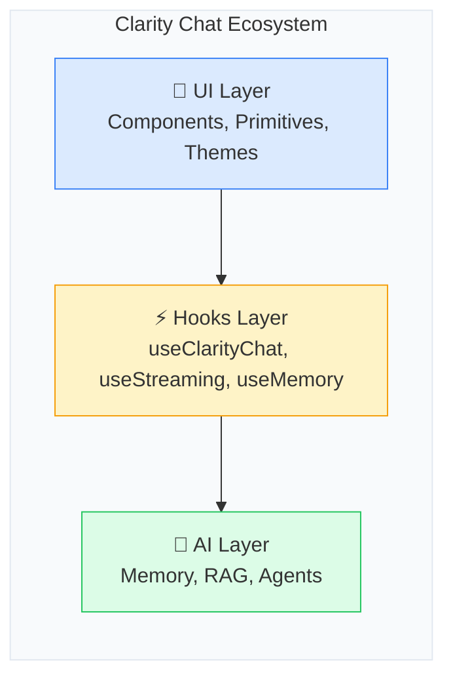

---

## Component Architecture

### Layer 1: UI Components

**Purpose:** Visual presentation and user interaction

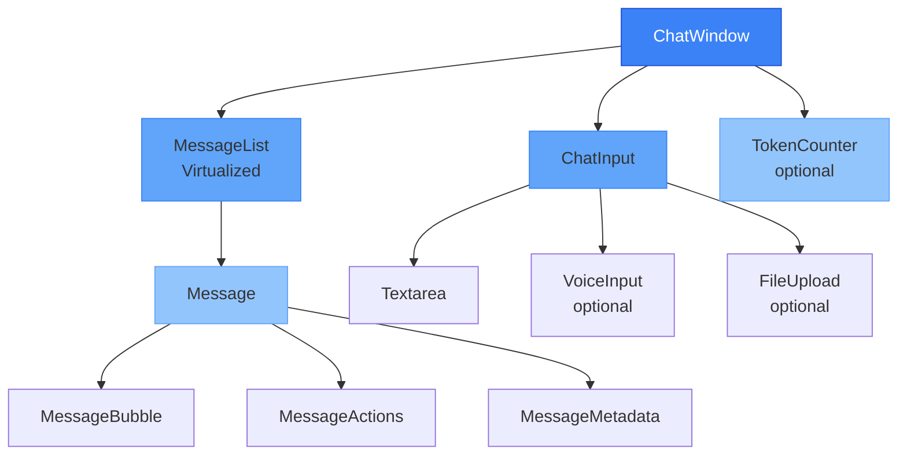

**Key Components:**
- `ChatWindow` - Main container orchestrating all chat UI
- `Message` - Individual message display with actions
- `ChatInput` - User input with voice and file support
- `MessageList` - Virtualized list for performance

---

### Layer 2: Hooks Layer

**Purpose:** State management and business logic

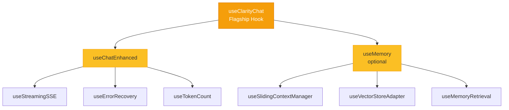

**Key Hooks:**
- `useClarityChat` - Main chat hook with memory integration
- `useStreamingSSE` - Server-Sent Events streaming support
- `useMemory` - Memory management with multiple strategies
- `useTokenCount` - Real-time token usage and cost tracking

---

### Layer 3: AI Infrastructure

**Purpose:** AI features and integrations

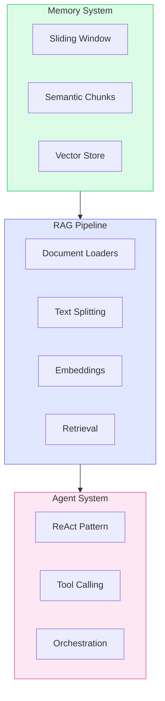

---

## Data Flow

### Message Flow

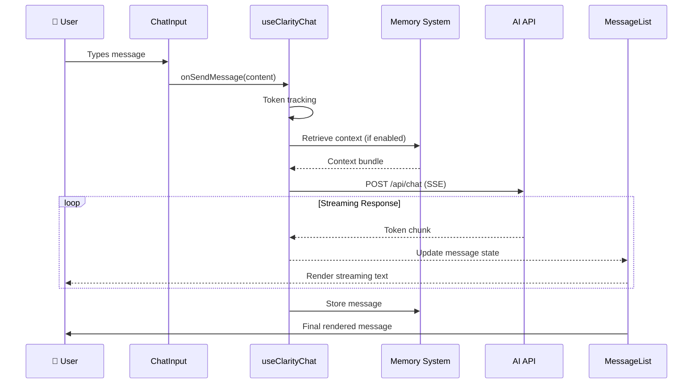

### Memory Flow

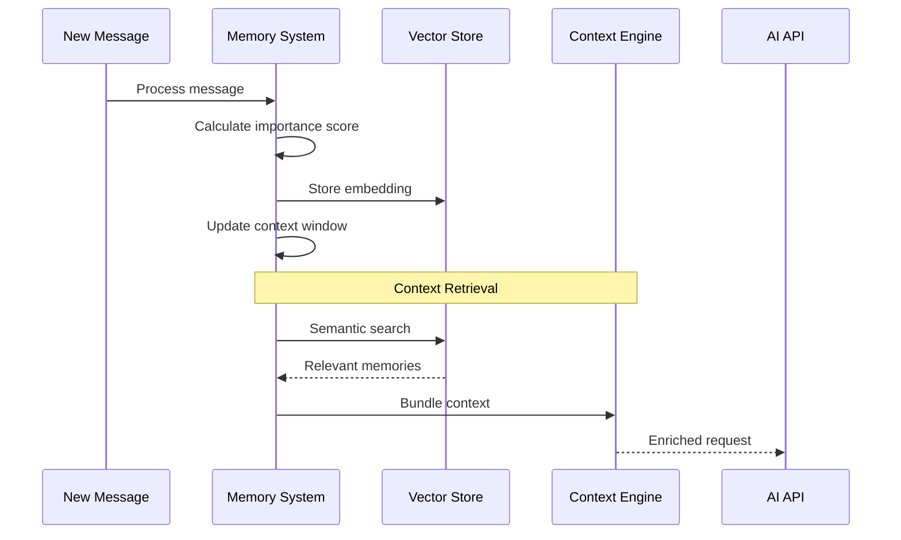

---

## Component Relationships

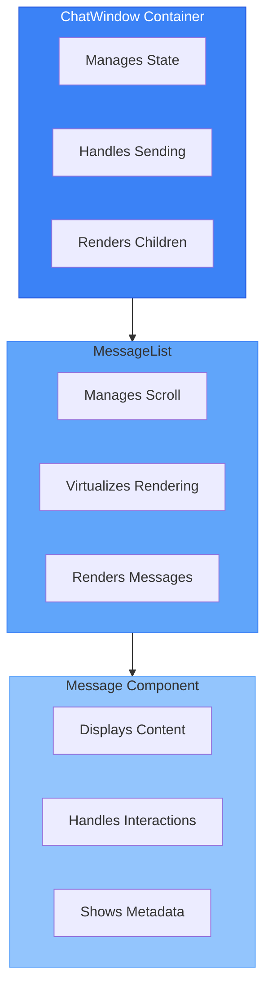

---

## Hook Composition

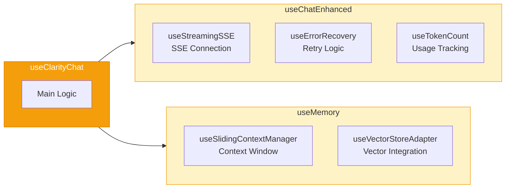

---

## Theme System

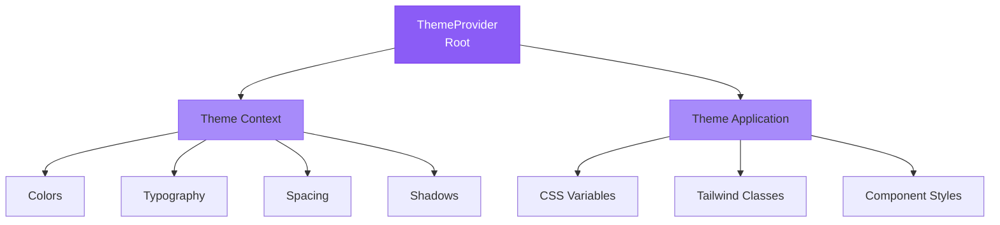

---

## State Management

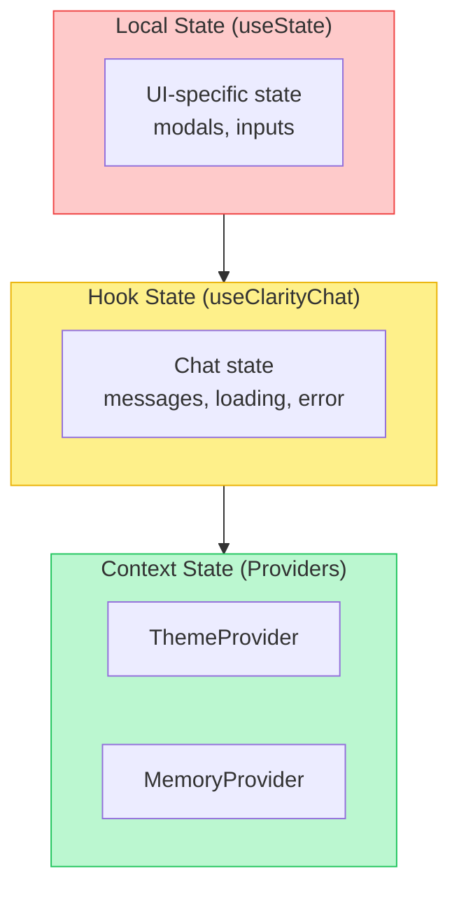

---

## Performance Optimizations

### Virtualization Strategy

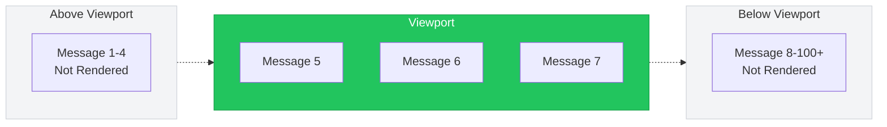

### Memory Optimization

| Strategy | Purpose | Impact |
|----------|---------|--------|
| Sliding Window | Limits context size | -50% token usage |
| Token Optimization | Compresses context | -30% additional |
| Semantic Caching | Reuses similar contexts | -40% API calls |

---

## Integration Points

### API Integration

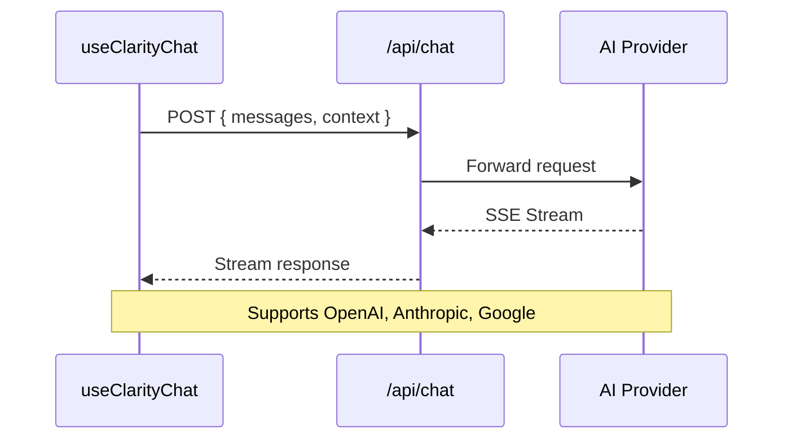

### Vector Store Integration

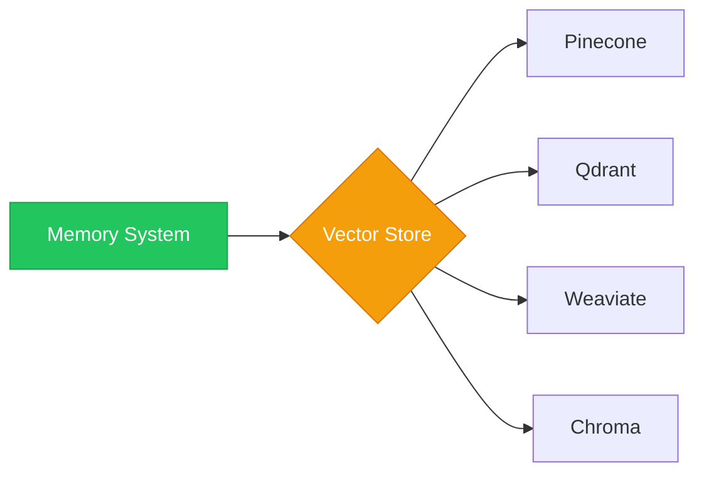

---

## File Structure

```
packages/
├── react/                    # Main library (@clarity-chat/react)
│   ├── src/
│   │   ├── components/       # 70+ UI components
│   │   ├── hooks/            # 35+ React hooks
│   │   ├── memory/           # Memory system
│   │   ├── theme/            # Theme system
│   │   └── utils/            # Utilities
│   └── styles.css            # Global styles
├── primitives/               # Base UI components (@clarity-chat/primitives)
├── memory/                   # Memory package (@clarity-chat/memory)
├── types/                    # TypeScript types (@clarity-chat/types)
└── cli/                      # CLI tool (@clarity-chat/cli)
```

---

## Key Design Decisions

| Decision | Rationale | Trade-off |
|----------|-----------|-----------|
| **Component Composition** | Flexibility and reusability | More components to learn |
| **Hook-Based Architecture** | Separation of concerns, testability | Requires React knowledge |
| **Virtual Scrolling** | Performance with 1000+ messages | Slightly more complex |
| **Pluggable Memory** | Flexibility for different use cases | Configuration needed |
| **CSS Variables + Tailwind** | Easy customization, performance | Bundle size consideration |

---

## Extension Points

### Custom Components

```tsx
// Extend ChatWindow with custom components
<ChatWindow
  renderMessage={(msg) => <CustomMessage message={msg} />}
  renderInput={() => <CustomInput />}
/>
```

### Custom Hooks

```tsx
// Compose with custom hooks
const { messages } = useClarityChat({ api: '/api/chat' })
const customData = useCustomHook(messages)
```

### Custom Themes

```tsx
// Create custom theme
const customTheme = {
  colors: { primary: '#your-color' },
  spacing: { sm: '0.5rem' },
}

<ThemeProvider theme={customTheme}>
  <ChatWindow />
</ThemeProvider>
```

---

## Next Steps

- [API Reference](./api-reference.md) - Complete API documentation
- [Getting Started](./getting-started.md) - Quick start guide
- [Memory Guide](./clarity-memory/GETTING_STARTED.md) - Memory system documentation
- [Best Practices](./best-practices.md) - Production patterns

---

**Last Updated:** December 2025
