# Component Architecture Diagrams

Visual representations of key components in the Clarity AI Chat Components library. These diagrams
document component structure, state flows, and interactions.

## Table of Contents

1. [CommandPalette Component Tree](#commandpalette-component-tree)
2. [AudioRecorder State Flow](#audiorecorder-state-flow)
3. [OKLCH Color Inheritance](#oklch-color-inheritance)
4. [Component Interaction Diagram](#component-interaction-diagram)

---

## CommandPalette Component Tree

The CommandPalette component is a modal dialog for executing commands with keyboard navigation,
search filtering, and AI context integration.

### Component Hierarchy

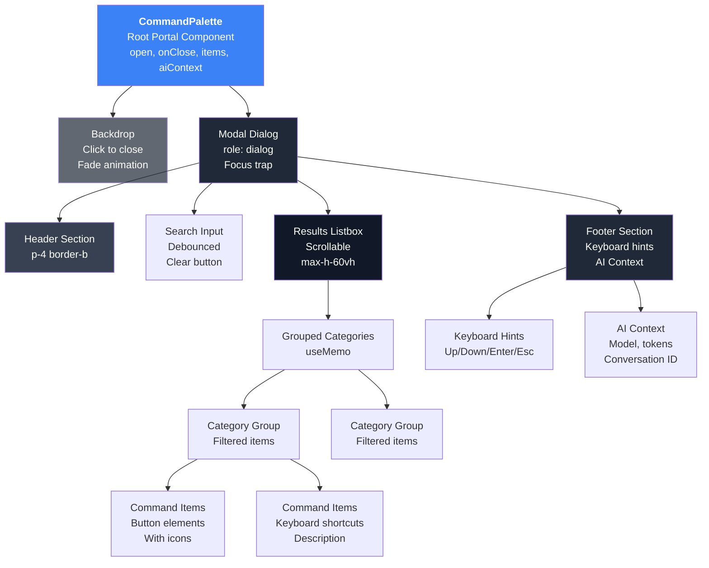

### Props Flow

```mermaid
graph LR
    subgraph Props["CommandPalette Props"]
        P1["items: CommandItem[]"]
        P2["open: boolean"]
        P3["onClose: () => void"]
        P4["placeholder?: string"]
        P5["loading?: boolean"]
        P6["aiContext?: AIContext"]
    end

    subgraph State["Internal State"]
        S1["search: string"]
        S2["selectedIndex: number"]
        S3["portalContainer: HTMLElement"]
    end

    subgraph Computed["Computed Values"]
        C1["debouncedSearch"]
        C2["filteredItems"]
        C3["groupedItems"]
        C4["flatItems"]
    end

    Props --> State
    State --> Computed
    Computed --> Render["Render Output"]

    style Props fill:#fbbf24,color:#000
    style State fill:#10b981,color:#fff
    style Computed fill:#8b5cf6,color:#fff
    style Render fill:#3b82f6,color:#fff
```

### Keyboard Navigation Flow

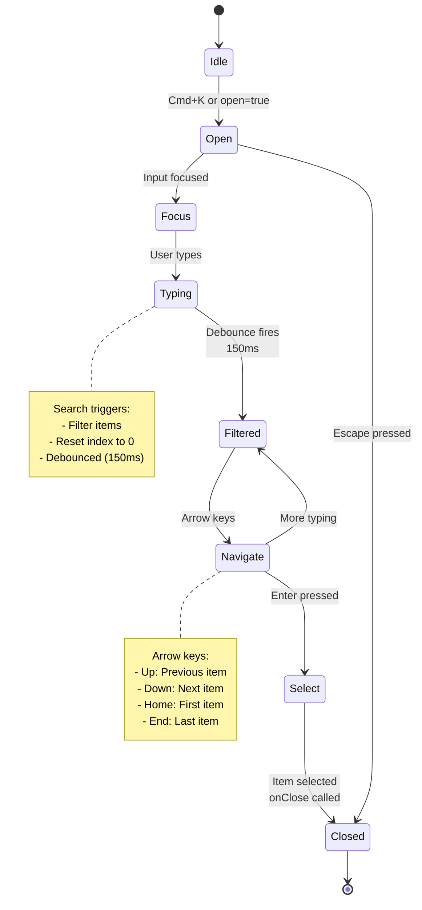

---

## AudioRecorder State Flow

The AudioRecorder component manages browser-based audio recording with waveform visualization and
advanced audio processing.

### Recording States

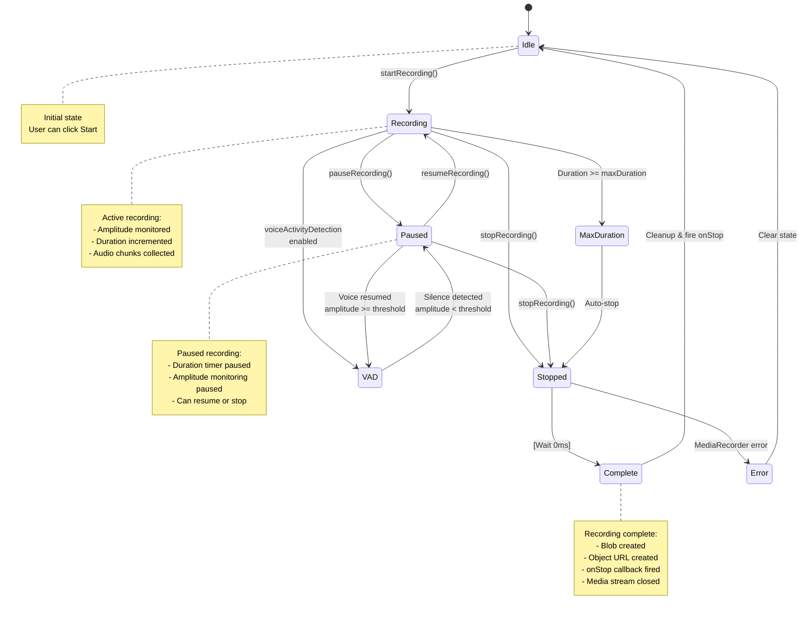

### Audio Processing Pipeline

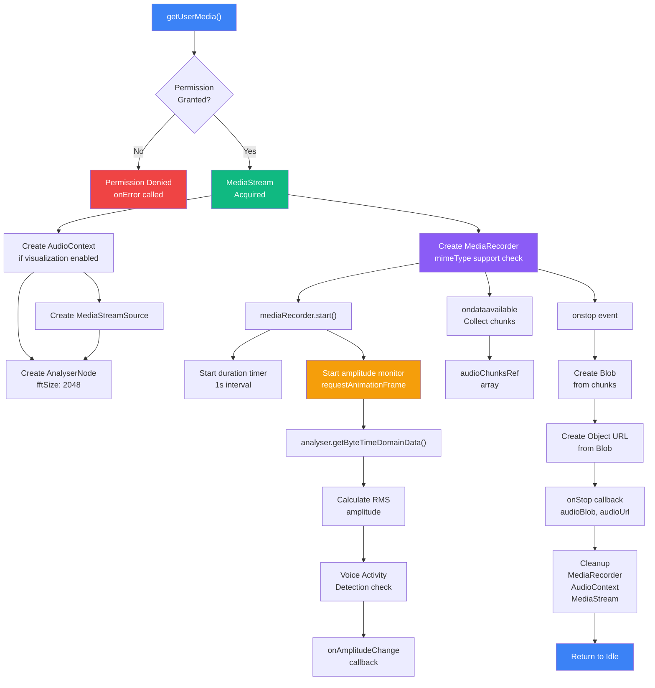

### Component Structure

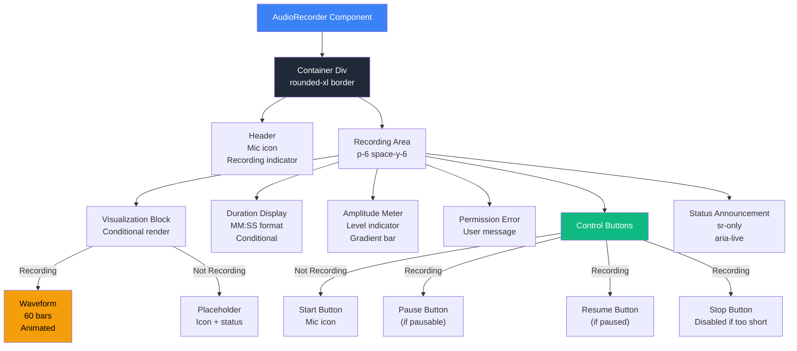

### Props Configuration

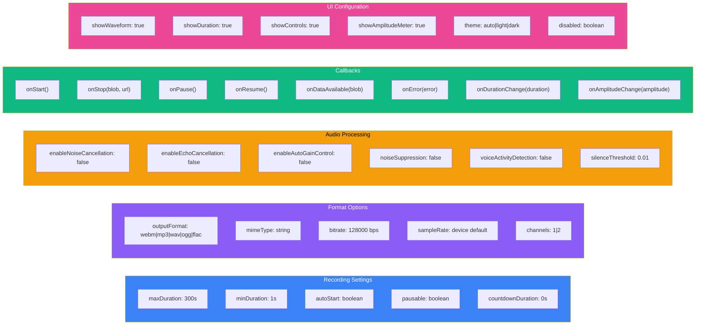

---

## OKLCH Color Inheritance

The OKLCH color utilities provide a type-safe system for color manipulation and accessibility
checking.

### Color Space Definition

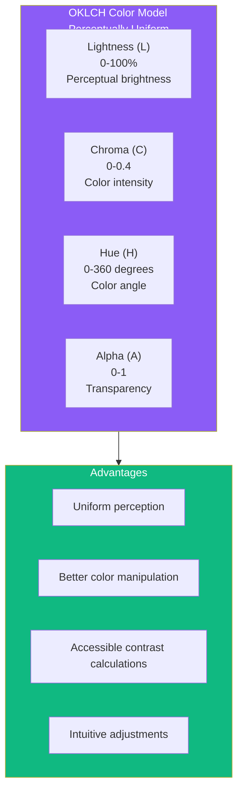

### Color Transformation Functions

```mermaid
graph TD
    BASE["OklchColor<br/>{ l, c, h, a }"]

    BASE --> PARSE["parseOklch(string)<br/>Parse CSS string"]
    PARSE --> PARSED["OklchColor object"]

    BASE --> TOSTRING["toOklchString(color)<br/>Convert to CSS"]
    TOSTRING --> CSS["oklch(L% C H / A)"]

    BASE --> LIGHTEN["lighten(color, amount)<br/>Increase lightness"]
    BASE --> DARKEN["darken(color, amount)<br/>Decrease lightness"]
    BASE --> SATURATE["saturate(color, amount)<br/>Increase chroma"]
    BASE --> DESATURATE["desaturate(color, amount)<br/>Decrease chroma"]
    BASE --> ROTATEHUE["rotateHue(color, degrees)<br/>Shift hue"]
    BASE --> SETALPHA["setAlpha(color, alpha)<br/>Set opacity"]
    BASE --> MIX["mix(color1, color2, ratio)<br/>Blend colors"]

    LIGHTEN --> LIGHTER["Output: { l: 0-100, ... }"]
    DARKEN --> DARKER["Output: { l: 0-100, ... }"]
    SATURATE --> SATURATED["Output: { c: 0-0.4, ... }"]
    DESATURATE --> DESATURATED["Output: { c: 0-0.4, ... }"]
    ROTATEHUE --> ROTATED["Output: { h: 0-360, ... }"]
    SETALPHA --> OPACITY["Output: { a: 0-1, ... }"]
    MIX --> BLENDED["Output: Interpolated color"]

    style BASE fill:#3b82f6,color:#fff
    style PARSE fill:#10b981,color:#fff
    style TOSTRING fill:#10b981,color:#fff
    style LIGHTEN fill:#f59e0b,color:#000
    style DARKEN fill:#f59e0b,color:#000
    style SATURATE fill:#f59e0b,color:#000
    style DESATURATE fill:#f59e0b,color:#000
    style ROTATEHUE fill:#f59e0b,color:#000
    style SETALPHA fill:#f59e0b,color:#000
    style MIX fill:#f59e0b,color:#000
```

### Accessibility Contrast System

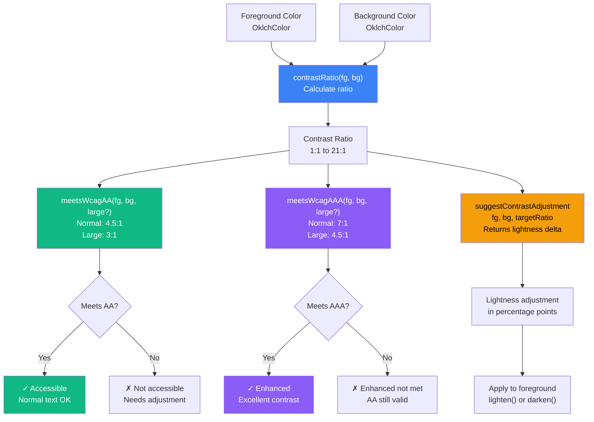

### Color Utility API

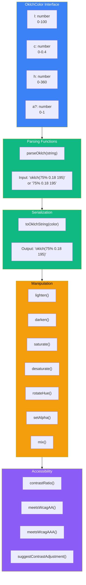

---

## Component Interaction Diagram

Full system view showing how components interact within the Clarity AI Chat ecosystem.

### High-Level Component Interactions

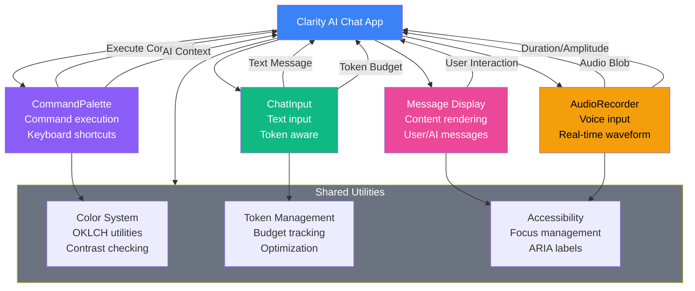

### State Management Flow

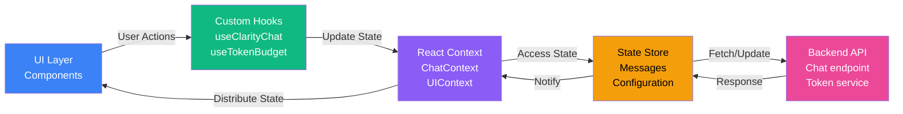

### Data Flow: Voice Input to Message

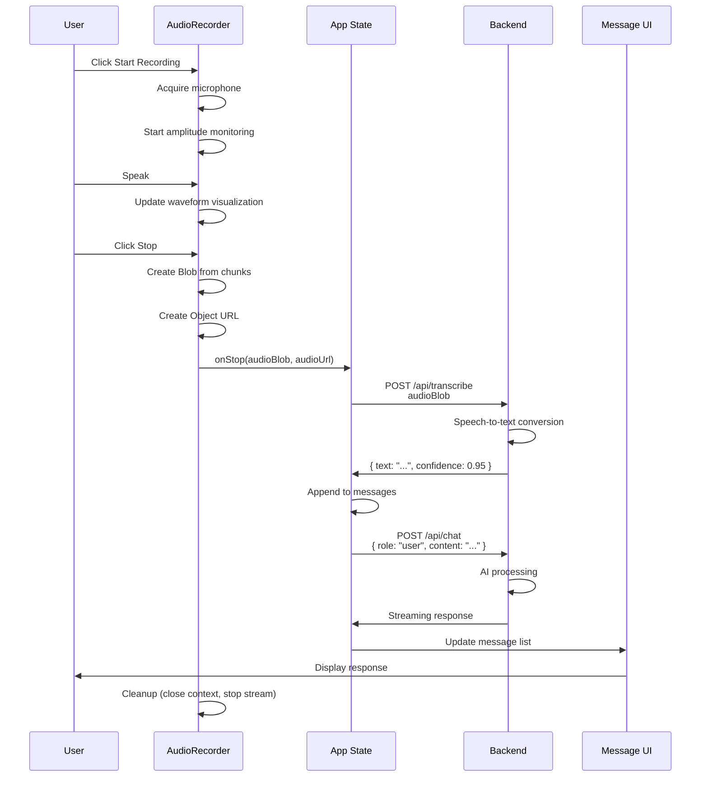

### CommandPalette Integration

```mermaid
sequenceDiagram
    participant User
    participant CP as CommandPalette
    participant App as Application State
    participant Service as Service Handler

    User->>CP: Press Cmd+K
    CP->>CP: open=true, focus input

    User->>CP: Type command name
    CP->>CP: Filter items (debounced 150ms)
    CP->>CP: Update groupedItems

    User->>CP: Press arrow keys
    CP->>CP: Update selectedIndex
    CP->>CP: Scroll item into view

    User->>CP: Press Enter
    CP->>CP: Get selected item
    CP->>CP: Call item.onSelect()

    note over Service
        onSelect is custom handler<br/>from parent component
    end note

    Service->>App: Execute command
    App->>App: Update state

    CP->>CP: Call onClose()
    CP->>CP: open=false, restore focus

    App->>User: Reflect changes in UI
```

### Component Dependencies

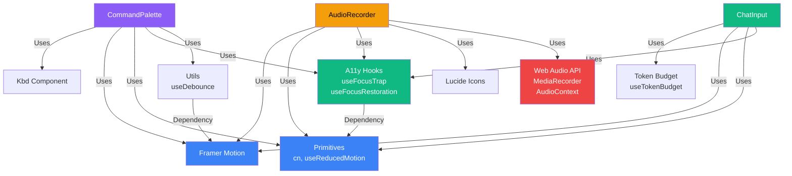

---

## Rendering Strategy

### Performance Optimization Patterns

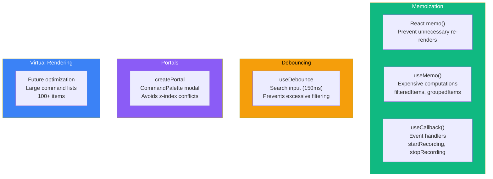

---

## Testing Architecture

### Component Test Coverage

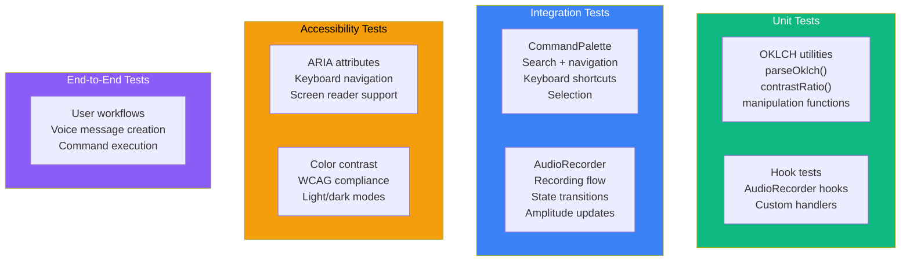

---

## Key Features Summary

### CommandPalette Key Features

- Keyboard navigation (arrow keys, home/end)
- Real-time search filtering with debouncing
- Category grouping for organization
- AI context display (model, tokens, conversation ID)
- Keyboard shortcuts display
- Focus trap and restore on open/close
- Portal rendering for z-index isolation
- Reduced motion support
- Accessibility first (ARIA, keyboard, screen readers)

### AudioRecorder Key Features

- Multiple output formats (WebM, MP3, WAV, OGG, FLAC)
- Real-time waveform visualization
- Input level metering
- Voice activity detection for pause/resume
- Duration timer with minimum/maximum limits
- Configurable audio processing (noise cancellation, echo cancellation, auto-gain)
- Permission handling and error states
- Mobile-responsive UI
- Full accessibility support

### OKLCH Color System Key Features

- Type-safe color manipulation
- Perceptually uniform color space
- Contrast ratio calculation
- WCAG AA/AAA compliance checking
- Lightness, chroma, and hue adjustments
- Color mixing and interpolation
- Accessibility-first design
- CSS output formatting

---

## Related Documentation

- [Architecture](../architecture.md)
- [Component Guidelines](../../packages/react/CLAUDE.md)
- [Best Practices](../best-practices.md)
- [API Reference](../api-reference.md)
