# Contributing to Clarity Chat - Enhanced

Thank you for your interest in contributing to Clarity Chat! This guide will help you get started.

---

## 📋 Table of Contents

- [Code of Conduct](#code-of-conduct)
- [Getting Started](#getting-started)
- [Development Workflow](#development-workflow)
- [Coding Standards](#coding-standards)
- [Testing Guidelines](#testing-guidelines)
- [Commit Convention](#commit-convention)
- [Pull Request Process](#pull-request-process)
- [Component Guidelines](#component-guidelines)
- [Documentation](#documentation)

---

## 🗺️ Contribution Journey Overview

```mermaid
graph TB
    START[Want to Contribute] --> FORK{First Time?}
    
    FORK -->|Yes| SETUP[Fork & Setup]
    FORK -->|No| SYNC[Sync with Upstream]
    
    SETUP --> BRANCH[Create Branch]
    SYNC --> BRANCH
    
    BRANCH --> CODE{What to Work On?}
    
    CODE -->|Bug Fix| FIX[Write Fix]
    CODE -->|New Feature| FEAT[Implement Feature]
    CODE -->|Documentation| DOCS[Update Docs]
    CODE -->|Tests| TEST[Add Tests]
    
    FIX --> LOCAL[Run Local Checks]
    FEAT --> LOCAL
    DOCS --> LOCAL
    TEST --> LOCAL
    
    LOCAL --> COMMIT[Commit Changes]
    COMMIT --> PUSH[Push to Fork]
    PUSH --> PR[Create Pull Request]
    
    PR --> REVIEW[Code Review]
    REVIEW --> CHANGES{Changes Requested?}
    
    CHANGES -->|Yes| ITERATE[Make Changes]
    ITERATE --> COMMIT
    
    CHANGES -->|No| MERGE[Merge to Main]
    MERGE --> CELEBRATE[🎉 Celebrate!]
    
    style START fill:#4A90E2,color:#fff
    style MERGE fill:#7ED321,color:#fff
    style CELEBRATE fill:#50E3C2,color:#fff
```



---

## 🤝 Code of Conduct

We are committed to providing a welcoming and inspiring community for all. Please:

- **Be respectful** and inclusive
- **Be patient** and helpful
- **Assume good intentions**
- **Give constructive feedback**
- **Focus on what's best** for the community

---

## 🚀 Getting Started

### Complete Setup Process


### 1. Fork and Clone

```bash
# Fork the repository on GitHub
# Then clone your fork
git clone https://github.com/YOUR_USERNAME/Clarity-ai-chat-components.git
cd Clarity-ai-chat-components

# Add upstream remote
git remote add upstream https://github.com/christireid/Clarity-ai-chat-components.git
```

### 2. Install Dependencies

```bash
npm install
```

### 3. Create a Branch

```bash
git checkout -b feature/your-feature-name
# or
git checkout -b fix/bug-description
```

### 4. Start Development

```bash
# Start Storybook for component development
npm run storybook

# Run tests in watch mode
npm run test:watch

# Type check
npm run typecheck
```

---

## 🔄 Development Workflow

### Daily Workflow Diagram


### Daily Workflow

1. **Sync with upstream**
   ```bash
   git fetch upstream
   git rebase upstream/main
   ```

2. **Make your changes**
   - Write code
   - Add tests
   - Update documentation

3. **Run checks locally**
   ```bash
   npm run lint
   npm run typecheck
   npm run test
   npm run format
   ```

4. **Commit your changes**
   ```bash
   git add .
   git commit -m "feat: add new feature"
   ```

5. **Push and create PR**
   ```bash
   git push origin feature/your-feature-name
   ```

### Project Structure

```
packages/
├── react/              # Main library
│   ├── src/
│   │   ├── components/    # React components
│   │   ├── hooks/         # Custom hooks
│   │   ├── utils/         # Utility functions
│   │   └── __tests__/     # Test files
│   └── package.json
│
├── types/              # TypeScript types
├── primitives/         # Base components
└── error-handling/     # Error system
```

---

## 📝 Coding Standards

### Code Quality Pipeline


### TypeScript

- ✅ Use **strict mode**
- ✅ Explicit return types for functions
- ✅ No `any` types (use `unknown` if needed)
- ✅ Prefer interfaces over type aliases for objects
- ✅ Use const assertions where appropriate

```typescript
// ✅ Good
interface ButtonProps {
  label: string
  onClick: () => void
  disabled?: boolean
}

function Button({ label, onClick, disabled = false }: ButtonProps): JSX.Element {
  return <button onClick={onClick} disabled={disabled}>{label}</button>
}

// ❌ Bad
function Button(props: any) {
  return <button>{props.label}</button>
}
```

### React

- ✅ Use functional components and hooks
- ✅ Memoize expensive computations with `useMemo`
- ✅ Memoize callbacks with `useCallback`
- ✅ Use `React.memo` for frequently re-rendered components
- ✅ Extract complex logic into custom hooks

```typescript
// ✅ Good
export const Message = memo(function Message({ content, role }: MessageProps) {
  const formattedContent = useMemo(() => formatMarkdown(content), [content])
  const handleCopy = useCallback(() => navigator.clipboard.writeText(content), [content])
  
  return (
    <div className="message">
      <div>{formattedContent}</div>
      <button onClick={handleCopy}>Copy</button>
    </div>
  )
})

// ❌ Bad
export function Message(props: any) {
  const formattedContent = formatMarkdown(props.content) // Runs on every render
  
  return <div>{formattedContent}</div>
}
```

### Naming Conventions


- **Components**: PascalCase (`ChatWindow`, `MessageList`)
- **Hooks**: camelCase with `use` prefix (`useChat`, `useStreaming`)
- **Utilities**: camelCase (`formatDate`, `calculateTokens`)
- **Constants**: UPPER_SNAKE_CASE (`DEFAULT_THEME`, `MAX_RETRIES`)
- **Types/Interfaces**: PascalCase (`Message`, `ThemeConfig`)

### File Structure

```
component-name/
├── component-name.tsx          # Component implementation
├── component-name.test.tsx     # Tests
├── component-name.stories.tsx  # Storybook stories
├── component-name.types.ts     # TypeScript types
└── index.ts                    # Public exports
```

---

## 🧪 Testing Guidelines

### Testing Strategy


### Writing Tests

**Unit Test Example:**
```typescript
import { render, screen } from '@testing-library/react'
import { Message } from './message'

describe('Message', () => {
  it('renders user message', () => {
    render(<Message role="user" content="Hello" />)
    expect(screen.getByText('Hello')).toBeInTheDocument()
  })
  
  it('renders with correct role class', () => {
    const { container } = render(<Message role="user" content="Test" />)
    expect(container.firstChild).toHaveClass('message-user')
  })
})
```

**Integration Test Example:**
```typescript
import { render, screen, userEvent } from '@testing-library/react'
import { ChatWindow } from './chat-window'

describe('ChatWindow Integration', () => {
  it('sends message and displays response', async () => {
    const onSend = vi.fn()
    render(<ChatWindow messages={[]} onSendMessage={onSend} />)
    
    const input = screen.getByPlaceholderText('Type a message...')
    await userEvent.type(input, 'Hello')
    await userEvent.click(screen.getByRole('button', { name: /send/i }))
    
    expect(onSend).toHaveBeenCalledWith('Hello')
  })
})
```

---

## 📦 Commit Convention

### Commit Message Format

```
<type>(<scope>): <subject>

<body>

<footer>
```

### Commit Flow


### Types

- **feat**: New feature
- **fix**: Bug fix
- **docs**: Documentation changes
- **style**: Code style changes (formatting)
- **refactor**: Code refactoring
- **perf**: Performance improvements
- **test**: Adding or updating tests
- **chore**: Maintenance tasks
- **ci**: CI/CD changes

### Examples

```bash
# Feature
feat(chat): add voice input support

# Bug fix
fix(message): correct timestamp formatting

# Documentation
docs(api): update useChat hook examples

# Refactoring
refactor(theme): simplify color system

# Performance
perf(list): implement virtual scrolling
```

---

## 🔍 Pull Request Process

### PR Lifecycle

```mermaid
sequenceDiagram
    participant You
    participant Fork
    participant GitHub
    participant CI
    participant Reviewer
    participant Main
    
    You->>Fork: Push changes
    Fork->>GitHub: Create PR
    GitHub->>CI: Trigger CI pipeline
    
    CI->>CI: Run tests
    CI->>CI: Run linters
    CI->>CI: Build check
    
    alt CI Passes
        CI-->>GitHub: ✅ All checks passed
        GitHub->>Reviewer: Request review
        
        Reviewer->>Reviewer: Code review
        
        alt Changes Requested
            Reviewer-->>You: Request changes
            You->>Fork: Push updates
            Fork->>CI: Re-run CI
        else Approved
            Reviewer-->>GitHub: Approve PR
            GitHub->>Main: Merge PR
            Main-->>You: 🎉 Merged!
        end
    else CI Fails
        CI-->>You: ❌ Checks failed
        You->>Fork: Fix issues
        Fork->>CI: Re-run CI
    end
```



### PR Checklist

Before submitting:

- [ ] Code follows style guidelines
- [ ] Self-review completed
- [ ] Comments added for complex logic
- [ ] Documentation updated
- [ ] Tests added/updated
- [ ] All tests passing
- [ ] No console errors/warnings
- [ ] Storybook stories added/updated
- [ ] Screenshots added (if UI change)
- [ ] Breaking changes documented

### PR Template

```markdown
## Description
Brief description of changes

## Type of Change
- [ ] Bug fix
- [ ] New feature
- [ ] Breaking change
- [ ] Documentation update

## How Has This Been Tested?
- [ ] Unit tests
- [ ] Integration tests
- [ ] Manual testing

## Screenshots (if applicable)
Add screenshots here

## Checklist
- [ ] Code follows style guidelines
- [ ] Tests added/updated
- [ ] Documentation updated
- [ ] Storybook stories added
```

---

## 🎨 Component Guidelines

### Component Development Flow


### Component Structure

```typescript
// 1. Imports
import { memo, useCallback, useMemo } from 'react'
import { ComponentProps } from './types'
import { useTheme } from '../hooks/use-theme'

// 2. Types
interface MessageProps {
  content: string
  role: 'user' | 'assistant'
  timestamp: Date
  onCopy?: () => void
}

// 3. Component
export const Message = memo(function Message({
  content,
  role,
  timestamp,
  onCopy,
}: MessageProps) {
  // 4. Hooks
  const { theme } = useTheme()
  
  // 5. Memoized values
  const formattedTime = useMemo(
    () => formatTimestamp(timestamp),
    [timestamp]
  )
  
  // 6. Callbacks
  const handleCopy = useCallback(() => {
    navigator.clipboard.writeText(content)
    onCopy?.()
  }, [content, onCopy])
  
  // 7. Render
  return (
    <div className={`message message-${role}`}>
      <div className="message-content">{content}</div>
      <div className="message-meta">
        <span>{formattedTime}</span>
        <button onClick={handleCopy}>Copy</button>
      </div>
    </div>
  )
})

// 8. Display name for debugging
Message.displayName = 'Message'
```

### Component Best Practices

1. **Use TypeScript interfaces** for props
2. **Memoize components** that render frequently
3. **Extract logic** into custom hooks
4. **Use semantic HTML** for accessibility
5. **Add prop-types** or TypeScript for validation
6. **Keep components focused** (single responsibility)
7. **Write comprehensive tests**
8. **Create Storybook stories**

---

## 📚 Documentation Guidelines

### Documentation Types


### Writing Documentation

**Good Documentation:**
- Clear and concise
- Includes code examples
- Shows common use cases
- Explains the "why" not just "how"
- Has visual diagrams (when helpful)
- Is up-to-date

**Documentation Checklist:**
- [ ] Component description
- [ ] Props table
- [ ] Usage examples
- [ ] Type definitions
- [ ] Common patterns
- [ ] Troubleshooting tips
- [ ] Related components
- [ ] Storybook story

---

## 🚀 Release Process

### Release Pipeline


---

## 🤝 Getting Help

### Support Channels


- 💬 **Discord**: For questions and discussions
- 🐛 **GitHub Issues**: For bug reports
- 💡 **GitHub Discussions**: For feature requests
- 📧 **Email**: For security issues

---

## 🎉 Recognition

Contributors will be:
- Added to `CONTRIBUTORS.md`
- Mentioned in release notes
- Featured on project website
- Given contributor badge

---

## 📖 Additional Resources

- [Quick Start Guide](../getting-started/quick-start.md)
- [Architecture Overview](./overview.md)
- [API Reference](../api/components.md)
- [Examples Gallery](../examples/README.md)

---

**Thank you for contributing to Clarity Chat! 🙏**

Every contribution, no matter how small, makes this project better for everyone.

---

**Built with ❤️ by [Code & Clarity](https://codeclarity.ai)**
