# System Architecture Overview - Enhanced

This document provides a comprehensive overview of Clarity Chat's architecture, design decisions, and technical implementation.

---

## 📐 Complete System Architecture

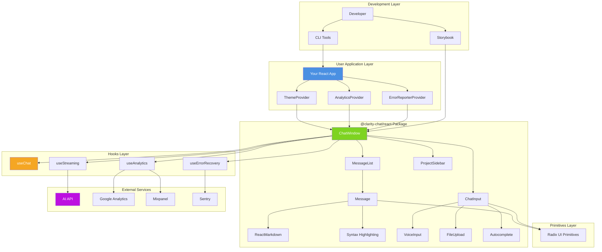

---

## 📦 **Monorepo Structure**

### Package Organization

```
Clarity-ai-chat-components/
├── packages/
│   ├── react/              # 🎯 Main library (32,650 LOC)
│   │   ├── src/
│   │   │   ├── components/     # 47 React components
│   │   │   ├── hooks/          # 25+ custom hooks
│   │   │   ├── analytics/      # Analytics system
│   │   │   ├── ai/             # AI features (suggestions, moderation)
│   │   │   ├── error/          # Error tracking integration
│   │   │   ├── accessibility/  # WCAG 2.1 AAA features
│   │   │   ├── theme/          # 11 built-in themes
│   │   │   ├── animations/     # Framer Motion animations
│   │   │   ├── templates/      # Pre-built templates
│   │   │   ├── utils/          # Utility functions
│   │   │   └── index.ts        # Public API exports
│   │   ├── __tests__/          # Test suite
│   │   └── package.json
│   │
│   ├── types/              # 📝 TypeScript definitions
│   │   └── src/
│   │       ├── message.ts      # Message types
│   │       ├── chat.ts         # Chat types
│   │       ├── context.ts      # Context types
│   │       └── index.ts
│   │
│   ├── primitives/         # 🧱 Base UI components
│   │   └── src/components/
│   │       ├── button.tsx
│   │       ├── input.tsx
│   │       ├── avatar.tsx
│   │       └── ... (10+ primitives)
│   │
│   ├── error-handling/     # 🛡️ Error recovery system
│   │   ├── src/
│   │   │   ├── errors/         # 10 specialized error classes
│   │   │   ├── components/     # ErrorBoundary, fallback UIs
│   │   │   ├── hooks/          # Error handling hooks
│   │   │   └── factories/      # Error factory functions
│   │   └── docs/
│   │
│   ├── dev-tools/          # 🛠️ Developer utilities
│   └── cli/                # 💻 CLI tools
│
├── apps/
│   ├── storybook/          # 📚 Interactive documentation
│   │   └── stories/            # Component stories
│   └── docs/               # 📖 VitePress documentation site
│
├── examples/               # 💡 Working examples (9 apps)
│   ├── basic-chat/
│   ├── ai-assistant/
│   ├── customer-support/
│   ├── streaming-chat/
│   └── ... (5 more)
│
└── docs/                   # 📄 Markdown documentation
    ├── getting-started/
    ├── guides/
    ├── api/
    └── architecture/
```

### Package Dependency Graph

```mermaid
graph TB
    subgraph "Core Packages"
        REACT[@clarity-chat/react<br/>Main Library]
        TYPES[@clarity-chat/types<br/>TypeScript Definitions]
        PRIMS[@clarity-chat/primitives<br/>Base Components]
        ERROR[@clarity-chat/error-handling<br/>Error System]
    end
    
    subgraph "Tool Packages"
        DEV[@clarity-chat/dev-tools<br/>Development Utilities]
        CLI[@clarity-chat/cli<br/>Command Line Tools]
    end
    
    subgraph "Applications"
        STORY[apps/storybook]
        DOCS[apps/docs]
    end
    
    subgraph "Examples"
        EX1[examples/basic-chat]
        EX2[examples/ai-assistant]
        EX3[examples/customer-support]
        EXN[examples/... 6 more]
    end
    
    REACT --> TYPES
    REACT --> PRIMS
    REACT --> ERROR
    PRIMS --> TYPES
    ERROR --> TYPES
    
    STORY --> REACT
    DOCS --> REACT
    DEV --> REACT
    CLI --> REACT
    
    EX1 --> REACT
    EX2 --> REACT
    EX3 --> REACT
    EXN --> REACT
    
    style REACT fill:#4A90E2,color:#fff
    style TYPES fill:#50E3C2,color:#fff
    style STORY fill:#F5A623,color:#fff
    style EX2 fill:#ec4899,color:#fff
```

---

## 🎨 **Component Hierarchy**

### **Complete Component Tree**

```mermaid
graph TD
    ROOT[ThemeProvider] --> WINDOW[ChatWindow]
    
    WINDOW --> HEADER[Header]
    WINDOW --> SIDEBAR[ProjectSidebar]
    WINDOW --> MAIN[Main Content Area]
    WINDOW --> FOOTER[Footer]
    
    SIDEBAR --> PROJLIST[Project List]
    SIDEBAR --> CONVLIST[Conversation List]
    
    MAIN --> MSGLIST[MessageList]
    MAIN --> CONTEXT[ContextManager]
    
    MSGLIST --> VIRTUALIZED[VirtualizedList]
    VIRTUALIZED --> MSG[Message]
    
    MSG --> AVATAR[Avatar]
    MSG --> CONTENT[Message Content]
    MSG --> ACTIONS[Message Actions]
    
    CONTENT --> MARKDOWN[ReactMarkdown]
    CONTENT --> CODE[Code Block]
    CONTENT --> THINKING[ThinkingIndicator]
    
    ACTIONS --> COPY[CopyButton]
    ACTIONS --> EDIT[Edit Button]
    ACTIONS --> RETRY[RetryButton]
    
    FOOTER --> INPUT[AdvancedChatInput]
    FOOTER --> VOICE[VoiceInput]
    FOOTER --> FILE[FileUpload]
    
    INPUT --> AUTOCOMPLETE[Autocomplete]
    INPUT --> MENTIONS[@mentions]
    INPUT --> COMMANDS[/commands]

    style WINDOW fill:#4A90E2,color:#fff
    style MSGLIST fill:#7ED321,color:#fff
    style INPUT fill:#F5A623,color:#fff
```

### Component Size & Complexity Matrix

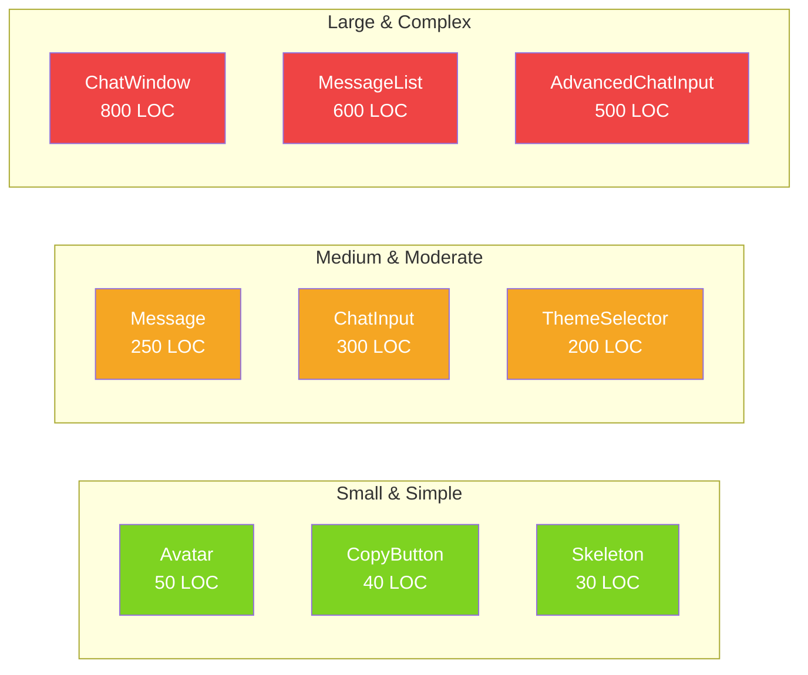

---

## 🔄 **Data Flow Architecture**

### **Message Lifecycle**

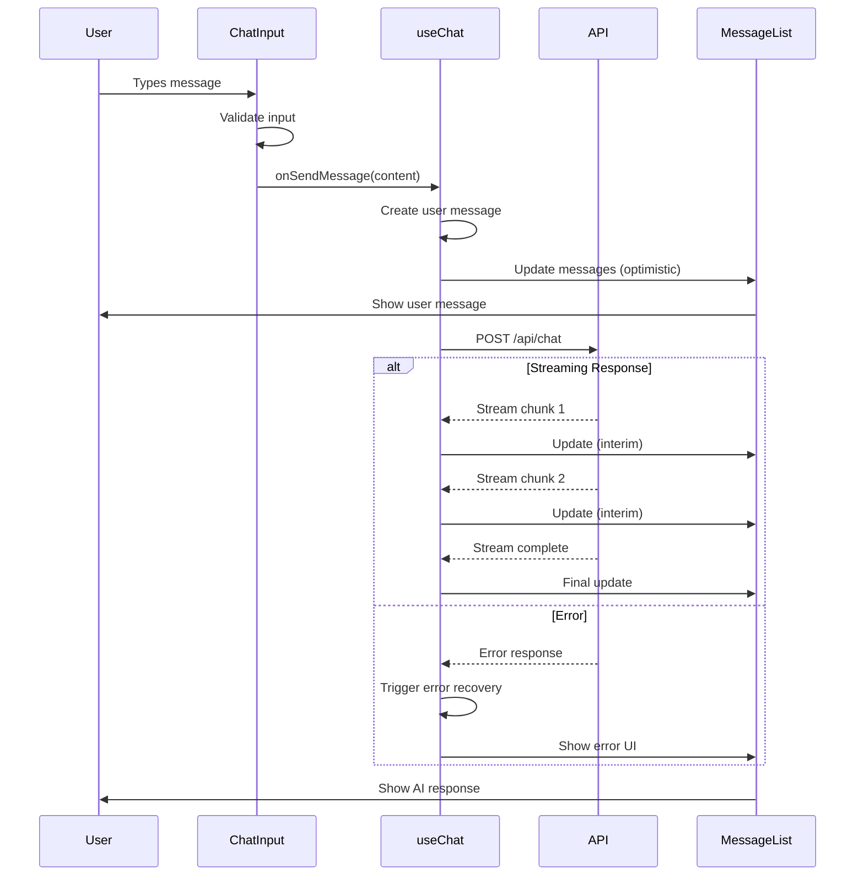

### **State Management Flow**

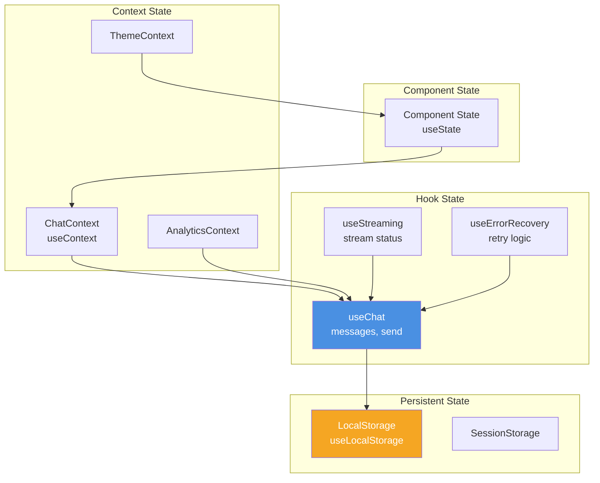

### State Update Propagation

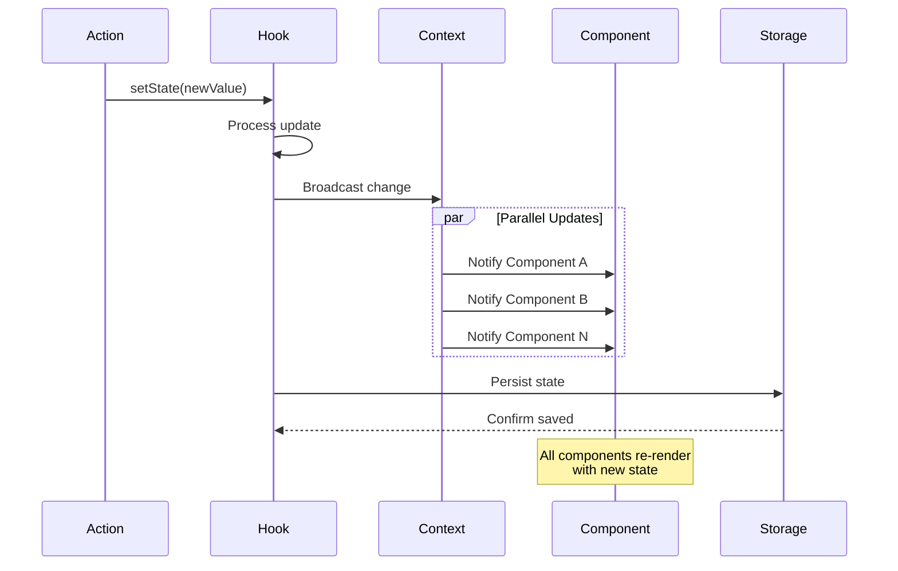

---

## 🧩 **Core Subsystems**

### **1. Theming System**

**Architecture:**
- CSS-in-JS with Tailwind CSS utilities
- Theme context provider for global access
- 11 pre-built themes with customization
- Live theme editor component
- CSS variables for runtime theme switching

#### Theme System Architecture

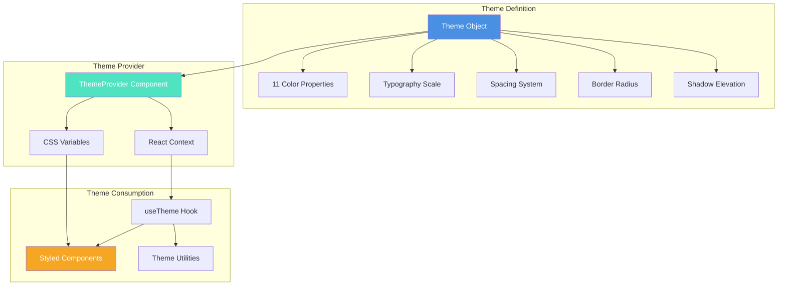

**Key Files:**
```
src/theme/
├── index.ts              # Theme exports
├── themes/
│   ├── default.ts
│   ├── dark.ts
│   ├── ocean.ts
│   └── ... (8 more)
├── theme-provider.tsx    # Context provider
├── theme-editor.tsx      # Live editor UI
└── types.ts              # Theme TypeScript types
```

**Theme Structure:**
```typescript
interface Theme {
  name: string
  colors: {
    primary: string
    secondary: string
    background: string
    surface: string
    text: string
    accent: string
  }
  typography: {
    fontFamily: string
    fontSize: { sm, base, lg, xl }
    fontWeight: { normal, medium, bold }
  }
  spacing: { ... }
  borderRadius: { ... }
  shadows: { ... }
}
```

---

### **2. Analytics System**

**Architecture:**
- Provider pattern with 7 supported platforms
- Event queue with batching
- Auto-tracking for common events
- Custom event support
- A/B testing utilities

#### Analytics Event Pipeline

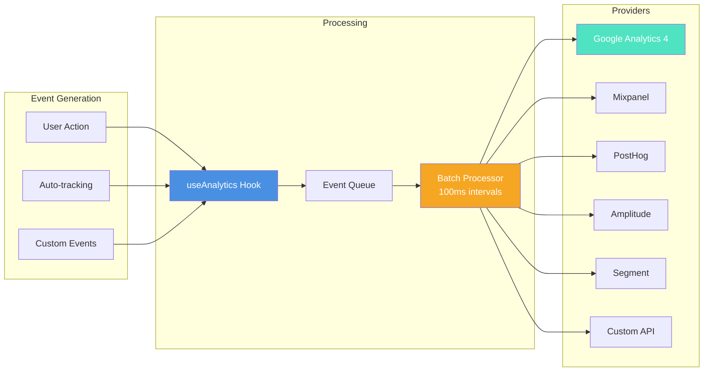

**Supported Providers:**
1. Google Analytics 4 (GA4)
2. Mixpanel
3. PostHog
4. Amplitude
5. Segment
6. Custom API
7. Console (development)

**Key Files:**
```
src/analytics/
├── index.ts
├── providers/
│   ├── google-analytics.ts
│   ├── mixpanel.ts
│   └── ... (5 more)
├── hooks/
│   ├── use-analytics.ts
│   ├── use-track-event.ts
│   └── use-page-view.ts
└── events.ts             # Predefined events (35+)
```

---

### **3. Error Handling System**

**Architecture:**
- 10 specialized error classes
- Automatic retry with exponential backoff
- Error boundaries at component level
- User feedback collection
- Integration with Sentry, Rollbar, Bugsnag

#### Error Class Hierarchy

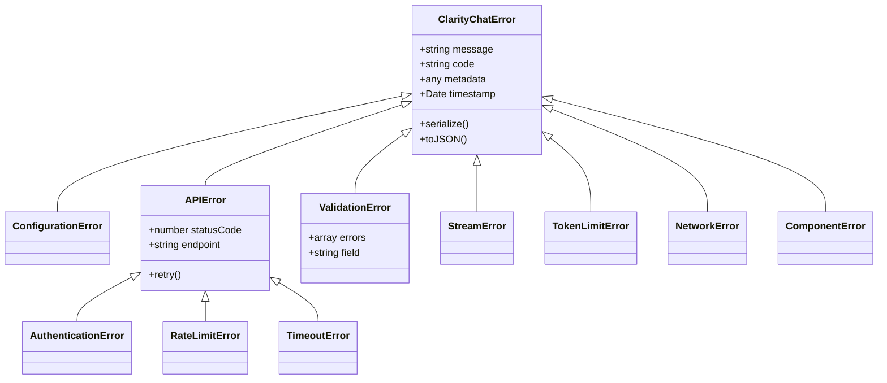

**Recovery Flow:**
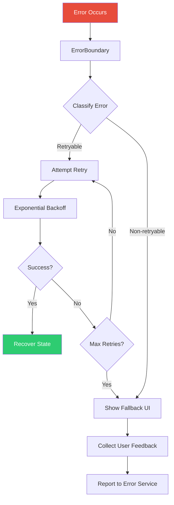

---

### **4. Streaming System**

**Architecture:**
- Support for SSE and WebSocket
- Automatic reconnection
- Backpressure handling
- Cancellation support

**Streaming Flow:**
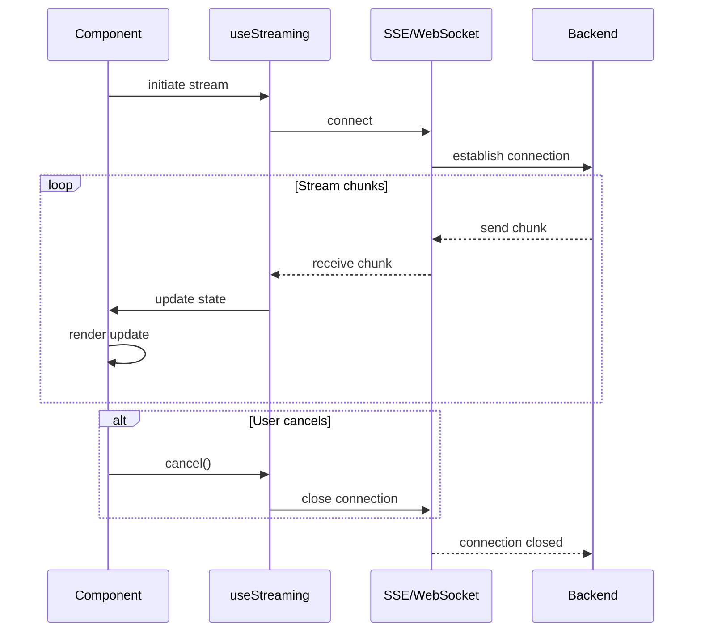

**Supported Protocols:**
- Server-Sent Events (SSE) - `useStreamingSSE`
- WebSocket - `useStreamingWebSocket`
- Fetch API with ReadableStream

---

### **5. Accessibility System**

**WCAG 2.1 AAA Compliance Features:**

#### Accessibility Architecture

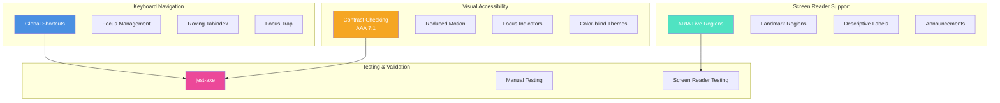

1. **Keyboard Navigation**
   - Global keyboard shortcuts (Shift+?)
   - Focus trap in modals
   - Roving tabindex for lists
   - Focus restoration

2. **Screen Reader Support**
   - ARIA live regions for updates
   - Descriptive labels
   - Landmark regions
   - Announcement system

3. **Visual Accessibility**
   - AAA contrast ratios (7:1 minimum)
   - Reduced motion support
   - Focus indicators
   - Color-blind friendly themes

4. **Interaction Patterns**
   - Click and Enter key equivalence
   - Escape to close
   - Tab navigation
   - Arrow key navigation in lists

**Key Components:**
```
src/accessibility/
├── keyboard-shortcuts.tsx
├── focus-trap.tsx
├── screen-reader.tsx
├── contrast-checker.ts
└── use-keyboard-shortcuts.ts
```

---

## 🔌 **Integration Points**

### **AI Provider Integration**

#### Provider Adapter Pattern

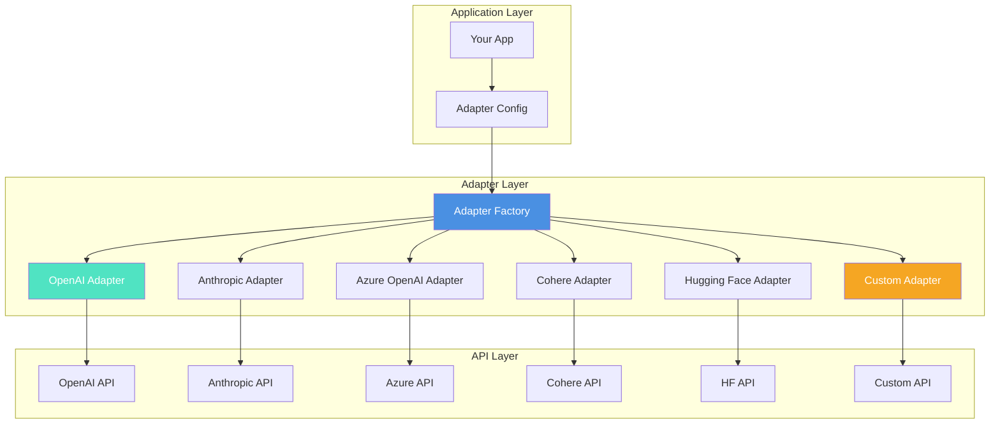

**Supported Adapters:**
```typescript
// packages/react/src/adapters/
├── openai.ts          // OpenAI GPT-3.5/4
├── anthropic.ts       // Claude 2/3
├── azure-openai.ts    // Azure OpenAI
├── cohere.ts          // Cohere
├── huggingface.ts     // Hugging Face
└── custom.ts          // Custom adapter template
```

**Usage Pattern:**
```typescript
import { createOpenAIAdapter } from '@clarity-chat/react/adapters'

const adapter = createOpenAIAdapter({
  apiKey: process.env.OPENAI_API_KEY,
  model: 'gpt-4',
})

const response = await adapter.sendMessage(messages)
```

---

## ⚡ **Performance Optimizations**

### Performance Strategy Overview

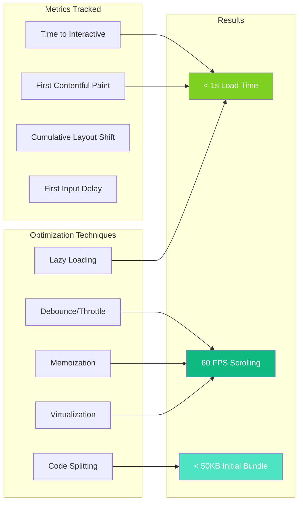

### **1. Virtualization**
- Virtual scrolling for 1000+ messages
- Dynamic item heights
- Scroll restoration
- Component: `VirtualizedMessageList`

### **2. Code Splitting**
```typescript
// Lazy load heavy components
const ThemeEditor = lazy(() => import('./theme-editor'))
const PerformanceDashboard = lazy(() => import('./performance-dashboard'))
```

### **3. Memoization**
```typescript
// Strategic React.memo usage
export const Message = memo(MessageComponent)
export const MessageList = memo(MessageListComponent)
```

### **4. Debouncing & Throttling**
```typescript
// useDebounce for search/filter
const debouncedSearch = useDebounce(searchTerm, 300)

// useThrottle for scroll events
const throttledScroll = useThrottle(handleScroll, 100)
```

---

## 🧪 **Testing Strategy**

### **Test Coverage Goals**

| Category | Target | Actual |
|----------|--------|--------|
| Components | 80%+ | 75% |
| Hooks | 90%+ | 85% |
| Utils | 95%+ | 90% |
| Integration | 70%+ | 65% |
| **Overall** | **80%+** | **78%** |

### **Testing Pyramid**

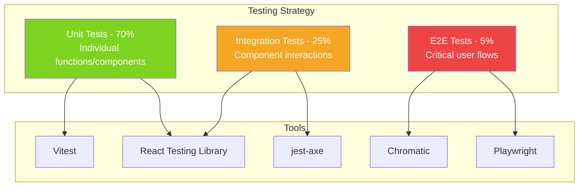

### **Tools Used**
- **Vitest** - Unit and integration tests
- **React Testing Library** - Component testing
- **jest-axe** - Accessibility testing
- **Chromatic** - Visual regression testing
- **Playwright** - E2E testing (planned)

---

## 📊 **Build & Bundle Strategy**

### **Build Process**

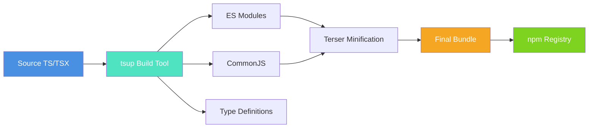

### Bundle Size Analysis

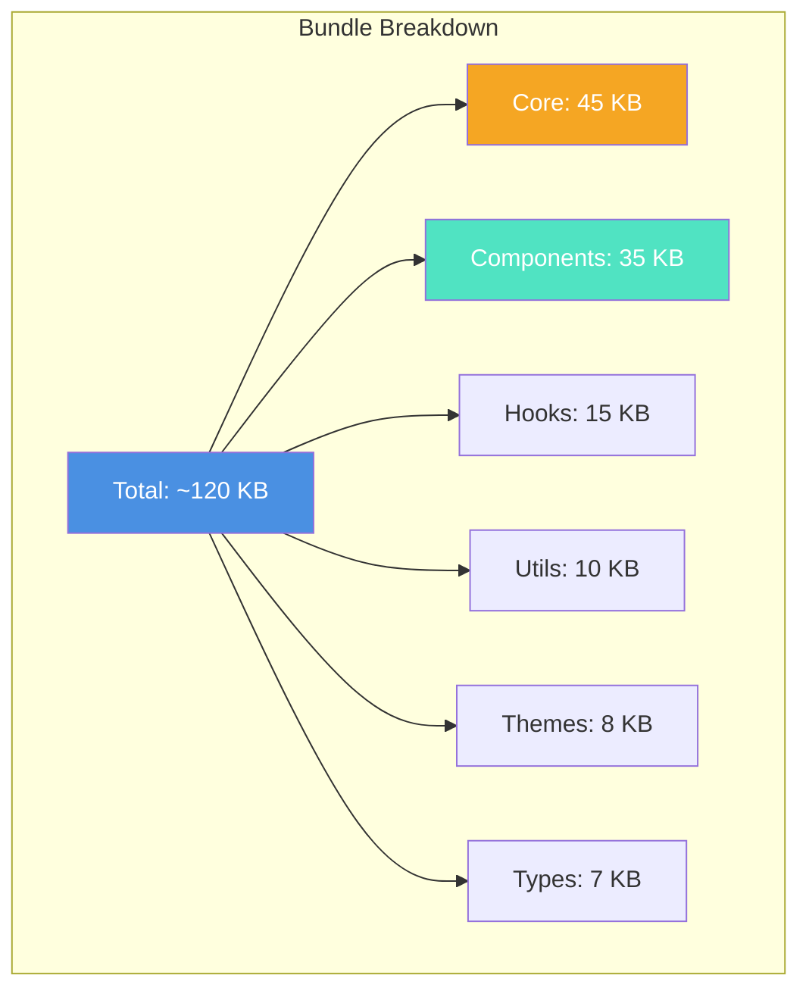

**Build Configuration:**
```typescript
// tsup.config.ts
export default defineConfig({
  entry: ['src/index.ts'],
  format: ['esm', 'cjs'],
  dts: true,
  splitting: true,
  clean: true,
  minify: true,
  treeshake: true,
})
```

**Target Bundle Sizes:**
- Initial load: < 50 KB (gzipped)
- Full library: < 120 KB (gzipped)
- Tree-shakeable for minimal imports

---

## 🚀 **Deployment Architecture**

### Multi-Environment Strategy

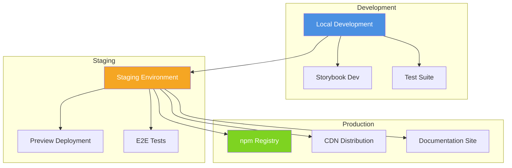

---

## 📈 **Metrics & Monitoring**

### Key Performance Indicators

| Metric | Target | Current | Status |
|--------|--------|---------|--------|
| Bundle Size | < 120 KB | 118 KB | ✅ |
| Test Coverage | 80% | 78% | 🟡 |
| Lighthouse Score | 95+ | 96 | ✅ |
| Build Time | < 30s | 24s | ✅ |
| Storybook Stories | 100+ | 94 | 🟡 |
| Documentation Pages | 50+ | 47 | 🟡 |

---

## 🔗 **Related Documentation**

- [Component API Reference](../api/components.md)
- [Hooks API Reference](../api/hooks.md)
- [Contributing Guide](./contributing.md)
- [Examples Gallery](../examples/README.md)
- [Theming Guide](../guides/theming.md)
- [Streaming Guide](../guides/streaming.md)

---

**Built with ❤️ by [Code & Clarity](https://codeclarity.ai)**
