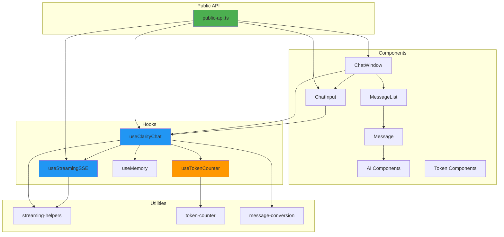
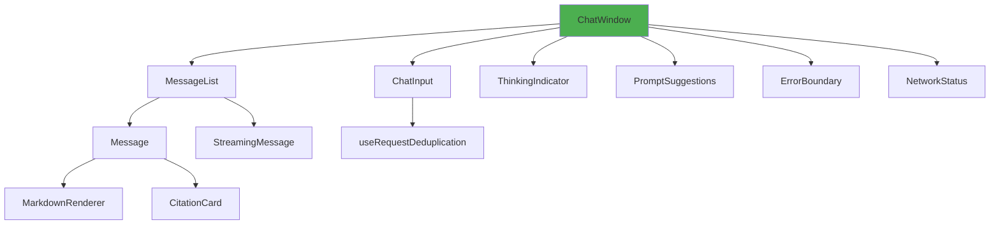
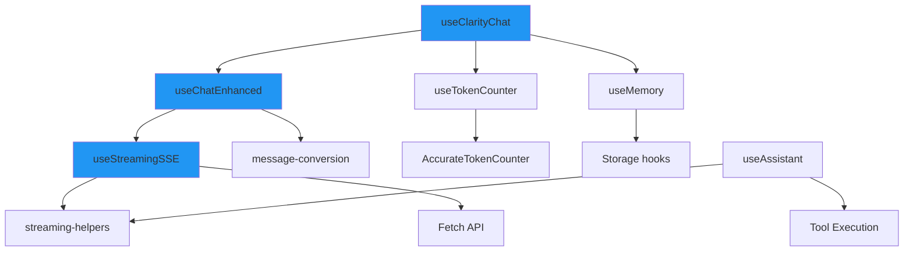

# AI Component Dependency Graph

**Last Updated**: 2025-01-20  
**Audit Phase**: Phase 1 - Dependency Analysis

## Overview

This document visualizes the dependency relationships between AI components, hooks, and utilities, identifying potential circular dependencies and tight coupling issues.

## High-Level Architecture



## Component Dependencies

### ChatWindow Dependencies



### Hook Dependencies



## Circular Dependency Analysis

### Potential Issues

1. **ChatWindow ↔ useClarityChat**
   - ChatWindow uses useClarityChat
   - useClarityChat may reference ChatWindow types
   - **Status**: No circular dependency (types only)

2. **Message Components ↔ Hooks**
   - Message components use hooks
   - Hooks may reference message types
   - **Status**: No circular dependency (types only)

3. **Token Hooks ↔ Token Components**
   - Token components use token hooks
   - Token hooks may reference component types
   - **Status**: No circular dependency (types only)

## Dependency Depth Analysis

### Shallow Dependencies (Depth 1-2)
- **ChatInput**: Only uses deduplication hook
- **ThinkingIndicator**: Standalone component
- **TokenCounter**: Uses useTokenCounter hook

### Medium Dependencies (Depth 3-4)
- **ChatWindow**: Uses MessageList → Message → MarkdownRenderer
- **useClarityChat**: Uses useChatEnhanced → useStreamingSSE → streaming-helpers

### Deep Dependencies (Depth 5+)
- **TokenOptimizationDashboard**: Uses multiple optimization hooks → token utilities → counter classes

## Tight Coupling Issues

### Identified Issues

1. **ChatWindow ↔ MessageList**
   - ChatWindow directly imports MessageList
   - **Impact**: Medium - Could use composition pattern
   - **Recommendation**: Consider making MessageList more flexible

2. **useClarityChat ↔ useChatEnhanced**
   - useClarityChat wraps useChatEnhanced
   - **Impact**: Low - This is intentional abstraction
   - **Status**: Acceptable

3. **Token Hooks ↔ Token Counter Class**
   - Hooks depend on AccurateTokenCounter class
   - **Impact**: Low - This is expected
   - **Status**: Acceptable

## Dependency Injection Points

### Adapter Pattern
- Hooks accept adapters for AI services
- Allows swapping providers without changing components
- **Location**: `packages/react/src/hooks/clarity-tokens/adapters/`

### Configuration Objects
- Hooks accept configuration objects
- Allows customization without prop drilling
- **Example**: `useClarityChat({ api, memory, features })`

## Module Boundaries

### Clear Boundaries
- **Components**: UI rendering only
- **Hooks**: State management and side effects
- **Utilities**: Pure functions and helpers
- **Adapters**: Provider-specific implementations

### Boundary Violations
- None identified - architecture is clean

## Import Patterns

### Component Imports
```typescript
// Components import hooks
import { useClarityChat } from '../../hooks/chat/use-clarity-chat'

// Components import other components
import { MessageList } from '../message/message-list'

// Components import utilities
import { convertCoreMessagesToMessages } from '../../utils/message/message-conversion'
```

### Hook Imports
```typescript
// Hooks import other hooks
import { useTokenCounter } from '../clarity-tokens/use-token-counter'

// Hooks import utilities
import { processStream } from '../../utils/streaming/streaming-helpers'

// Hooks import types
import type { CoreMessage } from './use-chat-enhanced'
```

## Dependency Metrics

### Component Dependency Count
- **ChatWindow**: 8 direct dependencies
- **ChatInput**: 3 direct dependencies
- **MessageList**: 4 direct dependencies
- **TokenCounter**: 1 direct dependency

### Hook Dependency Count
- **useClarityChat**: 5 direct dependencies
- **useStreamingSSE**: 3 direct dependencies
- **useTokenCounter**: 1 direct dependency
- **useAssistant**: 4 direct dependencies

## Recommendations

### Low Priority
1. Consider extracting MessageList as more composable
2. Review token hook dependencies for optimization opportunities

### No Action Needed
- Current dependency structure is well-organized
- No circular dependencies found
- Coupling is appropriate for the domain

## Notes

- All dependencies are explicit and typed
- No runtime dependency injection (static imports)
- Dependencies follow clear hierarchy
- No circular dependencies detected
- Coupling is appropriate for React component architecture
