# Conversation Flow Documentation

**Last Updated**: 2025-01-20  
**Audit Phase**: Phase 1 - Flow Documentation

## Overview

This document maps the complete conversation flow from user input through AI service calls to response presentation, including state management and context handling.

## Primary Flow: User Message to AI Response

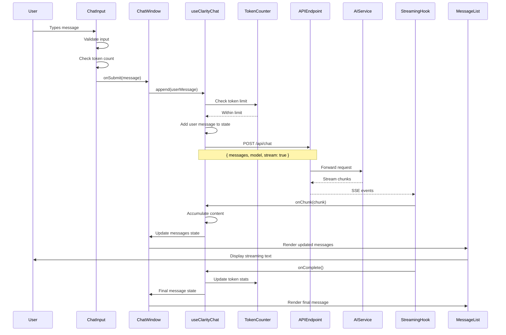

## Streaming Flow Detail

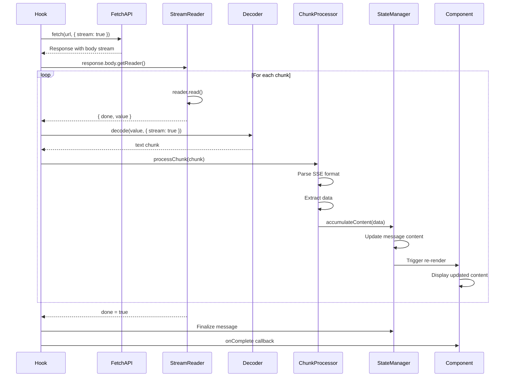

## Token Management Flow

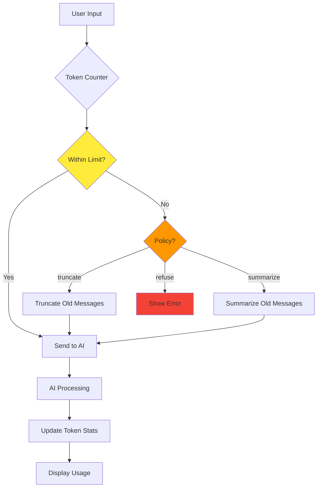

## Error Handling Flow

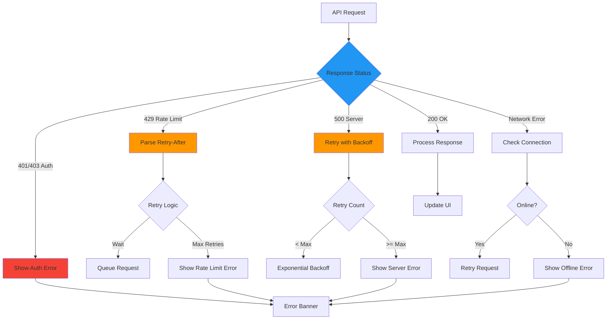

## Context Window Management Flow

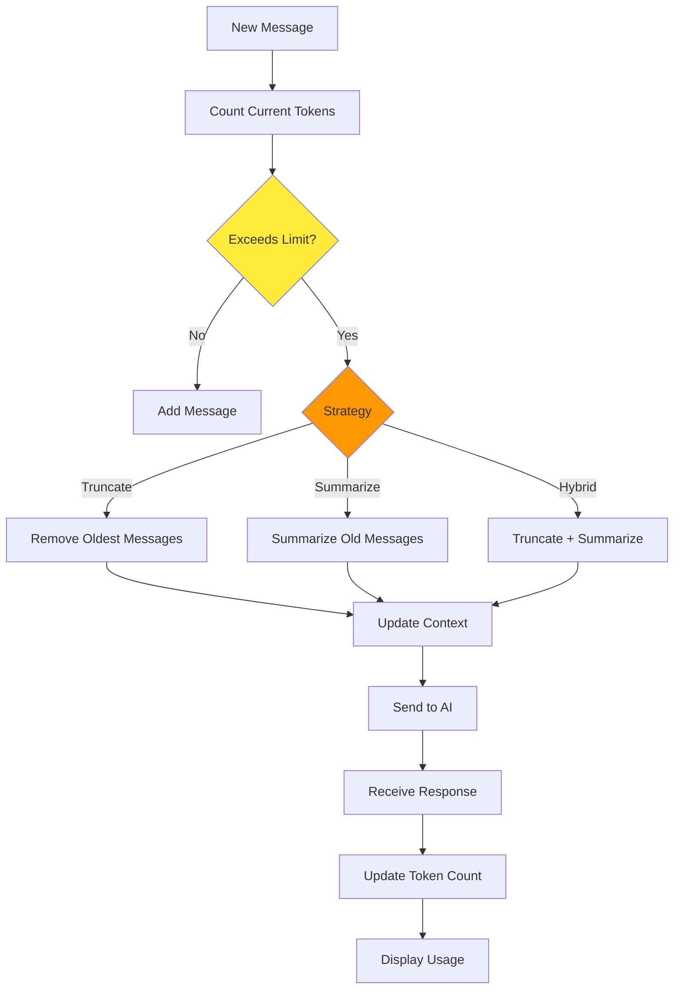

## State Management Architecture

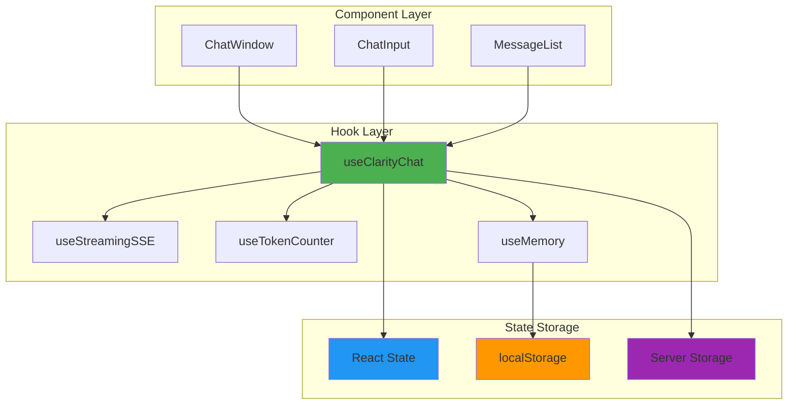

## Memory/Context Flow

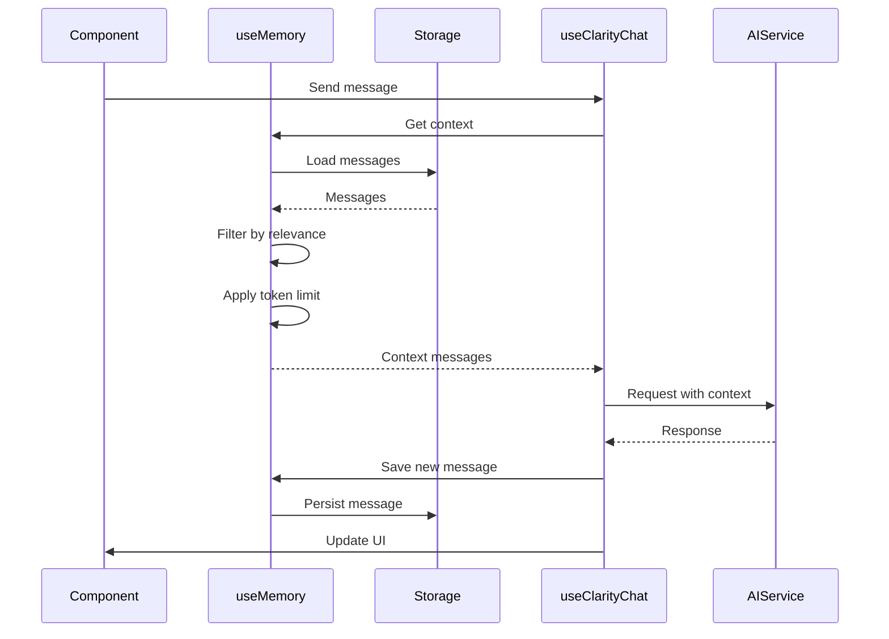

## Multi-Turn Conversation Flow

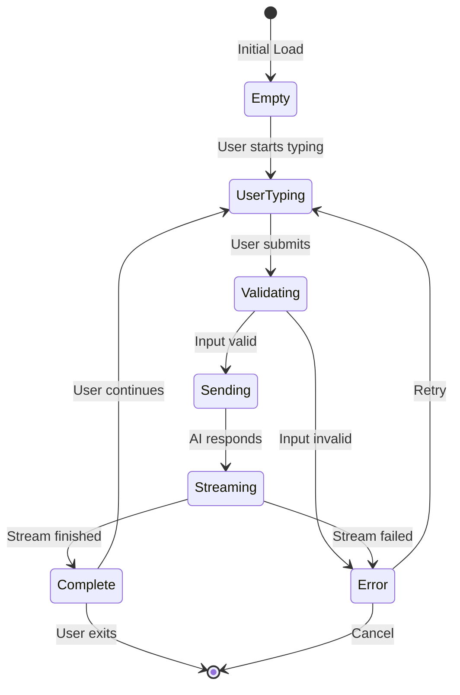

## Tool Calling Flow

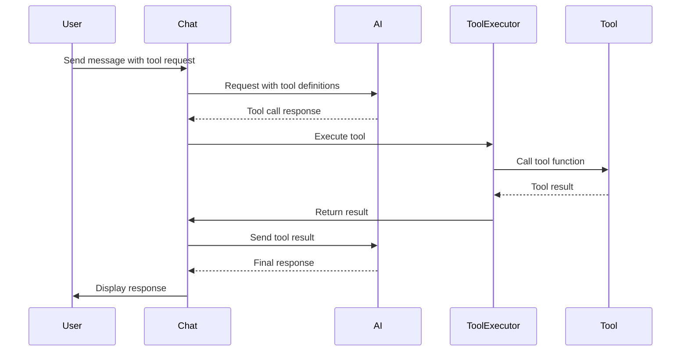

## Rate Limiting Flow

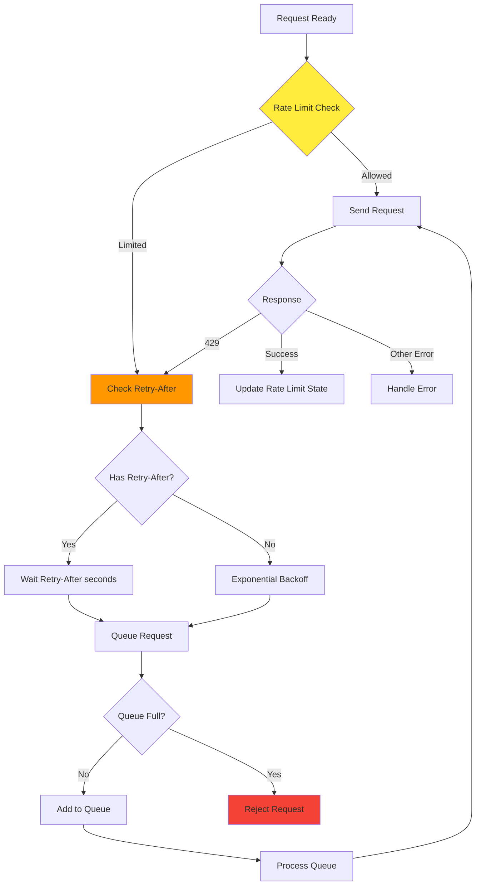

## Component Interaction Flow

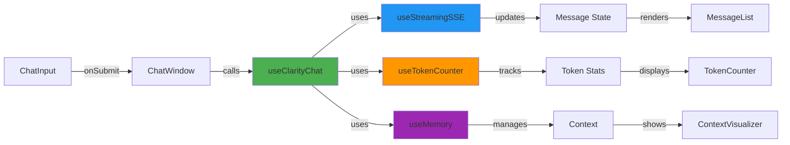

## State Synchronization Flow

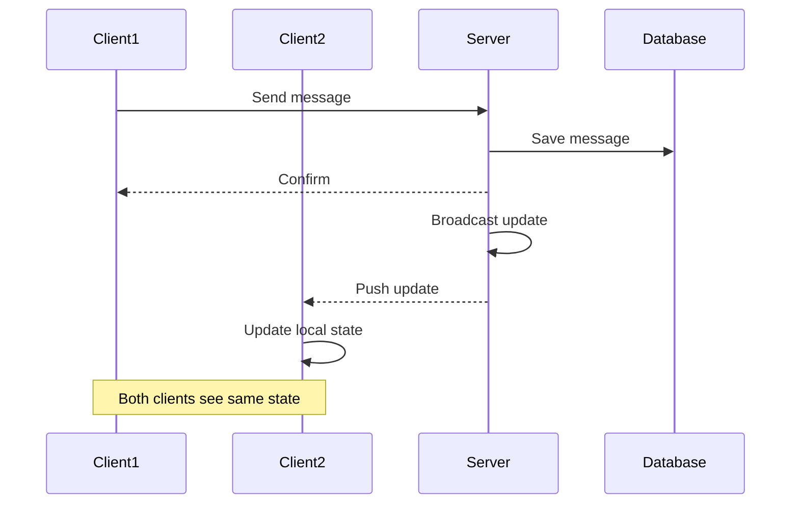

## Notes

- All flows support both streaming and non-streaming modes
- Error handling is integrated at each step
- Token management happens before sending requests
- State updates are batched for performance
- Memory/context is managed transparently
- Rate limiting is handled automatically
