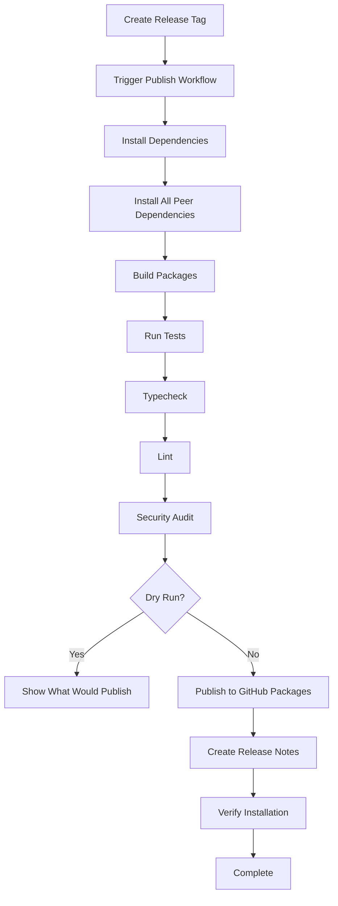

# CI/CD & Deployment Guide

Complete guide to CI/CD pipelines, peer dependency management, and bundle size monitoring for
Clarity Chat Components.

## Table of Contents

1. [Overview](#overview)
2. [CI/CD Pipeline](#cicd-pipeline)
3. [Peer Dependency Management](#peer-dependency-management)
4. [Bundle Size Monitoring](#bundle-size-monitoring)
5. [Deployment Process](#deployment-process)
6. [Security & Best Practices](#security--best-practices)
7. [Troubleshooting](#troubleshooting)

---

## Overview

The Clarity Chat Components project uses GitHub Actions for CI/CD with:

- ✅ **Automated testing** with all peer dependency configurations
- ✅ **Bundle size monitoring** with PR comments and enforcement
- ✅ **Security scanning** with StepSecurity Harden Runner
- ✅ **Automated publishing** to GitHub Packages
- ✅ **Zero-downtime deployments** with rollback capabilities

### Architecture

```
┌─────────────────────────────────────────────────────────────┐
│                     GitHub Actions Workflows                 │
├─────────────────────────────────────────────────────────────┤
│                                                               │
│  ┌──────────┐  ┌──────────┐  ┌──────────┐  ┌──────────┐   │
│  │   Lint   │  │Typecheck │  │   Test   │  │  Build   │   │
│  └────┬─────┘  └────┬─────┘  └────┬─────┘  └────┬─────┘   │
│       │             │              │             │          │
│       └─────────────┴──────────────┴─────────────┘          │
│                         │                                    │
│                    ┌────▼─────┐                             │
│                    │ Peer Dep │                             │
│                    │  Tests   │                             │
│                    └────┬─────┘                             │
│                         │                                    │
│                    ┌────▼─────┐                             │
│                    │  Bundle  │                             │
│                    │   Size   │                             │
│                    └────┬─────┘                             │
│                         │                                    │
│                    ┌────▼─────┐                             │
│                    │ Publish  │                             │
│                    │ (on tag) │                             │
│                    └──────────┘                             │
│                                                               │
└─────────────────────────────────────────────────────────────┘
```

---

## CI/CD Pipeline

### Main CI Workflow

File: `.github/workflows/ci.yml`

**Triggers**:

- Push to `main` or `develop`
- Pull requests to `main` or `develop`
- Manual dispatch

**Jobs**:

1. **Lint** (10 min)
   - ESLint check
   - Prettier format check
   - Quick feedback on code style

2. **Typecheck** (10 min)
   - TypeScript compilation check
   - No emit, just validation
   - Catches type errors early

3. **Test** (15 min)
   - Unit tests with Vitest
   - Integration tests
   - Coverage reporting

4. **Build** (15 min)
   - Install peer dependencies (standard preset)
   - Build all packages
   - Verify dist outputs
   - Cache stats reporting

5. **CI Summary** (5 min)
   - Performance metrics
   - Failure notifications
   - PR comments on failure

**Features**:

- ✅ Parallel execution for speed (lint, typecheck, test run in parallel)
- ✅ Turbo Remote Cache for build optimization
- ✅ Automatic retry on transient failures
- ✅ Debug mode with tmate SSH access

**Usage**:

```bash
# Run CI locally (matches what runs in GitHub)
pnpm check

# Run individual steps
pnpm lint
pnpm typecheck
pnpm test
pnpm build
```

---

## Peer Dependency Management

### Why Peer Dependencies?

Peer dependencies allow:

- ✅ **Smaller bundle sizes** - Dependencies not bundled
- ✅ **Version flexibility** - Users control versions
- ✅ **Deduplication** - One copy shared across packages
- ✅ **Optional features** - Users install only what they need

### Peer Dependency Strategy

```json
{
  "peerDependencies": {
    "react": "^18.0.0 || ^19.0.0", // Required
    "framer-motion": "^12.23.25", // Required
    "lucide-react": "^0.500.0", // Required
    "zod": "^3.24.0", // Required
    "react-dom": "^18.0.0 || ^19.0.0", // Optional (for web)
    "shiki": "^3.0.0", // Optional (code highlighting)
    "mermaid": "^11.0.0", // Optional (diagrams)
    "pdfjs-dist": "^3.0.0 || ^4.0.0", // Optional (PDF processing)
    "mammoth": "^1.0.0", // Optional (DOCX processing)
    "jszip": "^3.10.0", // Optional (export features)
    "cohere-ai": "^7.0.0", // Optional (reranking)
    "flowtoken": "^1.0.0" // Optional (token counting)
  },
  "peerDependenciesMeta": {
    "react-dom": { "optional": true },
    "shiki": { "optional": true },
    "mermaid": { "optional": true },
    "pdfjs-dist": { "optional": true },
    "mammoth": { "optional": true },
    "jszip": { "optional": true },
    "cohere-ai": { "optional": true },
    "flowtoken": { "optional": true }
  }
}
```

### Installation Presets

#### Minimal (Core Only)

```bash
node scripts/install-peers-ci.js minimal
```

**Includes**: React, Framer Motion, Lucide, Zod **Bundle Size**: ~450 KB gzipped **Use Case**: Basic
chat without advanced features

#### Standard (Recommended)

```bash
node scripts/install-peers-ci.js standard
```

**Includes**: Minimal + Markdown + Code highlighting (Shiki) **Bundle Size**: ~730 KB gzipped **Use
Case**: Most applications with markdown support

#### Full (All Features)

```bash
node scripts/install-peers-ci.js full
```

**Includes**: All peer dependencies **Bundle Size**: ~1.5 MB gzipped **Use Case**: Apps using all
features (diagrams, PDF, export)

#### Document Q&A

```bash
node scripts/install-peers-ci.js document
```

**Includes**: Core + Markdown + PDF.js + Mammoth + Cohere **Bundle Size**: ~1.2 MB gzipped **Use
Case**: RAG applications with document processing

#### Custom

```bash
node scripts/install-peers-ci.js custom core reactDom markdown
```

**Includes**: Only specified features **Use Case**: Fine-tuned installations

### CI Testing Matrix

File: `.github/workflows/peer-dependency-tests.yml`

Tests run on every PR affecting package.json or source code:

**Test Configurations**:

1. **All Peers Installed**
   - Validates all features work
   - Preset: `full`
   - Ensures no regressions

2. **Required Peers Only**
   - Validates core functionality
   - Preset: `minimal`
   - Ensures minimal deps work

3. **Optional Peer Degradation**
   - Matrix of missing optional peers:
     - Without Shiki
     - Without Mermaid
     - Without PDF.js
     - Without Mammoth
   - Ensures graceful degradation

4. **Peer Validation**
   - Validates package.json structure
   - Checks peerDependenciesMeta
   - Lists required vs optional

**Example Output**:

```
✅ All Peers Installed - PASSED
✅ Required Peers Only - PASSED
✅ Without Shiki - PASSED (graceful degradation)
✅ Without Mermaid - PASSED (graceful degradation)
✅ Without PDF.js - PASSED (graceful degradation)
✅ Without Mammoth - PASSED (graceful degradation)
✅ Peer Validation - PASSED
```

### Graceful Degradation

Components handle missing optional peers gracefully:

```tsx
// Example: Shiki code highlighting
import { lazy, Suspense } from 'react'

const ShikiHighlighter = lazy(() =>
  import('shiki')
    .then((mod) => ({ default: ShikiWrapper }))
    .catch(() => ({ default: FallbackHighlighter }))
)

export function CodeBlock({ code, language }) {
  return (
    <Suspense
      fallback={
        <pre>
          <code>{code}</code>
        </pre>
      }
    >
      <ShikiHighlighter code={code} language={language} />
    </Suspense>
  )
}
```

**Best Practices**:

- ✅ Always provide fallback UI
- ✅ Show helpful error messages
- ✅ Document which features require which peers
- ✅ Use dynamic imports for optional features

---

## Bundle Size Monitoring

### Bundle Size Strategy

File: `.github/workflows/bundle-size-check.yml`

**Goals**:

- Keep bundles small and fast
- Prevent bundle bloat over time
- Enforce size limits per bundle
- Provide transparency in PRs

### Size Limits

```yaml
env:
  # Absolute limits (gzipped)
  MAX_BUNDLE_SIZE_KB: 800 # Main bundle limit
  MAX_CORE_SIZE_KB: 250 # Core bundle limit
  MAX_SLIM_SIZE_KB: 150 # Slim bundle limit

  # Growth limits
  MAX_GROWTH_PERCENT: 5 # Max growth per PR
```

### Bundles Tracked

| Bundle     | Description    | Target Size | Includes             |
| ---------- | -------------- | ----------- | -------------------- |
| `index.js` | Full bundle    | < 800 KB    | All features         |
| `core.js`  | Core features  | < 250 KB    | Essential components |
| `slim.js`  | Minimal bundle | < 150 KB    | Basic chat only      |

### CI Workflow

**On Pull Request**:

1. **Measure Current Bundle**
   - Build with minimal peers
   - Measure all bundles (raw + gzipped)
   - Upload artifacts

2. **Measure Base Branch**
   - Checkout base branch
   - Build and measure
   - Compare with current

3. **Compare & Report**
   - Calculate size differences
   - Calculate percentage changes
   - Post PR comment with results
   - Fail if limits exceeded

**Example PR Comment**:

```markdown
## 📦 Bundle Size Report

| Bundle | Base   | Current | Change             | Status |
| ------ | ------ | ------- | ------------------ | ------ |
| Main   | 450 KB | 460 KB  | 📈 +10 KB (+2.22%) | ✅     |
| Core   | 200 KB | 205 KB  | 📈 +5 KB (+2.50%)  | ✅     |
| Slim   | 120 KB | 120 KB  | ➖ 0 KB (0.00%)    | ✅     |

### Limits

- Maximum bundle size: 800 KB (gzipped)
- Maximum core size: 250 KB (gzipped)
- Maximum slim size: 150 KB (gzipped)
- Maximum growth per PR: 5%

### ✅ Bundle Size Check Passed
```

**Failure Conditions**:

- ❌ Any bundle exceeds absolute size limit
- ❌ Any bundle grows more than 5%
- ❌ Build fails

### Local Bundle Analysis

```bash
cd packages/react

# Build and measure
pnpm build
node scripts/measure-bundle-sizes.ts

# Size limit check
pnpm size

# Detailed analysis with webpack-bundle-analyzer
pnpm size:why

# Generate JSON report
pnpm size:analyze
```

### Optimization Techniques

#### 1. Tree-Shakeable Imports

```tsx
// ✅ Good: Named imports
import { Button, Input } from '@clarity-chat/react'

// ❌ Bad: Namespace imports
import * as Clarity from '@clarity-chat/react'
```

#### 2. Dynamic Imports

```tsx
// ✅ Good: Lazy load heavy features
const MonacoEditor = lazy(() => import('./MonacoEditor'))
const MermaidDiagram = lazy(() => import('./MermaidDiagram'))

function App() {
  return (
    <Suspense fallback={<Skeleton />}>
      <MonacoEditor />
    </Suspense>
  )
}
```

#### 3. Entry Point Exports

```tsx
// Use specific entry points for tree-shaking
import { useReducedMotion } from '@clarity-chat/react/animations'
import { tokenCounter } from '@clarity-chat/react/utils'
```

#### 4. Externalize Large Dependencies

```tsx
// In tsup.config.ts
export default defineConfig({
  external: ['react', 'react-dom', 'framer-motion', 'shiki', 'mermaid', 'pdfjs-dist'],
})
```

---

## Deployment Process

### Publishing to GitHub Packages

File: `.github/workflows/publish.yml`

**Trigger**:

- Push tag matching `v*` (e.g., `v2.0.0`)
- Manual dispatch for testing

**Process**:



**Steps**:

1. **Prepare Release**

   ```bash
   # Update version
   pnpm changeset version

   # Commit changes
   git add .
   git commit -m "chore: release v2.0.0"

   # Create tag
   git tag v2.0.0
   git push origin main --tags
   ```

2. **Automated Publish**
   - GitHub Actions detects tag
   - Runs full CI pipeline
   - Installs all peer dependencies
   - Builds packages
   - Runs security audit
   - Publishes with provenance
   - Creates GitHub release

3. **Verification**
   - Automated installation test
   - Import verification
   - Smoke tests

**Dry Run Mode**:

```bash
# Test publish without actually publishing
gh workflow run publish.yml -f dry_run=true
```

### Release Checklist

Before creating a release:

- [ ] All tests passing on main
- [ ] Bundle sizes within limits
- [ ] Peer dependency tests passing
- [ ] CHANGELOG.md updated
- [ ] Version bumped in package.json
- [ ] Migration guide created (for major versions)
- [ ] Documentation updated
- [ ] Security audit clean

---

## Security & Best Practices

### Security Features

#### 1. StepSecurity Harden Runner

All workflows use Harden Runner for egress filtering:

```yaml
- name: Harden Runner
  uses: step-security/harden-runner@v2.11.1
  with:
    egress-policy: audit
    disable-sudo: true
    allowed-endpoints: >
      github.com:443 api.github.com:443 registry.npmjs.org:443
```

**Benefits**:

- ✅ Monitors network traffic
- ✅ Blocks unauthorized egress
- ✅ Audit logs for compliance
- ✅ Supply chain attack detection

#### 2. SHA-Pinned Actions

All actions use SHA pins for supply chain security:

```yaml
# ✅ Good: SHA-pinned
uses: actions/checkout@11bd71901bbe5b1630ceea73d27597364c9af683 # v4.2.2

# ❌ Bad: Version tag only
uses: actions/checkout@v4
```

**Update Process**:

1. Find latest release
2. Get commit SHA
3. Update workflow with SHA + version comment

#### 3. Minimal Permissions

Workflows use least-privilege permissions:

```yaml
permissions:
  contents: read # Read code
  pull-requests: write # Comment on PRs
  packages: write # Publish packages (publish only)
```

#### 4. NPM Provenance

Publishes include provenance for supply chain transparency:

```yaml
- name: Publish
  run: pnpm publish --provenance
  env:
    NODE_AUTH_TOKEN: ${{ secrets.GITHUB_TOKEN }}
```

### Best Practices

#### Workflow Design

1. **Fail Fast**
   - Run quick checks first (lint, typecheck)
   - Expensive checks last (build, e2e tests)

2. **Parallel Execution**
   - Independent jobs run in parallel
   - Reduces total CI time

3. **Caching Strategy**
   - pnpm store cache (dependencies)
   - Turbo Remote Cache (builds)
   - Artifact uploads (build outputs)

4. **Concurrency Control**
   - Cancel in-progress runs on new commits
   - Prevents wasted CI minutes

#### Peer Dependencies

1. **Clear Documentation**
   - Document what features require which peers
   - Provide installation helpers
   - Show bundle size impact

2. **Graceful Degradation**
   - Always provide fallbacks
   - Clear error messages
   - Progressive enhancement

3. **Version Ranges**
   - Support multiple major versions where possible
   - Test with min and max versions
   - Document version requirements

#### Bundle Size

1. **Regular Monitoring**
   - Track on every PR
   - Fail if exceeds limits
   - Provide optimization tips

2. **Progressive Enhancement**
   - Core bundle small
   - Optional features loaded dynamically
   - Entry points for code splitting

3. **Tree-Shaking**
   - Named exports only
   - Avoid side effects
   - Mark sideEffects in package.json

---

## Troubleshooting

### Common Issues

#### Build Failures

**Symptom**: Build fails in CI but works locally

**Solutions**:

```bash
# Clean everything
pnpm clean
rm -rf node_modules pnpm-lock.yaml
pnpm install

# Rebuild from scratch
pnpm build

# Check for environment differences
node --version  # Must match CI (v20)
pnpm --version  # Must match CI (v10)
```

#### Peer Dependency Issues

**Symptom**: Missing peer dependency warnings

**Solutions**:

```bash
# Install with specific preset
cd packages/react
node scripts/install-peers-ci.js standard

# Verify installation
ls -la node_modules | grep -E "(react|framer-motion|lucide)"

# Check package.json
cat package.json | jq '.peerDependencies'
```

#### Bundle Size Failures

**Symptom**: Bundle size check fails

**Solutions**:

```bash
# Analyze what changed
git diff main -- packages/react/src

# Measure locally
cd packages/react
pnpm build
node scripts/measure-bundle-sizes.ts

# Find large dependencies
pnpm size:why

# Check for accidental imports
grep -r "import.*from 'large-library'" src/
```

#### Test Failures

**Symptom**: Tests fail only in CI

**Solutions**:

```bash
# Run tests in CI mode
CI=true pnpm test

# Check for timing issues
pnpm test -- --no-parallel

# Verbose output
pnpm test -- --reporter=verbose

# Specific test
pnpm test -- specific-test.test.ts
```

### Getting Help

1. **Check Workflow Logs**
   - Go to Actions tab
   - Click on failed run
   - Review step-by-step logs

2. **Use Debug Mode**

   ```bash
   # Enable SSH debugging
   gh workflow run ci.yml -f debug_enabled=true
   ```

3. **Local Reproduction**

   ```bash
   # Run exactly what CI runs
   pnpm check
   ```

4. **Ask for Help**
   - Open GitHub issue
   - Include workflow run URL
   - Attach relevant logs

---

## Related Documentation

- [GitHub Actions Workflows README](../.github/workflows/README.md)
- [Peer Dependencies Guide](../packages/react/scripts/INSTALL_PEERS_README.md)
- [Package Development Guide](../packages/react/CLAUDE.md)
- [Security Policy](../SECURITY.md)

---

**Last Updated**: 2026-01-26 **Maintained By**: Clarity Chat Team
