# Example Gallery

Explore our collection of working examples demonstrating different use cases and integration patterns.

---

## 📊 Visual Architecture Overview

```mermaid
graph TB
    subgraph "Learning Path 🎓"
        B1[🟢 Basic Chat]
        B1 --> I1[🟡 Streaming Chat]
        B1 --> I2[🟡 AI Assistant]
        B1 --> I3[🟡 Customer Support]
        B1 --> I4[🟡 Analytics Console]
        B1 --> I5[🟡 Model Comparison]
        I2 --> A1[🔴 Multi-User Chat]
        I2 --> A2[🔴 RAG Workbench]
    end
    
    style B1 fill:#7ED321
    style I1 fill:#F5A623
    style I2 fill:#F5A623
    style I3 fill:#F5A623
    style I4 fill:#F5A623
    style I5 fill:#F5A623
    style A1 fill:#D0021B
    style A2 fill:#D0021B
```



---

## 🎯 Quick Links

| Example | Description | Tech Stack | Difficulty |
|---------|-------------|------------|------------|
| [Basic Chat](#basic-chat) | Simple chat interface | React, Vite | 🟢 Beginner |
| [AI Assistant](#ai-assistant) | Full-featured AI assistant | Next.js, OpenAI | 🟡 Intermediate |
| [Customer Support](#customer-support) | Support bot template | Next.js, tRPC | 🟡 Intermediate |
| [Streaming Chat](#streaming-chat) | Real-time streaming | React, SSE | 🟡 Intermediate |
| [Multi-User Chat](#multi-user-chat) | Collaborative chat | Next.js, Supabase | 🔴 Advanced |
| [Analytics Console](#analytics-console) | Analytics dashboard | React, Mixpanel | 🟡 Intermediate |
| [RAG Workbench](#rag-workbench) | Document Q&A | Next.js, Pinecone | 🔴 Advanced |
| [Model Comparison](#model-comparison) | Compare AI models | React, Multiple APIs | 🟡 Intermediate |

---

## 📈 Example Comparison Matrix

```mermaid
%%{init: {'theme':'base', 'themeVariables': { 'primaryColor':'#4A90E2','primaryTextColor':'#fff','primaryBorderColor':'#2E5C8A','lineColor':'#50E3C2','secondaryColor':'#50E3C2','tertiaryColor':'#F5A623'}}}%%
graph TD
    subgraph "Feature Complexity Matrix"
        subgraph "🟢 Beginner (1-2 weeks)"
            BC[Basic Chat<br/>Components: 3<br/>Lines: ~150<br/>APIs: 0]
        end
        
        subgraph "🟡 Intermediate (2-4 weeks)"
            SC[Streaming Chat<br/>Components: 5<br/>Lines: ~300<br/>APIs: 1]
            AI[AI Assistant<br/>Components: 8<br/>Lines: ~500<br/>APIs: 1]
            CS[Customer Support<br/>Components: 10<br/>Lines: ~600<br/>APIs: 2]
            AC[Analytics Console<br/>Components: 12<br/>Lines: ~400<br/>APIs: 1]
            MC[Model Comparison<br/>Components: 9<br/>Lines: ~450<br/>APIs: 3+]
        end
        
        subgraph "🔴 Advanced (4-8 weeks)"
            MU[Multi-User Chat<br/>Components: 15<br/>Lines: ~800<br/>APIs: 2]
            RAG[RAG Workbench<br/>Components: 18<br/>Lines: ~1000<br/>APIs: 3]
        end
    end
    
    style BC fill:#7ED321
    style SC fill:#F5A623
    style AI fill:#F5A623
    style CS fill:#F5A623
    style AC fill:#F5A623
    style MC fill:#F5A623
    style MU fill:#D0021B
    style RAG fill:#D0021B
```



---

## 🔧 Technology Stack Comparison


---

## 🟢 Basic Chat

**Location**: [`examples/basic-chat`](../../examples/basic-chat)

### Overview
The simplest implementation of Clarity Chat. Perfect for learning the basics and quick prototyping.

### Architecture Diagram

```mermaid
%%{init: {'theme':'base', 'themeVariables': { 'primaryColor':'#4A90E2','primaryTextColor':'#fff','primaryBorderColor':'#2E5C8A','lineColor':'#50E3C2','secondaryColor':'#50E3C2','tertiaryColor':'#F5A623'}}}%%
graph TB
    subgraph "Basic Chat Architecture"
        U[👤 User] -->|Types message| UI[ChatWindow Component]
        UI -->|Triggers| SM[State Manager<br/>useState]
        SM -->|Updates| ML[Message List<br/>Array]
        UI -->|onSendMessage| SIM[Simulated AI<br/>setTimeout 1s]
        SIM -->|Echo Response| ML
        ML -->|Renders| UI
        
        subgraph "Components Used"
            CW[ChatWindow]
            TP[ThemeProvider]
        end
        
        subgraph "State"
            MSG[messages: Message[]]
            THM[theme: Theme]
        end
        
        CW --> UI
        TP --> UI
        MSG --> SM
        THM --> TP
    end
    
    style U fill:#50E3C2
    style UI fill:#4A90E2
    style SM fill:#F5A623
    style SIM fill:#7ED321
    style CW fill:#4A90E2
    style TP fill:#4A90E2
```

### Data Flow


### Features
- ✅ Message sending and receiving
- ✅ Simple AI response simulation
- ✅ Theme switching
- ✅ Basic styling

### Tech Stack
- React 18
- TypeScript
- Vite
- Clarity Chat

### Quick Start
```bash
cd examples/basic-chat
npm install
npm run dev
```

### Code Snippet
```tsx
import { ChatWindow, ThemeProvider, themes } from '@clarity-chat/react'

function App() {
  const [messages, setMessages] = useState([])

  const handleSend = async (content: string) => {
    // Simulate AI response
    setTimeout(() => {
      setMessages(prev => [...prev, {
        id: Date.now().toString(),
        role: 'assistant',
        content: `Echo: ${content}`,
        timestamp: new Date()
      }])
    }, 1000)
  }

  return (
    <ThemeProvider theme={themes.ocean}>
      <ChatWindow messages={messages} onSendMessage={handleSend} />
    </ThemeProvider>
  )
}
```

### Learning Goals
- Understand basic component structure
- Learn message state management
- Explore theming system

---

## 🟡 AI Assistant

**Location**: [`examples/ai-assistant`](../../examples/ai-assistant)

### Overview
Full-featured AI assistant with OpenAI integration, streaming responses, and advanced features.

### Architecture Diagram

```mermaid
%%{init: {'theme':'base', 'themeVariables': { 'primaryColor':'#4A90E2','primaryTextColor':'#fff','primaryBorderColor':'#2E5C8A','lineColor':'#50E3C2','secondaryColor':'#50E3C2','tertiaryColor':'#F5A623'}}}%%
graph TB
    subgraph "AI Assistant Architecture"
        U[👤 User] -->|Sends message| FE[Next.js Frontend]
        FE -->|POST /api/chat| API[API Route Handler]
        API -->|Chat completion| OAI[OpenAI GPT-4]
        OAI -->|Streaming response| STREAM[OpenAIStream]
        STREAM -->|SSE| FE
        FE -->|Renders chunks| UI[ChatWindow]
        
        subgraph "Frontend Components"
            CW[ChatWindow]
            CH[useChat Hook<br/>Vercel AI SDK]
            CTX[Context Manager]
            FILE[File Upload]
            VOICE[Voice Input]
            HIST[History Panel]
        end
        
        subgraph "Backend Services"
            RT[API Route<br/>/api/chat]
            EMBED[Embeddings API<br/>/api/embeddings]
            UP[Upload Handler]
        end
        
        subgraph "State Management"
            MSGS[messages[]]
            LOAD[isLoading]
            ERR[error]
            META[metadata]
        end
        
        CH --> FE
        CW --> FE
        CTX --> FE
        FILE --> UP
        VOICE --> FE
        HIST --> MSGS
        
        RT --> API
        EMBED --> API
    end
    
    style U fill:#50E3C2
    style FE fill:#4A90E2
    style API fill:#F5A623
    style OAI fill:#7ED321
    style STREAM fill:#F5A623
```

### Streaming Data Flow


### Integration Pattern


### Features
- ✅ OpenAI GPT-4 integration
- ✅ Streaming responses (SSE)
- ✅ Context management
- ✅ File uploads
- ✅ Voice input
- ✅ Conversation history
- ✅ Analytics tracking
- ✅ Error handling

### Tech Stack
- Next.js 14 (App Router)
- TypeScript
- OpenAI API
- Vercel AI SDK
- Clarity Chat

### Quick Start
```bash
cd examples/ai-assistant
npm install
cp .env.example .env.local
# Add your OPENAI_API_KEY
npm run dev
```

### Code Snippet
```tsx
// app/api/chat/route.ts
import { OpenAIStream, StreamingTextResponse } from 'ai'
import { Configuration, OpenAIApi } from 'openai'

export async function POST(req: Request) {
  const { messages } = await req.json()
  
  const response = await openai.createChatCompletion({
    model: 'gpt-4',
    stream: true,
    messages,
  })

  const stream = OpenAIStream(response)
  return new StreamingTextResponse(stream)
}

// app/page.tsx
import { useChat } from 'ai/react'
import { ChatWindow } from '@clarity-chat/react'

export default function Chat() {
  const { messages, input, handleSubmit, isLoading } = useChat()

  return <ChatWindow messages={messages} onSendMessage={handleSubmit} />
}
```

### Learning Goals
- Real API integration
- Streaming implementation
- Advanced state management
- Production patterns

---

## 🟡 Customer Support

**Location**: [`examples/customer-support`](../../examples/customer-support)

### Overview
Pre-built customer support bot with FAQ matching, ticket creation, and escalation.

### Architecture Diagram


### FAQ Matching Flow


### Ticket Creation Flow


### Features
- ✅ FAQ pattern matching
- ✅ Ticket creation
- ✅ Escalation to human agent
- ✅ Sentiment analysis
- ✅ Customer satisfaction rating
- ✅ Support analytics
- ✅ Multi-language support

### Tech Stack
- Next.js 14
- TypeScript
- tRPC
- Prisma
- PostgreSQL
- Clarity Chat

### Quick Start
```bash
cd examples/customer-support
npm install
cp .env.example .env.local
# Configure DATABASE_URL
npx prisma migrate dev
npm run dev
```

### Code Snippet
```tsx
import { SupportBotTemplate } from '@clarity-chat/react/templates'

export default function SupportPage() {
  return (
    <SupportBotTemplate
      config={{
        faqs: [
          { question: 'How do I reset my password?', answer: '...' },
          { question: 'What are your business hours?', answer: '...' }
        ],
        onCreateTicket: async (issue) => {
          const response = await fetch('/api/tickets', {
            method: 'POST',
            body: JSON.stringify(issue)
          })
          return response.json()
        },
        onEscalate: () => {
          // Connect to human agent
        }
      }}
    />
  )
}
```

### Learning Goals
- Template usage
- Backend integration
- Database operations
- Production deployment

---

## 🟡 Streaming Chat

**Location**: [`examples/streaming-chat`](../../examples/streaming-chat)

### Overview
Demonstrates real-time streaming with both SSE and WebSocket implementations.

### Architecture Diagram

```mermaid
%%{init: {'theme':'base', 'themeVariables': { 'primaryColor':'#4A90E2','primaryTextColor':'#fff','primaryBorderColor':'#2E5C8A','lineColor':'#50E3C2','secondaryColor':'#50E3C2','tertiaryColor':'#F5A623'}}}%%
graph TB
    subgraph "Streaming Chat Architecture"
        U[👤 User] -->|Sends message| FE[React Frontend]
        
        subgraph "Dual Protocol Support"
            FE -->|Option A| SSE[Server-Sent Events<br/>useStreamingSSE]
            FE -->|Option B| WS[WebSocket<br/>useStreamingWS]
        end
        
        SSE -->|HTTP GET| SSE_EP[/api/stream-sse<br/>Express Endpoint]
        WS -->|ws://| WS_EP[WebSocket Server<br/>ws.on('connection')]
        
        subgraph "Backend Processing"
            SSE_EP -->|Generates| CHUNKS_SSE[Token Chunks<br/>data: events]
            WS_EP -->|Generates| CHUNKS_WS[Token Chunks<br/>JSON messages]
        end
        
        CHUNKS_SSE -->|Streams back| SSE
        CHUNKS_WS -->|Streams back| WS
        
        SSE -->|Appends tokens| UI[ChatWindow<br/>Streaming Display]
        WS -->|Appends tokens| UI
        
        UI -->|Cancel button| CANCEL[Cancel Stream]
        CANCEL -->|Aborts| SSE_EP
        CANCEL -->|Close| WS_EP
    end
    
    style U fill:#50E3C2
    style FE fill:#4A90E2
    style SSE fill:#F5A623
    style WS fill:#F5A623
    style SSE_EP fill:#7ED321
    style WS_EP fill:#7ED321
```

### SSE vs WebSocket Comparison

```mermaid
%%{init: {'theme':'base', 'themeVariables': { 'primaryColor':'#4A90E2','primaryTextColor':'#fff','primaryBorderColor':'#2E5C8A','lineColor':'#50E3C2','secondaryColor':'#50E3C2','tertiaryColor':'#F5A623'}}}%%
graph LR
    subgraph "Server-Sent Events (SSE)"
        SSE_CLIENT[Client] -->|HTTP GET| SSE_SERVER[Server]
        SSE_SERVER -->|data: chunk1\ndata: chunk2| SSE_CLIENT
        SSE_NOTE[✅ Simpler<br/>✅ Auto-reconnect<br/>✅ HTTP/2 friendly<br/>❌ Unidirectional]
    end
    
    subgraph "WebSocket"
        WS_CLIENT[Client] <-->|Bidirectional| WS_SERVER[Server]
        WS_NOTE[✅ Full duplex<br/>✅ Lower latency<br/>✅ Binary support<br/>❌ More complex]
    end
    
    style SSE_CLIENT fill:#4A90E2
    style WS_CLIENT fill:#F5A623
    style SSE_NOTE fill:#50E3C2
    style WS_NOTE fill:#50E3C2
```



### Streaming Flow with Cancellation


### Backpressure Handling


### Features
- ✅ Server-Sent Events (SSE)
- ✅ WebSocket streaming
- ✅ Stream cancellation
- ✅ Reconnection handling
- ✅ Backpressure management

### Tech Stack
- React 18
- TypeScript
- Express.js
- Clarity Chat

### Quick Start
```bash
cd examples/streaming-chat
npm install
npm run dev # Starts both frontend and backend
```

### Code Snippet
```tsx
import { useStreamingSSE, ChatWindow } from '@clarity-chat/react'

function StreamingChat() {
  const { messages, streamMessage, cancelStream } = useStreamingSSE()

  const handleSend = async (content: string) => {
    await streamMessage('/api/stream', {
      method: 'POST',
      body: JSON.stringify({ message: content })
    })
  }

  return (
    <ChatWindow
      messages={messages}
      onSendMessage={handleSend}
      onCancel={cancelStream}
    />
  )
}
```

### Learning Goals
- Streaming protocols
- Real-time updates
- Connection management
- Performance optimization

---

## 🔴 Multi-User Chat

**Location**: [`examples/multi-user-chat`](../../examples/multi-user-chat)

### Overview
Collaborative chat with multiple users, real-time sync, and presence awareness.

### Architecture Diagram


### Real-time Synchronization Flow


### Presence & Typing Indicators


### Read Receipts Implementation

```mermaid
%%{init: {'theme':'base', 'themeVariables': { 'primaryColor':'#4A90E2','primaryTextColor':'#fff','primaryBorderColor':'#2E5C8A','lineColor':'#50E3C2','secondaryColor':'#50E3C2','tertiaryColor':'#F5A623'}}}%%
flowchart TD
    MSG[Message Displayed] --> VISIBLE{In Viewport?}
    
    VISIBLE -->|Yes| TIMER[Start 2s Timer]
    VISIBLE -->|No| WAIT[Wait for Scroll]
    
    WAIT --> VISIBLE
    
    TIMER --> MARK[Mark as Read Locally]
    MARK --> BATCH{Batch Ready?<br/>5 messages or 1s}
    
    BATCH -->|Yes| UPDATE[UPDATE read_receipts<br/>SET read_at = NOW()]
    BATCH -->|No| COLLECT[Collect More Reads]
    
    UPDATE --> BROADCAST[Broadcast to Other Users]
    BROADCAST --> DISPLAY[Show Read Indicators<br/>✓✓ Seen by 3]
    
    COLLECT --> BATCH
    
    style MSG fill:#50E3C2
    style MARK fill:#7ED321
    style UPDATE fill:#4A90E2
    style DISPLAY fill:#F5A623
```

### Features
- ✅ Real-time synchronization
- ✅ User presence
- ✅ Typing indicators
- ✅ Read receipts
- ✅ User authentication
- ✅ Message persistence

### Tech Stack
- Next.js 14
- TypeScript
- Supabase (Auth + Realtime)
- PostgreSQL
- Clarity Chat

### Quick Start
```bash
cd examples/multi-user-chat
npm install
cp .env.example .env.local
# Configure SUPABASE_URL and SUPABASE_KEY
npm run dev
```

### Code Snippet
```tsx
import { createClient } from '@supabase/supabase-js'
import { ChatWindow, useChat } from '@clarity-chat/react'

const supabase = createClient(SUPABASE_URL, SUPABASE_KEY)

export default function CollaborativeChat() {
  const { messages, addMessage } = useChat()

  useEffect(() => {
    // Subscribe to real-time updates
    const subscription = supabase
      .channel('messages')
      .on('postgres_changes', {
        event: 'INSERT',
        schema: 'public',
        table: 'messages'
      }, payload => {
        addMessage(payload.new)
      })
      .subscribe()

    return () => subscription.unsubscribe()
  }, [])

  return <ChatWindow messages={messages} onSendMessage={handleSend} />
}
```

### Learning Goals
- Real-time databases
- WebSocket integration
- User authentication
- Collaborative features

---

## 🟡 Analytics Console

**Location**: [`examples/analytics-console-demo`](../../examples/analytics-console-demo)

### Overview
Comprehensive analytics dashboard showing all tracked events and metrics.

### Architecture Diagram



```mermaid
%%{init: {'theme':'base', 'themeVariables': { 'primaryColor':'#4A90E2','primaryTextColor':'#fff','primaryBorderColor':'#2E5C8A','lineColor':'#50E3C2','secondaryColor':'#50E3C2','tertiaryColor':'#F5A623'}}}%%
graph TB
    subgraph "Analytics Console Architecture"
        U[👤 User] -->|Interacts| APP[Chat Application]
        
        APP -->|Emits events| TRACKER[Analytics Tracker<br/>useAnalytics Hook]
        
        subgraph "Event Types"
            E1[message_sent]
            E2[message_received]
            E3[theme_changed]
            E4[error_occurred]
            E5[session_started]
            E6[custom_event]
        end
        
        TRACKER -->|Batches| QUEUE[Event Queue<br/>Max 50 events]
        
        QUEUE -->|Flush every 10s| SENDER[Event Sender]
        
        SENDER -->|Send to| MIX[Mixpanel API]
        SENDER -->|Send to| GA[Google Analytics]
        
        subgraph "Analytics Console"
            CONSOLE[Dashboard UI] -->|Fetch data| MIX
            CONSOLE -->|Query| GA
            
            VIZ1[Event Timeline<br/>Chart.js]
            VIZ2[User Journey<br/>Sankey Diagram]
            VIZ3[Metrics Cards<br/>Total, Avg, Trends]
            FILTER[Event Filters<br/>Date, Type, User]
        end
        
        CONSOLE --> VIZ1
        CONSOLE --> VIZ2
        CONSOLE --> VIZ3
        CONSOLE --> FILTER
    end
    
    style APP fill:#4A90E2
    style TRACKER fill:#F5A623
    style QUEUE fill:#50E3C2
    style MIX fill:#7ED321
    style CONSOLE fill:#4A90E2
```

### Event Tracking Flow

```mermaid
sequenceDiagram
    participant U as User Action
    participant C as Component
    participant H as useAnalytics
    participant Q as Event Queue
    participant M as Mixpanel
    
    U->>C: Send message
    C->>H: track('message_sent', { length: 42 })
    H->>H: Enrich with context
    
    Note over H: Add: session_id, user_id,<br/>timestamp, device_info
    
    H->>Q: Push to queue
    
    alt Queue full (50 events)
        Q->>M: Flush immediately
    else Timer elapsed (10s)
        Q->>M: Flush batch
    end
    
    M-->>M: Process & aggregate
    
    Note over M: Available in dashboard<br/>within 2 seconds
```

### Analytics Dashboard Visualization

```mermaid
%%{init: {'theme':'base', 'themeVariables': { 'primaryColor':'#4A90E2','primaryTextColor':'#fff','primaryBorderColor':'#2E5C8A','lineColor':'#50E3C2','secondaryColor':'#50E3C2','tertiaryColor':'#F5A623'}}}%%
graph TB
    subgraph "Analytics Console Dashboard"
        subgraph "Overview Metrics"
            M1[📊 Total Messages<br/>12,847 +23%]
            M2[👥 Active Users<br/>342 +12%]
            M3[⏱️ Avg Session<br/>8.5 min +5%]
            M4[🎨 Top Theme<br/>Ocean 45%]
        end
        
        subgraph "Event Timeline"
            CHART[Line Chart<br/>Last 24 Hours<br/>Messages per Hour]
        end
        
        subgraph "User Journey Funnel"
            F1[Session Start<br/>1,000 users] --> F2[First Message<br/>850 users 85%]
            F2 --> F3[5+ Messages<br/>420 users 42%]
            F3 --> F4[Theme Change<br/>180 users 18%]
        end
        
        subgraph "Event Breakdown"
            PIE[Pie Chart<br/>message_sent: 45%<br/>message_received: 40%<br/>theme_changed: 8%<br/>error_occurred: 2%]
        end
        
        subgraph "A/B Tests"
            AB[Test: New Theme<br/>Variant A: 52% engagement<br/>Variant B: 48% engagement<br/>Winner: A p=0.03]
        end
    end
    
    style M1 fill:#4A90E2
    style M2 fill:#50E3C2
    style M3 fill:#F5A623
    style M4 fill:#7ED321
```

### Features
- ✅ Event tracking visualization
- ✅ User journey analysis
- ✅ Performance metrics
- ✅ A/B testing dashboard
- ✅ Custom event filtering

### Tech Stack
- React 18
- TypeScript
- Mixpanel / Google Analytics
- Chart.js
- Clarity Chat

### Quick Start
```bash
cd examples/analytics-console-demo
npm install
cp .env.example .env.local
# Configure MIXPANEL_TOKEN
npm run dev
```

### Learning Goals
- Analytics integration
- Data visualization
- Event tracking patterns

---

## 🔴 RAG Workbench

**Location**: [`examples/rag-workbench-demo`](../../examples/rag-workbench-demo)

### Overview
Document Q&A system using Retrieval Augmented Generation (RAG) with vector database.

### Architecture Diagram

```mermaid
%%{init: {'theme':'base', 'themeVariables': { 'primaryColor':'#4A90E2','primaryTextColor':'#fff','primaryBorderColor':'#2E5C8A','lineColor':'#50E3C2','secondaryColor':'#50E3C2','tertiaryColor':'#F5A623'}}}%%
graph TB
    subgraph "RAG Workbench Architecture"
        U[👤 User] -->|Uploads PDF| UPLOAD[Document Upload]
        UPLOAD -->|Parse| PARSER[PDF Parser]
        PARSER -->|Split| CHUNKER[Text Chunker<br/>1000 tokens overlap 200]
        
        CHUNKER -->|Generate| EMBED_API[OpenAI Embeddings<br/>text-embedding-3-large]
        EMBED_API -->|1536-dim vectors| PINE[Pinecone Vector DB<br/>Store + Index]
        
        U -->|Asks question| QUERY[Question Input]
        QUERY -->|Generate embedding| EMBED_Q[Query Embedding]
        EMBED_Q -->|Similarity search| PINE
        PINE -->|Top-K results k=5| CONTEXT[Retrieved Chunks<br/>with scores]
        
        CONTEXT -->|Build prompt| LLM_CALL[LangChain<br/>GPT-4 Call]
        LLM_CALL -->|Context + Question| OAI[OpenAI GPT-4]
        OAI -->|Answer with citations| RESP[Response Display]
        
        subgraph "Context Management"
            DOCS[Document List]
            META[Metadata Filters]
            CITE[Citation Links]
        end
        
        PINE --> DOCS
        CONTEXT --> CITE
        RESP --> CITE
    end
    
    style UPLOAD fill:#50E3C2
    style PINE fill:#4A90E2
    style CONTEXT fill:#F5A623
    style OAI fill:#7ED321
```

### RAG Pipeline Flow

```mermaid
sequenceDiagram
    participant U as User
    participant F as Frontend
    participant P as Parser
    participant E as Embeddings API
    participant V as Vector DB (Pinecone)
    participant L as LLM (GPT-4)
    
    rect rgb(80, 227, 194, 0.2)
        Note over U,V: Phase 1: Document Ingestion
        U->>F: Upload "product_guide.pdf"
        F->>P: Parse PDF
        P-->>F: Text chunks (n=47)
        
        loop For each chunk
            F->>E: Generate embedding
            E-->>F: 1536-dim vector
            F->>V: Store(chunk_text, vector, metadata)
        end
        
        V-->>U: "Document indexed: 47 chunks"
    end
    
    rect rgb(245, 166, 35, 0.2)
        Note over U,L: Phase 2: Query Processing
        U->>F: Ask "What are the warranty terms?"
        F->>E: Embed query
        E-->>F: Query vector
        F->>V: Similarity search (top_k=5)
        V-->>F: Relevant chunks [0.89, 0.85, 0.82, 0.78, 0.76]
    end
    
    rect rgb(74, 144, 226, 0.2)
        Note over F,L: Phase 3: Answer Generation
        F->>L: Prompt = Context + Question
        Note over L: Context from top 5 chunks
        L-->>F: Answer with citations
        F-->>U: Display answer + source links
    end
```

### Vector Search Process

```mermaid
%%{init: {'theme':'base', 'themeVariables': { 'primaryColor':'#4A90E2','primaryTextColor':'#fff','primaryBorderColor':'#2E5C8A','lineColor':'#50E3C2','secondaryColor':'#50E3C2','tertiaryColor':'#F5A623'}}}%%
flowchart TD
    QUERY[User Query:<br/>What are warranty terms?] --> EMBED[Generate Query Embedding<br/>OpenAI API]
    
    EMBED --> SEARCH[Pinecone Similarity Search<br/>cosine_similarity]
    
    SEARCH --> FILTER{Apply Filters?}
    FILTER -->|Yes| META[Filter by Metadata<br/>document_type: manual]
    FILTER -->|No| RANK[Rank by Score]
    
    META --> RANK
    RANK --> TOPK[Select Top-K<br/>k=5 chunks]
    
    TOPK --> RERANK{Re-rank?}
    RERANK -->|Yes| CROSS[Cross-encoder<br/>Reranking]
    RERANK -->|No| RETURN[Return Results]
    
    CROSS --> RETURN
    
    RETURN --> RESULTS[Chunk 1: score 0.89<br/>Chunk 2: score 0.85<br/>Chunk 3: score 0.82<br/>Chunk 4: score 0.78<br/>Chunk 5: score 0.76]
    
    style QUERY fill:#50E3C2
    style SEARCH fill:#4A90E2
    style TOPK fill:#F5A623
    style RESULTS fill:#7ED321
```

### Document Processing Pipeline

```mermaid
%%{init: {'theme':'base', 'themeVariables': { 'primaryColor':'#4A90E2','primaryTextColor':'#fff','primaryBorderColor':'#2E5C8A','lineColor':'#50E3C2','secondaryColor':'#50E3C2','tertiaryColor':'#F5A623'}}}%%
stateDiagram-v2
    [*] --> Uploaded: PDF uploaded
    Uploaded --> Parsing: Extract text
    Parsing --> Chunking: Split text
    
    state Chunking {
        [*] --> RecursiveChunk
        RecursiveChunk --> CheckSize: size > 1000 tokens?
        CheckSize --> RecursiveChunk: Yes, split more
        CheckSize --> AddOverlap: No
        AddOverlap --> [*]
    }
    
    Chunking --> Embedding: For each chunk
    
    state Embedding {
        [*] --> CallAPI
        CallAPI --> Retry: Rate limit?
        Retry --> CallAPI
        CallAPI --> Store: Success
        Store --> [*]
    }
    
    Embedding --> Indexed: All chunks embedded
    Indexed --> Ready: Searchable
    Ready --> [*]
    
    note right of Chunking
        Chunking strategy:
        - Max size: 1000 tokens
        - Overlap: 200 tokens
        - Preserve paragraphs
    end note
```

### Features
- ✅ PDF document upload
- ✅ Vector embedding
- ✅ Semantic search
- ✅ Context-aware responses
- ✅ Citation tracking
- ✅ Document visualization

### Tech Stack
- Next.js 14
- TypeScript
- OpenAI Embeddings
- Pinecone Vector DB
- LangChain
- Clarity Chat

### Quick Start
```bash
cd examples/rag-workbench-demo
npm install
cp .env.example .env.local
# Configure OPENAI_API_KEY and PINECONE_API_KEY
npm run dev
```

### Code Snippet
```tsx
import { ChatWindow, ContextManager } from '@clarity-chat/react'
import { useRAG } from '../hooks/use-rag'

export default function RAGWorkbench() {
  const { messages, query, documents } = useRAG()

  const handleSend = async (content: string) => {
    // Perform vector search
    const relevantDocs = await vectorDB.search(content)
    
    // Query with context
    const response = await openai.chat.completions.create({
      model: 'gpt-4',
      messages: [
        { role: 'system', content: `Context: ${relevantDocs}` },
        { role: 'user', content }
      ]
    })
  }

  return (
    <>
      <ContextManager documents={documents} />
      <ChatWindow messages={messages} onSendMessage={handleSend} />
    </>
  )
}
```

### Learning Goals
- RAG architecture
- Vector databases
- Embedding generation
- Advanced AI patterns

---

## 🟡 Model Comparison

**Location**: [`examples/model-comparison-demo`](../../examples/model-comparison-demo)

### Overview
Compare responses from different AI models side-by-side.

### Architecture Diagram

```mermaid
%%{init: {'theme':'base', 'themeVariables': { 'primaryColor':'#4A90E2','primaryTextColor':'#fff','primaryBorderColor':'#2E5C8A','lineColor':'#50E3C2','secondaryColor':'#50E3C2','tertiaryColor':'#F5A623'}}}%%
graph TB
    subgraph "Model Comparison Architecture"
        U[👤 User] -->|Single prompt| INPUT[Prompt Input]
        INPUT -->|Broadcast| ROUTER[Request Router]
        
        subgraph "AI Provider Adapters"
            ROUTER -->|Parallel requests| OAI[OpenAI Adapter<br/>GPT-4, GPT-3.5]
            ROUTER -->|Parallel requests| ANT[Anthropic Adapter<br/>Claude 3]
            ROUTER -->|Parallel requests| COH[Cohere Adapter<br/>Command]
            ROUTER -->|Parallel requests| META[Meta Adapter<br/>Llama 2]
        end
        
        OAI -->|Response + Metrics| AGG[Response Aggregator]
        ANT -->|Response + Metrics| AGG
        COH -->|Response + Metrics| AGG
        META -->|Response + Metrics| AGG
        
        AGG -->|Format| DISPLAY[Side-by-Side Display]
        
        subgraph "Metrics Tracking"
            TIMER[Response Time]
            TOKENS[Token Count]
            COST[Cost Calculator]
            QUALITY[Quality Score]
        end
        
        AGG --> TIMER
        AGG --> TOKENS
        AGG --> COST
        AGG --> QUALITY
        
        DISPLAY --> EXPORT[Export Comparison<br/>JSON/CSV]
    end
    
    style INPUT fill:#50E3C2
    style ROUTER fill:#4A90E2
    style AGG fill:#F5A623
    style DISPLAY fill:#7ED321
```

### Parallel Model Execution

```mermaid
sequenceDiagram
    participant U as User
    participant R as Router
    participant GPT4 as OpenAI GPT-4
    participant Claude as Anthropic Claude
    participant Cohere as Cohere Command
    
    U->>R: "Explain quantum computing"
    
    par Parallel Execution
        R->>GPT4: API call + start timer
        R->>Claude: API call + start timer
        R->>Cohere: API call + start timer
    end
    
    Note over GPT4,Cohere: All requests sent simultaneously
    
    GPT4-->>R: Response (2.3s, 847 tokens, $0.042)
    Note over R: Store result 1
    
    Claude-->>R: Response (1.8s, 923 tokens, $0.037)
    Note over R: Store result 2
    
    Cohere-->>R: Response (3.1s, 756 tokens, $0.028)
    Note over R: Store result 3
    
    R->>R: Aggregate all results
    R->>U: Display side-by-side comparison
```

### Comparison Dashboard

```mermaid
%%{init: {'theme':'base', 'themeVariables': { 'primaryColor':'#4A90E2','primaryTextColor':'#fff','primaryBorderColor':'#2E5C8A','lineColor':'#50E3C2','secondaryColor':'#50E3C2','tertiaryColor':'#F5A623'}}}%%
graph TB
    subgraph "Comparison Dashboard UI"
        subgraph "Column 1: GPT-4"
            GPT_RESP[Response Text<br/>1,024 chars]
            GPT_TIME[⏱️ 2.3s]
            GPT_TOK[🔢 847 tokens]
            GPT_COST[💰 $0.042]
            GPT_SCORE[⭐ 9.2/10]
        end
        
        subgraph "Column 2: Claude 3"
            CLD_RESP[Response Text<br/>1,156 chars]
            CLD_TIME[⏱️ 1.8s ✓]
            CLD_TOK[🔢 923 tokens]
            CLD_COST[💰 $0.037 ✓]
            CLD_SCORE[⭐ 9.4/10 ✓]
        end
        
        subgraph "Column 3: Cohere"
            COH_RESP[Response Text<br/>891 chars]
            COH_TIME[⏱️ 3.1s]
            COH_TOK[🔢 756 tokens ✓]
            COH_COST[💰 $0.028 ✓]
            COH_SCORE[⭐ 8.7/10]
        end
        
        subgraph "Winner Summary"
            WIN[🏆 Best Overall: Claude 3<br/>🚀 Fastest: Claude 3<br/>💵 Cheapest: Cohere<br/>📝 Most Detailed: Claude 3]
        end
    end
    
    style CLD_TIME fill:#7ED321
    style CLD_COST fill:#7ED321
    style CLD_SCORE fill:#7ED321
```

### Cost Comparison Chart

```mermaid
%%{init: {'theme':'base', 'themeVariables': { 'primaryColor':'#4A90E2','primaryTextColor':'#fff','primaryBorderColor':'#2E5C8A','lineColor':'#50E3C2','secondaryColor':'#50E3C2','tertiaryColor':'#F5A623'}}}%%
graph LR
    subgraph "Cost per 1K Tokens (Input/Output)"
        GPT4[GPT-4<br/>$0.03 / $0.06<br/>❌ Most expensive]
        GPT35[GPT-3.5<br/>$0.002 / $0.002<br/>✅ Good balance]
        CLAUDE[Claude 3<br/>$0.015 / $0.075<br/>⚠️ High output cost]
        COHERE[Cohere<br/>$0.001 / $0.002<br/>✅ Cheapest]
    end
    
    subgraph "Cost Ranking"
        RANK1[1st: Cohere $0.028]
        RANK2[2nd: GPT-3.5 $0.034]
        RANK3[3rd: Claude $0.037]
        RANK4[4th: GPT-4 $0.042]
    end
    
    style COHERE fill:#7ED321
    style GPT35 fill:#50E3C2
    style CLAUDE fill:#F5A623
    style GPT4 fill:#D0021B
```

### Features
- ✅ Multiple AI providers (OpenAI, Anthropic, Cohere)
- ✅ Side-by-side comparison
- ✅ Response metrics (speed, tokens, cost)
- ✅ Model switching
- ✅ Export comparisons

### Tech Stack
- React 18
- TypeScript
- Multiple AI APIs
- Clarity Chat

### Quick Start
```bash
cd examples/model-comparison-demo
npm install
cp .env.example .env.local
# Configure API keys for multiple providers
npm run dev
```

### Learning Goals
- Multi-provider integration
- Performance comparison
- Cost analysis

---

## 🚀 Running All Examples

### Clone and Setup
```bash
git clone https://github.com/christireid/Clarity-ai-chat-components.git
cd Clarity-ai-chat-components
npm install
```

### Run Specific Example
```bash
npm run dev --workspace=examples/basic-chat
npm run dev --workspace=examples/ai-assistant
```

### Run with Turborepo
```bash
turbo dev --filter=examples/*
```

---

## 📊 Integration Patterns Comparison

```mermaid
%%{init: {'theme':'base', 'themeVariables': { 'primaryColor':'#4A90E2','primaryTextColor':'#fff','primaryBorderColor':'#2E5C8A','lineColor':'#50E3C2','secondaryColor':'#50E3C2','tertiaryColor':'#F5A623'}}}%%
graph TB
    subgraph "Integration Pattern Categories"
        subgraph "🟢 Simple Integration"
            P1[State Management<br/>useState + useEffect<br/>Example: Basic Chat]
        end
        
        subgraph "🟡 API Integration"
            P2[REST API<br/>fetch + async/await<br/>Examples: AI Assistant,<br/>Customer Support]
            P3[Streaming API<br/>SSE + WebSocket<br/>Examples: Streaming Chat,<br/>AI Assistant]
        end
        
        subgraph "🔴 Advanced Integration"
            P4[Real-time Database<br/>Supabase Subscriptions<br/>Example: Multi-User Chat]
            P5[Vector Database<br/>Embeddings + Search<br/>Example: RAG Workbench]
            P6[Multi-Provider<br/>Adapter Pattern<br/>Example: Model Comparison]
        end
    end
    
    style P1 fill:#7ED321
    style P2 fill:#F5A623
    style P3 fill:#F5A623
    style P4 fill:#D0021B
    style P5 fill:#D0021B
    style P6 fill:#D0021B
```

---

## 🎓 Learning Path Visualization

```mermaid
%%{init: {'theme':'base', 'themeVariables': { 'primaryColor':'#4A90E2','primaryTextColor':'#fff','primaryBorderColor':'#2E5C8A','lineColor':'#50E3C2','secondaryColor':'#50E3C2','tertiaryColor':'#F5A623'}}}%%
flowchart TD
    START[🚀 Start Here] --> BC[Basic Chat<br/>Week 1-2<br/>Core concepts]
    
    BC -->|Master basics| BRANCH{Choose Path}
    
    BRANCH -->|Streaming focus| SC[Streaming Chat<br/>Week 3-4<br/>SSE + WebSocket]
    BRANCH -->|AI integration| AI[AI Assistant<br/>Week 3-5<br/>OpenAI + Vercel AI]
    BRANCH -->|Templates| CS[Customer Support<br/>Week 3-5<br/>tRPC + Database]
    
    SC --> ADVANCED{Advanced Topics}
    AI --> ADVANCED
    CS --> ADVANCED
    
    ADVANCED -->|Collaboration| MU[Multi-User Chat<br/>Week 6-9<br/>Real-time + Auth]
    ADVANCED -->|AI/ML Deep Dive| RAG[RAG Workbench<br/>Week 6-10<br/>Vector DB + LangChain]
    
    BRANCH -->|Analytics focus| AC[Analytics Console<br/>Week 3-4<br/>Tracking + Viz]
    BRANCH -->|Multi-model| MC[Model Comparison<br/>Week 3-5<br/>Multiple APIs]
    
    AC --> EXPERT[🎓 Expert Level]
    MC --> EXPERT
    MU --> EXPERT
    RAG --> EXPERT
    
    EXPERT --> BUILD[Build Your Own!]
    
    style START fill:#50E3C2
    style BC fill:#7ED321
    style BRANCH fill:#F5A623
    style ADVANCED fill:#F5A623
    style EXPERT fill:#4A90E2
    style BUILD fill:#D0021B
```

---

## 📈 Complexity vs Features Matrix

```mermaid
%%{init: {'theme':'base', 'themeVariables': { 'primaryColor':'#4A90E2','primaryTextColor':'#fff','primaryBorderColor':'#2E5C8A','lineColor':'#50E3C2','secondaryColor':'#50E3C2','tertiaryColor':'#F5A623'}}}%%
quadrantChart
    title Complexity vs Features
    x-axis Low Features --> High Features
    y-axis Low Complexity --> High Complexity
    quadrant-1 Advanced
    quadrant-2 Expert
    quadrant-3 Beginner
    quadrant-4 Intermediate
    Basic Chat: [0.2, 0.2]
    Streaming Chat: [0.5, 0.4]
    AI Assistant: [0.6, 0.5]
    Customer Support: [0.7, 0.6]
    Analytics Console: [0.5, 0.45]
    Model Comparison: [0.65, 0.55]
    Multi-User Chat: [0.8, 0.85]
    RAG Workbench: [0.9, 0.9]
```

---

## 📝 Creating Your Own Example

### 1. Create Directory
```bash
mkdir examples/my-example
cd examples/my-example
```

### 2. Initialize Project
```bash
npm init -y
npm install @clarity-chat/react react react-dom
npm install -D vite @vitejs/plugin-react typescript
```

### 3. Add to Workspace
```json
// Add to root package.json workspaces
{
  "workspaces": [
    "packages/*",
    "apps/*",
    "examples/*"
  ]
}
```

### 4. Create Example
See our [example template](../../examples/_template) for a starting point.

---

## 🤝 Contributing Examples

We welcome new examples! Please:

1. Follow the [Contributing Guide](../architecture/contributing.md)
2. Include a comprehensive README
3. Add `.env.example` for required environment variables
4. Document all features
5. Add to this gallery

---

## 📚 Additional Resources

- [Quick Start Guide](../getting-started/quick-start.md)
- [API Reference](../api/components.md)
- [Integration Guides](./integrations.md)
- [Deployment Guide](../guides/deployment.md)

---

## 💬 Need Help?

- 💬 [Discord Community](https://discord.gg/clarity-chat)
- 🐛 [Report Issues](https://github.com/christireid/Clarity-ai-chat-components/issues)
- 💡 [Request Examples](https://github.com/christireid/Clarity-ai-chat-components/discussions)

---

**Built with ❤️ by [Code & Clarity](https://codeclarity.ai)**
