# Streaming Messages Guide

Learn how to implement real-time streaming responses in your chat application.

---

## 🌊 Why Streaming?

Streaming provides a better user experience by:
- ✅ Showing responses as they're generated
- ✅ Reducing perceived latency
- ✅ Allowing users to read while AI is thinking
- ✅ Enabling cancellation of long responses

### Streaming vs Non-Streaming Comparison

```mermaid
sequenceDiagram
    participant User
    participant UI
    participant API
    participant AI
    
    rect rgb(255, 240, 240)
    Note over User,AI: ❌ Non-Streaming (Traditional)
    User->>UI: Send message
    UI->>API: POST request
    API->>AI: Generate response
    Note over AI: Wait 10-30 seconds...
    AI-->>API: Complete response
    API-->>UI: Full response
    UI-->>User: Display all at once
    Note over User: Long wait time!
    end
    
    rect rgb(240, 255, 240)
    Note over User,AI: ✅ Streaming (Modern)
    User->>UI: Send message
    UI->>API: POST request (stream=true)
    API->>AI: Generate response
    
    loop Every 50-200ms
        AI-->>API: Chunk of text
        API-->>UI: Stream chunk
        UI-->>User: Display progressively
    end
    
    AI-->>API: Stream complete
    API-->>UI: Close stream
    Note over User: Instant feedback!
    end
```



### User Experience Impact


---

## 🚀 Quick Start

### Streaming Architecture Overview


### Basic Streaming with SSE

```tsx
import { useStreaming } from '@clarity-chat/react'

function StreamingChat() {
  const { streamMessage, isStreaming } = useStreaming({
    onChunk: (chunk) => console.log('Received:', chunk),
    onComplete: (fullText) => console.log('Done:', fullText),
  })

  const handleSend = async (content: string) => {
    await streamMessage('/api/chat', {
      method: 'POST',
      headers: { 'Content-Type': 'application/json' },
      body: JSON.stringify({ message: content }),
    })
  }

  return (
    <ChatWindow
      messages={messages}
      onSendMessage={handleSend}
      isLoading={isStreaming}
    />
  )
}
```

---

## 📡 Server-Sent Events (SSE)

### SSE Architecture


### SSE Message Format


### Backend Implementation (Next.js)

```typescript
// app/api/chat/route.ts
import { OpenAI } from 'openai'

export async function POST(req: Request) {
  const { message } = await req.json()
  const openai = new OpenAI({ apiKey: process.env.OPENAI_API_KEY })

  const stream = await openai.chat.completions.create({
    model: 'gpt-4',
    messages: [{ role: 'user', content: message }],
    stream: true,
  })

  // Create a readable stream
  const encoder = new TextEncoder()
  const readable = new ReadableStream({
    async start(controller) {
      for await (const chunk of stream) {
        const content = chunk.choices[0]?.delta?.content || ''
        if (content) {
          controller.enqueue(encoder.encode(`data: ${JSON.stringify({ content })}\n\n`))
        }
      }
      controller.close()
    },
  })

  return new Response(readable, {
    headers: {
      'Content-Type': 'text/event-stream',
      'Cache-Control': 'no-cache',
      'Connection': 'keep-alive',
    },
  })
}
```

### Frontend with useStreamingSSE

```tsx
import { useStreamingSSE } from '@clarity-chat/react'

function SSEChat() {
  const [messages, setMessages] = useState<Message[]>([])
  
  const { connect, isConnected, disconnect } = useStreamingSSE({
    url: '/api/chat/stream',
    onMessage: (data) => {
      // Update the last message with streamed content
      setMessages((prev) => {
        const last = prev[prev.length - 1]
        if (last && last.role === 'assistant') {
          return [
            ...prev.slice(0, -1),
            { ...last, content: last.content + data.content },
          ]
        }
        return prev
      })
    },
    onError: (error) => console.error('SSE Error:', error),
  })

  const handleSend = async (content: string) => {
    // Add user message
    setMessages((prev) => [
      ...prev,
      { id: crypto.randomUUID(), role: 'user', content, timestamp: new Date() },
    ])
    
    // Add empty assistant message for streaming
    setMessages((prev) => [
      ...prev,
      { id: crypto.randomUUID(), role: 'assistant', content: '', timestamp: new Date() },
    ])
    
    // Start streaming
    connect({ message: content })
  }

  return (
    <ChatWindow
      messages={messages}
      onSendMessage={handleSend}
      isLoading={isConnected}
    />
  )
}
```

---

## 🔌 WebSocket Streaming

### WebSocket vs SSE Comparison


### WebSocket Connection Lifecycle


### Backend Implementation (Express)

```typescript
import { WebSocketServer } from 'ws'
import { OpenAI } from 'openai'

const wss = new WebSocketServer({ port: 8080 })
const openai = new OpenAI({ apiKey: process.env.OPENAI_API_KEY })

wss.on('connection', (ws) => {
  ws.on('message', async (data) => {
    const { message } = JSON.parse(data.toString())
    
    const stream = await openai.chat.completions.create({
      model: 'gpt-4',
      messages: [{ role: 'user', content: message }],
      stream: true,
    })

    for await (const chunk of stream) {
      const content = chunk.choices[0]?.delta?.content || ''
      if (content) {
        ws.send(JSON.stringify({ type: 'chunk', content }))
      }
    }
    
    ws.send(JSON.stringify({ type: 'done' }))
  })
})
```

### Frontend with useStreamingWebSocket

```tsx
import { useStreamingWebSocket } from '@clarity-chat/react'

function WebSocketChat() {
  const [messages, setMessages] = useState<Message[]>([])
  
  const { sendMessage, isConnected } = useStreamingWebSocket({
    url: 'ws://localhost:8080',
    onMessage: (data) => {
      if (data.type === 'chunk') {
        setMessages((prev) => {
          const last = prev[prev.length - 1]
          return [
            ...prev.slice(0, -1),
            { ...last, content: last.content + data.content },
          ]
        })
      }
    },
    reconnect: true,
    reconnectInterval: 3000,
  })

  const handleSend = (content: string) => {
    setMessages((prev) => [
      ...prev,
      { id: crypto.randomUUID(), role: 'user', content, timestamp: new Date() },
      { id: crypto.randomUUID(), role: 'assistant', content: '', timestamp: new Date() },
    ])
    
    sendMessage({ message: content })
  }

  return (
    <ChatWindow
      messages={messages}
      onSendMessage={handleSend}
      isLoading={!isConnected}
    />
  )
}
```

---

## ⚡ Advanced Features

### Stream Cancellation Flow


### Stream Cancellation

```tsx
import { StreamCancellation } from '@clarity-chat/react'

function CancellableChat() {
  const { streamMessage, isStreaming, cancel } = useStreaming()

  return (
    <div>
      <ChatWindow
        messages={messages}
        onSendMessage={streamMessage}
        isLoading={isStreaming}
      />
      
      {isStreaming && (
        <StreamCancellation
          onCancel={cancel}
          message="Cancel generation"
        />
      )}
    </div>
  )
}
```

### Typing Indicators

```tsx
import { useRealisticTyping } from '@clarity-chat/react'

function TypingChat() {
  const { showTyping, stages } = useRealisticTyping({
    stages: [
      { text: 'Thinking...', duration: 1000 },
      { text: 'Analyzing...', duration: 1500 },
      { text: 'Generating response...', duration: 2000 },
    ],
  })

  return (
    <ChatWindow
      messages={messages}
      onSendMessage={handleSend}
      renderTyping={() => showTyping && (
        <ThinkingIndicator stage={stages[currentStage]} />
      )}
    />
  )
}
```

### Thinking Stages Visualization


### Token Streaming with Cost Tracking

```tsx
import { useTokenTracker } from '@clarity-chat/react'

function CostAwareChat() {
  const { trackTokens, totalTokens, estimatedCost } = useTokenTracker({
    model: 'gpt-4',
    pricing: {
      input: 0.03,  // per 1K tokens
      output: 0.06,
    },
  })

  const { streamMessage } = useStreaming({
    onChunk: (chunk, metadata) => {
      if (metadata?.tokens) {
        trackTokens(metadata.tokens)
      }
    },
  })

  return (
    <div>
      <ChatWindow messages={messages} onSendMessage={streamMessage} />
      <TokenCounter tokens={totalTokens} cost={estimatedCost} />
    </div>
  )
}
```

### Token Cost Calculation

```mermaid
graph LR
    A[Incoming Chunk] --> B{Has Token Metadata?}
    B -->|Yes| C[Extract Token Count]
    B -->|No| D[Estimate from Text Length]
    
    C --> E[Add to Total Tokens]
    D --> F[~4 chars = 1 token]
    F --> E
    
    E --> G[Calculate Input Cost]
    E --> H[Calculate Output Cost]
    
    G --> I[Input Tokens × $0.03/1K]
    H --> J[Output Tokens × $0.06/1K]
    
    I --> K[Total Cost]
    J --> K
    
    K --> L[Display to User]
    
    style C fill:#7ED321,color:#fff
    style D fill:#F5A623,color:#fff
    style K fill:#4A90E2,color:#fff
    style L fill:#50E3C2,color:#fff
```



---

## 🛠️ Error Handling

### Error Handling State Machine


### Retry on Connection Loss

```tsx
import { useErrorRecovery } from '@clarity-chat/react'

function ResilientStreamingChat() {
  const { executeWithRetry } = useErrorRecovery({
    maxRetries: 3,
    initialDelay: 1000,
  })

  const { streamMessage } = useStreaming({
    onError: async (error) => {
      await executeWithRetry(async () => {
        // Retry the stream
        await streamMessage(url, options)
      })
    },
  })

  return <ChatWindow {...props} />
}
```

### Fallback to Non-Streaming

```tsx
function AdaptiveChat() {
  const [useStreaming, setUseStreaming] = useState(true)
  
  const handleSend = async (content: string) => {
    if (useStreaming) {
      try {
        await streamMessage('/api/chat', { ... })
      } catch (error) {
        console.warn('Streaming failed, falling back to regular request')
        setUseStreaming(false)
        // Fall back to regular request
        const response = await fetch('/api/chat', { ... })
        const data = await response.json()
        // Handle non-streaming response
      }
    } else {
      // Regular non-streaming request
    }
  }

  return <ChatWindow onSendMessage={handleSend} />
}
```

### Adaptive Fallback Flow


---

## 📊 Performance Optimization

### Streaming Performance Metrics


### Debounced Updates

```tsx
import { useDebounce } from '@clarity-chat/react'

function OptimizedStreamingChat() {
  const [streamedContent, setStreamedContent] = useState('')
  const debouncedContent = useDebounce(streamedContent, 100)

  const { streamMessage } = useStreaming({
    onChunk: (chunk) => {
      // Accumulate chunks but debounce UI updates
      setStreamedContent((prev) => prev + chunk)
    },
  })

  // Use debounced content for rendering
  return <Message content={debouncedContent} />
}
```

### Batched Chunk Processing

```tsx
function BatchedStreamingChat() {
  const chunkBuffer = useRef<string[]>([])
  const flushInterval = useRef<NodeJS.Timeout>()

  const flushBuffer = () => {
    if (chunkBuffer.current.length > 0) {
      const combined = chunkBuffer.current.join('')
      setMessages((prev) => {
        const last = prev[prev.length - 1]
        return [
          ...prev.slice(0, -1),
          { ...last, content: last.content + combined },
        ]
      })
      chunkBuffer.current = []
    }
  }

  const { streamMessage } = useStreaming({
    onChunk: (chunk) => {
      chunkBuffer.current.push(chunk)
      
      // Flush every 100ms
      if (!flushInterval.current) {
        flushInterval.current = setInterval(flushBuffer, 100)
      }
    },
    onComplete: () => {
      flushBuffer()
      if (flushInterval.current) {
        clearInterval(flushInterval.current)
        flushInterval.current = undefined
      }
    },
  })

  return <ChatWindow onSendMessage={streamMessage} />
}
```

### Batch Processing Timeline


---

## 🔐 Security Best Practices

### Security Architecture


### Rate Limiting

```typescript
// Backend rate limiting
import { Ratelimit } from '@upstash/ratelimit'
import { Redis } from '@upstash/redis'

const ratelimit = new Ratelimit({
  redis: Redis.fromEnv(),
  limiter: Ratelimit.slidingWindow(10, '1 m'), // 10 requests per minute
})

export async function POST(req: Request) {
  const identifier = req.headers.get('x-forwarded-for') || 'anonymous'
  const { success } = await ratelimit.limit(identifier)
  
  if (!success) {
    return new Response('Too many requests', { status: 429 })
  }
  
  // Continue with streaming
}
```

### Input Validation

```tsx
function SecureStreamingChat() {
  const validateInput = (content: string): boolean => {
    // Check length
    if (content.length > 4000) {
      toast.error('Message too long (max 4000 characters)')
      return false
    }
    
    // Check for malicious patterns
    if (/<script|javascript:/i.test(content)) {
      toast.error('Invalid input detected')
      return false
    }
    
    return true
  }

  const handleSend = async (content: string) => {
    if (!validateInput(content)) return
    await streamMessage('/api/chat', { ... })
  }

  return <ChatWindow onSendMessage={handleSend} />
}
```

### Input Validation Flow

```mermaid
graph LR
    A[User Input] --> B{Length Check}
    B -->|> 4000 chars| C[Reject: Too Long]
    B -->|✓ Valid| D{Pattern Check}
    
    D -->|Script Tags| E[Reject: XSS Attempt]
    D -->|SQL Keywords| F[Reject: SQLi Attempt]
    D -->|✓ Safe| G{Encoding Check}
    
    G -->|Invalid UTF-8| H[Reject: Bad Encoding]
    G -->|✓ Valid| I{Rate Limit}
    
    I -->|Exceeded| J[Reject: Too Many Requests]
    I -->|✓ OK| K[Sanitize Input]
    
    K --> L[Forward to AI]
    
    style C fill:#ef4444,color:#fff
    style E fill:#ef4444,color:#fff
    style F fill:#ef4444,color:#fff
    style H fill:#ef4444,color:#fff
    style J fill:#ef4444,color:#fff
    style K fill:#50E3C2,color:#fff
    style L fill:#7ED321,color:#fff
```



---

## 📚 Provider-Specific Examples

### Provider Integration Comparison


### OpenAI

```typescript
const stream = await openai.chat.completions.create({
  model: 'gpt-4-turbo-preview',
  messages: [{ role: 'user', content: message }],
  stream: true,
  stream_options: { include_usage: true }, // Get token usage
})
```

### Anthropic Claude

```typescript
const stream = await anthropic.messages.stream({
  model: 'claude-3-opus-20240229',
  max_tokens: 1024,
  messages: [{ role: 'user', content: message }],
})

for await (const event of stream) {
  if (event.type === 'content_block_delta') {
    // Handle chunk
  }
}
```

### Azure OpenAI

```typescript
const deployment = 'gpt-4'
const stream = await client.streamChatCompletions(
  deployment,
  [{ role: 'user', content: message }]
)

for await (const chunk of stream) {
  const content = chunk.choices[0]?.delta?.content
  if (content) {
    // Handle chunk
  }
}
```

---

## 🧪 Testing Streaming

### Testing Strategy


### Mock Streaming Response

```tsx
import { vi } from 'vitest'

describe('Streaming Chat', () => {
  it('handles streamed messages', async () => {
    const mockStream = vi.fn().mockImplementation(async () => {
      // Simulate chunks
      await new Promise((resolve) => setTimeout(resolve, 100))
      onChunk('Hello')
      await new Promise((resolve) => setTimeout(resolve, 100))
      onChunk(' World')
      onComplete('Hello World')
    })

    const { result } = renderHook(() => useStreaming())
    await act(async () => {
      await result.current.streamMessage('/api/chat', {})
    })

    expect(result.current.isStreaming).toBe(false)
  })
})
```

---

## 📖 Related Documentation

- [useStreaming Hook](../api/hooks.md#usestreaming)
- [Error Handling](./error-handling.md)
- [Performance Guide](./performance.md)

---

**Need help with streaming?** [Join our Discord](https://discord.gg/clarity-chat)
