# Theming Guide

Complete guide to customizing and creating themes in Clarity Chat.

---

## 🎨 Built-in Themes

Clarity Chat includes 11 professionally designed themes out of the box.

### Theme Selection Journey

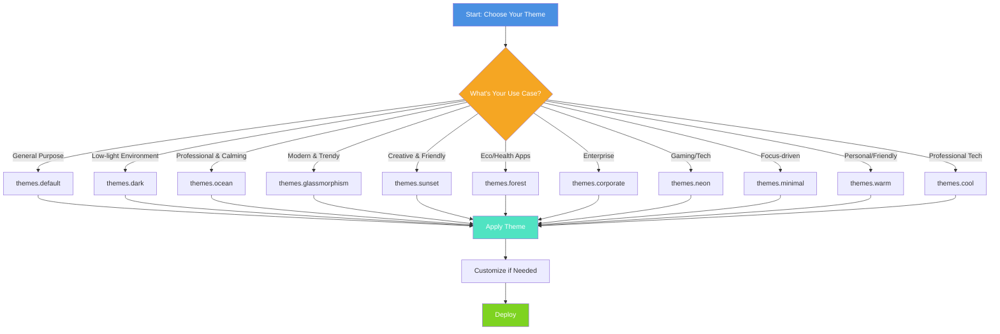

### Using Built-in Themes

```tsx
import { ThemeProvider, themes } from '@clarity-chat/react'

function App() {
  return (
    <ThemeProvider theme={themes.ocean}>
      <ChatWindow {...props} />
    </ThemeProvider>
  )
}
```

### Available Themes

| Theme | Description | Best For |
|-------|-------------|----------|
| `themes.default` | Clean, professional | General purpose |
| `themes.dark` | Dark mode | Low-light environments |
| `themes.ocean` | Blue ocean vibes | Calming, professional |
| `themes.glassmorphism` | Modern glass effect | Modern, trendy UIs |
| `themes.sunset` | Warm sunset colors | Creative, friendly apps |
| `themes.forest` | Green nature theme | Eco, health apps |
| `themes.corporate` | Professional business | Enterprise applications |
| `themes.neon` | Cyberpunk neon | Gaming, tech apps |
| `themes.minimal` | Ultra minimal | Focus-driven interfaces |
| `themes.warm` | Cozy warm tones | Personal, friendly apps |
| `themes.cool` | Cool blue/gray | Professional, tech apps |

### Theme Color Palettes Visualization

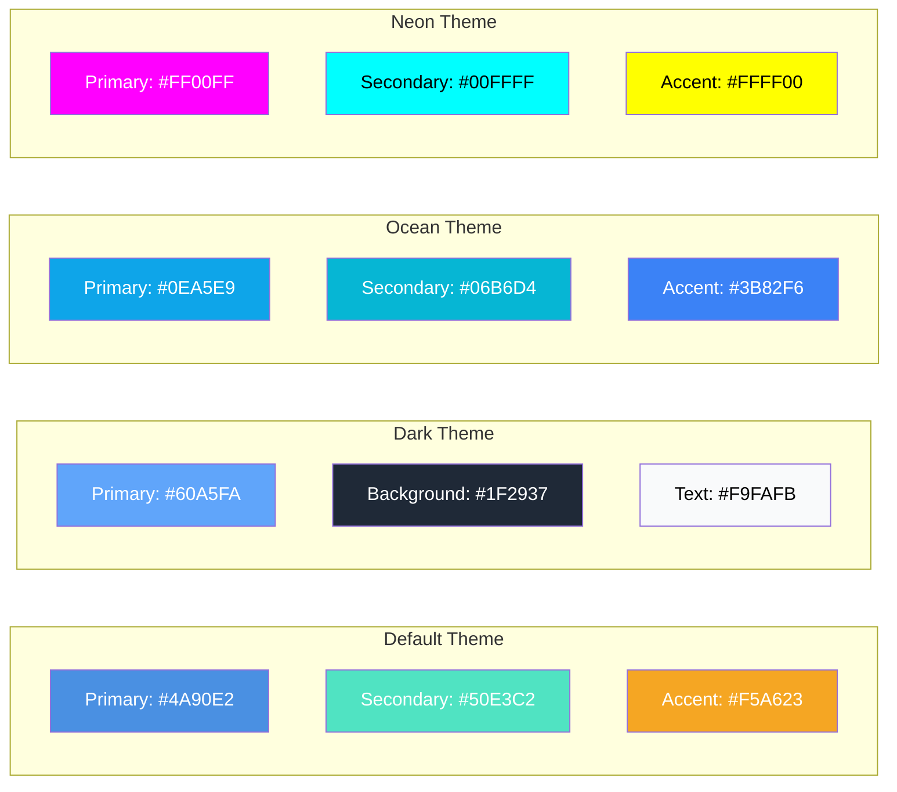

---

## 🛠️ Custom Themes

### Theme Architecture

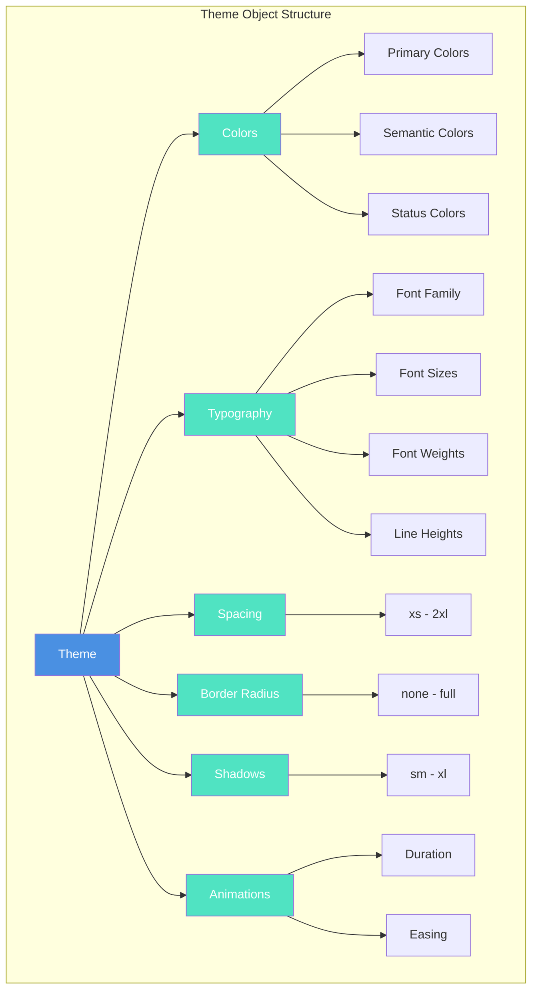

### Creating a Custom Theme

```tsx
import { createTheme, ThemeProvider } from '@clarity-chat/react'

const myTheme = createTheme({
  name: 'My Custom Theme',
  colors: {
    primary: '#6366f1',        // Main brand color
    secondary: '#8b5cf6',      // Secondary actions
    background: '#ffffff',     // Page background
    surface: '#f3f4f6',        // Card backgrounds
    text: '#111827',           // Primary text
    textSecondary: '#6b7280', // Secondary text
    accent: '#ec4899',         // Highlights
    success: '#10b981',        // Success states
    warning: '#f59e0b',        // Warning states
    error: '#ef4444',          // Error states
    border: '#e5e7eb',         // Borders
  },
  typography: {
    fontFamily: 'Inter, system-ui, sans-serif',
    fontSize: {
      xs: '0.75rem',
      sm: '0.875rem',
      base: '1rem',
      lg: '1.125rem',
      xl: '1.25rem',
      '2xl': '1.5rem',
    },
    fontWeight: {
      normal: 400,
      medium: 500,
      semibold: 600,
      bold: 700,
    },
    lineHeight: {
      tight: 1.25,
      normal: 1.5,
      relaxed: 1.75,
    },
  },
  spacing: {
    xs: '0.25rem',
    sm: '0.5rem',
    md: '1rem',
    lg: '1.5rem',
    xl: '2rem',
    '2xl': '3rem',
  },
  borderRadius: {
    none: '0',
    sm: '0.25rem',
    md: '0.5rem',
    lg: '0.75rem',
    xl: '1rem',
    full: '9999px',
  },
  shadows: {
    sm: '0 1px 2px 0 rgb(0 0 0 / 0.05)',
    md: '0 4px 6px -1px rgb(0 0 0 / 0.1)',
    lg: '0 10px 15px -3px rgb(0 0 0 / 0.1)',
    xl: '0 20px 25px -5px rgb(0 0 0 / 0.1)',
  },
  animations: {
    duration: {
      fast: '150ms',
      normal: '300ms',
      slow: '500ms',
    },
    easing: {
      default: 'cubic-bezier(0.4, 0, 0.2, 1)',
      in: 'cubic-bezier(0.4, 0, 1, 1)',
      out: 'cubic-bezier(0, 0, 0.2, 1)',
      inOut: 'cubic-bezier(0.4, 0, 0.2, 1)',
    },
  },
})

function App() {
  return (
    <ThemeProvider theme={myTheme}>
      <ChatWindow {...props} />
    </ThemeProvider>
  )
}
```

### Theme Creation Workflow

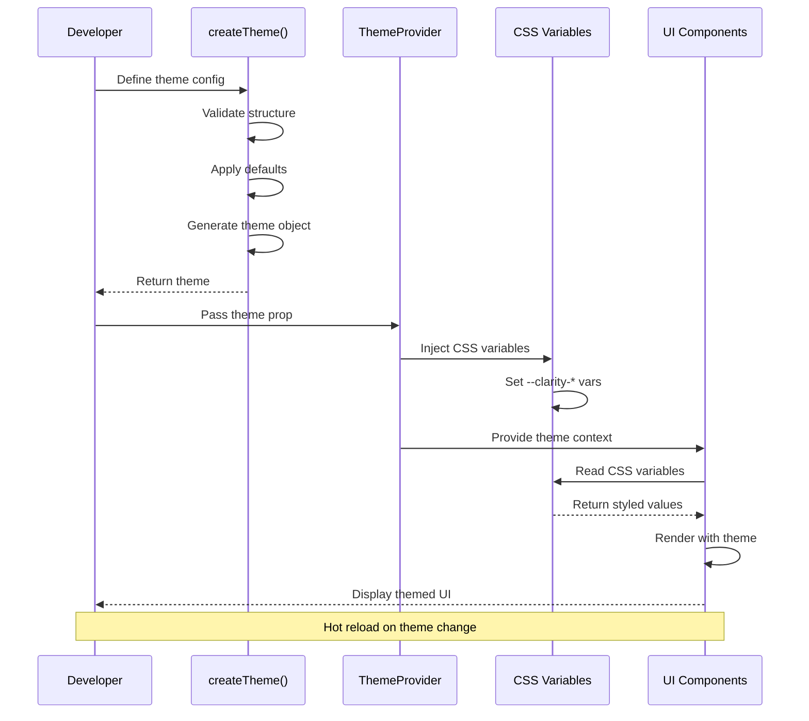

---

## 🎭 Dynamic Theme Switching

### Theme Switching Architecture

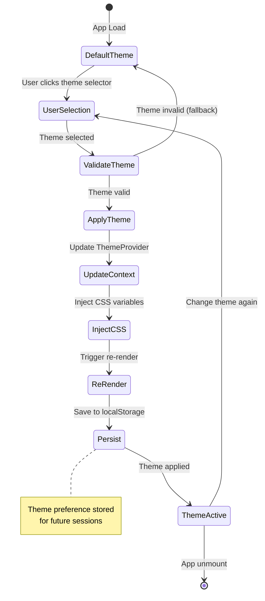

### Runtime Theme Switching

```tsx
import { useState } from 'react'
import { ThemeProvider, themes, ThemeSelector } from '@clarity-chat/react'

function App() {
  const [currentTheme, setCurrentTheme] = useState(themes.ocean)

  return (
    <ThemeProvider theme={currentTheme}>
      <div>
        {/* Theme selector component */}
        <ThemeSelector
          currentTheme={currentTheme}
          onThemeChange={setCurrentTheme}
          themes={Object.values(themes)}
        />
        
        <ChatWindow {...props} />
      </div>
    </ThemeProvider>
  )
}
```

### Persisting Theme Preference

```tsx
import { useLocalStorage } from '@clarity-chat/react'

function App() {
  const [themeName, setThemeName] = useLocalStorage('theme', 'ocean')
  const currentTheme = themes[themeName] || themes.ocean

  return (
    <ThemeProvider theme={currentTheme}>
      <ChatWindow {...props} />
    </ThemeProvider>
  )
}
```

### Theme Persistence Flow

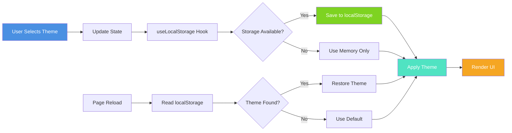

---

## 🌙 Dark Mode

### Dark Mode Detection Flow

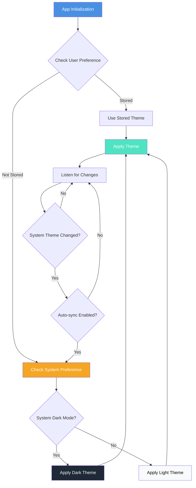

### Auto-detect System Preference

```tsx
import { useMediaQuery } from '@clarity-chat/react'

function App() {
  const isDarkMode = useMediaQuery('(prefers-color-scheme: dark)')
  const theme = isDarkMode ? themes.dark : themes.default

  return (
    <ThemeProvider theme={theme}>
      <ChatWindow {...props} />
    </ThemeProvider>
  )
}
```

### Manual Dark Mode Toggle

```tsx
function App() {
  const [isDark, setIsDark] = useState(false)

  return (
    <>
      <button onClick={() => setIsDark(!isDark)}>
        {isDark ? '☀️ Light' : '🌙 Dark'}
      </button>
      
      <ThemeProvider theme={isDark ? themes.dark : themes.default}>
        <ChatWindow {...props} />
      </ThemeProvider>
    </>
  )
}
```

---

## 🎨 Theme Editor

### Live Theme Customization

```tsx
import { ThemeEditor } from '@clarity-chat/react'

function ThemeCustomizer() {
  const [theme, setTheme] = useState(themes.ocean)

  return (
    <div className="grid grid-cols-2 gap-4">
      {/* Live preview */}
      <ThemeProvider theme={theme}>
        <ChatWindow {...props} />
      </ThemeProvider>
      
      {/* Theme editor */}
      <ThemeEditor
        theme={theme}
        onChange={setTheme}
        onSave={(theme) => {
          localStorage.setItem('custom-theme', JSON.stringify(theme))
        }}
      />
    </div>
  )
}
```

### Theme Editor Workflow

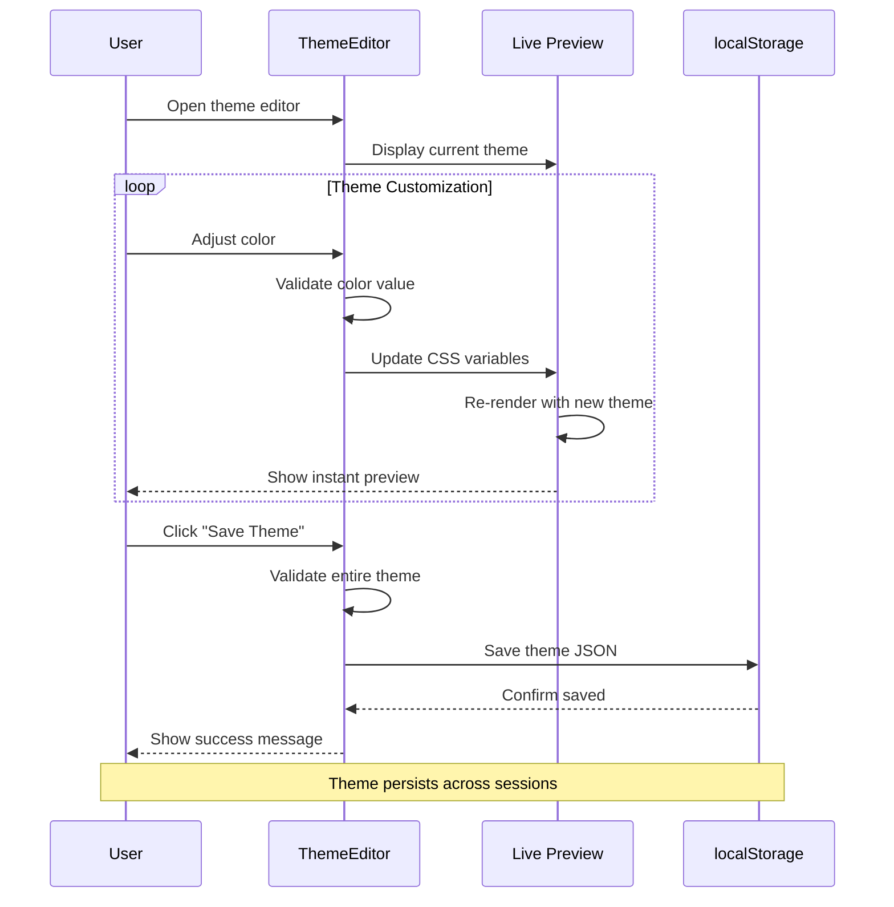

---

## 🎯 Theme Customization Patterns

### Theme Inheritance Hierarchy

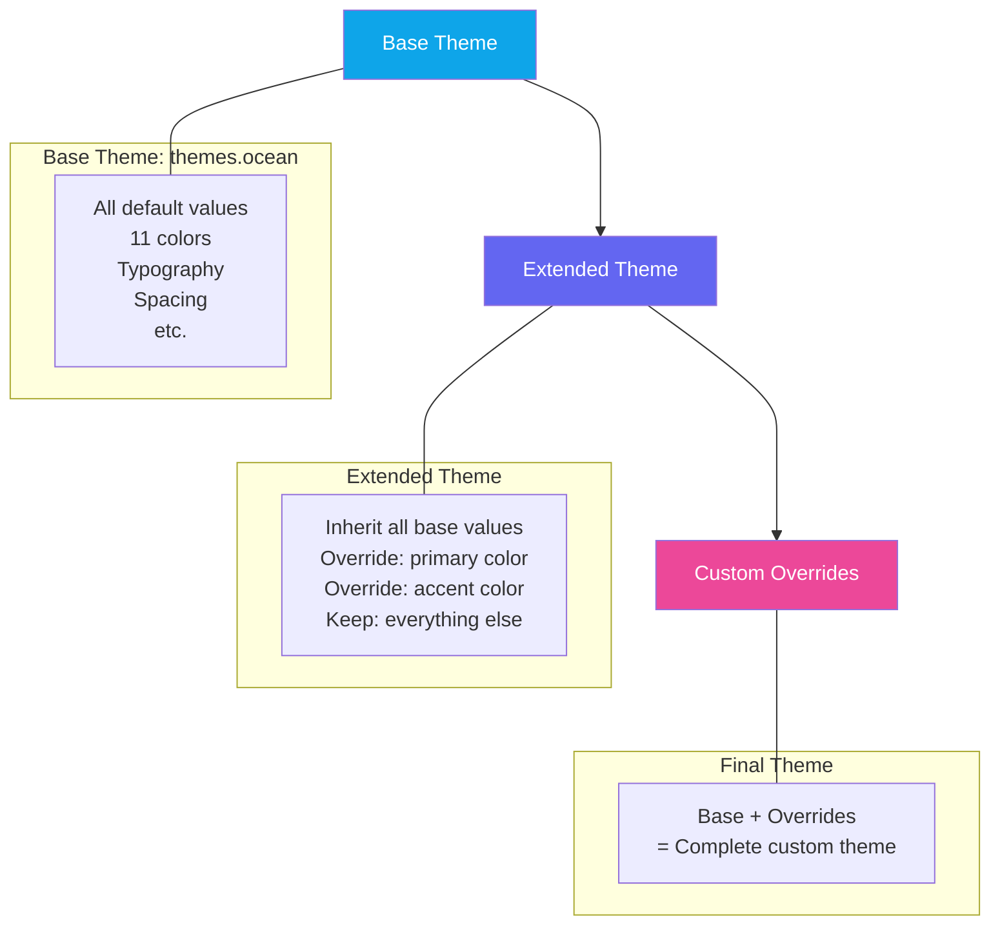

### Extending an Existing Theme

```tsx
import { themes, createTheme } from '@clarity-chat/react'

const myTheme = createTheme({
  ...themes.ocean,
  colors: {
    ...themes.ocean.colors,
    primary: '#your-brand-color',
    accent: '#your-accent-color',
  },
})
```

### Brand-Specific Theme

```tsx
const brandTheme = createTheme({
  name: 'Acme Corp',
  colors: {
    primary: '#FF6B35',      // Acme orange
    secondary: '#004E89',    // Acme blue
    background: '#FFFFFF',
    surface: '#F7F9FC',
    text: '#1A1A1A',
    accent: '#FF6B35',
  },
  typography: {
    fontFamily: 'Montserrat, sans-serif',
    // ... rest of config
  },
})
```

### Brand Theme Integration Flow

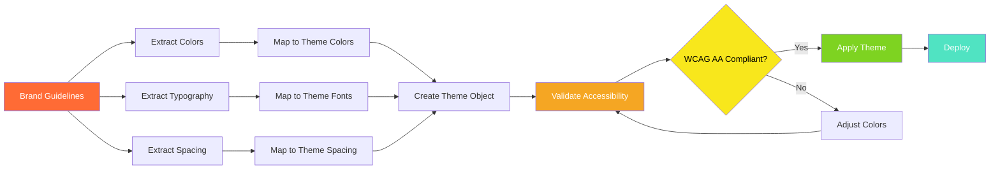

### Accessibility-Focused Theme

```tsx
const accessibleTheme = createTheme({
  name: 'High Contrast',
  colors: {
    // AAA contrast ratios (7:1)
    primary: '#0066CC',
    background: '#FFFFFF',
    text: '#000000',
    surface: '#F5F5F5',
    border: '#333333',
  },
  typography: {
    fontSize: {
      // Larger base size for readability
      base: '1.125rem',
      lg: '1.25rem',
      xl: '1.5rem',
    },
    lineHeight: {
      // Generous line height
      normal: 1.6,
      relaxed: 1.8,
    },
  },
})
```

### Accessibility Compliance Check

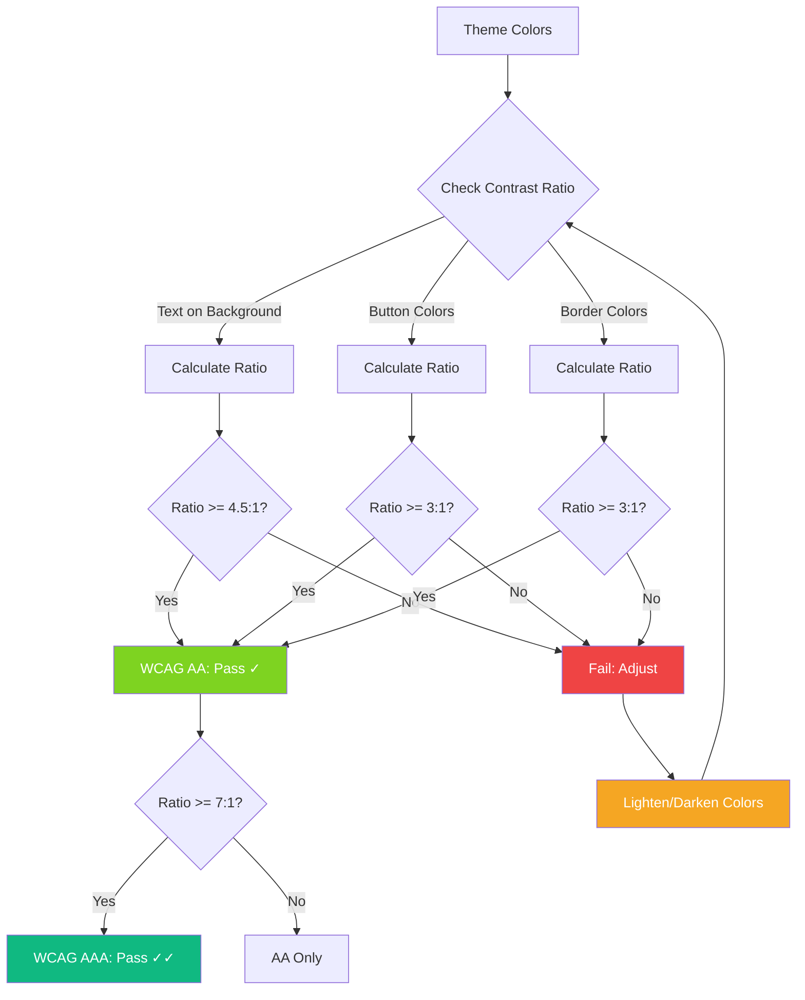

---

## 🔧 Advanced Customization

### CSS Variable Cascade

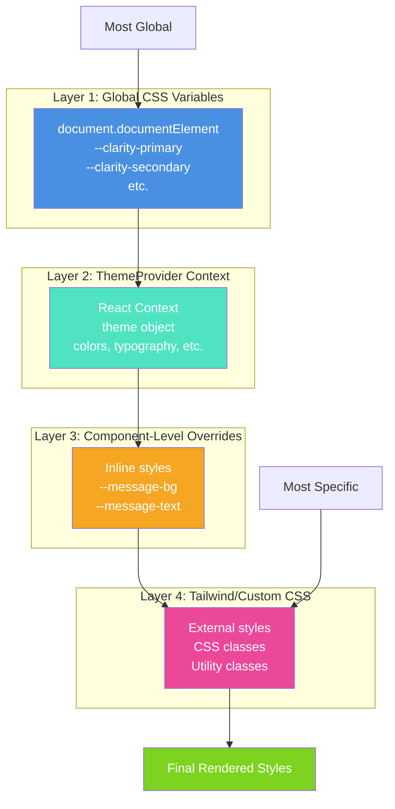

### CSS Variables

Clarity Chat themes are implemented using CSS variables, allowing runtime customization:

```tsx
function App() {
  useEffect(() => {
    // Dynamically change theme colors
    document.documentElement.style.setProperty('--clarity-primary', '#6366f1')
    document.documentElement.style.setProperty('--clarity-accent', '#ec4899')
  }, [])

  return <ChatWindow {...props} />
}
```

### Component-Level Overrides

```tsx
<ChatWindow
  className="chat-window"
  style={{
    '--message-bg': '#f0f0f0',
    '--message-text': '#333',
  } as React.CSSProperties}
  {...props}
/>
```

### Tailwind CSS Integration

If you're using Tailwind, extend your theme to match Clarity Chat:

```js
// tailwind.config.js
module.exports = {
  theme: {
    extend: {
      colors: {
        clarity: {
          primary: '#4A90E2',
          secondary: '#7ED321',
          accent: '#F5A623',
        },
      },
    },
  },
}
```

### Integration Architecture

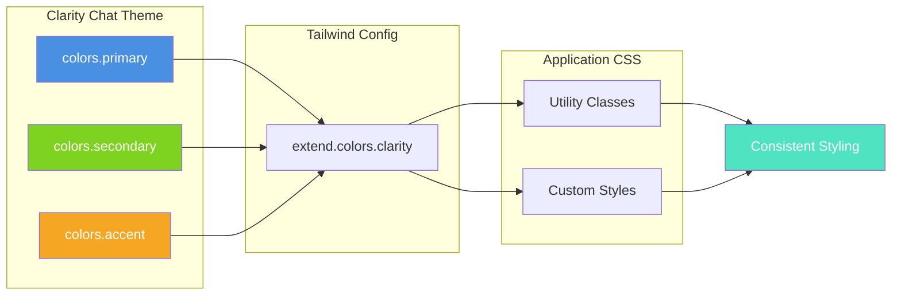

---

## 📚 Theme Type Reference

```typescript
interface Theme {
  name: string
  
  colors: {
    primary: string
    secondary: string
    background: string
    surface: string
    text: string
    textSecondary: string
    accent: string
    success: string
    warning: string
    error: string
    border: string
  }
  
  typography: {
    fontFamily: string
    fontSize: {
      xs: string
      sm: string
      base: string
      lg: string
      xl: string
      '2xl': string
    }
    fontWeight: {
      normal: number
      medium: number
      semibold: number
      bold: number
    }
    lineHeight: {
      tight: number
      normal: number
      relaxed: number
    }
  }
  
  spacing: {
    xs: string
    sm: string
    md: string
    lg: string
    xl: string
    '2xl': string
  }
  
  borderRadius: {
    none: string
    sm: string
    md: string
    lg: string
    xl: string
    full: string
  }
  
  shadows: {
    sm: string
    md: string
    lg: string
    xl: string
  }
  
  animations: {
    duration: {
      fast: string
      normal: string
      slow: string
    }
    easing: {
      default: string
      in: string
      out: string
      inOut: string
    }
  }
}
```

### Theme Type Hierarchy

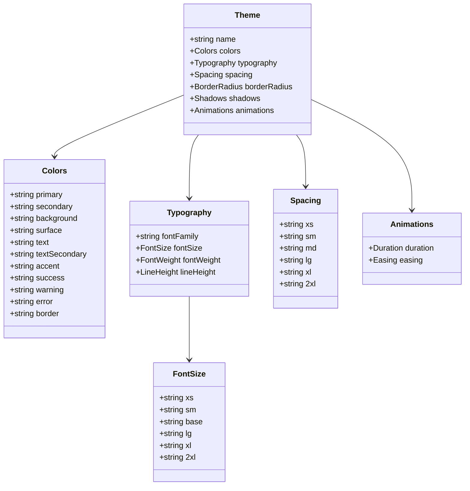

---

## 🎓 Best Practices

### Theme Development Checklist

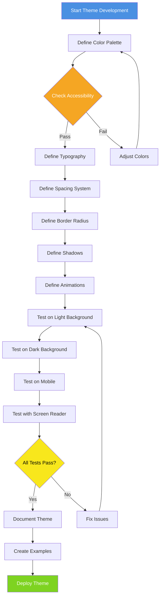

### ✅ Do's

- Use semantic color names (primary, accent, etc.)
- Maintain AAA contrast ratios for accessibility
- Test themes in both light and dark environments
- Provide fallback values for custom properties
- Keep theme configs in separate files
- Use TypeScript for type safety

### ❌ Don'ts

- Hard-code colors in components
- Mix theme systems (CSS vars + inline styles)
- Ignore color-blind accessibility
- Use too many color variations
- Forget to test on mobile devices

---

## 🔍 Examples

### E-commerce Theme

```tsx
const ecommerceTheme = createTheme({
  name: 'E-commerce',
  colors: {
    primary: '#FF6347',      // Tomato red for CTAs
    secondary: '#4CAF50',    // Success green
    accent: '#FFD700',       // Gold for highlights
    // ... rest of colors
  },
})
```

### Healthcare Theme

```tsx
const healthcareTheme = createTheme({
  name: 'Healthcare',
  colors: {
    primary: '#0077B6',      // Medical blue
    secondary: '#90E0EF',    // Light blue
    accent: '#00B4D8',       // Cyan
    // ... rest of colors
  },
})
```

### Industry-Specific Theme Comparison

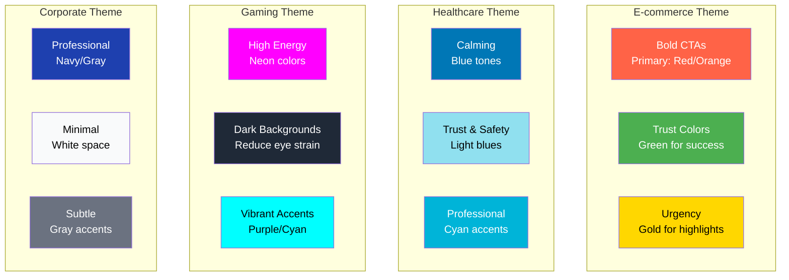

---

## 📖 Related Documentation

- [Components API](../api/components.md)
- [Accessibility Guide](./accessibility.md)
- [Examples](../examples/README.md)

---

**Need help with theming?** [Join our Discord](https://discord.gg/clarity-chat)
