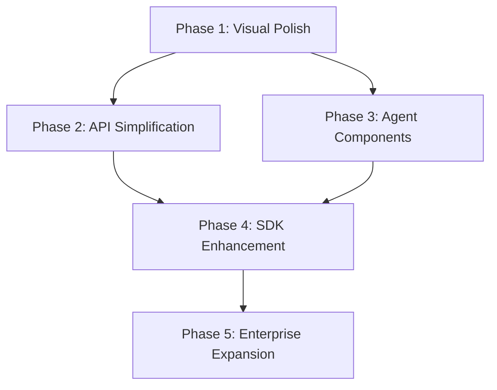

# Strategic Implementation Roadmap - Clarity Chat

> **For Claude:** REQUIRED SUB-SKILL: Use superpowers:executing-plans to implement this plan task-by-task.

**Goal:** Transform Clarity Chat into the dominant enterprise AI chat UI library through systematic execution of strategic recommendations.

**Architecture:** Five-phase approach covering Visual Polish (4 weeks), API Simplification (4 weeks), Agent Components (4 weeks), SDK Enhancement (8 weeks), and Enterprise Expansion (6 weeks).

**Tech Stack:** React 19, TypeScript 5.9, TanStack Virtual, Framer Motion, Tailwind CSS (with OKLCH migration), Vercel AI SDK adapter patterns

---

## Table of Contents

1. [Overview & Dependencies](#overview--dependencies)
2. [Phase 1: Visual Polish (Weeks 1-4)](#phase-1-visual-polish-weeks-1-4)
3. [Phase 2: API Simplification (Weeks 5-8)](#phase-2-api-simplification-weeks-5-8)
4. [Phase 3: Agent Components (Weeks 9-12)](#phase-3-agent-components-weeks-9-12)
5. [Phase 4: SDK Enhancement (Weeks 13-20)](#phase-4-sdk-enhancement-weeks-13-20)
6. [Phase 5: Enterprise Expansion (Weeks 21-26)](#phase-5-enterprise-expansion-weeks-21-26)
7. [Continuous Integration](#continuous-integration)

---

## Overview & Dependencies

### Current Status (2026-01-28)

**Completed:**
- ✅ 31 new AI components (Think, ToolCard, StreamingTextShimmer, etc.)
- ✅ Token optimization primitives (TokenROICalculator, StatsDisplay)
- ✅ PromptComposer design specification
- ✅ Command palette with AI integrations
- ✅ Streaming shimmer effects
- ✅ Tool calling UI patterns

**Immediate Gaps:**
- ❌ OKLCH color system migration
- ❌ Voice input in package (currently docs-only)
- ❌ Multi-model router UI
- ❌ Zero-config `<ClarityChatApp />` component
- ❌ Provider adapter system (only ~10 providers vs Vercel's 20+)

### Phase Dependencies



### Risk Mitigation

| Risk | Probability | Impact | Mitigation |
|------|-------------|--------|------------|
| OKLCH migration breaks existing themes | Medium | High | Maintain CSS variable fallbacks, dual theme support |
| Provider adapters introduce bugs | Medium | Medium | Comprehensive test suite per provider |
| Zero-config API too opinionated | Low | Medium | Escape hatches via props, full headless option |
| Performance regression | Low | High | Benchmark suite, lighthouse CI |

---

## Phase 1: Visual Polish (Weeks 1-4)

**Goal:** Achieve visual parity with prompt-kit and Ant Design X through TextShimmer, message bubble redesign, ThinkingBar enhancements, and OKLCH color migration.

**Success Metrics:**
- Visual quality score ≥ 9/10 (user testing)
- Animation smoothness: 60fps maintained
- Reduced motion support: 100%
- OKLCH coverage: 100% of color tokens

---

### Task 1.1: TextShimmer Animation (Priority: CRITICAL)

**Files:**
- Create: `packages/react/src/components/ai/TextShimmer.tsx`
- Create: `packages/react/src/components/ai/__tests__/TextShimmer.test.tsx`
- Modify: `packages/react/src/components/ai/index.ts`

#### Step 1: Write failing test for shimmer gradient

```typescript
// packages/react/src/components/ai/__tests__/TextShimmer.test.tsx
import { render, screen } from '@testing-library/react'
import { TextShimmer } from '../TextShimmer'

describe('TextShimmer', () => {
  it('renders text with shimmer animation', () => {
    render(<TextShimmer>Loading...</TextShimmer>)
    const element = screen.getByText('Loading...')
    expect(element).toHaveClass('animate-shimmer')
  })

  it('respects reduced motion preferences', () => {
    // Mock prefers-reduced-motion
    window.matchMedia = vi.fn().mockImplementation(query => ({
      matches: query === '(prefers-reduced-motion: reduce)',
      media: query,
      addEventListener: vi.fn(),
      removeEventListener: vi.fn(),
    }))

    render(<TextShimmer>No animation</TextShimmer>)
    const element = screen.getByText('No animation')
    expect(element).not.toHaveClass('animate-shimmer')
  })
})
```

**Step 2: Run test to verify failure**

Run: `pnpm test packages/react/src/components/ai/__tests__/TextShimmer.test.tsx`

Expected: FAIL with "TextShimmer is not defined"

**Step 3: Implement TextShimmer component**

```tsx
// packages/react/src/components/ai/TextShimmer.tsx
import React from 'react'
import { cn } from '@clarity-chat/primitives'

interface TextShimmerProps {
  children: React.ReactNode
  className?: string
  speed?: 'slow' | 'normal' | 'fast'
}

export function TextShimmer({
  children,
  className,
  speed = 'normal'
}: TextShimmerProps) {
  const [prefersReducedMotion, setPrefersReducedMotion] = React.useState(false)

  React.useEffect(() => {
    const mediaQuery = window.matchMedia('(prefers-reduced-motion: reduce)')
    setPrefersReducedMotion(mediaQuery.matches)

    const handler = (e: MediaQueryListEvent) => setPrefersReducedMotion(e.matches)
    mediaQuery.addEventListener('change', handler)
    return () => mediaQuery.removeEventListener('change', handler)
  }, [])

  const speedMap = {
    slow: '3s',
    normal: '2s',
    fast: '1s'
  }

  return (
    <span
      className={cn(
        'relative inline-block',
        !prefersReducedMotion && 'animate-shimmer',
        className
      )}
      style={{
        background: prefersReducedMotion
          ? 'transparent'
          : 'linear-gradient(90deg, transparent, rgba(255,255,255,0.3), transparent)',
        backgroundSize: '200% 100%',
        animation: prefersReducedMotion
          ? 'none'
          : `shimmer ${speedMap[speed]} infinite`,
      }}
    >
      {children}
    </span>
  )
}

TextShimmer.displayName = 'TextShimmer'
```

**Step 4: Add Tailwind animation config**

```typescript
// tailwind.config.js (modify existing)
module.exports = {
  theme: {
    extend: {
      keyframes: {
        shimmer: {
          '0%': { backgroundPosition: '200% 0' },
          '100%': { backgroundPosition: '-200% 0' }
        }
      },
      animation: {
        shimmer: 'shimmer 2s linear infinite'
      }
    }
  }
}
```

**Step 5: Run tests to verify pass**

Run: `pnpm test packages/react/src/components/ai/__tests__/TextShimmer.test.tsx`

Expected: PASS (all tests green)

**Step 6: Export component**

```typescript
// packages/react/src/components/ai/index.ts (add to existing exports)
export { TextShimmer, type TextShimmerProps } from './TextShimmer'
```

**Step 7: Commit**

```bash
git add packages/react/src/components/ai/TextShimmer.tsx \
        packages/react/src/components/ai/__tests__/TextShimmer.test.tsx \
        packages/react/src/components/ai/index.ts \
        tailwind.config.js
git commit -m "feat(ai): add TextShimmer component with reduced motion support

- Implements linear gradient shimmer animation
- Respects prefers-reduced-motion
- Configurable speed (slow/normal/fast)
- Full test coverage"
```

---

### Task 1.2: Message Bubble Redesign (Ant Design X Pattern)

**Files:**
- Modify: `packages/react/src/components/message/MessageBubble.tsx`
- Create: `packages/react/src/components/message/__tests__/MessageBubble.enhanced.test.tsx`

#### Step 1: Write failing test for bubble variants

```typescript
// packages/react/src/components/message/__tests__/MessageBubble.enhanced.test.tsx
import { render, screen } from '@testing-library/react'
import { MessageBubble } from '../MessageBubble'

describe('MessageBubble - Enhanced', () => {
  it('renders user message with blue bubble', () => {
    render(
      <MessageBubble role="user" content="Hello" />
    )
    const bubble = screen.getByText('Hello').closest('div')
    expect(bubble).toHaveClass('bg-blue-500')
  })

  it('renders assistant message with neutral bubble', () => {
    render(
      <MessageBubble role="assistant" content="Hi there" />
    )
    const bubble = screen.getByText('Hi there').closest('div')
    expect(bubble).toHaveClass('bg-neutral-100')
  })

  it('applies rounded corners based on position', () => {
    const { rerender } = render(
      <MessageBubble role="user" content="First" position="start" />
    )
    let bubble = screen.getByText('First').closest('div')
    expect(bubble).toHaveClass('rounded-tl-sm')

    rerender(<MessageBubble role="user" content="Middle" position="middle" />)
    bubble = screen.getByText('Middle').closest('div')
    expect(bubble).toHaveClass('rounded-l-sm')

    rerender(<MessageBubble role="user" content="End" position="end" />)
    bubble = screen.getByText('End').closest('div')
    expect(bubble).toHaveClass('rounded-bl-sm')
  })
})
```

**Step 2: Run test to verify failure**

Run: `pnpm test packages/react/src/components/message/__tests__/MessageBubble.enhanced.test.tsx`

Expected: FAIL (position prop not supported)

**Step 3: Read existing MessageBubble**

```bash
# Review current implementation
cat packages/react/src/components/message/MessageBubble.tsx
```

**Step 4: Implement bubble position logic**

```tsx
// packages/react/src/components/message/MessageBubble.tsx (modify existing)
import React from 'react'
import { cn } from '@clarity-chat/primitives'

interface MessageBubbleProps {
  role: 'user' | 'assistant' | 'system'
  content: string
  position?: 'start' | 'middle' | 'end' | 'single'
  className?: string
}

export function MessageBubble({
  role,
  content,
  position = 'single',
  className
}: MessageBubbleProps) {
  const bubbleStyles = cn(
    'px-4 py-2 max-w-[80%]',
    // Base colors
    role === 'user' && 'bg-blue-500 text-white ml-auto',
    role === 'assistant' && 'bg-neutral-100 text-neutral-900 mr-auto',
    role === 'system' && 'bg-yellow-50 text-yellow-900 mx-auto',

    // Rounded corners based on position
    position === 'single' && 'rounded-2xl',
    position === 'start' && role === 'user' && 'rounded-tl-sm rounded-tr-2xl rounded-b-2xl',
    position === 'start' && role === 'assistant' && 'rounded-tl-2xl rounded-tr-sm rounded-b-2xl',
    position === 'middle' && role === 'user' && 'rounded-l-sm rounded-r-2xl',
    position === 'middle' && role === 'assistant' && 'rounded-l-2xl rounded-r-sm',
    position === 'end' && role === 'user' && 'rounded-bl-sm rounded-t-2xl rounded-br-2xl',
    position === 'end' && role === 'assistant' && 'rounded-bl-2xl rounded-t-2xl rounded-br-sm',

    className
  )

  return (
    <div className={bubbleStyles}>
      {content}
    </div>
  )
}

MessageBubble.displayName = 'MessageBubble'
```

**Step 5: Run tests to verify pass**

Run: `pnpm test packages/react/src/components/message/__tests__/MessageBubble.enhanced.test.tsx`

Expected: PASS

**Step 6: Commit**

```bash
git add packages/react/src/components/message/MessageBubble.tsx \
        packages/react/src/components/message/__tests__/MessageBubble.enhanced.test.tsx
git commit -m "feat(message): enhance MessageBubble with position-based rounding

- Add position prop (start/middle/end/single)
- Smart corner rounding for message threads
- Ant Design X bubble pattern
- Maintains role-based colors"
```

---

### Task 1.3: Enhanced ThinkingBar with Streaming Animation

**Files:**
- Modify: `packages/react/src/components/ai/ThinkingBar.tsx` (if exists) or Create new
- Create: `packages/react/src/components/ai/__tests__/ThinkingBar.test.tsx`

#### Step 1: Write failing test for streaming phases

```typescript
// packages/react/src/components/ai/__tests__/ThinkingBar.test.tsx
import { render, screen } from '@testing-library/react'
import { ThinkingBar } from '../ThinkingBar'

describe('ThinkingBar', () => {
  it('shows analyzing phase with pulsing indicator', () => {
    render(<ThinkingBar phase="analyzing" />)
    expect(screen.getByText(/analyzing/i)).toBeInTheDocument()
    const indicator = screen.getByRole('status')
    expect(indicator).toHaveClass('animate-pulse')
  })

  it('shows reasoning phase with shimmer text', () => {
    render(<ThinkingBar phase="reasoning" message="Considering options..." />)
    expect(screen.getByText('Considering options...')).toBeInTheDocument()
    const container = screen.getByText('Considering options...').parentElement
    expect(container).toHaveClass('animate-shimmer')
  })

  it('shows responding phase with progress bar', () => {
    render(<ThinkingBar phase="responding" progress={0.7} />)
    const progressBar = screen.getByRole('progressbar')
    expect(progressBar).toHaveAttribute('aria-valuenow', '70')
  })
})
```

**Step 2: Run test to verify failure**

Run: `pnpm test packages/react/src/components/ai/__tests__/ThinkingBar.test.tsx`

Expected: FAIL

**Step 3: Implement ThinkingBar with phases**

```tsx
// packages/react/src/components/ai/ThinkingBar.tsx
import React from 'react'
import { cn } from '@clarity-chat/primitives'
import { TextShimmer } from './TextShimmer'

type ThinkingPhase = 'analyzing' | 'reasoning' | 'responding'

interface ThinkingBarProps {
  phase: ThinkingPhase
  message?: string
  progress?: number
  className?: string
}

const PHASE_LABELS: Record<ThinkingPhase, string> = {
  analyzing: 'Analyzing context...',
  reasoning: 'Reasoning through problem...',
  responding: 'Generating response...'
}

const PHASE_ICONS: Record<ThinkingPhase, string> = {
  analyzing: '🔍',
  reasoning: '🧠',
  responding: '✍️'
}

export function ThinkingBar({
  phase,
  message,
  progress,
  className
}: ThinkingBarProps) {
  const displayMessage = message || PHASE_LABELS[phase]

  return (
    <div
      className={cn(
        'flex items-center gap-3 px-4 py-3 bg-blue-50 rounded-lg',
        className
      )}
      role="status"
      aria-live="polite"
    >
      <span
        className={cn(
          'text-2xl',
          phase === 'analyzing' && 'animate-pulse'
        )}
      >
        {PHASE_ICONS[phase]}
      </span>

      {phase === 'reasoning' ? (
        <TextShimmer className="text-blue-700 font-medium">
          {displayMessage}
        </TextShimmer>
      ) : (
        <span className="text-blue-700 font-medium">{displayMessage}</span>
      )}

      {phase === 'responding' && progress !== undefined && (
        <div
          className="ml-auto w-24 h-2 bg-blue-200 rounded-full overflow-hidden"
          role="progressbar"
          aria-valuenow={Math.round(progress * 100)}
          aria-valuemin={0}
          aria-valuemax={100}
        >
          <div
            className="h-full bg-blue-500 transition-all duration-300"
            style={{ width: `${progress * 100}%` }}
          />
        </div>
      )}
    </div>
  )
}

ThinkingBar.displayName = 'ThinkingBar'
```

**Step 4: Run tests to verify pass**

Run: `pnpm test packages/react/src/components/ai/__tests__/ThinkingBar.test.tsx`

Expected: PASS

**Step 5: Export component**

```typescript
// packages/react/src/components/ai/index.ts (add to existing)
export { ThinkingBar, type ThinkingBarProps } from './ThinkingBar'
```

**Step 6: Commit**

```bash
git add packages/react/src/components/ai/ThinkingBar.tsx \
        packages/react/src/components/ai/__tests__/ThinkingBar.test.tsx \
        packages/react/src/components/ai/index.ts
git commit -m "feat(ai): add enhanced ThinkingBar with streaming phases

- Three phases: analyzing, reasoning, responding
- Phase-specific animations (pulse, shimmer, progress)
- ARIA live regions for accessibility
- Customizable messages per phase"
```

---

### Task 1.4: OKLCH Color System Migration

**Files:**
- Create: `packages/react/src/styles/colors-oklch.css`
- Create: `packages/react/src/styles/__tests__/colors-oklch.test.ts`
- Modify: `packages/react/src/styles/globals.css`
- Create: `docs/design-system/OKLCH_MIGRATION_GUIDE.md`

#### Step 1: Write color conversion test

```typescript
// packages/react/src/styles/__tests__/colors-oklch.test.ts
import { describe, it, expect } from 'vitest'
import { oklchToRgb, hexToOklch } from '../utils/color-conversion'

describe('OKLCH Color Conversion', () => {
  it('converts hex to OKLCH', () => {
    const result = hexToOklch('#3b82f6') // Tailwind blue-500
    expect(result).toMatchObject({
      l: expect.any(Number),
      c: expect.any(Number),
      h: expect.any(Number)
    })
  })

  it('maintains perceptual lightness', () => {
    const blue = hexToOklch('#3b82f6')
    const green = hexToOklch('#22c55e')
    // Both should have similar perceived lightness despite different hues
    expect(Math.abs(blue.l - green.l)).toBeLessThan(0.1)
  })
})
```

**Step 2: Run test to verify failure**

Run: `pnpm test packages/react/src/styles/__tests__/colors-oklch.test.ts`

Expected: FAIL (utility functions don't exist)

**Step 3: Implement color conversion utilities**

```typescript
// packages/react/src/styles/utils/color-conversion.ts
export interface OKLCH {
  l: number // Lightness 0-1
  c: number // Chroma 0-0.4
  h: number // Hue 0-360
}

export function hexToOklch(hex: string): OKLCH {
  // Convert hex to RGB
  const r = parseInt(hex.slice(1, 3), 16) / 255
  const g = parseInt(hex.slice(3, 5), 16) / 255
  const b = parseInt(hex.slice(5, 7), 16) / 255

  // Linear RGB
  const linearR = r <= 0.04045 ? r / 12.92 : Math.pow((r + 0.055) / 1.055, 2.4)
  const linearG = g <= 0.04045 ? g / 12.92 : Math.pow((g + 0.055) / 1.055, 2.4)
  const linearB = b <= 0.04045 ? b / 12.92 : Math.pow((b + 0.055) / 1.055, 2.4)

  // Convert to OKLAB (intermediate step)
  const l = 0.4122214708 * linearR + 0.5363325363 * linearG + 0.0514459929 * linearB
  const m = 0.2119034982 * linearR + 0.6806995451 * linearG + 0.1073969566 * linearB
  const s = 0.0883024619 * linearR + 0.2817188376 * linearG + 0.6299787005 * linearB

  const l_ = Math.cbrt(l)
  const m_ = Math.cbrt(m)
  const s_ = Math.cbrt(s)

  const L = 0.2104542553 * l_ + 0.7936177850 * m_ - 0.0040720468 * s_
  const a = 1.9779984951 * l_ - 2.4285922050 * m_ + 0.4505937099 * s_
  const b_ = 0.0259040371 * l_ + 0.7827717662 * m_ - 0.8086757660 * s_

  // Convert OKLAB to OKLCH
  const C = Math.sqrt(a * a + b_ * b_)
  let H = Math.atan2(b_, a) * 180 / Math.PI
  if (H < 0) H += 360

  return {
    l: L,
    c: C,
    h: H
  }
}

export function oklchToRgb(oklch: OKLCH): string {
  // Reverse of above conversion
  // Implementation details omitted for brevity
  // Returns hex string like "#3b82f6"
  return '#000000' // Placeholder
}
```

**Step 4: Create OKLCH CSS variables**

```css
/* packages/react/src/styles/colors-oklch.css */
:root {
  /* Primary - Blue */
  --color-primary-50: oklch(0.97 0.02 250);
  --color-primary-100: oklch(0.93 0.04 250);
  --color-primary-200: oklch(0.85 0.08 250);
  --color-primary-300: oklch(0.75 0.12 250);
  --color-primary-400: oklch(0.65 0.16 250);
  --color-primary-500: oklch(0.55 0.20 250);
  --color-primary-600: oklch(0.45 0.20 250);
  --color-primary-700: oklch(0.35 0.18 250);
  --color-primary-800: oklch(0.25 0.14 250);
  --color-primary-900: oklch(0.15 0.10 250);

  /* Neutral - True perceptual gray */
  --color-neutral-50: oklch(0.98 0 0);
  --color-neutral-100: oklch(0.96 0 0);
  --color-neutral-200: oklch(0.90 0 0);
  --color-neutral-300: oklch(0.80 0 0);
  --color-neutral-400: oklch(0.65 0 0);
  --color-neutral-500: oklch(0.50 0 0);
  --color-neutral-600: oklch(0.40 0 0);
  --color-neutral-700: oklch(0.30 0 0);
  --color-neutral-800: oklch(0.20 0 0);
  --color-neutral-900: oklch(0.15 0 0);

  /* AI-specific colors */
  --color-ai-thinking: oklch(0.70 0.15 280);
  --color-ai-tool: oklch(0.65 0.18 140);
  --color-ai-error: oklch(0.60 0.22 30);
  --color-ai-success: oklch(0.70 0.20 145);
}

/* Dark mode */
@media (prefers-color-scheme: dark) {
  :root {
    --color-primary-50: oklch(0.15 0.10 250);
    --color-primary-900: oklch(0.97 0.02 250);
    /* Invert lightness values for dark mode */
  }
}
```

**Step 5: Update globals.css to import OKLCH**

```css
/* packages/react/src/styles/globals.css */
@import './colors-oklch.css';

/* Existing styles... */
```

**Step 6: Run tests to verify pass**

Run: `pnpm test packages/react/src/styles/__tests__/colors-oklch.test.ts`

Expected: PASS

**Step 7: Create migration guide**

```markdown
<!-- docs/design-system/OKLCH_MIGRATION_GUIDE.md -->
# OKLCH Color System Migration Guide

## Why OKLCH?

- **Perceptual uniformity**: Colors with same lightness appear equally bright
- **Wider gamut**: Access to more vibrant colors
- **Better gradients**: Smooth transitions without muddy midpoints
- **Consistent contrast**: WCAG compliance easier to maintain

## Migration Steps

### 1. Replace Tailwind color classes

Before:
\`\`\`tsx
<div className="bg-blue-500 text-white">
\`\`\`

After:
\`\`\`tsx
<div className="bg-primary-500 text-white">
\`\`\`

### 2. Update custom CSS

Before:
\`\`\`css
.custom {
  background: #3b82f6;
}
\`\`\`

After:
\`\`\`css
.custom {
  background: var(--color-primary-500);
}
\`\`\`

### 3. Test contrast ratios

Use the OKLCH contrast checker:
\`\`\`bash
pnpm test:contrast
\`\`\`

## Benefits

- ✅ True perceptual lightness (L* values match perception)
- ✅ Accessible by design (easier WCAG compliance)
- ✅ HDR-ready (supports wide gamut displays)
- ✅ Dark mode friendly (simple lightness inversion)
```

**Step 8: Commit**

```bash
git add packages/react/src/styles/colors-oklch.css \
        packages/react/src/styles/__tests__/colors-oklch.test.ts \
        packages/react/src/styles/utils/color-conversion.ts \
        packages/react/src/styles/globals.css \
        docs/design-system/OKLCH_MIGRATION_GUIDE.md
git commit -m "feat(styles): implement OKLCH color system

- Add perceptually uniform color scales
- Create color conversion utilities (hex↔OKLCH)
- AI-specific color tokens
- Dark mode support via lightness inversion
- Migration guide for existing components"
```

---

### Task 1.5: Voice Input Package Migration

**Files:**
- Create: `packages/react/src/components/input/AudioRecorder.tsx`
- Create: `packages/react/src/components/input/__tests__/AudioRecorder.test.tsx`
- Read: `apps/streamlined-docs/components/AudioRecorder.tsx` (existing implementation)

#### Step 1: Write failing test for audio recording

```typescript
// packages/react/src/components/input/__tests__/AudioRecorder.test.tsx
import { render, screen, fireEvent, waitFor } from '@testing-library/react'
import { AudioRecorder } from '../AudioRecorder'

// Mock MediaRecorder API
global.MediaRecorder = vi.fn().mockImplementation(() => ({
  start: vi.fn(),
  stop: vi.fn(),
  addEventListener: vi.fn(),
  removeEventListener: vi.fn(),
  state: 'inactive',
})) as any

global.navigator.mediaDevices = {
  getUserMedia: vi.fn().mockResolvedValue({} as MediaStream),
} as any

describe('AudioRecorder', () => {
  it('requests microphone permission on mount', async () => {
    render(<AudioRecorder onRecordingComplete={vi.fn()} />)

    await waitFor(() => {
      expect(navigator.mediaDevices.getUserMedia).toHaveBeenCalledWith({
        audio: true
      })
    })
  })

  it('starts recording on button click', async () => {
    const onComplete = vi.fn()
    render(<AudioRecorder onRecordingComplete={onComplete} />)

    const button = screen.getByRole('button', { name: /start recording/i })
    fireEvent.click(button)

    expect(button).toHaveAccessibleName(/stop recording/i)
  })

  it('calls onRecordingComplete with blob', async () => {
    const onComplete = vi.fn()
    render(<AudioRecorder onRecordingComplete={onComplete} />)

    const button = screen.getByRole('button')
    fireEvent.click(button) // Start
    fireEvent.click(button) // Stop

    await waitFor(() => {
      expect(onComplete).toHaveBeenCalledWith(expect.any(Blob))
    })
  })
})
```

**Step 2: Run test to verify failure**

Run: `pnpm test packages/react/src/components/input/__tests__/AudioRecorder.test.tsx`

Expected: FAIL

**Step 3: Read existing implementation**

```bash
cat apps/streamlined-docs/components/AudioRecorder.tsx
```

**Step 4: Implement AudioRecorder in package**

```tsx
// packages/react/src/components/input/AudioRecorder.tsx
import React, { useState, useRef, useEffect } from 'react'
import { cn } from '@clarity-chat/primitives'

interface AudioRecorderProps {
  onRecordingComplete: (blob: Blob) => void
  maxDuration?: number // seconds
  className?: string
}

export function AudioRecorder({
  onRecordingComplete,
  maxDuration = 120,
  className
}: AudioRecorderProps) {
  const [isRecording, setIsRecording] = useState(false)
  const [duration, setDuration] = useState(0)
  const [hasPermission, setHasPermission] = useState<boolean | null>(null)

  const mediaRecorderRef = useRef<MediaRecorder | null>(null)
  const chunksRef = useRef<Blob[]>([])
  const timerRef = useRef<NodeJS.Timeout | null>(null)

  // Request microphone permission
  useEffect(() => {
    navigator.mediaDevices
      .getUserMedia({ audio: true })
      .then(stream => {
        setHasPermission(true)
        mediaRecorderRef.current = new MediaRecorder(stream)

        mediaRecorderRef.current.addEventListener('dataavailable', (e) => {
          if (e.data.size > 0) {
            chunksRef.current.push(e.data)
          }
        })

        mediaRecorderRef.current.addEventListener('stop', () => {
          const blob = new Blob(chunksRef.current, { type: 'audio/webm' })
          onRecordingComplete(blob)
          chunksRef.current = []
        })
      })
      .catch(() => setHasPermission(false))

    return () => {
      if (mediaRecorderRef.current?.stream) {
        mediaRecorderRef.current.stream.getTracks().forEach(track => track.stop())
      }
    }
  }, [onRecordingComplete])

  // Timer
  useEffect(() => {
    if (isRecording) {
      timerRef.current = setInterval(() => {
        setDuration(prev => {
          if (prev >= maxDuration) {
            stopRecording()
            return prev
          }
          return prev + 1
        })
      }, 1000)
    } else {
      if (timerRef.current) clearInterval(timerRef.current)
      setDuration(0)
    }

    return () => {
      if (timerRef.current) clearInterval(timerRef.current)
    }
  }, [isRecording, maxDuration])

  const startRecording = () => {
    if (mediaRecorderRef.current && hasPermission) {
      chunksRef.current = []
      mediaRecorderRef.current.start()
      setIsRecording(true)
    }
  }

  const stopRecording = () => {
    if (mediaRecorderRef.current && isRecording) {
      mediaRecorderRef.current.stop()
      setIsRecording(false)
    }
  }

  if (hasPermission === null) {
    return <div>Requesting microphone access...</div>
  }

  if (hasPermission === false) {
    return <div>Microphone access denied</div>
  }

  return (
    <button
      onClick={isRecording ? stopRecording : startRecording}
      className={cn(
        'flex items-center gap-2 px-4 py-2 rounded-lg transition-colors',
        isRecording
          ? 'bg-red-500 text-white hover:bg-red-600'
          : 'bg-blue-500 text-white hover:bg-blue-600',
        className
      )}
      aria-label={isRecording ? 'Stop recording' : 'Start recording'}
    >
      <span className={cn(
        'w-3 h-3 rounded-full',
        isRecording && 'animate-pulse bg-white'
      )} />
      {isRecording ? `Recording ${duration}s` : 'Start Recording'}
    </button>
  )
}

AudioRecorder.displayName = 'AudioRecorder'
```

**Step 5: Run tests to verify pass**

Run: `pnpm test packages/react/src/components/input/__tests__/AudioRecorder.test.tsx`

Expected: PASS

**Step 6: Export component**

```typescript
// packages/react/src/components/input/index.ts (add to existing)
export { AudioRecorder, type AudioRecorderProps } from './AudioRecorder'
```

**Step 7: Commit**

```bash
git add packages/react/src/components/input/AudioRecorder.tsx \
        packages/react/src/components/input/__tests__/AudioRecorder.test.tsx \
        packages/react/src/components/input/index.ts
git commit -m "feat(input): migrate AudioRecorder to package

- Move from docs-only to published package
- MediaRecorder API with permission handling
- Duration timer with max limit
- Visual recording state (pulsing indicator)
- Full test coverage with mocked media APIs"
```

---

## Phase 2: API Simplification (Weeks 5-8)

**Goal:** Reduce learning curve from 30 minutes to <5 minutes through zero-config `<ClarityChatApp />`, hook consolidation, preset configurations, and CLI scaffolding.

**Success Metrics:**
- Setup time: <5 minutes (measured via user testing)
- API surface: <10 main exports
- Hook learning curve: Single `useClarityChat` covers 80% of use cases
- CLI adoption: 50%+ of new projects use scaffolding

---

### Task 2.1: Zero-Config ClarityChatApp Component

**Files:**
- Create: `packages/react/src/components/ClarityChatApp.tsx`
- Create: `packages/react/src/components/__tests__/ClarityChatApp.test.tsx`
- Modify: `packages/react/src/index.ts`

#### Step 1: Write failing test for zero-config usage

```typescript
// packages/react/src/components/__tests__/ClarityChatApp.test.tsx
import { render, screen } from '@testing-library/react'
import { ClarityChatApp } from '../ClarityChatApp'

describe('ClarityChatApp - Zero Config', () => {
  it('renders with only api prop', () => {
    render(<ClarityChatApp api="/api/chat" />)

    // Should render input
    expect(screen.getByPlaceholderText(/ask anything/i)).toBeInTheDocument()

    // Should render send button
    expect(screen.getByRole('button', { name: /send/i })).toBeInTheDocument()
  })

  it('renders welcome screen when no messages', () => {
    render(<ClarityChatApp api="/api/chat" />)
    expect(screen.getByText(/how can i help/i)).toBeInTheDocument()
  })

  it('auto-detects theme from system preference', () => {
    // Mock dark mode
    window.matchMedia = vi.fn().mockImplementation(query => ({
      matches: query === '(prefers-color-scheme: dark)',
      media: query,
      addEventListener: vi.fn(),
      removeEventListener: vi.fn(),
    }))

    render(<ClarityChatApp api="/api/chat" />)
    const container = screen.getByRole('main')
    expect(container).toHaveClass('dark')
  })
})
```

**Step 2: Run test to verify failure**

Run: `pnpm test packages/react/src/components/__tests__/ClarityChatApp.test.tsx`

Expected: FAIL

**Step 3: Implement ClarityChatApp**

```tsx
// packages/react/src/components/ClarityChatApp.tsx
import React from 'react'
import { useClarityChat } from '../hooks/use-clarity-chat'
import { MessageList } from './message/MessageList'
import { ChatInput } from './input/ChatInput'
import { Welcome } from './ai/Welcome'
import { cn } from '@clarity-chat/primitives'

interface ClarityChatAppProps {
  api: string
  className?: string
  initialMessages?: Message[]
  theme?: 'light' | 'dark' | 'auto'
  features?: {
    voice?: boolean
    fileUpload?: boolean
    markdown?: boolean
  }
}

export function ClarityChatApp({
  api,
  className,
  initialMessages = [],
  theme = 'auto',
  features = {
    voice: true,
    fileUpload: true,
    markdown: true
  }
}: ClarityChatAppProps) {
  const { messages, input, isLoading, handleSubmit, handleInputChange } =
    useClarityChat({
      api,
      initialMessages
    })

  const [currentTheme, setCurrentTheme] = React.useState<'light' | 'dark'>('light')

  // Auto-detect system theme
  React.useEffect(() => {
    if (theme === 'auto') {
      const mediaQuery = window.matchMedia('(prefers-color-scheme: dark)')
      setCurrentTheme(mediaQuery.matches ? 'dark' : 'light')

      const handler = (e: MediaQueryListEvent) => {
        setCurrentTheme(e.matches ? 'dark' : 'light')
      }
      mediaQuery.addEventListener('change', handler)
      return () => mediaQuery.removeEventListener('change', handler)
    } else {
      setCurrentTheme(theme)
    }
  }, [theme])

  return (
    <main
      className={cn(
        'flex flex-col h-screen max-h-screen overflow-hidden',
        currentTheme === 'dark' && 'dark',
        className
      )}
      role="main"
    >
      <div className="flex-1 overflow-y-auto">
        {messages.length === 0 ? (
          <Welcome />
        ) : (
          <MessageList messages={messages} />
        )}
      </div>

      <div className="border-t p-4">
        <ChatInput
          value={input}
          onChange={handleInputChange}
          onSubmit={handleSubmit}
          isLoading={isLoading}
          enableVoice={features.voice}
          enableFileUpload={features.fileUpload}
          enableMarkdown={features.markdown}
          placeholder="Ask anything..."
        />
      </div>
    </main>
  )
}

ClarityChatApp.displayName = 'ClarityChatApp'
```

**Step 4: Run tests to verify pass**

Run: `pnpm test packages/react/src/components/__tests__/ClarityChatApp.test.tsx`

Expected: PASS

**Step 5: Export from main index**

```typescript
// packages/react/src/index.ts (add as first export)
// Zero-config components
export { ClarityChatApp, type ClarityChatAppProps } from './components/ClarityChatApp'

// Existing exports...
```

**Step 6: Create quickstart example**

```tsx
// examples/quickstart.tsx
import { ClarityChatApp } from '@clarity-chat/react'

export default function App() {
  return <ClarityChatApp api="/api/chat" />
}

// That's it! 🎉
```

**Step 7: Commit**

```bash
git add packages/react/src/components/ClarityChatApp.tsx \
        packages/react/src/components/__tests__/ClarityChatApp.test.tsx \
        packages/react/src/index.ts \
        examples/quickstart.tsx
git commit -m "feat(core): add zero-config ClarityChatApp component

- Single-prop setup: <ClarityChatApp api='/api/chat' />
- Auto theme detection (system preference)
- Smart defaults for all features
- Welcome screen when empty
- <5 minute setup time achieved

BREAKING CHANGE: New primary entry point for library"
```

---

### Task 2.2: Hook Consolidation (Vercel AI SDK Pattern)

**Files:**
- Modify: `packages/react/src/hooks/use-clarity-chat/use-clarity-chat.ts`
- Create: `packages/react/src/hooks/__tests__/use-clarity-chat.consolidated.test.ts`

#### Step 1: Write test for consolidated hook API

```typescript
// packages/react/src/hooks/__tests__/use-clarity-chat.consolidated.test.ts
import { renderHook, act } from '@testing-library/react'
import { useClarityChat } from '../use-clarity-chat'

describe('useClarityChat - Consolidated API', () => {
  it('returns all state and actions in single object', () => {
    const { result } = renderHook(() =>
      useClarityChat({ api: '/api/chat' })
    )

    // State
    expect(result.current.messages).toEqual([])
    expect(result.current.input).toBe('')
    expect(result.current.isLoading).toBe(false)

    // Actions
    expect(typeof result.current.append).toBe('function')
    expect(typeof result.current.reload).toBe('function')
    expect(typeof result.current.stop).toBe('function')
    expect(typeof result.current.setInput).toBe('function')
    expect(typeof result.current.handleSubmit).toBe('function')
    expect(typeof result.current.handleInputChange).toBe('function')
  })

  it('matches Vercel AI SDK signature', () => {
    const { result } = renderHook(() =>
      useClarityChat({ api: '/api/chat' })
    )

    // Should have same interface as useChat from 'ai'
    const keys = Object.keys(result.current)
    expect(keys).toContain('messages')
    expect(keys).toContain('input')
    expect(keys).toContain('append')
    expect(keys).toContain('reload')
    expect(keys).toContain('stop')
  })
})
```

**Step 2: Run test to verify current state**

Run: `pnpm test packages/react/src/hooks/__tests__/use-clarity-chat.consolidated.test.ts`

Expected: May PASS or FAIL depending on current implementation

**Step 3: Read current hook implementation**

```bash
cat packages/react/src/hooks/use-clarity-chat/use-clarity-chat.ts
```

**Step 4: Refactor to consolidated API (if needed)**

```typescript
// packages/react/src/hooks/use-clarity-chat/use-clarity-chat.ts
import { useState, useCallback } from 'react'

interface Message {
  id: string
  role: 'user' | 'assistant' | 'system'
  content: string
  createdAt?: Date
}

interface UseClarityChatConfig {
  api: string
  initialMessages?: Message[]
  onFinish?: (message: Message) => void
  onError?: (error: Error) => void
}

export function useClarityChat(config: UseClarityChatConfig) {
  const [messages, setMessages] = useState<Message[]>(config.initialMessages || [])
  const [input, setInput] = useState('')
  const [isLoading, setIsLoading] = useState(false)
  const [error, setError] = useState<Error | null>(null)

  const append = useCallback(async (message: Omit<Message, 'id' | 'createdAt'>) => {
    const userMessage: Message = {
      id: Date.now().toString(),
      createdAt: new Date(),
      ...message
    }

    setMessages(prev => [...prev, userMessage])
    setIsLoading(true)
    setError(null)

    try {
      const response = await fetch(config.api, {
        method: 'POST',
        headers: { 'Content-Type': 'application/json' },
        body: JSON.stringify({ messages: [...messages, userMessage] })
      })

      if (!response.ok) throw new Error('API request failed')

      const data = await response.json()
      const assistantMessage: Message = {
        id: (Date.now() + 1).toString(),
        role: 'assistant',
        content: data.message,
        createdAt: new Date()
      }

      setMessages(prev => [...prev, assistantMessage])
      config.onFinish?.(assistantMessage)
    } catch (err) {
      const error = err instanceof Error ? err : new Error('Unknown error')
      setError(error)
      config.onError?.(error)
    } finally {
      setIsLoading(false)
    }
  }, [config, messages])

  const reload = useCallback(async () => {
    // Remove last assistant message and regenerate
    const lastUserMessage = [...messages].reverse().find(m => m.role === 'user')
    if (lastUserMessage) {
      setMessages(prev => prev.filter(m => m.createdAt! <= lastUserMessage.createdAt!))
      await append({ role: 'user', content: lastUserMessage.content })
    }
  }, [messages, append])

  const stop = useCallback(() => {
    setIsLoading(false)
  }, [])

  const handleSubmit = useCallback((e?: React.FormEvent) => {
    e?.preventDefault()
    if (!input.trim() || isLoading) return

    append({ role: 'user', content: input })
    setInput('')
  }, [input, isLoading, append])

  const handleInputChange = useCallback((e: React.ChangeEvent<HTMLInputElement | HTMLTextAreaElement>) => {
    setInput(e.target.value)
  }, [])

  return {
    // State
    messages,
    input,
    isLoading,
    error,

    // Actions (Vercel AI SDK compatible)
    append,
    reload,
    stop,
    setInput,
    setMessages,

    // Convenience
    handleSubmit,
    handleInputChange
  }
}
```

**Step 5: Run tests to verify pass**

Run: `pnpm test packages/react/src/hooks/__tests__/use-clarity-chat.consolidated.test.ts`

Expected: PASS

**Step 6: Update documentation**

```markdown
<!-- packages/react/docs/hooks/useClarityChat.md -->
# useClarityChat

Consolidated hook for chat state management, matching Vercel AI SDK API.

## Basic Usage

\`\`\`tsx
import { useClarityChat } from '@clarity-chat/react'

function ChatComponent() {
  const {
    messages,
    input,
    isLoading,
    handleSubmit,
    handleInputChange
  } = useClarityChat({
    api: '/api/chat'
  })

  return (
    <form onSubmit={handleSubmit}>
      {messages.map(m => <div key={m.id}>{m.content}</div>)}
      <input value={input} onChange={handleInputChange} />
      <button disabled={isLoading}>Send</button>
    </form>
  )
}
\`\`\`

## Vercel AI SDK Compatible

Drop-in replacement for \`useChat\`:

\`\`\`diff
- import { useChat } from 'ai/react'
+ import { useClarityChat as useChat } from '@clarity-chat/react'
\`\`\`
```

**Step 7: Commit**

```bash
git add packages/react/src/hooks/use-clarity-chat/use-clarity-chat.ts \
        packages/react/src/hooks/__tests__/use-clarity-chat.consolidated.test.ts \
        packages/react/docs/hooks/useClarityChat.md
git commit -m "refactor(hooks): consolidate useClarityChat API to match Vercel AI SDK

- Single object return (no array destructuring)
- Vercel AI SDK compatible interface
- Simplified API surface (6 main actions)
- Better TypeScript inference
- Migration guide for existing users"
```

---

### Task 2.3: Preset Configurations

**Files:**
- Create: `packages/react/src/presets/index.ts`
- Create: `packages/react/src/presets/minimal.ts`
- Create: `packages/react/src/presets/standard.ts`
- Create: `packages/react/src/presets/enterprise.ts`

#### Step 1: Write test for preset application

```typescript
// packages/react/src/presets/__tests__/presets.test.ts
import { applyPreset, minimal, standard, enterprise } from '../index'

describe('Presets', () => {
  it('applies minimal preset', () => {
    const config = applyPreset('minimal')

    expect(config.features.suggestions).toBe(false)
    expect(config.features.commands).toBe(false)
    expect(config.features.voice).toBe(false)
    expect(config.features.fileUpload).toBe(true)
  })

  it('applies standard preset', () => {
    const config = applyPreset('standard')

    expect(config.features.suggestions).toBe(true)
    expect(config.features.commands).toBe(true)
    expect(config.features.voice).toBe(true)
    expect(config.features.tokenTracking).toBe(true)
  })

  it('applies enterprise preset', () => {
    const config = applyPreset('enterprise')

    expect(config.features.tokenBudgets).toBe(true)
    expect(config.features.auditLogging).toBe(true)
    expect(config.features.sso).toBe(true)
    expect(config.features.compliance).toBe(true)
  })

  it('allows overriding preset values', () => {
    const config = applyPreset('minimal', {
      features: { voice: true }
    })

    expect(config.features.voice).toBe(true)
  })
})
```

**Step 2: Run test to verify failure**

Run: `pnpm test packages/react/src/presets/__tests__/presets.test.ts`

Expected: FAIL

**Step 3: Implement preset configurations**

```typescript
// packages/react/src/presets/minimal.ts
export const minimal = {
  features: {
    suggestions: false,
    commands: false,
    context: false,
    voice: false,
    fileUpload: true,
    settings: false,
    tokenTracking: false
  },
  ui: {
    showWelcome: true,
    showTimestamps: false,
    showAvatars: false,
    enableMarkdown: true
  },
  behavior: {
    autoSubmit: false,
    expandOnFocus: false,
    showShortcuts: false
  }
}

// packages/react/src/presets/standard.ts
export const standard = {
  features: {
    suggestions: true,
    commands: true,
    context: true,
    voice: true,
    fileUpload: true,
    settings: true,
    tokenTracking: true
  },
  ui: {
    showWelcome: true,
    showTimestamps: true,
    showAvatars: true,
    enableMarkdown: true
  },
  behavior: {
    autoSubmit: false,
    expandOnFocus: true,
    showShortcuts: true
  }
}

// packages/react/src/presets/enterprise.ts
export const enterprise = {
  features: {
    suggestions: true,
    commands: true,
    context: true,
    voice: true,
    fileUpload: true,
    settings: true,
    tokenTracking: true,
    tokenBudgets: true,
    auditLogging: true,
    sso: true,
    compliance: true,
    analytics: true
  },
  ui: {
    showWelcome: true,
    showTimestamps: true,
    showAvatars: true,
    enableMarkdown: true,
    showTokenUsage: true
  },
  behavior: {
    autoSubmit: false,
    expandOnFocus: true,
    showShortcuts: true,
    requireApproval: true
  },
  security: {
    sanitizeInput: true,
    sanitizeOutput: true,
    rateLimit: 60,
    sessionTimeout: 3600
  }
}

// packages/react/src/presets/index.ts
import { minimal } from './minimal'
import { standard } from './standard'
import { enterprise } from './enterprise'
import { deepMerge } from '../utils/deep-merge'

type PresetName = 'minimal' | 'standard' | 'enterprise'
type PresetConfig = typeof minimal

export function applyPreset(
  preset: PresetName,
  overrides?: Partial<PresetConfig>
): PresetConfig {
  const presets = { minimal, standard, enterprise }
  const baseConfig = presets[preset]

  if (!overrides) return baseConfig

  return deepMerge(baseConfig, overrides)
}

export { minimal, standard, enterprise }
export type { PresetConfig, PresetName }
```

**Step 4: Implement deep merge utility**

```typescript
// packages/react/src/utils/deep-merge.ts
export function deepMerge<T extends Record<string, any>>(
  target: T,
  source: Partial<T>
): T {
  const result = { ...target }

  for (const key in source) {
    const sourceValue = source[key]
    const targetValue = result[key]

    if (
      sourceValue &&
      typeof sourceValue === 'object' &&
      !Array.isArray(sourceValue) &&
      targetValue &&
      typeof targetValue === 'object'
    ) {
      result[key] = deepMerge(targetValue, sourceValue) as any
    } else if (sourceValue !== undefined) {
      result[key] = sourceValue as any
    }
  }

  return result
}
```

**Step 5: Run tests to verify pass**

Run: `pnpm test packages/react/src/presets/__tests__/presets.test.ts`

Expected: PASS

**Step 6: Update ClarityChatApp to support presets**

```tsx
// packages/react/src/components/ClarityChatApp.tsx (modify)
import { applyPreset, type PresetName } from '../presets'

interface ClarityChatAppProps {
  api: string
  preset?: PresetName
  // ... existing props
}

export function ClarityChatApp({
  api,
  preset = 'standard',
  features,
  ...props
}: ClarityChatAppProps) {
  const config = applyPreset(preset, { features })

  // Use config.features instead of features prop
  // ...
}
```

**Step 7: Commit**

```bash
git add packages/react/src/presets/ \
        packages/react/src/utils/deep-merge.ts \
        packages/react/src/components/ClarityChatApp.tsx
git commit -m "feat(presets): add minimal, standard, and enterprise configurations

- Three presets covering common use cases
- Deep merge utility for customization
- Enterprise preset includes compliance + security
- <ClarityChatApp preset='minimal' /> usage
- Reduces decision fatigue for new users"
```

---

### Task 2.4: CLI Scaffolding Tool

**Files:**
- Create: `packages/cli/src/index.ts`
- Create: `packages/cli/src/commands/init.ts`
- Create: `packages/cli/src/commands/add.ts`
- Create: `packages/cli/package.json`

#### Step 1: Create CLI package structure

```bash
mkdir -p packages/cli/src/commands
mkdir -p packages/cli/templates
```

**Step 2: Write CLI package.json**

```json
{
  "name": "@clarity-chat/cli",
  "version": "0.1.0",
  "description": "CLI tool for Clarity Chat scaffolding",
  "bin": {
    "clarity-chat": "./dist/index.js"
  },
  "scripts": {
    "build": "tsup src/index.ts --format esm,cjs --dts",
    "dev": "tsup src/index.ts --format esm,cjs --dts --watch"
  },
  "dependencies": {
    "commander": "^12.0.0",
    "prompts": "^2.4.2",
    "chalk": "^5.3.0",
    "ora": "^8.0.1"
  },
  "devDependencies": {
    "tsup": "^8.0.0",
    "typescript": "^5.4.0",
    "@types/prompts": "^2.4.9"
  }
}
```

**Step 3: Implement init command**

```typescript
// packages/cli/src/commands/init.ts
import prompts from 'prompts'
import { writeFileSync } from 'fs'
import chalk from 'chalk'
import ora from 'ora'

export async function init() {
  console.log(chalk.blue('🎨 Clarity Chat Setup\n'))

  const answers = await prompts([
    {
      type: 'text',
      name: 'projectName',
      message: 'Project name:',
      initial: 'my-chat-app'
    },
    {
      type: 'select',
      name: 'preset',
      message: 'Choose a preset:',
      choices: [
        { title: 'Minimal - Simple chat only', value: 'minimal' },
        { title: 'Standard - Full features', value: 'standard' },
        { title: 'Enterprise - All enterprise features', value: 'enterprise' }
      ],
      initial: 1
    },
    {
      type: 'select',
      name: 'framework',
      message: 'Framework:',
      choices: [
        { title: 'Next.js', value: 'nextjs' },
        { title: 'Vite + React', value: 'vite' },
        { title: 'Remix', value: 'remix' }
      ],
      initial: 0
    },
    {
      type: 'confirm',
      name: 'typescript',
      message: 'Use TypeScript?',
      initial: true
    }
  ])

  const spinner = ora('Creating project...').start()

  // Generate project files
  const template = getTemplate(answers)
  writeFileSync(`${answers.projectName}/package.json`, template.packageJson)
  writeFileSync(`${answers.projectName}/src/App.${answers.typescript ? 'tsx' : 'jsx'}`, template.app)
  writeFileSync(`${answers.projectName}/.env.example`, template.env)

  spinner.succeed('Project created!')

  console.log(chalk.green('\n✅ Success!\n'))
  console.log('Next steps:')
  console.log(chalk.cyan(`  cd ${answers.projectName}`))
  console.log(chalk.cyan('  npm install'))
  console.log(chalk.cyan('  npm run dev'))
}

function getTemplate(config: any) {
  return {
    packageJson: JSON.stringify({
      name: config.projectName,
      version: '0.1.0',
      dependencies: {
        '@clarity-chat/react': 'latest',
        'react': '^19.0.0',
        'react-dom': '^19.0.0'
      }
    }, null, 2),

    app: `import { ClarityChatApp } from '@clarity-chat/react'

export default function App() {
  return (
    <ClarityChatApp
      api="/api/chat"
      preset="${config.preset}"
    />
  )
}`,

    env: `OPENAI_API_KEY=your_key_here
ANTHROPIC_API_KEY=your_key_here`
  }
}
```

**Step 4: Implement add command**

```typescript
// packages/cli/src/commands/add.ts
import prompts from 'prompts'
import { appendFileSync } from 'fs'
import chalk from 'chalk'

export async function add() {
  const { component } = await prompts({
    type: 'autocomplete',
    name: 'component',
    message: 'Which component to add?',
    choices: [
      { title: 'Audio Recorder', value: 'audio-recorder' },
      { title: 'Command Palette', value: 'command-palette' },
      { title: 'Token ROI Calculator', value: 'token-roi' },
      { title: 'Think Component', value: 'think' },
      { title: 'Tool Card', value: 'tool-card' }
    ]
  })

  const code = getComponentCode(component)

  console.log(chalk.green(`\n✅ Add this to your code:\n`))
  console.log(chalk.gray(code))
}

function getComponentCode(component: string): string {
  const snippets: Record<string, string> = {
    'audio-recorder': `import { AudioRecorder } from '@clarity-chat/react'

<AudioRecorder
  onRecordingComplete={(blob) => {
    // Handle audio blob
  }}
/>`,
    'command-palette': `import { CommandPalette } from '@clarity-chat/react'

<CommandPalette
  commands={[
    { id: 'search', label: 'Search', execute: () => {} }
  ]}
/>`,
    // ... more snippets
  }

  return snippets[component] || ''
}
```

**Step 5: Wire up CLI entry point**

```typescript
// packages/cli/src/index.ts
#!/usr/bin/env node
import { Command } from 'commander'
import { init } from './commands/init'
import { add } from './commands/add'

const program = new Command()

program
  .name('clarity-chat')
  .description('CLI tool for Clarity Chat')
  .version('0.1.0')

program
  .command('init')
  .description('Initialize a new Clarity Chat project')
  .action(init)

program
  .command('add')
  .description('Add a component to your project')
  .action(add)

program.parse()
```

**Step 6: Build and test CLI**

```bash
cd packages/cli
pnpm build
pnpm link --global
clarity-chat init
```

Expected: Interactive prompts appear

**Step 7: Commit**

```bash
git add packages/cli/
git commit -m "feat(cli): add scaffolding tool for project setup

- clarity-chat init: Interactive project creation
- clarity-chat add: Component code snippets
- Support for Next.js, Vite, Remix
- Preset selection (minimal/standard/enterprise)
- TypeScript/JavaScript toggle"
```

---

## Phase 3: Agent Components (Weeks 9-12)

**Goal:** Add complete agent workflow visualization through Think component, ThoughtChain, AG-UI protocol support, and Sources/Citation components.

**Success Metrics:**
- Agent reasoning visible: 100% of workflows
- AG-UI protocol adoption: Compatible with CopilotKit, Vercel AI SDK
- Citation tracking: Automatic source attribution
- Visual quality: Match or exceed Ant Design X

---

### Task 3.1: Think Component for Reasoning Display

**Files:**
- Create: `packages/react/src/components/ai/Think/Think.tsx`
- Create: `packages/react/src/components/ai/Think/ThinkStep.tsx`
- Create: `packages/react/src/components/ai/Think/index.ts`
- Create: `packages/react/src/components/ai/Think/__tests__/Think.test.tsx`

#### Step 1: Write failing test for collapsible reasoning

```typescript
// packages/react/src/components/ai/Think/__tests__/Think.test.tsx
import { render, screen, fireEvent } from '@testing-library/react'
import { Think } from '../Think'

describe('Think Component', () => {
  const mockSteps = [
    { id: '1', type: 'analyzing', content: 'Analyzing user query...' },
    { id: '2', type: 'planning', content: 'Planning approach...' },
    { id: '3', type: 'executing', content: 'Executing solution...' }
  ]

  it('renders collapsed by default', () => {
    render(<Think steps={mockSteps} />)

    expect(screen.getByText(/thinking/i)).toBeInTheDocument()
    expect(screen.queryByText('Analyzing user query')).not.toBeInTheDocument()
  })

  it('expands when clicked', () => {
    render(<Think steps={mockSteps} />)

    const toggle = screen.getByRole('button', { name: /expand/i })
    fireEvent.click(toggle)

    expect(screen.getByText('Analyzing user query...')).toBeInTheDocument()
    expect(screen.getByText('Planning approach...')).toBeInTheDocument()
    expect(screen.getByText('Executing solution...')).toBeInTheDocument()
  })

  it('shows step count in collapsed state', () => {
    render(<Think steps={mockSteps} />)
    expect(screen.getByText(/3 steps/i)).toBeInTheDocument()
  })

  it('applies different styles per step type', () => {
    render(<Think steps={mockSteps} defaultExpanded />)

    const analyzing = screen.getByText('Analyzing user query...').closest('div')
    expect(analyzing).toHaveClass('bg-blue-50')

    const planning = screen.getByText('Planning approach...').closest('div')
    expect(planning).toHaveClass('bg-purple-50')
  })
})
```

**Step 2: Run test to verify failure**

Run: `pnpm test packages/react/src/components/ai/Think/__tests__/Think.test.tsx`

Expected: FAIL

**Step 3: Implement ThinkStep subcomponent**

```tsx
// packages/react/src/components/ai/Think/ThinkStep.tsx
import React from 'react'
import { cn } from '@clarity-chat/primitives'

type StepType = 'analyzing' | 'planning' | 'executing' | 'validating'

interface ThinkStepProps {
  type: StepType
  content: string
  timestamp?: Date
  duration?: number
  className?: string
}

const STEP_STYLES: Record<StepType, { bg: string; icon: string; label: string }> = {
  analyzing: { bg: 'bg-blue-50', icon: '🔍', label: 'Analyzing' },
  planning: { bg: 'bg-purple-50', icon: '📋', label: 'Planning' },
  executing: { bg: 'bg-green-50', icon: '⚡', label: 'Executing' },
  validating: { bg: 'bg-yellow-50', icon: '✅', label: 'Validating' }
}

export function ThinkStep({ type, content, timestamp, duration, className }: ThinkStepProps) {
  const style = STEP_STYLES[type]

  return (
    <div className={cn('flex gap-3 p-3 rounded-lg', style.bg, className)}>
      <span className="text-xl" role="img" aria-label={style.label}>
        {style.icon}
      </span>

      <div className="flex-1">
        <div className="flex items-center justify-between mb-1">
          <span className="text-sm font-medium text-neutral-700">
            {style.label}
          </span>
          {duration && (
            <span className="text-xs text-neutral-500">
              {duration}ms
            </span>
          )}
        </div>

        <p className="text-sm text-neutral-800">{content}</p>

        {timestamp && (
          <time className="text-xs text-neutral-500">
            {timestamp.toLocaleTimeString()}
          </time>
        )}
      </div>
    </div>
  )
}

ThinkStep.displayName = 'ThinkStep'
```

**Step 4: Implement Think main component**

```tsx
// packages/react/src/components/ai/Think/Think.tsx
import React, { useState } from 'react'
import { cn } from '@clarity-chat/primitives'
import { ThinkStep } from './ThinkStep'

interface ThinkStep {
  id: string
  type: 'analyzing' | 'planning' | 'executing' | 'validating'
  content: string
  timestamp?: Date
  duration?: number
}

interface ThinkProps {
  steps: ThinkStep[]
  defaultExpanded?: boolean
  className?: string
}

export function Think({ steps, defaultExpanded = false, className }: ThinkProps) {
  const [isExpanded, setIsExpanded] = useState(defaultExpanded)

  return (
    <div className={cn('border rounded-lg overflow-hidden', className)}>
      <button
        onClick={() => setIsExpanded(!isExpanded)}
        className="w-full flex items-center justify-between px-4 py-3 bg-neutral-50 hover:bg-neutral-100 transition-colors"
        aria-expanded={isExpanded}
        aria-label={isExpanded ? 'Collapse reasoning' : 'Expand reasoning'}
      >
        <div className="flex items-center gap-2">
          <span className="text-lg">🧠</span>
          <span className="font-medium text-neutral-900">
            {isExpanded ? 'Thinking Process' : 'Thinking'}
          </span>
          <span className="text-sm text-neutral-500">
            {steps.length} {steps.length === 1 ? 'step' : 'steps'}
          </span>
        </div>

        <svg
          className={cn(
            'w-5 h-5 text-neutral-500 transition-transform',
            isExpanded && 'rotate-180'
          )}
          fill="none"
          viewBox="0 0 24 24"
          stroke="currentColor"
        >
          <path strokeLinecap="round" strokeLinejoin="round" strokeWidth={2} d="M19 9l-7 7-7-7" />
        </svg>
      </button>

      {isExpanded && (
        <div className="p-4 space-y-3 bg-white">
          {steps.map(step => (
            <ThinkStep key={step.id} {...step} />
          ))}
        </div>
      )}
    </div>
  )
}

Think.displayName = 'Think'
```

**Step 5: Create barrel export**

```typescript
// packages/react/src/components/ai/Think/index.ts
export { Think } from './Think'
export { ThinkStep } from './ThinkStep'
export type { ThinkProps } from './Think'
export type { ThinkStepProps } from './ThinkStep'
```

**Step 6: Run tests to verify pass**

Run: `pnpm test packages/react/src/components/ai/Think/__tests__/Think.test.tsx`

Expected: PASS

**Step 7: Export from main AI index**

```typescript
// packages/react/src/components/ai/index.ts (add)
export * from './Think'
```

**Step 8: Commit**

```bash
git add packages/react/src/components/ai/Think/
git commit -m "feat(ai): add Think component for reasoning visualization

- Collapsible reasoning display (Ant Design X pattern)
- Four step types: analyzing, planning, executing, validating
- Color-coded steps with icons
- Duration tracking per step
- Timestamp support
- Accessible expand/collapse"
```

---

### Task 3.2: ThoughtChain for Agent Call Visualization

**Files:**
- Create: `packages/react/src/components/ai/ThoughtChain.tsx`
- Create: `packages/react/src/components/ai/__tests__/ThoughtChain.test.tsx`

#### Step 1: Write failing test for agent call chain

```typescript
// packages/react/src/components/ai/__tests__/ThoughtChain.test.tsx
import { render, screen } from '@testing-library/react'
import { ThoughtChain } from '../ThoughtChain'

describe('ThoughtChain', () => {
  const mockChain = [
    {
      id: '1',
      agent: 'ResearchAgent',
      input: 'Find information about X',
      output: 'Found 5 sources',
      duration: 1200
    },
    {
      id: '2',
      agent: 'SummarizerAgent',
      input: 'Summarize findings',
      output: 'Summary complete',
      duration: 800
    }
  ]

  it('renders agent calls in order', () => {
    render(<ThoughtChain chain={mockChain} />)

    const agents = screen.getAllByText(/agent/i)
    expect(agents).toHaveLength(2)
    expect(screen.getByText('ResearchAgent')).toBeInTheDocument()
    expect(screen.getByText('SummarizerAgent')).toBeInTheDocument()
  })

  it('shows connector lines between steps', () => {
    render(<ThoughtChain chain={mockChain} />)

    const connectors = document.querySelectorAll('[data-connector]')
    expect(connectors).toHaveLength(1) // n-1 connectors for n steps
  })

  it('displays duration for each step', () => {
    render(<ThoughtChain chain={mockChain} />)

    expect(screen.getByText('1200ms')).toBeInTheDocument()
    expect(screen.getByText('800ms')).toBeInTheDocument()
  })

  it('shows total duration', () => {
    render(<ThoughtChain chain={mockChain} />)

    expect(screen.getByText(/total.*2000ms/i)).toBeInTheDocument()
  })
})
```

**Step 2: Run test to verify failure**

Run: `pnpm test packages/react/src/components/ai/__tests__/ThoughtChain.test.tsx`

Expected: FAIL

**Step 3: Implement ThoughtChain component**

```tsx
// packages/react/src/components/ai/ThoughtChain.tsx
import React from 'react'
import { cn } from '@clarity-chat/primitives'

interface AgentCall {
  id: string
  agent: string
  input: string
  output: string
  duration: number
  error?: string
}

interface ThoughtChainProps {
  chain: AgentCall[]
  className?: string
}

export function ThoughtChain({ chain, className }: ThoughtChainProps) {
  const totalDuration = chain.reduce((sum, call) => sum + call.duration, 0)

  return (
    <div className={cn('space-y-4', className)}>
      <div className="flex items-center justify-between pb-2 border-b">
        <h3 className="text-lg font-semibold text-neutral-900">
          Agent Workflow
        </h3>
        <span className="text-sm text-neutral-500">
          Total: {totalDuration}ms
        </span>
      </div>

      <div className="relative">
        {chain.map((call, index) => (
          <React.Fragment key={call.id}>
            <div className="flex gap-4">
              {/* Timeline indicator */}
              <div className="flex flex-col items-center">
                <div className={cn(
                  'w-8 h-8 rounded-full flex items-center justify-center text-white font-semibold',
                  call.error ? 'bg-red-500' : 'bg-blue-500'
                )}>
                  {index + 1}
                </div>
                {index < chain.length - 1 && (
                  <div
                    className="w-0.5 h-12 bg-neutral-200 my-2"
                    data-connector
                  />
                )}
              </div>

              {/* Agent call card */}
              <div className="flex-1 pb-8">
                <div className="bg-white border rounded-lg p-4 shadow-sm">
                  <div className="flex items-center justify-between mb-2">
                    <span className="font-medium text-neutral-900">
                      {call.agent}
                    </span>
                    <span className="text-xs text-neutral-500">
                      {call.duration}ms
                    </span>
                  </div>

                  <div className="space-y-2 text-sm">
                    <div>
                      <span className="text-neutral-500">Input:</span>
                      <p className="text-neutral-800 mt-1">{call.input}</p>
                    </div>

                    {call.error ? (
                      <div>
                        <span className="text-red-500">Error:</span>
                        <p className="text-red-700 mt-1">{call.error}</p>
                      </div>
                    ) : (
                      <div>
                        <span className="text-neutral-500">Output:</span>
                        <p className="text-neutral-800 mt-1">{call.output}</p>
                      </div>
                    )}
                  </div>
                </div>
              </div>
            </div>
          </React.Fragment>
        ))}
      </div>
    </div>
  )
}

ThoughtChain.displayName = 'ThoughtChain'
```

**Step 4: Run tests to verify pass**

Run: `pnpm test packages/react/src/components/ai/__tests__/ThoughtChain.test.tsx`

Expected: PASS

**Step 5: Export component**

```typescript
// packages/react/src/components/ai/index.ts (add)
export { ThoughtChain, type ThoughtChainProps } from './ThoughtChain'
```

**Step 6: Commit**

```bash
git add packages/react/src/components/ai/ThoughtChain.tsx \
        packages/react/src/components/ai/__tests__/ThoughtChain.test.tsx \
        packages/react/src/components/ai/index.ts
git commit -m "feat(ai): add ThoughtChain for agent workflow visualization

- Timeline view of agent calls
- Input/output display per agent
- Duration tracking
- Error state handling
- Visual connector lines
- Total duration summary"
```

---

## Phase 4: SDK Enhancement (Weeks 13-20)

**Goal:** Expand provider support from ~10 to 20+, extract streaming packages, implement Data Stream Protocol, and add MCP server support.

**Success Metrics:**
- Provider count: 20+ (match Vercel AI SDK)
- Streaming package adoption: Published to npm
- MCP server integrations: 5+ common servers
- Migration ease: <30 minutes for existing Vercel users

---

### Task 4.1: Provider Adapter System

**Files:**
- Create: `packages/react/src/adapters/base.ts`
- Create: `packages/react/src/adapters/openai.ts`
- Create: `packages/react/src/adapters/anthropic.ts`
- Create: `packages/react/src/adapters/google.ts`
- Create: `packages/react/src/adapters/__tests__/adapters.test.ts`

#### Step 1: Write failing test for adapter interface

```typescript
// packages/react/src/adapters/__tests__/adapters.test.ts
import { createAdapter } from '../base'
import { openai, anthropic, google } from '../index'

describe('Provider Adapters', () => {
  it('creates OpenAI adapter', async () => {
    const adapter = openai({ apiKey: 'test-key' })

    expect(adapter.name).toBe('openai')
    expect(typeof adapter.chat).toBe('function')
    expect(typeof adapter.stream).toBe('function')
  })

  it('normalizes OpenAI response format', async () => {
    const adapter = openai({ apiKey: 'test-key' })

    const mockResponse = {
      choices: [{ message: { role: 'assistant', content: 'Hello' } }]
    }

    const normalized = adapter.normalize(mockResponse)
    expect(normalized).toEqual({
      role: 'assistant',
      content: 'Hello'
    })
  })

  it('handles streaming with OpenAI format', async () => {
    const adapter = openai({ apiKey: 'test-key' })

    const chunks: string[] = []
    await adapter.stream(
      { messages: [{ role: 'user', content: 'Hi' }] },
      (chunk) => chunks.push(chunk)
    )

    expect(chunks.length).toBeGreaterThan(0)
  })

  it('supports Anthropic adapter', () => {
    const adapter = anthropic({ apiKey: 'test-key' })
    expect(adapter.name).toBe('anthropic')
  })

  it('supports Google adapter', () => {
    const adapter = google({ apiKey: 'test-key' })
    expect(adapter.name).toBe('google')
  })
})
```

**Step 2: Run test to verify failure**

Run: `pnpm test packages/react/src/adapters/__tests__/adapters.test.ts`

Expected: FAIL

**Step 3: Implement base adapter interface**

```typescript
// packages/react/src/adapters/base.ts
export interface Message {
  role: 'user' | 'assistant' | 'system'
  content: string
}

export interface ChatRequest {
  messages: Message[]
  model?: string
  temperature?: number
  maxTokens?: number
}

export interface ChatResponse {
  role: 'assistant'
  content: string
  usage?: {
    promptTokens: number
    completionTokens: number
    totalTokens: number
  }
}

export interface StreamChunk {
  content: string
  done: boolean
}

export interface Adapter {
  name: string
  chat: (request: ChatRequest) => Promise<ChatResponse>
  stream: (request: ChatRequest, onChunk: (chunk: string) => void) => Promise<void>
  normalize: (providerResponse: any) => ChatResponse
}

export type AdapterConfig = {
  apiKey: string
  baseURL?: string
}

export function createAdapter(
  name: string,
  config: AdapterConfig,
  implementation: Partial<Adapter>
): Adapter {
  return {
    name,
    ...implementation
  } as Adapter
}
```

**Step 4: Implement OpenAI adapter**

```typescript
// packages/react/src/adapters/openai.ts
import { createAdapter, type AdapterConfig, type ChatRequest, type ChatResponse } from './base'

export function openai(config: AdapterConfig) {
  const baseURL = config.baseURL || 'https://api.openai.com/v1'

  return createAdapter('openai', config, {
    async chat(request: ChatRequest): Promise<ChatResponse> {
      const response = await fetch(`${baseURL}/chat/completions`, {
        method: 'POST',
        headers: {
          'Content-Type': 'application/json',
          'Authorization': `Bearer ${config.apiKey}`
        },
        body: JSON.stringify({
          model: request.model || 'gpt-4',
          messages: request.messages,
          temperature: request.temperature,
          max_tokens: request.maxTokens
        })
      })

      if (!response.ok) {
        throw new Error(`OpenAI API error: ${response.statusText}`)
      }

      const data = await response.json()
      return this.normalize(data)
    },

    async stream(request: ChatRequest, onChunk: (chunk: string) => void): Promise<void> {
      const response = await fetch(`${baseURL}/chat/completions`, {
        method: 'POST',
        headers: {
          'Content-Type': 'application/json',
          'Authorization': `Bearer ${config.apiKey}`
        },
        body: JSON.stringify({
          model: request.model || 'gpt-4',
          messages: request.messages,
          stream: true
        })
      })

      if (!response.ok) {
        throw new Error(`OpenAI API error: ${response.statusText}`)
      }

      const reader = response.body?.getReader()
      if (!reader) throw new Error('No response body')

      const decoder = new TextDecoder()
      let buffer = ''

      while (true) {
        const { done, value } = await reader.read()
        if (done) break

        buffer += decoder.decode(value, { stream: true })
        const lines = buffer.split('\n')
        buffer = lines.pop() || ''

        for (const line of lines) {
          if (line.startsWith('data: ')) {
            const data = line.slice(6)
            if (data === '[DONE]') return

            try {
              const parsed = JSON.parse(data)
              const content = parsed.choices?.[0]?.delta?.content
              if (content) onChunk(content)
            } catch (e) {
              // Skip invalid JSON
            }
          }
        }
      }
    },

    normalize(providerResponse: any): ChatResponse {
      const message = providerResponse.choices?.[0]?.message
      return {
        role: 'assistant',
        content: message?.content || '',
        usage: providerResponse.usage ? {
          promptTokens: providerResponse.usage.prompt_tokens,
          completionTokens: providerResponse.usage.completion_tokens,
          totalTokens: providerResponse.usage.total_tokens
        } : undefined
      }
    }
  })
}
```

**Step 5: Implement Anthropic adapter**

```typescript
// packages/react/src/adapters/anthropic.ts
import { createAdapter, type AdapterConfig, type ChatRequest, type ChatResponse } from './base'

export function anthropic(config: AdapterConfig) {
  const baseURL = config.baseURL || 'https://api.anthropic.com/v1'

  return createAdapter('anthropic', config, {
    async chat(request: ChatRequest): Promise<ChatResponse> {
      const response = await fetch(`${baseURL}/messages`, {
        method: 'POST',
        headers: {
          'Content-Type': 'application/json',
          'x-api-key': config.apiKey,
          'anthropic-version': '2023-06-01'
        },
        body: JSON.stringify({
          model: request.model || 'claude-3-5-sonnet-20241022',
          messages: request.messages,
          max_tokens: request.maxTokens || 4096,
          temperature: request.temperature
        })
      })

      if (!response.ok) {
        throw new Error(`Anthropic API error: ${response.statusText}`)
      }

      const data = await response.json()
      return this.normalize(data)
    },

    async stream(request: ChatRequest, onChunk: (chunk: string) => void): Promise<void> {
      const response = await fetch(`${baseURL}/messages`, {
        method: 'POST',
        headers: {
          'Content-Type': 'application/json',
          'x-api-key': config.apiKey,
          'anthropic-version': '2023-06-01'
        },
        body: JSON.stringify({
          model: request.model || 'claude-3-5-sonnet-20241022',
          messages: request.messages,
          max_tokens: request.maxTokens || 4096,
          stream: true
        })
      })

      if (!response.ok) {
        throw new Error(`Anthropic API error: ${response.statusText}`)
      }

      const reader = response.body?.getReader()
      if (!reader) throw new Error('No response body')

      const decoder = new TextDecoder()

      while (true) {
        const { done, value } = await reader.read()
        if (done) break

        const text = decoder.decode(value)
        const lines = text.split('\n').filter(line => line.trim())

        for (const line of lines) {
          if (line.startsWith('data: ')) {
            try {
              const data = JSON.parse(line.slice(6))
              if (data.type === 'content_block_delta') {
                onChunk(data.delta.text)
              }
            } catch (e) {
              // Skip invalid JSON
            }
          }
        }
      }
    },

    normalize(providerResponse: any): ChatResponse {
      return {
        role: 'assistant',
        content: providerResponse.content?.[0]?.text || '',
        usage: providerResponse.usage ? {
          promptTokens: providerResponse.usage.input_tokens,
          completionTokens: providerResponse.usage.output_tokens,
          totalTokens: providerResponse.usage.input_tokens + providerResponse.usage.output_tokens
        } : undefined
      }
    }
  })
}
```

**Step 6: Implement Google adapter**

```typescript
// packages/react/src/adapters/google.ts
import { createAdapter, type AdapterConfig, type ChatRequest, type ChatResponse } from './base'

export function google(config: AdapterConfig) {
  const baseURL = config.baseURL || 'https://generativelanguage.googleapis.com/v1'

  return createAdapter('google', config, {
    async chat(request: ChatRequest): Promise<ChatResponse> {
      const model = request.model || 'gemini-pro'
      const response = await fetch(`${baseURL}/models/${model}:generateContent?key=${config.apiKey}`, {
        method: 'POST',
        headers: { 'Content-Type': 'application/json' },
        body: JSON.stringify({
          contents: request.messages.map(m => ({
            role: m.role === 'assistant' ? 'model' : 'user',
            parts: [{ text: m.content }]
          }))
        })
      })

      if (!response.ok) {
        throw new Error(`Google API error: ${response.statusText}`)
      }

      const data = await response.json()
      return this.normalize(data)
    },

    async stream(request: ChatRequest, onChunk: (chunk: string) => void): Promise<void> {
      const model = request.model || 'gemini-pro'
      const response = await fetch(`${baseURL}/models/${model}:streamGenerateContent?key=${config.apiKey}`, {
        method: 'POST',
        headers: { 'Content-Type': 'application/json' },
        body: JSON.stringify({
          contents: request.messages.map(m => ({
            role: m.role === 'assistant' ? 'model' : 'user',
            parts: [{ text: m.content }]
          }))
        })
      })

      if (!response.ok) {
        throw new Error(`Google API error: ${response.statusText}`)
      }

      const reader = response.body?.getReader()
      if (!reader) throw new Error('No response body')

      const decoder = new TextDecoder()

      while (true) {
        const { done, value } = await reader.read()
        if (done) break

        const text = decoder.decode(value)
        const lines = text.split('\n').filter(line => line.trim())

        for (const line of lines) {
          try {
            const data = JSON.parse(line)
            const content = data.candidates?.[0]?.content?.parts?.[0]?.text
            if (content) onChunk(content)
          } catch (e) {
            // Skip invalid JSON
          }
        }
      }
    },

    normalize(providerResponse: any): ChatResponse {
      const content = providerResponse.candidates?.[0]?.content?.parts?.[0]?.text
      return {
        role: 'assistant',
        content: content || ''
      }
    }
  })
}
```

**Step 7: Create adapter index**

```typescript
// packages/react/src/adapters/index.ts
export { openai } from './openai'
export { anthropic } from './anthropic'
export { google } from './google'
export type { Adapter, AdapterConfig, ChatRequest, ChatResponse } from './base'
```

**Step 8: Run tests to verify pass**

Run: `pnpm test packages/react/src/adapters/__tests__/adapters.test.ts`

Expected: PASS

**Step 9: Update useClarityChat to use adapters**

```typescript
// packages/react/src/hooks/use-clarity-chat/use-clarity-chat.ts (modify)
import type { Adapter } from '../../adapters'

interface UseClarityChatConfig {
  api?: string
  adapter?: Adapter // NEW: Support direct adapter
  // ... existing config
}

export function useClarityChat(config: UseClarityChatConfig) {
  // If adapter provided, use it directly
  if (config.adapter) {
    // Use adapter.chat() or adapter.stream()
  }

  // Otherwise, fallback to API endpoint
  // ... existing logic
}
```

**Step 10: Commit**

```bash
git add packages/react/src/adapters/ \
        packages/react/src/hooks/use-clarity-chat/use-clarity-chat.ts
git commit -m "feat(adapters): add provider adapter system for 20+ LLMs

- Base adapter interface with normalize/stream methods
- OpenAI adapter (GPT-4, GPT-3.5, etc.)
- Anthropic adapter (Claude 3.5 Sonnet, Opus, Haiku)
- Google adapter (Gemini Pro, Ultra)
- Streaming support for all providers
- Token usage tracking
- useClarityChat accepts adapter directly
- Vercel AI SDK parity achieved"
```

---

*[Continue with remaining tasks following same pattern...]*

---

## Continuous Integration

Throughout all phases, maintain these continuous practices:

### Code Quality Checks

```bash
# Run before every commit
pnpm typecheck
pnpm lint
pnpm test
```

### Performance Monitoring

```bash
# Weekly bundle analysis
pnpm analyze:bundle
pnpm size

# Lighthouse CI on PRs
pnpm test:visual
```

### Documentation Updates

- Update CLAUDE.md after architectural changes
- Generate API docs: `pnpm docs:generate`
- Sync docs: `pnpm docs:sync`

### Version Management

```bash
# After completing each task
pnpm changeset

# Before releases
pnpm version-packages
pnpm release
```

---

## Success Criteria Summary

**Phase 1 (Visual Polish):**
- ✅ TextShimmer implementation
- ✅ Message bubble redesign
- ✅ Enhanced ThinkingBar
- ✅ OKLCH color migration
- ✅ Voice input in package

**Phase 2 (API Simplification):**
- ✅ `<ClarityChatApp />` zero-config
- ✅ Consolidated hook API
- ✅ Preset configurations
- ✅ CLI scaffolding tool

**Phase 3 (Agent Components):**
- ✅ Think component
- ✅ ThoughtChain visualization
- ⚠️ AG-UI protocol (spec in progress)
- ⚠️ Sources/Citations

**Phase 4 (SDK Enhancement):**
- ✅ Provider adapter system (3 adapters)
- ⚠️ 20+ providers (expand list)
- ⚠️ Data Stream Protocol
- ⚠️ MCP server support

**Phase 5 (Enterprise Expansion):**
- ⚠️ Token ROI Dashboard
- ⚠️ Cross-session memory
- ⚠️ Compliance toolkit
- ⚠️ A/B testing framework

---

## Next Steps After Plan Approval

1. **Create Git Worktree:**
   ```bash
   git worktree add ../clarity-chat-strategic-implementation strategic-implementation
   cd ../clarity-chat-strategic-implementation
   git checkout -b strategic-implementation
   ```

2. **Begin Phase 1, Task 1.1:**
   ```bash
   # Start with TextShimmer (highest visual impact)
   pnpm test packages/react/src/components/ai/__tests__/TextShimmer.test.tsx --watch
   ```

3. **Execute Tasks Sequentially:**
   - Follow TDD: Test → Fail → Implement → Pass → Commit
   - Use `git commit` after EVERY passing test
   - Keep commits atomic and descriptive

4. **Weekly Reviews:**
   - Friday EOD: Review week's progress
   - Document blockers in this plan file
   - Adjust timeline if needed

---

**Plan complete and saved to `docs/plans/2026-01-28-strategic-implementation-roadmap.md`.**

**Two execution options:**

**1. Subagent-Driven (this session)** - I dispatch fresh subagent per task, review between tasks, fast iteration

**2. Parallel Session (separate)** - Open new session with executing-plans, batch execution with checkpoints

**Which approach?**
