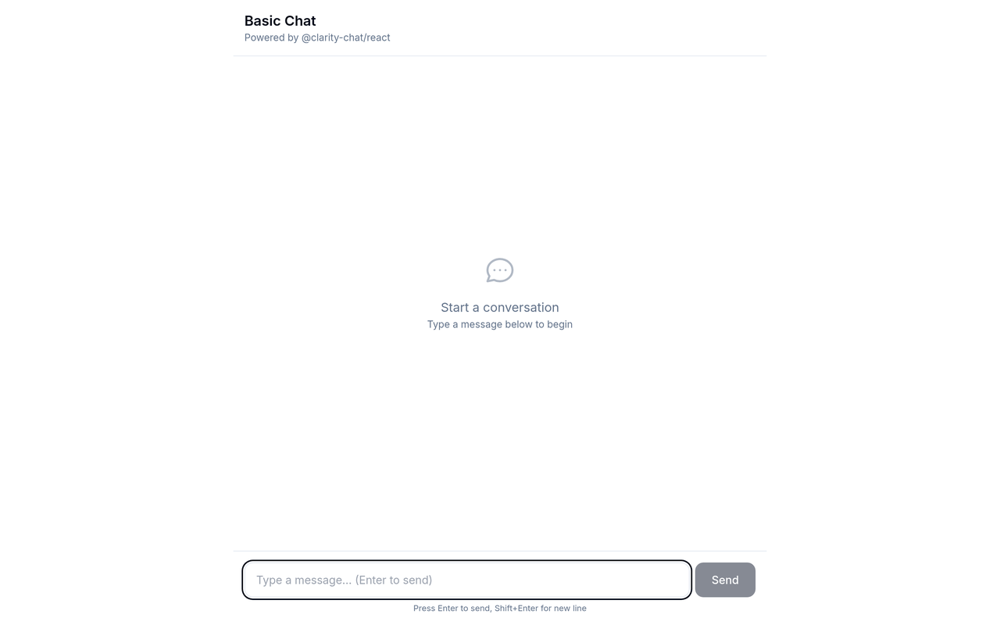

# Basic Chat

> The simplest possible AI chat implementation using `@clarity-chat/react` - get started in under 5
> minutes.

<!-- visual-header -->

<div align="center">



<sub>A minimal chat window: header, message list, composer.</sub>

</div>

<br />

**Composing a message. Add an `OPENAI_API_KEY` to `.env.local` to get real replies.**


> **Heads up** — This example calls OpenAI, so it needs a key before it will answer.

<!-- visual-header -->

## Features

- **@clarity-chat/react Integration** - Uses the official `useClarityChat` hook
- Streaming responses with SSE
- Clean, minimal UI
- Error handling with proper error boundary
- Loading states
- Keyboard accessible (WCAG 2.1 AA)
- Dark mode support
- Mobile responsive

## Quick Start

```bash
# Clone the example
npx degit clarity-chat/clarity-chat/examples/basic-chat my-chat-app
cd my-chat-app

# Install dependencies
pnpm install

# Set up environment
cp .env.example .env.local
# Add your OpenAI API key to .env.local

# Run development server
pnpm dev
```

Open [http://localhost:3000](http://localhost:3000) to see the demo.

## What You'll Learn

1. How to use `@clarity-chat/react`'s `useClarityChat` hook
2. How to stream responses from OpenAI using SSE
3. Proper message state management patterns
4. Accessibility best practices for chat UIs

## Key Code

### Chat Component using @clarity-chat/react

The main chat component is dramatically simplified using the `useClarityChat` hook:

```typescript
// components/basic-chat.tsx
import { useClarityChat } from '@clarity-chat/react'

export function BasicChat() {
  const { messages, append, isLoading, error, input, setInput, setMessages } = useClarityChat({
    api: '/api/chat',
  })

  // Send a message
  const sendMessage = async (content: string) => {
    await append({ role: 'user', content })
    setInput('')
  }

  // Clear messages
  const clearMessages = () => setMessages([])

  // That's it! All the complex state management is handled for you
}
```

### useClarityChat Hook Features

The `useClarityChat` hook provides:

| Feature       | Description                           |
| ------------- | ------------------------------------- |
| `messages`    | Array of messages in the conversation |
| `append`      | Function to append a message and send |
| `setMessages` | Function to set messages directly     |
| `isLoading`   | Loading state during API calls        |
| `error`       | Error object if something goes wrong  |
| `input`       | Current input value                   |
| `setInput`    | Function to update input              |
| `stop`        | Function to stop streaming            |
| `reload`      | Function to retry the last message    |

### API Route

```typescript
// app/api/chat/route.ts
export async function POST(request: NextRequest) {
  const { messages } = await request.json()

  // Create SSE stream from OpenAI
  const stream = new ReadableStream({
    async start(controller) {
      const completion = await openai.chat.completions.create({
        model: 'gpt-4-turbo-preview',
        messages,
        stream: true,
      })

      for await (const chunk of completion) {
        // Send each chunk as SSE event
      }
    },
  })

  return new Response(stream, {
    headers: { 'Content-Type': 'text/event-stream' },
  })
}
```

## Project Structure

```
basic-chat/
├── app/
│   ├── api/chat/route.ts   # Streaming API endpoint
│   ├── globals.css         # Tailwind styles
│   ├── layout.tsx          # Root layout
│   └── page.tsx            # Home page
├── components/
│   ├── basic-chat.tsx      # Main chat component (uses @clarity-chat/react)
│   └── error-boundary.tsx  # Error boundary wrapper
├── .env.example            # Environment template
├── package.json
├── tailwind.config.js
└── tsconfig.json
```

## Customization

### Change the AI Model

Edit the API route to use a different model:

```typescript
// app/api/chat/route.ts
const completion = await openai.chat.completions.create({
  model: 'gpt-3.5-turbo', // or 'gpt-4', 'gpt-4-turbo-preview'
  messages,
  stream: true,
})
```

### Enable Message Persistence

Use the built-in persistence feature:

```typescript
const { messages, append } = useClarityChat({
  api: '/api/chat',
  initialMessages: [], // Load from localStorage on mount
})

// You can persist messages manually or use useEffect
useEffect(() => {
  localStorage.setItem('my-chat-history', JSON.stringify(messages))
}, [messages])
```

### Add a System Prompt

Prepend a system message to customize the AI's behavior:

```typescript
const systemMessage = {
  role: 'system',
  content: 'You are a helpful assistant specialized in coding.',
}

const completion = await openai.chat.completions.create({
  model: 'gpt-4-turbo-preview',
  messages: [systemMessage, ...messages],
  stream: true,
})
```

### Style the Messages

Edit `components/basic-chat.tsx` to customize the message bubbles:

```tsx
<div className={`
  max-w-[80%] p-4 rounded-2xl
  ${message.role === 'user'
    ? 'bg-blue-600 text-white'
    : 'bg-gray-100 dark:bg-gray-800'}
`}>
```

## Related Examples

- [streaming-chat](../streaming-chat) - Advanced streaming patterns
- [multi-provider](../multi-provider) - Switch between AI providers
- [custom-theming](../custom-theming) - Full theming capabilities
- [accessibility](../accessibility) - WCAG 2.1 AA compliance showcase

## Tech Stack

- [Next.js 15](https://nextjs.org) - React framework
- [React 19](https://react.dev) - UI library
- [@clarity-chat/react](../../packages/react) - Official chat components
- [Tailwind CSS](https://tailwindcss.com) - Styling
- [OpenAI API](https://platform.openai.com) - AI backend

## License

MIT
