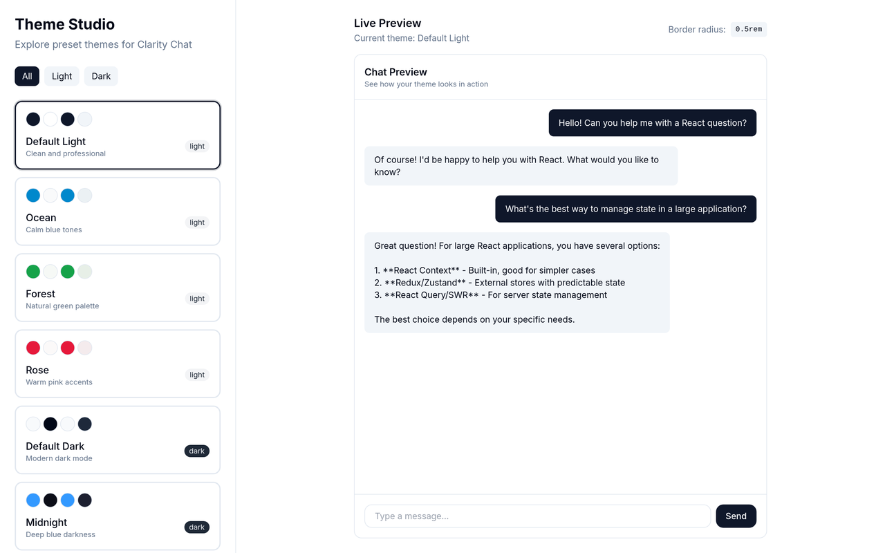

# Custom Theming

> Explore preset themes and create custom color schemes for Clarity Chat.

<!-- visual-header -->

<div align="center">



<sub>Theme Studio: eight presets on the left, a live chat preview on the right.</sub>

</div>

<br />

**Switching between Ocean, Forest, Rose, Default Dark and Midnight — the preview recolors
instantly.**


<!-- visual-header -->

## Features

- 8 preset themes (4 light, 4 dark)
- Live theme preview
- CSS variables export
- Persistent theme selection
- Smooth theme transitions
- Filter by light/dark mode

## Quick Start

```bash
# Clone the example
npx degit clarity-chat/clarity-chat/examples/custom-theming my-themed-app
cd my-themed-app

# Install dependencies
pnpm install

# Run development server
pnpm dev
```

Open [http://localhost:3003](http://localhost:3003) to see the demo.

## What You'll Learn

1. How Clarity Chat's theme system works
2. How to create and apply custom themes
3. CSS custom properties for theming
4. Light/dark mode implementation

## Available Themes

### Light Themes

- **Default Light** - Clean and professional
- **Ocean** - Calm blue tones
- **Forest** - Natural green palette
- **Rose** - Warm pink accents

### Dark Themes

- **Default Dark** - Modern dark mode
- **Midnight** - Deep blue darkness
- **Emerald** - Rich green on dark
- **Purple Haze** - Vibrant purple tones

## Key Code

### Theme Definition

```typescript
// lib/themes.ts
export interface Theme {
  id: string
  name: string
  mode: 'light' | 'dark'
  colors: {
    background: string // HSL values
    foreground: string
    primary: string
    userBubble: string
    assistantBubble: string
    // ... more colors
  }
  radius: string
}
```

### Apply Theme

```typescript
export function applyTheme(theme: Theme): void {
  const root = document.documentElement

  // Apply colors as CSS variables
  Object.entries(theme.colors).forEach(([key, value]) => {
    const cssVar = `--${key.replace(/([A-Z])/g, '-$1').toLowerCase()}`
    root.style.setProperty(cssVar, value)
  })

  // Apply border radius
  root.style.setProperty('--radius', theme.radius)

  // Toggle dark mode class
  if (theme.mode === 'dark') {
    root.classList.add('dark')
  } else {
    root.classList.remove('dark')
  }
}
```

### CSS Variables

```css
:root {
  --background: 0 0% 100%;
  --foreground: 222.2 84% 4.9%;
  --primary: 222.2 47.4% 11.2%;
  --primary-foreground: 210 40% 98%;
  --user-bubble: 222.2 47.4% 11.2%;
  --user-bubble-foreground: 210 40% 98%;
  --assistant-bubble: 210 40% 96.1%;
  --assistant-bubble-foreground: 222.2 84% 4.9%;
  --radius: 0.5rem;
}
```

## Project Structure

```
custom-theming/
├── app/
│   ├── globals.css          # Base CSS with variables
│   ├── layout.tsx
│   └── page.tsx
├── components/
│   └── theming-demo.tsx     # Main demo component
├── lib/
│   └── themes.ts            # Theme definitions
└── README.md
```

## Customization

### Create a Custom Theme

Add to `lib/themes.ts`:

```typescript
{
  id: 'my-custom-theme',
  name: 'My Custom Theme',
  description: 'A custom theme',
  mode: 'light',
  colors: {
    background: '45 30% 98%',     // Warm white
    foreground: '45 20% 10%',     // Dark brown
    primary: '45 80% 50%',        // Gold
    // ... define all colors
  },
  radius: '0.75rem',
}
```

### Use HSL for Colors

All colors use HSL format without the `hsl()` wrapper:

```typescript
// Format: "hue saturation% lightness%"
primary: '221.2 83.2% 53.3%' // Blue
primary: '142 76% 36%' // Green
primary: '350 80% 50%' // Pink
```

### Add Smooth Transitions

The base CSS includes transition rules:

```css
* {
  transition:
    background-color 0.2s ease,
    border-color 0.2s ease,
    color 0.2s ease;
}
```

## Related Examples

- [basic-chat](../basic-chat) - Apply themes to a chat
- [multi-provider](../multi-provider) - Enterprise theming
- [advanced-features](../advanced-features) - Component theming

## Tech Stack

- [Next.js 15](https://nextjs.org)
- [React 19](https://react.dev)
- [Tailwind CSS](https://tailwindcss.com)
- CSS Custom Properties

## License

MIT
