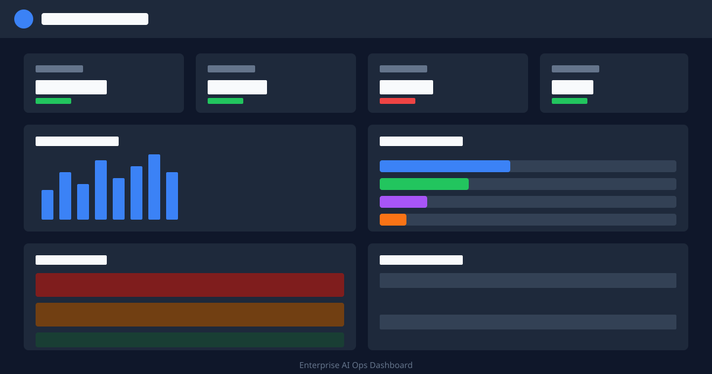

# Enterprise AI Ops Dashboard

[](https://opensource.org/licenses/MIT)
[](https://www.typescriptlang.org/)
[](https://nextjs.org/)

> Production-grade AI operations dashboard for monitoring, evaluation, and safety management.



## ✨ Features

- **Real-time metrics** - Track requests, tokens, costs, and latency at a glance
- **Usage analytics** - Visualize request volume and token breakdown over time
- **Safety monitoring** - Alert system for detecting PII, unusual patterns, and policy violations
- **Model comparison** - Compare performance metrics across different AI models
- **Responsive design** - Works on desktop, tablet, and mobile devices
- **Accessible** - WCAG 2.1 AA compliant with full keyboard navigation

## 🚀 Quick Start

```bash
# Navigate to this example
cd examples/enterprise-ai-ops

# Install dependencies
pnpm install

# Copy environment variables
cp .env.example .env.local

# Start development server (runs on port 3002)
pnpm dev
```

Open [http://localhost:3002](http://localhost:3002) to see the dashboard.

> **Note:** This example includes demo data that simulates real AI operations metrics without
> requiring API keys.

## 📋 Prerequisites

- Node.js 20+
- pnpm 10+
- (Optional) OpenAI/Anthropic API keys for real data integration

## 🏗️ Architecture

```
enterprise-ai-ops/
├── src/
│   └── app/
│       ├── layout.tsx        # Root layout with metadata
│       ├── page.tsx          # Main dashboard with all components
│       ├── loading.tsx       # Loading skeleton
│       ├── error.tsx         # Error boundary
│       └── globals.css       # Tailwind + CSS variables
├── package.json
├── tsconfig.json
├── tailwind.config.ts
└── .env.example
```

### Dashboard Components

```
┌─────────────────────────────────────────────────────────────┐
│                         Header                               │
│  [Logo] Enterprise AI Ops    [Alerts] [Refresh] [Settings]  │
├─────────────────────────────────────────────────────────────┤
│  ┌───────────┐ ┌───────────┐ ┌───────────┐ ┌───────────┐   │
│  │ Requests  │ │  Tokens   │ │   Cost    │ │  Latency  │   │
│  │  12,345   │ │   2.8M    │ │  $45.67   │ │   0.8s    │   │
│  └───────────┘ └───────────┘ └───────────┘ └───────────┘   │
├─────────────────────────────────────────────────────────────┤
│  ┌─────────────────────────┐ ┌─────────────────────────┐   │
│  │    Request Volume       │ │    Token Breakdown      │   │
│  │    [Bar Chart 24h]      │ │    [Progress Bars]      │   │
│  └─────────────────────────┘ └─────────────────────────┘   │
├─────────────────────────────────────────────────────────────┤
│  ┌─────────────────────────┐ ┌─────────────────────────┐   │
│  │    Safety Alerts        │ │   Model Performance     │   │
│  │    [Alert List]         │ │   [Comparison Table]    │   │
│  └─────────────────────────┘ └─────────────────────────┘   │
└─────────────────────────────────────────────────────────────┘
```

## 📁 Key Files

| File                  | Purpose                                                  |
| --------------------- | -------------------------------------------------------- |
| `src/app/page.tsx`    | Main dashboard with all components and state management  |
| `src/app/loading.tsx` | Skeleton loading states for better perceived performance |
| `src/app/error.tsx`   | Error boundary with retry functionality                  |

## 🎨 Customization

### Adding Real Data Sources

Replace mock data generators with API calls:

```typescript
// Example: Fetch real metrics from your backend
async function fetchMetrics(): Promise<Metrics> {
  const response = await fetch('/api/metrics')
  return response.json()
}

// In your component
useEffect(() => {
  fetchMetrics().then(setMetrics)

  // Set up real-time updates
  const ws = new WebSocket('wss://your-api/metrics')
  ws.onmessage = (event) => setMetrics(JSON.parse(event.data))

  return () => ws.close()
}, [])
```

### Integrating with Monitoring Services

```typescript
// Example: Send alerts to Slack
async function sendSlackAlert(alert: SafetyAlert) {
  await fetch(process.env.SLACK_WEBHOOK_URL!, {
    method: 'POST',
    headers: { 'Content-Type': 'application/json' },
    body: JSON.stringify({
      text: `🚨 ${alert.level.toUpperCase()}: ${alert.message}`,
    }),
  })
}
```

### Adding Charts with Recharts

This example includes `recharts` as a dependency. Upgrade the basic charts:

```typescript
import { LineChart, Line, XAxis, YAxis, Tooltip, ResponsiveContainer } from 'recharts'

function UsageChart({ data }: { data: UsageData[] }) {
  return (
    <ResponsiveContainer width="100%" height={200}>
      <LineChart data={data}>
        <XAxis dataKey="timestamp" />
        <YAxis />
        <Tooltip />
        <Line type="monotone" dataKey="requests" stroke="#3b82f6" />
      </LineChart>
    </ResponsiveContainer>
  )
}
```

### Styling

Customize colors in `src/app/globals.css`:

```css
:root {
  --primary: 221.2 83.2% 53.3%;
  --success: 142.1 76.2% 36.3%;
  --warning: 47.9 95.8% 53.1%;
  /* ... */
}
```

## 🔗 Related Examples

- [streaming-chat](../streaming-chat) - Real-time AI chat interface
- [memory-examples](../memory-examples) - Conversation memory patterns
- [token-optimization](../token-optimization) - Token usage optimization

## 🐛 Troubleshooting

<details>
<summary>Dashboard not loading</summary>

1. Check if port 3002 is available
2. Ensure all dependencies are installed: `pnpm install`
3. Check for TypeScript errors: `pnpm typecheck`

</details>

<details>
<summary>Charts not rendering</summary>

If using the full Recharts integration, ensure the library is properly installed:

```bash
pnpm add recharts
```

</details>

<details>
<summary>Performance issues</summary>

For large datasets:

- Implement pagination for alerts
- Use virtual scrolling for long lists
- Debounce real-time updates

</details>

## 📚 Learn More

- [Clarity Chat Documentation](../../packages/react/README.md)
- [Next.js App Router](https://nextjs.org/docs/app)
- [Recharts Documentation](https://recharts.org/)
- [AI Operations Best Practices](https://platform.openai.com/docs/guides/production-best-practices)

## 📄 License

MIT © [Code & Clarity](https://codeandclarity.com)
