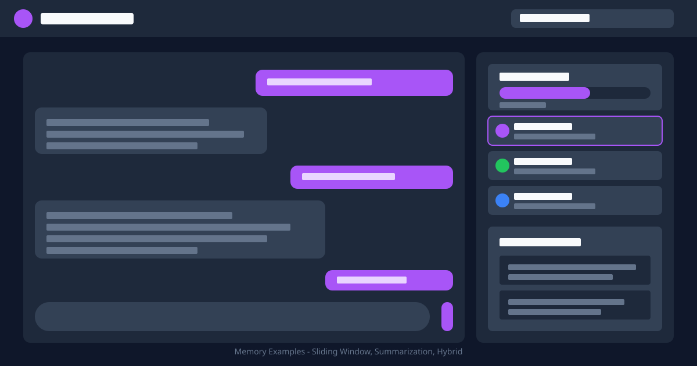

# Clarity Memory Examples

[](https://opensource.org/licenses/MIT)
[](https://www.typescriptlang.org/)
[](https://nodejs.org/)

> Complete, runnable examples for `@clarity-chat/memory` - AI conversation memory and context
> management.



## ✨ Features

- **Multiple frameworks** - Express.js, Fastify, Next.js, and CLI examples
- **React components** - Basic and advanced memory-enhanced chat interfaces
- **Vanilla JS** - No-framework example for any environment
- **Production patterns** - Token optimization, persistence, and caching

## 🚀 Quick Start

```bash
# Navigate to this example
cd examples/memory-examples

# Install dependencies
pnpm install

# Copy environment variables
cp .env.example .env.local

# Run an example
pnpm run express   # Express.js server
pnpm run fastify   # Fastify server
pnpm run cli       # Interactive CLI
```

## 📋 Prerequisites

- Node.js 20+
- pnpm 10+
- (Optional) OpenAI API key for semantic search with embeddings

---

## 📚 Available Examples

### Backend Examples

#### 1. **Express.js Server** (`memory-nodejs-express.ts`)

Full-featured REST API using Express.js with memory-enhanced endpoints.

```bash
npx tsx examples/memory-examples/memory-nodejs-express.ts
```

**Features:**

- Chat endpoint with memory context
- User preferences management
- Memory CRUD operations
- Statistics endpoint
- Health check

**Endpoints:**

- `POST /api/chat` - Chat with memory context
- `GET /api/preferences/:userId` - Get user preferences
- `POST /api/preferences/:userId` - Set user preference
- `GET /api/memories/:userId` - Get all user memories
- `DELETE /api/memories/:memoryId` - Delete a memory
- `GET /api/stats` - Memory statistics
- `GET /health` - Health check

---

#### 2. **Fastify Server** (`memory-nodejs-fastify.ts`)

High-performance REST API using Fastify with type-safe routes.

```bash
# Install Fastify first
npm install fastify

# Run the server
npx tsx examples/memory-examples/memory-nodejs-fastify.ts
```

**Why Fastify?**

- 2x faster than Express
- Built-in TypeScript support
- Schema validation
- Better async/await handling

Same endpoints as Express example above.

---

#### 3. **Next.js API Route** (`memory-nodejs-api.ts`)

Next.js App Router API route example for serverless/edge functions.

**File location:** Copy to `app/api/chat/route.ts` in your Next.js project

```typescript
// app/api/chat/route.ts
import { NextRequest, NextResponse } from 'next/server'
import { clarityMemory } from '@clarity-chat/memory'
// ... (see file for complete example)
```

**Features:**

- Singleton memory instance
- Optimized for serverless
- GET and POST handlers
- Memory statistics

---

#### 4. **CLI Chat Application** (`memory-cli.ts`)

Interactive command-line chat with persistent memory.

```bash
npx tsx examples/memory-examples/memory-cli.ts
```

**Commands:**

- `/stats` - View memory statistics
- `/clear` - Clear all memories
- `/exit` or `/quit` - Exit the application

**Use Cases:**

- Testing memory functionality
- Building CLI tools
- Prototyping chat interfaces
- Learning the API interactively

---

### Frontend Examples

#### 5. **React Advanced** (`memory-system-advanced.tsx`)

Advanced React integration with hooks and context.

**Features:**

- Custom memory hooks
- Context management
- Token optimization
- Real-time memory updates

---

#### 6. **React Basic** (`memory-system-basic.tsx`)

Simple React component example for quick integration.

**Features:**

- Simple setup
- Basic memory operations
- Minimal configuration

---

#### 7. **Vanilla JavaScript** (`memory-vanilla-js.html`)

Pure HTML/JavaScript example without frameworks.

```bash
# Open in browser
open examples/memory-examples/memory-vanilla-js.html
```

**Use Cases:**

- Legacy applications
- No-build setups
- Learning the API
- Quick prototypes

---

## 🚀 Quick Start

### 1. Install Dependencies

```bash
# From repo root
pnpm install

# Or install specific dependencies for examples
npm install express fastify
```

### 2. Run an Example

```bash
# Express server
npx tsx examples/memory-examples/memory-nodejs-express.ts

# Fastify server
npx tsx examples/memory-examples/memory-nodejs-fastify.ts

# CLI chat
npx tsx examples/memory-examples/memory-cli.ts
```

### 3. Test the API

```bash
# Chat endpoint
curl -X POST http://localhost:3000/api/chat \
  -H "Content-Type: application/json" \
  -d '{"userId": "user123", "message": "Hello!"}'

# Get stats
curl http://localhost:3000/api/stats

# Set preference
curl -X POST http://localhost:3000/api/preferences/user123 \
  -H "Content-Type: application/json" \
  -d '{"key": "theme", "value": "dark"}'
```

---

## 📖 Common Patterns

### Initializing Memory

```typescript
import { clarityMemory } from '@clarity-chat/memory'

// Zero-config (in-memory)
const memory = clarityMemory()
await memory.initialize()

// With file persistence
const memory = clarityMemory({
  storage: {
    type: 'file',
    path: './memories.json',
  },
})
await memory.initialize()

// With full configuration
const memory = clarityMemory({
  debug: true,
  storage: { type: 'memory' },
  embeddingProvider: {
    provider: 'openai',
    apiKey: process.env.OPENAI_API_KEY,
    model: 'text-embedding-3-small',
  },
  tokenBudget: {
    maxContextWindow: 4096,
    allocation: {
      systemPrompt: 512,
      userPreferences: 614,
      recentContext: 1229,
      semanticMemory: 1024,
      episodicMemory: 614,
      responseReserve: 205,
    },
  },
})
await memory.initialize()
```

### Adding Memories

```typescript
// Simple
await memory.add('User prefers dark mode')

// With options
await memory.add('User is a software engineer', {
  type: 'semantic',
  scope: 'user',
  importance: 0.9,
  tags: ['profile', 'occupation'],
})
```

### Searching Memories

```typescript
// Simple recall
const results = await memory.recall('user preferences')

// Advanced search
const results = await memory.recall('TypeScript', {
  limit: 10,
  minConfidence: 0.7,
  metadata: { userId: 'user123' },
})

// Low-level query
const results = await memory.query({
  types: ['semantic', 'profile'],
  scopes: ['user', 'global'],
  metadata: { userId: 'user123' },
  limit: 20,
})
```

### Getting Context for LLM

```typescript
const contextBundle = await memory.context({
  maxTokens: 1000,
})

// Use in LLM call
const response = await openai.chat.completions.create({
  messages: [
    { role: 'system', content: contextBundle.formatted },
    { role: 'user', content: userMessage },
  ],
})
```

---

## 🔧 Configuration Options

### Storage Types

- **`memory`** - In-memory (default, no persistence)
- **`file`** - JSON file storage (Node.js only)
- **`indexeddb`** - Browser storage (client-side only)

### Memory Types

- **`episodic`** - Conversation history, events
- **`semantic`** - Facts, knowledge, preferences
- **`profile`** - User characteristics
- **`procedural`** - How-to knowledge
- **`short-term`** - Temporary information

### Memory Scopes

- **`session`** - Current session only
- **`thread`** - Current conversation thread
- **`user`** - Specific user
- **`global`** - Shared across all users

---

## 🎯 Use Cases

### 1. **Chatbot with Memory**

Use the Express or Fastify example as a starting point for a chatbot that remembers user preferences
and conversation history.

### 2. **Personal Assistant**

Use the CLI example to build a personal assistant that learns about you over time.

### 3. **Customer Support**

Store customer preferences and history to provide personalized support.

### 4. **Knowledge Base**

Store and retrieve domain knowledge for Q&A systems.

### 5. **Recommendation System**

Track user preferences to make personalized recommendations.

---

## 🔗 Related Examples

- [streaming-chat](../streaming-chat) - Real-time streaming AI chat interface
- [token-optimization](../token-optimization) - Optimize token usage and costs
- [enterprise-ai-ops](../enterprise-ai-ops) - Enterprise AI operations dashboard

---

## 🐛 Troubleshooting

<details>
<summary>Server won't start</summary>

1. Ensure dependencies are installed: `pnpm install`
2. Check if port 3000 is available
3. Verify environment variables in `.env.local`

</details>

<details>
<summary>Memory not persisting</summary>

By default, memory uses in-memory storage. For persistence:

```typescript
const memory = clarityMemory({
  storage: {
    type: 'file',
    path: './memories.json',
  },
})
```

</details>

<details>
<summary>Embedding errors</summary>

Embeddings require an OpenAI API key. Set `OPENAI_API_KEY` in your `.env.local` file.

</details>

---

## 📚 Learn More

- [Clarity Memory Package](../../packages/memory/README.md)
- [Memory API Documentation](../../packages/memory/API.md)
- [Vercel AI SDK](https://ai-sdk.dev)

## 📄 License

MIT © [Code & Clarity](https://codeandclarity.com)
