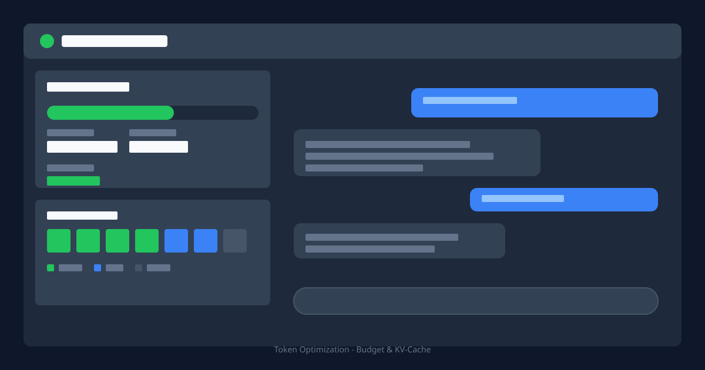
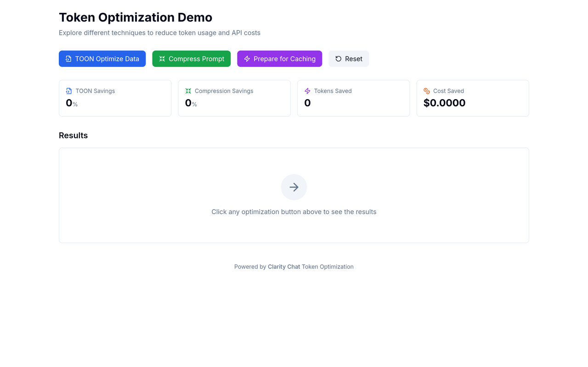

# Token Optimization Example

[](https://opensource.org/licenses/MIT)
[](https://www.typescriptlang.org/)
[](https://nextjs.org/)

> Interactive demonstrations of token optimization techniques including TOON format, prompt
> compression, and cache preparation.



<!-- visual-header -->

<div align="center">



<sub>The optimization playground with savings, tokens saved and cost saved.</sub>

</div>

<br />

**Running TOON optimization, prompt compression and cache preparation — the stats update live.**


<!-- visual-header -->

## ✨ Features

- **TOON Format** - Token-Optimized Object Notation for 30-60% savings on structured data
- **Prompt Compression** - Remove filler words and redundancy for 20-35% savings
- **Cache Preparation** - Add cache control markers for 50-90% cost reduction
- **Real-time Stats** - Track tokens saved and estimated cost reductions
- **Visual Comparison** - Side-by-side view of original vs. optimized content

## 🚀 Quick Start

```bash
# Navigate to this example
cd examples/token-optimization

# Install dependencies
pnpm install

# Copy environment variables (optional for demo)
cp .env.example .env.local

# Start development server (runs on port 3003)
pnpm dev
```

Open [http://localhost:3003](http://localhost:3003) to see the demo.

> **Note:** This example works without API keys, demonstrating optimization techniques with
> simulated data.

## 📋 Prerequisites

- Node.js 20+
- pnpm 10+
- (Optional) OpenAI API key for accurate tokenization

## 🏗️ Architecture

```
token-optimization/
├── src/
│   └── app/
│       ├── layout.tsx        # Root layout
│       ├── page.tsx          # Main optimization demo
│       ├── loading.tsx       # Loading skeleton
│       ├── error.tsx         # Error boundary
│       └── globals.css       # Tailwind + CSS variables
├── enhanced-optimization-example.tsx  # Advanced component (for reference)
├── package.json
├── tsconfig.json
└── .env.example
```

## 📁 Optimization Techniques

### 1. TOON (Token-Optimized Object Notation)

TOON reduces token usage by 30-60% for structured data:

```typescript
// Original JSON (45 tokens)
[
  { "name": "Alice", "city": "New York", "role": "Engineer" },
  { "name": "Bob", "city": "San Francisco", "role": "Designer" }
]

// TOON format (18 tokens)
@keys:a=name,b=city,c=role
[{"a":"Alice","b":"New York","c":"Engineer"},{"a":"Bob","b":"San Francisco","c":"Designer"}]
```

### 2. Prompt Compression

Removes filler words and redundancy:

```typescript
// Original (52 tokens)
"I really, really want to understand, you know, how I can actually improve
my code quality. Can you basically help me with that?"

// Compressed (32 tokens)
"I want to understand how I can improve my code quality. Can you help me with that?"
```

### 3. Prompt Caching

Adds cache control for frequently-used content:

```typescript
const messages = [
  {
    role: 'system',
    content: 'You are a helpful assistant...',
    cache_control: { type: 'ephemeral' }, // Cache this!
  },
  {
    role: 'user',
    content: 'How do I optimize React?',
  },
]
```

## 🎨 Customization

### Integrating Real Tokenization

Replace mock functions with actual tokenization using the token-optimization package:

```typescript
import { AccurateTokenCounter } from '@clarity-chat/token-optimization'

const counter = new AccurateTokenCounter({
  model: 'gpt-4o',
  enableCaching: true,
})

function countTokens(text: string): number {
  return counter.count(text)
}
```

### Using with Clarity Chat

```typescript
import { useTokenOptimization } from '@clarity-chat/react'

function MyComponent() {
  const { optimizeData, optimizePrompt, prepareMessages, stats } = useTokenOptimization({
    model: 'gpt-4o-mini',
    enableToon: true,
    enablePromptCaching: true,
    enableCostTracking: true,
  })

  // Use the optimization functions...
}
```

## 🔗 Related Examples

- [streaming-chat](../streaming-chat) - Real-time streaming chat interface
- [memory-examples](../memory-examples) - Conversation memory patterns
- [enterprise-ai-ops](../enterprise-ai-ops) - AI operations dashboard

## 🐛 Troubleshooting

<details>
<summary>Inaccurate token counts</summary>

The demo uses rough estimates (1 token ≈ 4 characters). For accurate counts, use
`@clarity-chat/token-optimization`:

```bash
pnpm add @clarity-chat/token-optimization
```

The package uses `gpt-tokenizer` internally for 99%+ accuracy (20x smaller than tiktoken WASM).

</details>

<details>
<summary>Cost calculations seem off</summary>

Demo uses approximate pricing. Update the cost multiplier for your specific model:

```typescript
const COST_PER_TOKEN = {
  'gpt-4o': 0.00001,
  'gpt-4o-mini': 0.0000015,
  'claude-3.5-sonnet': 0.000003,
}
```

</details>

## 📚 Learn More

- [Token Optimization Package](../../packages/token-optimization/README.md)
- [OpenAI Tokenizer](https://platform.openai.com/tokenizer)
- [Anthropic Prompt Caching](https://docs.anthropic.com/en/docs/build-with-claude/prompt-caching)
- [gpt-tokenizer Library](https://github.com/niieani/gpt-tokenizer)

## 📄 License

MIT © [Code & Clarity](https://codeandclarity.com)
