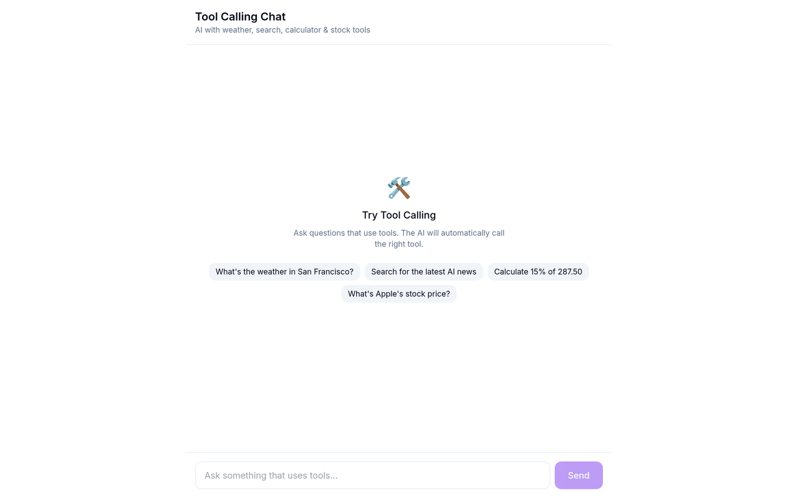

# Tool Calling

> AI function calling with visual tool rendering and execution status.

<!-- visual-header -->

<div align="center">



<sub>A chat wired to weather, search, calculator and stock tools.</sub>

</div>

<br />

**Composing prompts that route to different tools. Add an `OPENAI_API_KEY` to see them execute.**


> **Heads up** — Tool execution runs through OpenAI function calling, so it needs a key.

<!-- visual-header -->

## Features

- 4 built-in tools (weather, search, calculator, stock)
- Visual tool execution cards
- Real-time execution status
- Custom result renderers per tool
- Automatic tool selection by AI

## Quick Start

```bash
# Clone the example
npx degit clarity-chat/clarity-chat/examples/tool-calling my-tool-app
cd my-tool-app

# Install dependencies
pnpm install

# Set up environment
cp .env.example .env.local
# Add your OpenAI API key

# Run development server
pnpm dev
```

Open [http://localhost:3004](http://localhost:3004) to see the demo.

## Available Tools

| Tool       | Description         | Example Query                |
| ---------- | ------------------- | ---------------------------- |
| Weather    | Get current weather | "What's the weather in NYC?" |
| Search     | Web search          | "Search for AI news"         |
| Calculator | Math calculations   | "Calculate 15% of 287"       |
| Stock      | Stock prices        | "Apple stock price?"         |

## What You'll Learn

1. How to define tools for OpenAI function calling
2. How to handle tool execution in streaming responses
3. How to render tool results visually
4. How to handle multi-turn tool conversations

## Key Code

### Tool Definition

```typescript
// lib/tools.ts
export const TOOLS: ChatCompletionTool[] = [
  {
    type: 'function',
    function: {
      name: 'get_weather',
      description: 'Get the current weather',
      parameters: {
        type: 'object',
        properties: {
          location: { type: 'string', description: 'City name' },
          unit: { type: 'string', enum: ['celsius', 'fahrenheit'] },
        },
        required: ['location'],
      },
    },
  },
  // ... more tools
]
```

### Tool Execution Flow

```typescript
// API route handles:
// 1. Initial response with tool_calls
// 2. Execute each tool
// 3. Send results back to model
// 4. Stream final response

// SSE event types:
{ type: 'tool_calls', tool_calls: [...] }
{ type: 'tool_execution_start', tool_call_id, name, args }
{ type: 'tool_execution_result', tool_call_id, result }
{ type: 'text-delta', content: '...' }
```

### Tool Card Component

```tsx
function ToolCard({ toolCall }) {
  return (
    <div className={`tool-card ${toolCall.status}`}>
      <div className="header">
        <span>{toolInfo.icon}</span>
        <span>{toolInfo.description}</span>
        <span className="status">{toolCall.status}</span>
      </div>
      <div className="args">{JSON.stringify(toolCall.args)}</div>
      {toolCall.result && <ToolResult {...toolCall} />}
    </div>
  )
}
```

## Project Structure

```
tool-calling/
├── app/
│   ├── api/chat/route.ts      # Tool-enabled API route
│   ├── globals.css
│   ├── layout.tsx
│   └── page.tsx
├── components/
│   └── tool-calling-chat.tsx  # Main component
├── lib/
│   └── tools.ts               # Tool definitions & execution
└── README.md
```

## Customization

### Add a Custom Tool

1. Define the tool in `lib/tools.ts`:

```typescript
{
  type: 'function',
  function: {
    name: 'my_custom_tool',
    description: 'What this tool does',
    parameters: {
      type: 'object',
      properties: {
        param1: { type: 'string', description: '...' },
      },
      required: ['param1'],
    },
  },
}
```

2. Add execution logic:

```typescript
case 'my_custom_tool':
  return { success: true, data: { /* result */ } }
```

3. Add result renderer:

```typescript
function MyToolResult({ data }) {
  return <div>{/* custom UI */}</div>
}
```

4. Add tool info for styling:

```typescript
my_custom_tool: {
  icon: '🔧',
  color: 'bg-blue-500/10 text-blue-600',
  description: 'My Tool',
}
```

### Connect Real APIs

Replace the simulated functions with real API calls:

```typescript
async function executeWeather(location: string) {
  const response = await fetch(`https://api.weather.com/v1/current?location=${location}`, {
    headers: { 'API-Key': process.env.WEATHER_API_KEY },
  })
  return response.json()
}
```

## Related Examples

- [basic-chat](../basic-chat) - Chat without tools
- [streaming-chat](../streaming-chat) - Advanced streaming
- [multi-provider](../multi-provider) - Multiple AI providers

## Tech Stack

- [Next.js 15](https://nextjs.org)
- [React 19](https://react.dev)
- [Tailwind CSS](https://tailwindcss.com)
- [OpenAI API](https://platform.openai.com) - Function calling

## License

MIT
