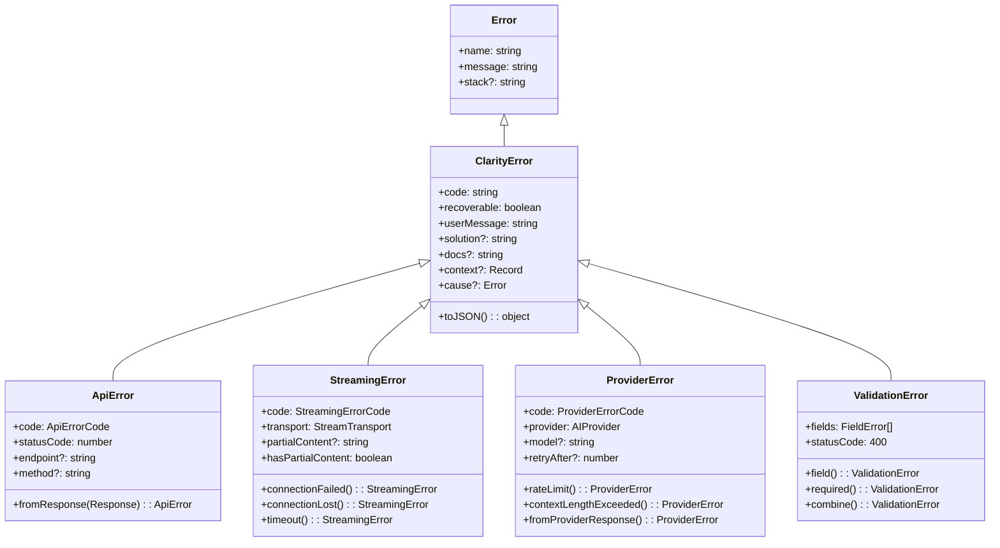
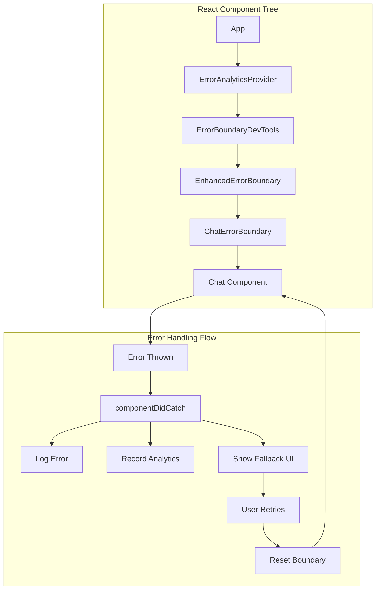
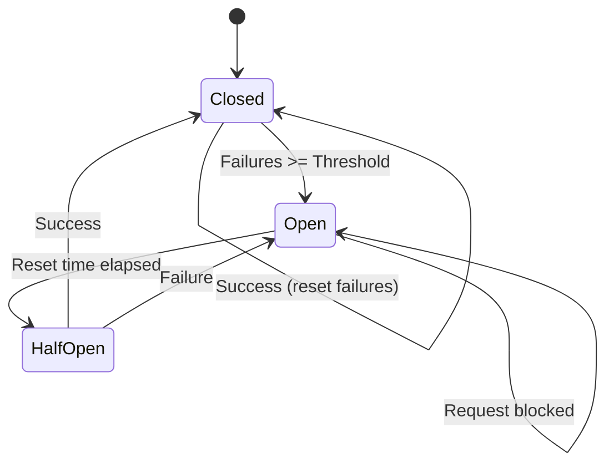
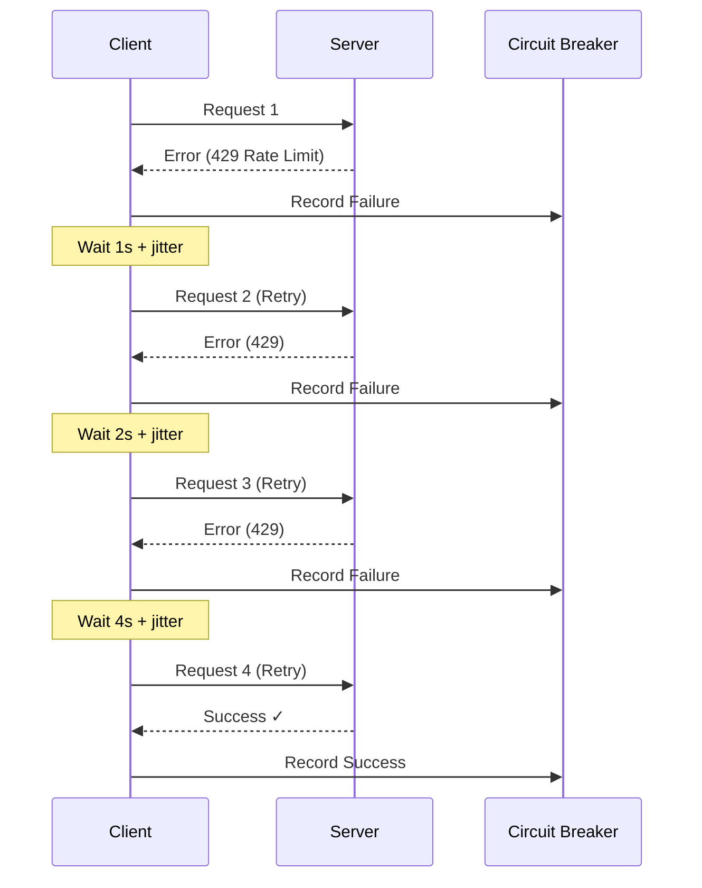
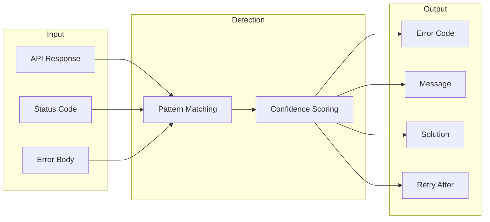
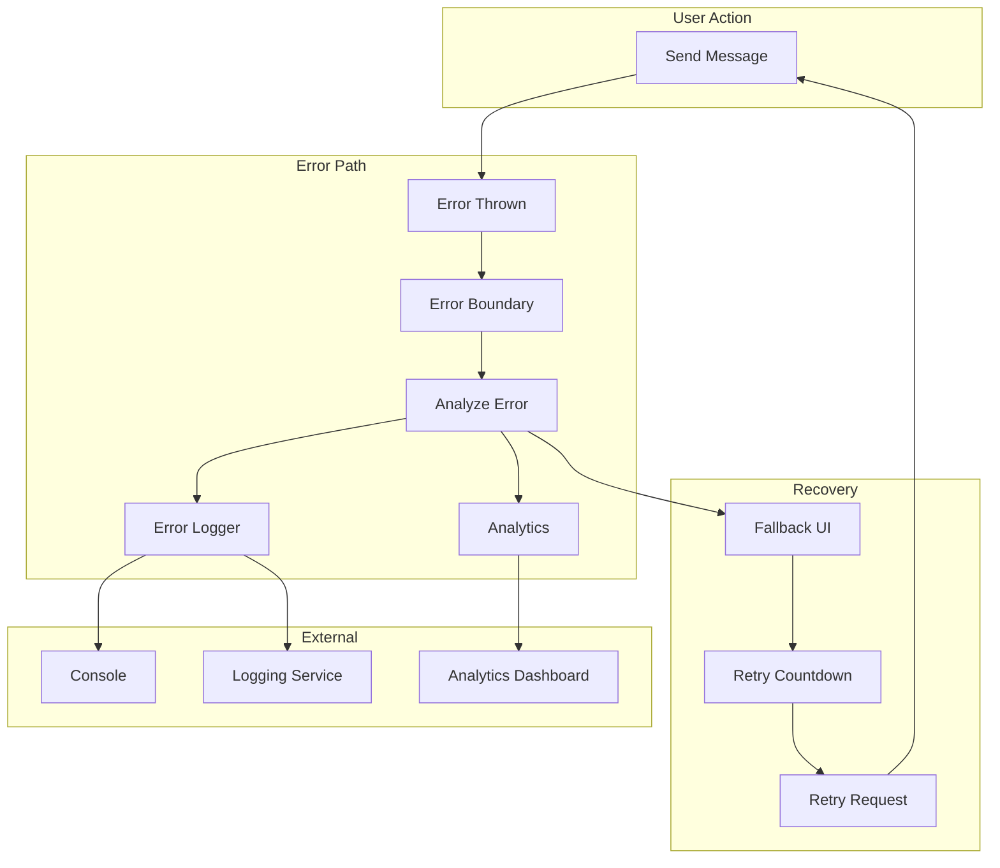
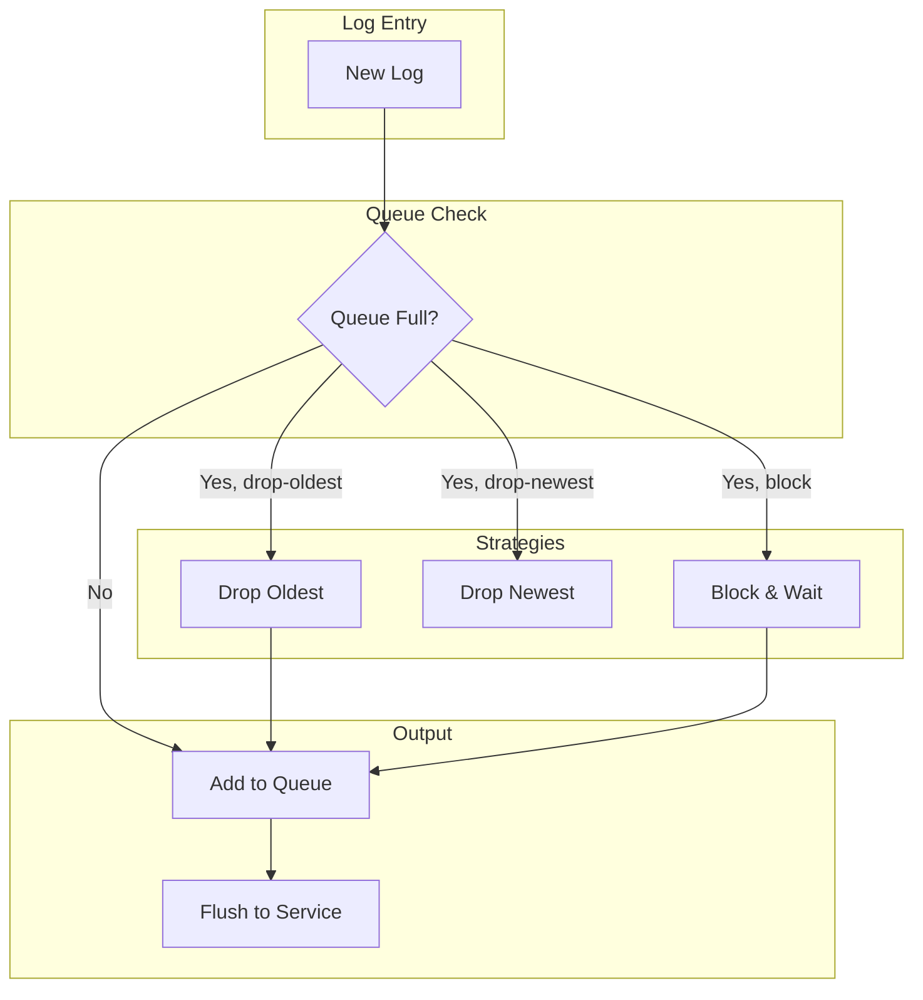
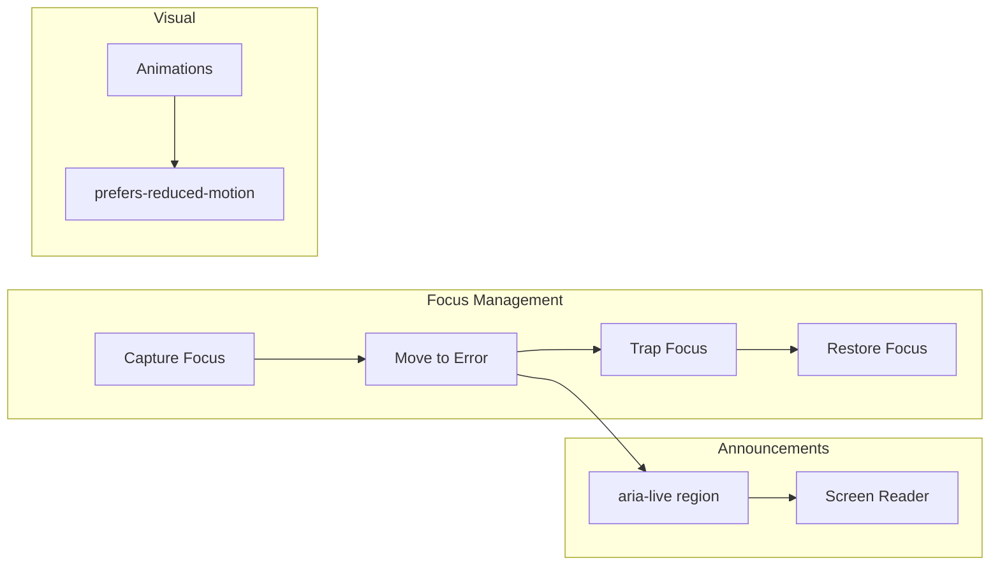

# Error Handling System Architecture

This document describes the architecture and design decisions of the Clarity Chat error handling
system.

## Overview

The error handling system provides a comprehensive, type-safe approach to error management in React
applications, with special focus on AI chat interfaces. It includes:

- Custom error class hierarchy
- React error boundaries with enhanced features
- Streaming error recovery
- Provider-specific error parsing
- Analytics and telemetry
- Circuit breaker pattern
- Accessibility support

## Error Class Hierarchy



### Design Decisions

1. **Base `ClarityError` class**: All custom errors extend this base, providing consistent behavior:
   - `userMessage`: Safe message for end users (no sensitive info)
   - `solution`: Actionable guidance for recovery
   - `recoverable`: Indicates if retry is appropriate
   - `toJSON()`: Serialization for logging

2. **Specific error classes**: Each error type knows its domain:
   - `ApiError`: HTTP/REST API errors
   - `StreamingError`: SSE/WebSocket connection issues
   - `ProviderError`: AI provider-specific errors (OpenAI, Anthropic, etc.)
   - `ValidationError`: Input validation with field-level details

3. **Static factory methods**: Convenient creation with appropriate defaults:
   ```typescript
   StreamingError.connectionLost('sse', partialContent)
   ProviderError.rateLimit('openai', 30) // 30 second retry-after
   ```

## Error Boundary Architecture



### Component Responsibilities

| Component                | Purpose                              |
| ------------------------ | ------------------------------------ |
| `ErrorAnalyticsProvider` | Context for error metrics collection |
| `ErrorBoundaryDevTools`  | Development-only debugging panel     |
| `EnhancedErrorBoundary`  | Generic error boundary with logging  |
| `ChatErrorBoundary`      | Chat-specific error handling         |

## Circuit Breaker State Machine



### Circuit Breaker Configuration

```typescript
const config = {
  threshold: 5, // Failures before opening
  resetTime: 30000, // Time before half-open (ms)
  persistKey: 'chat', // localStorage persistence key
}
```

### State Transitions

1. **Closed → Open**: After `threshold` consecutive failures
2. **Open → Half-Open**: After `resetTime` ms have elapsed
3. **Half-Open → Closed**: On successful request
4. **Half-Open → Open**: On any failure

## Retry Strategy with Jitter



### Jitter Formula

```typescript
function calculateDelayWithJitter(
  baseDelay: number,
  attempt: number,
  jitterFactor: number = 0.3
): number {
  const exponentialDelay = baseDelay * Math.pow(2, attempt)
  const jitter = Math.random() * jitterFactor * exponentialDelay
  return Math.floor(exponentialDelay + jitter)
}
```

**Why jitter?** Without jitter, multiple clients hitting the same rate limit will retry
simultaneously, causing a "thundering herd" problem. Random jitter spreads retries over time.

## Provider Error Detection



### Confidence Levels

| Level    | Meaning                  | Example                                |
| -------- | ------------------------ | -------------------------------------- |
| `high`   | Exact match on code/type | `error.type === 'rate_limit_exceeded'` |
| `medium` | Pattern in message       | `message.includes('too long')`         |
| `low`    | Status code only         | `statusCode >= 500`                    |

## Data Flow



## Backpressure Strategies

The error logger implements backpressure to prevent memory issues:



## Accessibility Architecture



### Accessibility Features

1. **Focus management**: Focus moves to error on occurrence, returns on recovery
2. **ARIA live regions**: Errors announced to screen readers
3. **Reduced motion**: Animations disabled when requested
4. **Keyboard navigation**: Full keyboard support for error UI

## Extension Points

The system is designed for extensibility:

### Custom Error Types

```typescript
class CustomError extends ClarityError {
  constructor(message: string) {
    super(message, {
      recoverable: true,
      solution: 'Custom guidance',
    })
  }

  get userMessage(): string {
    return 'Custom user-friendly message'
  }
}
```

### Custom Analytics Callbacks

```typescript
<ErrorAnalyticsProvider
  callbacks={{
    onErrorRecorded: (entry) => sendToDatadog(entry),
    onCircuitTrip: (type) => alertPagerDuty(type),
  }}
>
```

### Custom Fallback Components

```typescript
<EnhancedErrorBoundary
  FallbackComponent={({ error, resetErrorBoundary }) => (
    <CustomErrorUI error={error} onRetry={resetErrorBoundary} />
  )}
>
```

## Performance Considerations

1. **Lazy loading**: Dev tools only load in development
2. **Memoization**: Context values are memoized
3. **Batching**: Error logger batches logs to reduce network calls
4. **Cleanup**: Stale circuit breaker entries are cleaned up

## Security Considerations

1. **No sensitive data in userMessage**: Error details stay in logs
2. **Input sanitization**: SSE parsing limits depth and size
3. **XSS prevention**: HTML entities escaped in error messages
4. **No stack traces in production**: Configurable via logger
